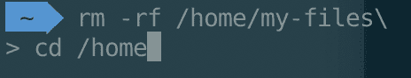

# rm -rf 用药过量

> 原文：<https://dev.to/voluntadpear/rm-rf-overdose-mfk>

Unix 上的`rm`命令和`-rf`标志就像面包和黄油一样。至少对我来说，很难想象没有这些标志运行`rm`命令。事实上，这变成了一种本能，几乎就好像命令总是`rm -rf`。

如果你知道你在做什么，你可以一直安全地运行完整的命令，但我应该更好地了解自己，并认识到在按回车键之前，我最好三思而行。让我告诉你几周前发生在我身上的事情，当时我在一个运行在谷歌云计算 T2 实例上的项目上损失了一整天的进度，而我支付的费用是每小时 1.5 美元 T4。本质上，运行一个`rm -rf`命令而不加思考让我损失了大约 15 美元。与几年前皮克斯运行完全相同的命令相比，这并不是很多钱。

## 简介`rm`

我平时用`rm -rf`的方式极其简单:

```
rm -rf directory_to_delete/ 
```

我只是指定了我想递归删除的目录的路径，就完成了！伟大的💯💯💯。为了获得更多的上下文信息，让我们一步一步地分解这个命令:

*   `rm`:正如它自己的手册(BSD 版本)所说:

> **rm** 实用程序试图删除命令行中指定的非目录类型文件。如果文件的权限不允许写入，并且标准输入设备是终端，则提示用户(在标准错误输出上)进行确认。

这就是在 Unix 中删除文件的基本命令。

*   `-r`:递归删除目录。还记得`rm`如何试图删除非目录类型的文件吗？嗯，有了这个标志，它将删除目录(及其内容)。

*   `-f` : **从不提示确认**，即使它试图删除的文件不允许写入。

## 不要在`/home`尝试这个

让我们建立一个测试环境，向您展示我前几天犯的愚蠢错误。我将使用 **Docker** 构建一个 Ubuntu 容器，但是如果你愿意，你可以使用任何虚拟机、云实例、你的旧笔记本电脑的磁盘分区和你用来做实验的 Linux 发行版，任何你喜欢的东西。请不要在你的主机上玩`rm`，尤其是在你的重要文件附近🙏。

我将首先用 docker 运行一个交互式 Ubuntu 会话，并创建一个基本的文件结构:

```
$ docker run -it --rm ubuntu
root@ubuntu:/# cd home/
root@ubuntu:/home# mkdir my-files
root@ubuntu:/home# cd my-files
root@ubuntu:/home/my-files# mkdir pictures
root@ubuntu:/home/my-files# mkdir music
root@ubuntu:/home/my-files# mkdir code
root@ubuntu:/home/my-files# mkdir docs
root@ubuntu:/home/my-files# cd docs
root@ubuntu:/home/my-files/docs# mkdir pdfs
root@ubuntu:/home/my-files/docs# mkdir business
root@ubuntu:/home/my-files/docs# mkdir tmp 
```

好了，到目前为止，我们只是创建了一堆目录。结构如下:

```
|- my-files
|   |- pictures
|   |- music
|   |- code
|   |- docs
|   |   |- pdfs
|   |   |- business
|   |   |- tmp 
```

现在想象一下，我们想要去掉`/docs`目录下的`tmp`目录(有趣的是，这实际上正是我想要做的！)，我们可以通过这样做来实现:

```
rm -rf /home/my-files/docs/tmp 
```

我们也可以使用相对路径来实现，例如，如果我们当前的工作目录是`/home/my-files/docs`，我们可以用`rm -rf tmp/`来代替。

现在，我在尝试删除我的`tmp`目录:
时犯了一个错误

```
rm -rf /home/my-files/docs/tmp\ 
```

您能发现原始命令的不同之处吗？只是一个人物而已！就在我按下回车键之前，我不小心按下了 Macbook 键盘上它正上方的那个键，反斜杠字符`\`。bash 命令中的反斜杠字符有什么特别之处？它对下一个字符进行转义，以避免被 shell 解释。所以在我的例子中，当我按下 Enter 键时，我的`rm`命令还没有运行。

嗯。这可能是好事，对吧？其实是的！这个小错误可以给你一个机会来检查你写的那一行是否正确，如果你发现了任何错别字，在造成任何损害之前忽略它🙂。问题是，如果你碰巧没有给予足够的关注(这肯定是我的情况)，你可能最终没有意识到你的`rm`命令还没有运行，并转移到下一个命令，好像一切都很顺利。如果您运行的下一个命令是一个`cd`(更改目录)，会发生什么呢？🤔让我们来试试:

```
root@ubuntu:/# rm -rf /home/my-files/docs/tmp\
> cd /home/my-files 
```

运行它并...我们所有的文件夹都不见了😱

## Wh...发生了什么事？

还记得我们说过`\`让 shell 忽略下一个字符吗？良好的...这意味着我们之前的命令相当于这个:

```
rm -rf /home/my-files/docs/tmpcd /home/my-files 
```

我不知道`rm`可以用来同时删除多个目录，但事实证明这是可能的。所以我们在这里试图删除两个目录:`/home/my-files/docs/tmpcd`(它不存在，因为`cd`后缀不应该在那里)和...`/home/my-files`😱😱😱😱。因此，即使我最初对运行`rm -rf /home/my-files/docs/tmp`非常有信心，因为我当然想删除那个目录，因此`-f`标志不会有问题，我也没有意识到 shell 还没有运行命令，所以下一行的`cd /home/my-files`没有被解释为更改目录命令。

## 怎么做才能防止这种情况？

首先，要有频繁的备份，并不时地从备份中测试恢复。如果可能的话，确保你的文件有一个以上的物理拷贝，并且尽可能地将它们存储在安全的云中。错误、事故和磁盘问题时有发生，而且你永远不知道什么时候会发生。

如果你的平台运行的是 rm 的 [GNU 版本，你可以使用`-I` *(大写的 i)* 标志来代替`-f`，在破坏性动作实际执行之前，你会收到一个提示(除非你试图删除的文件少于 4 个，并且不是递归的)。它类似于`-i` *(小写的 i)* ，但远没有那么烦人，非常适合这篇文章中描述的情况。](http://man7.org/linux/man-pages/man1/rm.1.html)

让我们来看看它的作用:

```
root@ubuntu:/# rm -rI /home/my-files/docs/tmp\
> cd /home/my-files
rm: remove 2 arguments recursively? 
```

如果我们使用的是`-I`标志，我们会惊讶地发现在我们认为是`cd`命令之后出现了`rm`确认提示。这给了我们更多的机会去发现这种错误，总的来说，这给了我们更多的机会去思考我们将要做的事情。

但是...在 macOS ☹️.上默认不可用问题是 macOS 上的`rm`实现是 BSD 实现，它不支持`-I`标志。如果你使用[自制软件](https://formulae.brew.sh/formula/coreutils)，你可以用`brew install coreutils`安装`rm`(和许多其他 GNU coreutils)，GNU `rm`版本将作为`grm`提供。如果你愿意，你可以将**别名**为`rm`。

如果你宁愿保留`rm`的原生实现，我建议使用 [Z shell](https://en.wikipedia.org/wiki/Z_shell) 作为安装了 [oh-my-zsh](https://github.com/robbyrussell/oh-my-zsh) 框架的 shell。在那里，你可以找到许多[令人惊叹的主题](https://github.com/robbyrussell/oh-my-zsh/wiki/Themes)，用不同的背景、图标和避免我们在这篇文章中最关心的错误的重要因素来定制你的外壳:提示**。**

 **我个人使用 [agnoster](https://github.com/agnoster/agnoster-zsh-theme) 主题，它给你一个非常独特的提示，让我更容易识别我是在继续上一行的相同命令，还是实际上在一个新行。

[](https://res.cloudinary.com/practicaldev/image/fetch/s--zqtlMeuU--/c_limit%2Cf_auto%2Cfl_progressive%2Cq_auto%2Cw_880/https://thepracticaldev.s3.amazonaws.com/i/tcljs78ydwh593jrazhw.png)

在截图中，有一个用蓝色填充的主提示，带有当前工作目录，还有一个未修饰的提示，带有一个`>`符号，表示我们正在继续之前的行。

作为第三种选择，您可以尝试使用外部 CLI 工具，而不是删除文件，而是将它们移动到垃圾桶。其中最流行的是可用于 macOS、Linux 和 Windows 的 [trash-cli](https://github.com/sindresorhus/trash-cli) 。该工具的作者辛德雷·索胡斯(Sindre Sorhus)还写了一个指南，介绍了避免与`rm` 发生事故的其他技巧。

我希望这篇文章能给你更多的选择，让你下次尝试使用`rm -rf`,请记住在那里要小心🔥！**