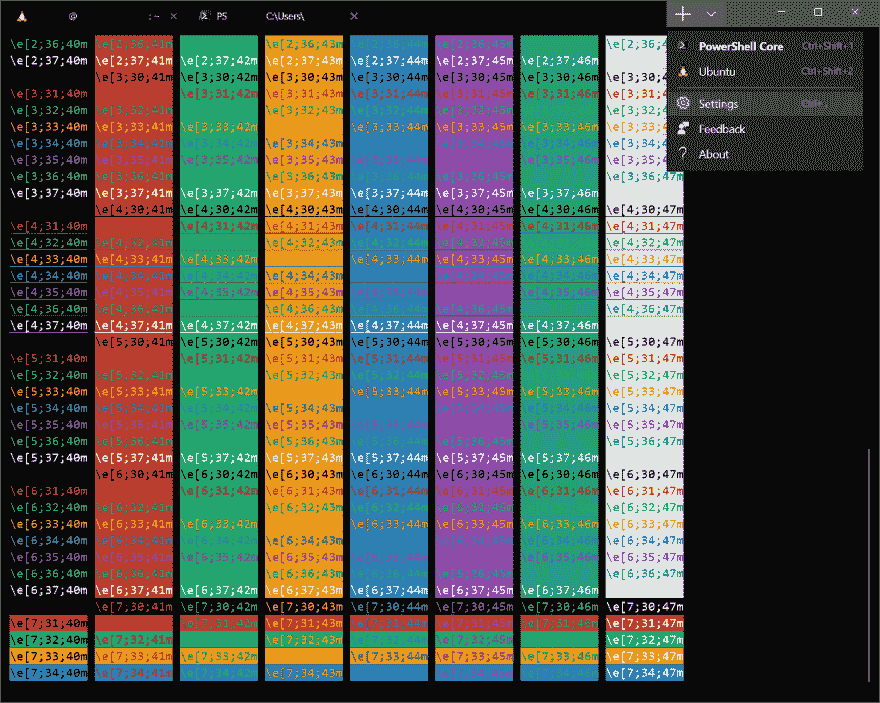
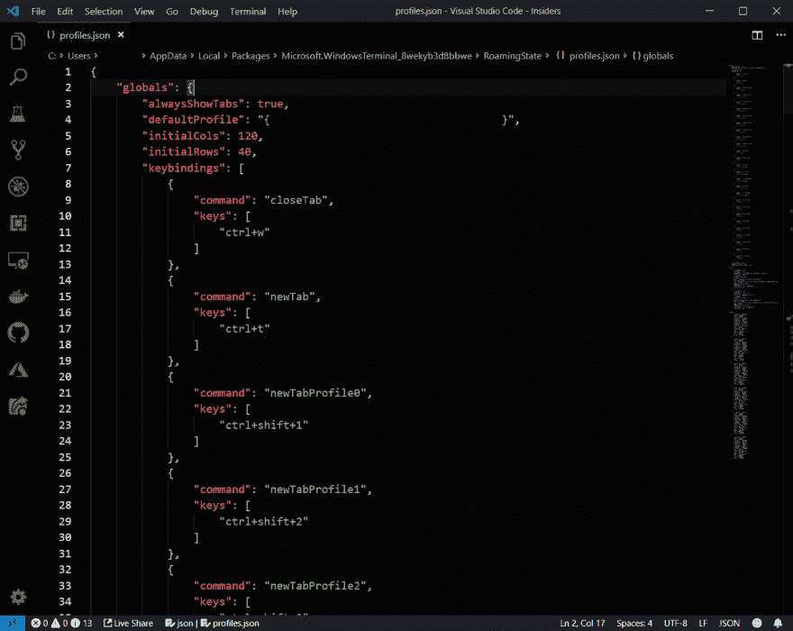
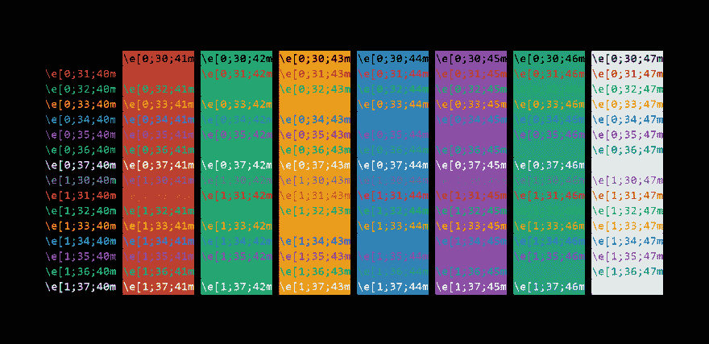

# Windows 终端配色方案在 Windows 终端中推出您自己的配色方案

> 原文：<https://dev.to/teckert/roll-your-own-color-scheme-in-windows-terminal-466b>

> 🚩声明:我为微软工作。我写这篇文章纯粹是作为一个 Windows 终端的粉丝。
> 也发表在我的[博客](https://thomaseckert.dev/posts/roll-your-own-color-scheme-in-windows-terminal)上。

在 Build 2019 上，微软宣布了一款用于 Windows 的[开源终端。2019 年 6 月 21 日，它开始在微软商店](https://devblogs.microsoft.com/commandline/introducing-windows-terminal/)提供[预览。我一直在玩它，虽然它的功能值得称赞，但每个开发人员都知道终端最重要的方面是它的配色方案。](https://www.microsoft.com/en-us/p/windows-terminal-preview/9n0dx20hk701?activetab=pivot:overviewtab)

幸运的是，自己写很容易。从 Windows 终端中，选择选项卡右边的下拉菜单。选择`Settings`。或者，访问设置的默认键绑定是`Ctrl` + `,`。

这将在默认编辑器中打开一个带有终端设置的 JSON 文件。

导航到“方案”键。这里的 JSON 对象列表将标准的 Unix 终端颜色(除了被称为`purple`的`magenta`)映射到十六进制代码。复制现有方案并将其粘贴到此列表中。现在，你可以随意编辑颜色。我选择实现一个来自 flatuicolors.com[的叫做 V1 的配色方案。你可以在](https://flatuicolors.com/)[这里](https://gist.github.com/t-eckert/9fd7c587c470e8312f07d8e65182644f)找到实施的要点。

为您的方案指定一个唯一的“名称”值，并设置“配置文件”来使用该方案。

编辑方案时，终端将实时更新。为了检查您的方案，我发现下面的`bash`命令很有用:

`for x in {0..8}; do for i in {30..37}; do for a in {40..47}; do echo -ne "\e[$x;$i;$a""m\\\e[$x;$i;$a""m\e[0;37;40m "; done; echo; done; done; echo ""`

这将在每种高亮颜色上显示每种文本颜色。我用它来为要点创建这个样本:

黑客快乐！