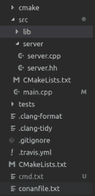
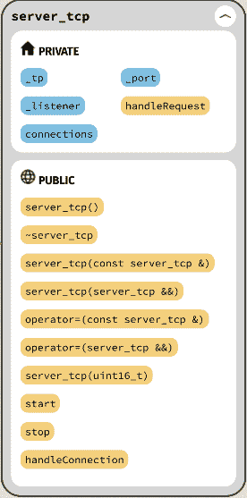

# 滚动你自己的妈妈，或者我是怎么做的-项目设置

> 原文：<https://dev.to/cppchedy/rolling-your-own-mom-or-how-i-did-it-project-setup-2enc>

# 简介

如果你厌倦了阅读前一篇文章，很抱歉，是的，它很无聊，但不幸的是，它是必需的。但是，从现在开始，我们将进入具体的内容，如果您愿意，您可以进行测试和跟踪。

这一部分的要点是展示中间件的入口点，代码的顶层类。因此，我们将通过 Seastar 简介、项目结构和最终代码来实现这一目标。

# 海星

Seastar 是一个开源的 c++框架，旨在帮助构建高性能的服务器应用程序。它被高性能 NoSQL 数据库 [ScyllaDb](https://www.scylladb.com/) 使用。

Seastar 的一个关键特性是它的事件驱动特性，这使得它的用户很容易编写非阻塞的异步代码。此外，海星建筑基于以下几点:

*   [无共享设计](http://seastar.io/shared-nothing/) : Seastar 使用无共享模型，将所有请求分割到单独的内核上。

*   [未来和承诺](http://seastar.io/futures-promises/):一种先进的并发应用新模型，为 C++程序员提供了高性能和创建可理解、可测试的高质量代码的能力。

*   [高性能网络](http://seastar.io/networking/) : Seastar 提供多种网络堆栈选择，包括易于开发的传统 Linux 网络、用于 Linux 上快速用户空间网络的 DPDK，以及 OSv 上的原生网络

*   [消息传递](http://seastar.io/message-passing/):在 CPU 内核之间共享信息的设计，无需耗时的锁定。

## 稍微绕道

鉴于我将在整个系列中使用 Seastar，我想我应该包括一个“如何使用 Seastar”部分。我认为在进一步深入之前进行这种迂回是有意义的，因为它将使对 MOM 代码的解释更加简单。

我假设你已经熟悉了[未来和承诺](https://en.wikipedia.org/wiki/Futures_and_promises)的概念。如果你想深入挖掘这个惊人的框架，并正确地学习它，那么我推荐你:[教程](https://github.com/scylladb/seastar/blob/master/doc/tutorial.md)、[演示](https://github.com/scylladb/seastar/tree/master/demos)和【真实世界】[应用](https://github.com/scylladb/seastar/tree/master/apps)。

为了使事情简短，我们将只看到基本的例子，并提出 Seastar 程序的框架。

### 程序结构

让我们从一个 Seastar 程序的一般结构开始:

```
#include <seastar/core/app-template.hh> //other includes...

int main(int argc, char** argv) {
    seastar::app_template app;
    /*
      if you want to add option for your application
    */
    app.add_options()
        ("foo", bpo::value<std::string>(), "foo arg")
        ;
    app.run(argc, argv, [] {
            //write your logic here
            //... could retrieve args

            return /*return a future*/;
    });
} 
```

Enter fullscreen mode Exit fullscreen mode

一般来说，你将编写的每个 Seastar 程序都将遵循这个结构:你实例化一个类型为`app_template`的对象，然后调用带 3 个参数的`run`方法。最后一个是与我们最相关的:它是包含应用程序逻辑的 lambda。
`app_template`管理海星引擎所需的配置:日志配置、CPU 配置、内存配置等...当我们启动我们的应用程序时，我们可以根据需要调整这些参数。例如，您可以通过发出`-cNB`来控制线程的数量，其中 NB 是您想要的线程数量。请注意，如果您选择的数字大于您机器上的硬件线程数，您将会得到一个运行时异常。我喜欢这个选择，它减少了线程切换带来的开销。

至于`run`，它启动运行时(scheduler，eventloop....)负责执行处理程序。我们稍后将讨论这一点。

### 例子

虽然使用 Seastar 带来了许多优势，如性能提升，但 Seastar 异步编程模型也带来了自己的麻烦:我们以非常规的方式编写代码，我们必须关注新事物。我们持有的许多假设不再正确，这是因为 Seastar 的异步、非阻塞特性。以下示例显示了我们需要了解的一些问题以及我们如何解决这些问题。

第一个例子是为了介绍。它只是休眠大约两秒钟，然后打印出“这不是学习 Seastar 的正确方法。”

```
#include <seastar/core/app-template.hh>
#include <seastar/core/sleep.hh>
#include <iostream> 
int main(int argc, char** argv) {
    seastar::app_template app;
    app.run(argc, argv, [] {
        using namespace std::chrono_literals;
        return seastar::sleep(2s).then([] {
            std::cout << "this is not the right way to learn Seastar.\n";
        });
    });
} 
```

Enter fullscreen mode Exit fullscreen mode

注意你可以在[编译器浏览器](https://godbolt.org/z/-LmO2I)中看到代码。

在这个程序中，`sleep`设置了一个计时器，并返回一个将在 2s 内解决的未来值。我们用一个 lambda 来链接这个未来，上面印着“这是..”到`std::cout`。

我们必须不断思考的问题是对象生存期或范围。与 nodejs/javascript 的闭包不同，C++的 lambda 并没有让我们免于处理对象/变量的可访问性。根据我们正在做的事情，我们可能会访问一个导致错误结果的无效状态，或者我们可能会得到一个运行时错误。下面的例子展示了 Seastar 新用户常犯的一个错误:

```
//includes ...

seastar::future<> dummy_fn(int offset) {
  int bad = 8;
  return seastar::make_ready_future<int>(offset)
      .then([&bad](int nb) { bad += nb; })
      .then([&bad] {
        bad++;
        std::cout << bad << '\n';
      });
}

int main(int argc, char **argv) {
  seastar::app_template app;
  return app.run(argc, argv, [] {
    auto ftr1 = dummy_fn(12);
    auto ftr2 = dummy_fn(46);

    return when_all(std::move(ftr1), std::move(ftr2))
        .then( {
            std::cout << "done computing";
            return 0;
        });
  });
} 
```

Enter fullscreen mode Exit fullscreen mode

你可以在[编译器浏览器](https://godbolt.org/z/RHfktS)中查看代码。

首先让我们分析 main:像往常一样，我们有`app_template`并调用 run 来启动 Seastar *引擎*并执行任务。接下来 lambda:我们调用两次`dummy_fn`。这个函数没有什么特别的，它唯一的目的是显示错误。现在，让我们只记住它返回一个未来。最后一句话从`when_all`开始。这意味着我们将等待期货`ftr1`和`ftr2`解决，以便我们可以继续下一个任务(打印“计算完成”)。

现在让我们来看看`dummy_fn`:我们有一个变量`bad`，对它进行一些计算。这些计算被一个接一个地以链式方式发送。在此之前，我们做一个 ready_future(立即解决的未来)。这种未来的决心来自于`offset`的论证。问题是`bad`的引用捕获:请记住我们是异步执行的，没有阻塞，这意味着我们将任务提交给 Seastar 调度程序，而不是执行它们，因此，当 lambdas 将运行时，`bad`将已经被破坏，因为我们从`dummy_fn`返回，我们将得到错误的结果。

所以一般来说，如果你通过引用来捕捉事物，你将会陷入困境，除非你知道你在做什么。所以这里的默认值是通过值捕获。

海星开发商已经考虑到这个问题，并为我们提供了必要的工具。

为了纠正前面的例子，我们可以使用`do_with`函数。那么`dummy_fn`就变成了:

```
seastar::future<> dummy_fn(int offset) {
  return seastar::do_with(int{8}, [offset](int &bad) {
    return seastar::make_ready_future<int>(offset)
        .then([&bad](int nb) { bad += nb; })
        .then([&bad] {
          bad++;
          std::cout << bad << '\n';
          return seastar::make_ready_future();
        });
  });
} 
```

Enter fullscreen mode Exit fullscreen mode

我们通过使用`do_with`来解决悬空 ref 问题。这个工具为我们管理对象的生命周期，直到我们不再需要使用它。简而言之，它分配内存并将我们将要使用的值移动到那里，然后当 lamnda 执行完毕时，它释放内存。你应该注意到，Seastar 管理它自己的内存，这是从一开始就预先分配的。另请注意，您可以调整内存分配大小。

除了前面的解决方案，我们可以使用引用计数来保持变量有效，直到我们完成计算。使用`seastar::shared_ptr`，`dummy_fn`变成如下:

```
seastar::future<> dummy_fn(int offset) {
  auto bad = seastar::make_shared<int>(8);
  return seastar::make_ready_future<int>(offset)
      .then([bad](int nb) { *bad += nb; })
      .then([bad] {
        (*bad)++;
        std::cout << *bad << '\n';
      });
} 
```

Enter fullscreen mode Exit fullscreen mode

Seastar 提供了自己的`shared_ptr`，它是`std::shared_ptr`的非线程安全版本。
在`dummy_fn`中，我们通过调用 make_shared 来创建 sstar shared_ptr，并通过复制到所有其他 lambdas 来捕获它。这样，我们就不再有寿命问题了。

通常，我们会使用`shared_ptr`，但是当我们有一个特定范围内需要的变量时，我们可能会使用`do_with`。

我们的最后一个例子更倾向于展示更多的 Seastar 结构，然后展示一个特定的问题。在这个例子中，我们引入了循环。Seastar 为循环提供了一个优雅解决方案:`keep_doing`、`repeat`、repeat_until_value 等....下面是一个使用`do_until`的例子。我们用`--message`选项得到一个字符串，然后一个字符接一个字符地打印出来:

```
#include <core/app-template.hh>
#include <core/sleep.hh>
#include <iostream>
#include <string> 
namespace bst = boost::program_options;

int main(int argc, char **argv) {
  seastar::app_template app;
  app.add_options()("message", bst::value<std::string>(), "Message to print");
  return app.run(argc, argv, [&app] {
    auto &&config = app.configuration();
    seastar::do_with(config["message"].as<std::string>(), int{0},
                      {
                       return seastar::do_until(
                           [&i, &msg] { return i >= msg.size(); },
                           [&i, &msg] { 
                               std::cout << msg[i] << '\n';
                               ++i;
                               return seastar::make_ready_future();
                           });
                     });
    return seastar::make_ready_future();
  });
} 
```

Enter fullscreen mode Exit fullscreen mode

[编译器资源管理器链接](https://godbolt.org/z/tc5QnT)

我们通过调用`add_options`来添加`message`选项。在 main lambda 中，我们首先获取配置，并将`--message`选项的值传递给`do_with`以及一个用 0 初始化的计数器。

我应该指出，传递给`do_with`的 lambda 必须尊重其他参数的顺序和类型:例如，如果我们希望`do_with`管理一个 int 和 float，我们写:
`do_with(int{9}, float{13.01},  { ...});`
我希望我清楚这一点。

现在，让我们进入循环部分。这个函数重复一个任务，直到满足某个条件。它接受两个 lambdas，第一个是谓词，第二个是循环体。我们每次都根据字符串的大小检查计数器的值。当`i`变得比`msg`大时，循环结束。
对于正文，我们打印每个字符并推进计数器。

希望我们现在可以带着对海星的基本理解回到妈妈那里。

# 第一步

## 设置项目

首先，我们将编写 cmake 文件，并准备好与`conanfile.txt`的依赖关系。我假设您已经安装了 cmake 和 conan，那么让我们继续项目结构:

[](https://res.cloudinary.com/practicaldev/image/fetch/s--kKdsPplr--/c_limit%2Cf_auto%2Cfl_progressive%2Cq_auto%2Cw_880/https://thepracticaldev.s3.amazonaws.com/i/b71y7knyf3emfwhdnnrt.png)

如图所示，我们有 3 个主文件夹:一个用于 cmake 脚本，另一个包含应用程序本身，`src`，还有一个包含测试的文件夹。

为了用 cmake 集成 clang-format 和 clang-tidy，我找到了这些 [cmake 脚本](https://git.stabletec.com/other/cmake-scripts/tree/master)。请注意，这里还有其他好东西。所有的荣誉归于维护者。将文件复制到 cmake 文件夹中。

让我们来关注一下 conanfile.txt

```
[requires]
gtest/1.8.0@lasote/stable
spdlog/1.3.1@bincrafters/stable 

[generators]
cmake 
```

Enter fullscreen mode Exit fullscreen mode

我们使用 google 的 lib gtests 进行测试，使用 spdlog 进行日志记录。我们指定 cmake 作为我们的生成器。

根 CMakeLists.txt:

```
cmake_minimum_required(VERSION 3.10)
project(Moza)

#includes cmake scripts
include(cmake/c++-standards.cmake)
include(cmake/compiler-options.cmake)
include(cmake/sanitizers.cmake)
include(cmake/formatting.cmake)
include(cmake/tools.cmake)

# require Seastar and use it's boost dependency
find_package(Seastar REQUIRED)
include_directories(${Boost_INCLUDE_DIR})

#include conan generated file for camke 
include(${CMAKE_BINARY_DIR}/conanbuildinfo.cmake)
conan_basic_setup(TARGETS)

#instruct seastar to use std::optional, std::variant etc, instead of it's own impl
add_definitions(-DSEASTAR_USE_STD_OPTIONAL_VARIANT_STRINGVIEW)

# clang format and clang-tidy integration
file(GLOB_RECURSE FFILES *.[chi]pp *.[chi]xx *.cc *.hh *.ii *.[CHI] )
clang_format(format ${FFILES})

clang_tidy(-format-style=file -checks=* -header-filter='${CMAKE_SOURCE_DIR}/*')

# we add only src folder
add_subdirectory(src) 
```

Enter fullscreen mode Exit fullscreen mode

根据您编译和安装 Seastar 的方式，您可能需要为 cmake 添加额外的参数，以便它可以找到所需的库。我将在本文的后面展示我是如何编译这个项目的。

接下来，让我们看看`src`文件夹中的`CMakeLists.txt`:

```
file(GLOB SRC_CORE lib/core/*.cpp lib/core/*.hh)

add_library(MozaLib ${SRC_CORE})
target_link_libraries(MozaLib Seastar::seastar CONAN_PKG::spdlog)

file(GLOB SRC_SERV server/*.cpp)
add_executable(Moza main.cpp ${SRC_SERV})
target_link_libraries(Moza Seastar::seastar MozaLib CONAN_PKG::spdlog) 
```

Enter fullscreen mode Exit fullscreen mode

我们已经完成了准备工作，现在让我们进入源文件夹。我以一种将模块从 MOM 的实际逻辑中分离出来的方式构建了`src`:我们有一个包含模块的`lib`子文件夹，`server`包含类服务器的源代码和一个`main.cpp`文件。

## 主

这是`main.cpp` :
的列表

```
#include <seastar/core/app-template.hh>
#include <seastar/core/distributed.hh> 
#include "server/server.hh" 
int main(int ac, char **av) {
  using namespace seastar;
  using namespace net;
  distributed<server_tcp> tcp_server;
  app_template app;
  return app.run(ac, av, [&] {
    engine().at_exit([&] { return tcp_server.stop(); });
    // here is not there
    return tcp_server.start_single().then(
        [&tcp_server] { return tcp_server.invoke_on(0, &server_tcp::start); });
  });
} 
```

Enter fullscreen mode Exit fullscreen mode

如前所述，Seastar 是围绕[反应堆模式](https://en.wikipedia.org/wiki/Reactor_pattern)构建的事件驱动框架。每个 Seastar 应用程序对于每个逻辑内核(或硬件线程)都有一个反应器(或事件循环)，当然假设是默认配置(没有`--c`标志)。这些事件循环彼此完全独立(*无共享设计*)。

为了帮助我们在可用的内核上共享我们的逻辑，Seastar developer 引入了`seastar::distributed`。这个实用程序的核心是将服务(在我们的例子中是 server_tcp)作为模板参数传递给所有硬件线程。

我们首先获取执行核心的本地反应器实例，并附加一个 lambda，在我们离开时关闭我们的服务。`distributed`要求服务有一个`stop`方法。这是唯一的要求。

接下来，我们调用`start_sinlge`，然后在 shard(core) 0 上调用`server_tcp::start`。`start_sinlge`只能激活一个碎片。

之前我说过我没有充分发挥海星的潜力。你可以在这里看到:我只使用了一个碎片。这其实是我设计的一个错误。我从一开始就没有考虑过碎片，我完全忘记了。我很紧张，因为最后期限快到了，所以即使我看到了我的错误，我也没有花时间去纠正它，即使我想到了几个解决方案，但它们需要修改协议，这是我不想搞砸的。希望这能成为另一篇文章的主题。

## 服务器类

现在让我们关注一下`server`，我们的服务类。在深入研究代码之前，让我们先做一个概述。注意，move 和 copy 构造函数/assignment_ops 被删除了。

[](https://res.cloudinary.com/practicaldev/image/fetch/s--lVrupr6q--/c_limit%2Cf_auto%2Cfl_progressive%2Cq_auto%2Cw_880/https://thepracticaldev.s3.amazonaws.com/i/nmb94rqf9gpgao9de9d2.png)

下面是`src/server/server.hh`的清单:

```
#pragma once 
#include <seastar/core/reactor.hh>
#include <seastar/core/temporary_buffer.hh>
#include <seastar/net/api.hh> 
#include "spdlog/spdlog.h" 
#include "lib/core/connection.hh"
#include "lib/core/topology.hh"
#include "lib/protocol/parser.hh"
#include "lib/identity/identity.hh"
#include "lib/identity/identity_generator.hh" 
using namespace seastar;
using namespace net;

class server_tcp {
  Topology _tp;
  lw_shared_ptr<server_socket> _listener;
  std::vector<lw_shared_ptr<Connection>> connections;
  uint16_t _port = 11212;

  std::string handleRequest(Specification sp, socket_address sco);

public:
  server_tcp() =default;
  ~server_tcp() =default;

  server_tcp(const server_tcp&) =delete;
  server_tcp(server_tcp&& ) =delete;

  server_tcp& operator=(const server_tcp&) =delete;
  server_tcp& operator=(server_tcp&&) =delete;

  server_tcp(uint16_t port) : _port{port} { }

  void start();
  future<> stop();

  future<> handleConnection(lw_shared_ptr<Connection> conn);

}; 
```

Enter fullscreen mode Exit fullscreen mode

将一个共享的 ptr 存储到一个用于监听的套接字，它将监听的端口和一个拓扑类型的对象。让我们暂时忽略连接向量。

拓扑是服务器的核心。它包含了我们的消息传递模型的所有实体，我们将在本系列的下一部分详细讨论。

让我们把重点放在`start`和`handleConnection`上。

```
void server_tcp::start() {
  spdlog::info("server is staring...");
  listen_options lo;
  lo.reuse_address = true;
  _listener = engine().listen(make_ipv4_address({_port}), lo);

  spdlog::info("listening on port {}", _port);
  keep_doing([this] {
    return _listener->accept().then(
        [this](connected_socket fd, socket_address addr) mutable {
          auto conn = make_lw_shared<Connection>(std::move(fd), addr);
          handleConnection(conn);
        });
  });
} 
```

Enter fullscreen mode Exit fullscreen mode

`start`会员功能简单。它用`reactor`类的方法`listen`创建了一个监听器。我们通过调用`engine`函数得到 reactor 的本地实例。接下来，我们开始用`accept`方法从监听器接受连接并处理连接。我们使用 Seastar 的`keep_doing`实用程序重复这个过程。注意，我们将文件描述符(connected_socket)和客户机地址(socket_address)存储在一个专用的类`Connection`中。它支持与客户端的双向通信。我们来看代码:

```
//src/lib/core/connection.hh
#pragma once 
#include <seastar/core/temporary_buffer.hh>
#include <seastar/net/api.hh> 
using namespace seastar;
using namespace net;

class Connection {
public:
    connected_socket m_fd;
    input_stream<char> m_in;
    output_stream<char> m_out;
    socket_address m_address;
    bool m_enabled;

  public:
    Connection(connected_socket fd, socket_address addr)
      : m_fd{std::move(fd)}, m_in{m_fd.input()}, m_out{m_fd.output()}, m_address{addr}, m_enabled{true} {
      m_fd.set_keepalive(true);
      m_fd.set_nodelay(true);
    }

    Connection(Connection &&orig)
      : m_fd{std::move(orig.m_fd)}
      , m_in{std::move(orig.m_in)}
      , m_out{std::move(orig.m_out)}
      , m_address{orig.m_address}
      , m_enabled{orig.m_enabled} {
    }

    Connection &operator=(const Connection &rhs) = delete;

    Connection &operator=(Connection &&rhs) = default;

    ~Connection() {
      closeStream();
    }

    void closeStream() {
      m_enabled = false;
      m_fd.shutdown_input();
      m_fd.shutdown_output();
    }

    future<temporary_buffer<char>> readFromStream() {
      return m_in.read();
    }

    bool isAlive() {
      return m_enabled;
    }

    socket_address getRemoteAddress() const {
      return this->m_address;
    }
  }; 
```

Enter fullscreen mode Exit fullscreen mode

最重要的位是`output_stream`和`input_stream`，我们可以用它们从/向客户端读/写。我们用`Connection`构造函数中的`input()`和`output()`打开流。

让我们转到`handleConnection`。这个方法从 socket 中读取数据，解析数据包并执行任务(最后返回报告)。至于现在，我们缺少许多模块，我们还没有解释消息模型和协议，因此，我们将编写它，以便它读取一些字节，记录请求并发送响应。当我们在系列中前进的时候，期待它改变。

```
seastar::future<> server_tcp::handleConnection(lw_shared_ptr<Connection> conn) {
  return conn->readFromStream()
      .then([this](temporary_buffer<char> buf) {
        std::string str;
        std::copy(std::begin(buf), std::end(buf), std::back_inserter(str));
        spdlog::info("received data : {}", str);
      })
      .then([this, conn] {
        if (conn->isAlive()) {
          return conn->m_out.write("WYSIWYG")
              .then([conn] { return conn->m_out.flush(); })//lambda 1
              .then([conn] { return conn->m_out.close(); })//lambda 2
              .then([conn] {});//lambda 3
        }
        return make_ready_future();
      });
} 
```

Enter fullscreen mode Exit fullscreen mode

`readFromStream`返回一个`temporary_buffer`的未来值，当它准备好时，传递给链中的下一个延续。`temporary_buffer`是一个高效的容器，采用零拷贝习语设计，并且只移动。我们将缓冲区复制到一个`std::string`中，并记录数据。接下来，我们向客户端发送一条消息。

注意`write`后`flush`的使用。我们确保数据被发送到客户端，并关闭连接。

还要注意链中的最后一个 lambda 是空的，但是它通过复制捕获了`conn`。这一行是防止访问被破坏的对象(在我们的例子中是`m_out`)所必需的:调用`conn->m_out.close();`安排连接被关闭，并返回一个表示该事件的未来。从链中排除λ3，在λ2 结束时触发`conn`的销毁。然而，我们仍然需要`m_out`活着，直到我们完成关闭连接。这就是为什么我们需要它，即使它是空的。

现在`stop`返回一个准备好的未来:

```
future<> server_tcp::stop() {
  return make_ready_future<>();
} 
```

Enter fullscreen mode Exit fullscreen mode

现在我们已经完成了`start`和`handleConnection`，我们可以开始编译项目了。

## 编译项目

我们将首先列出为了编译这个项目你需要输入的命令，然后讨论一些你需要注意的技术问题。

要编译项目，首先需要在根目录下创建一个名为`build`的新文件夹。这包含了所有的结果汇编，柯南等....

```
mkdir build 
```

Enter fullscreen mode Exit fullscreen mode

我们 cd 到`build`然后输入:

```
conan install .. 
```

Enter fullscreen mode Exit fullscreen mode

这将安装`conanfile.txt`
中描述的所有需要的包，特别是`gtest`和`spdlog`。

接下来，我们用 cmake:
构建项目

```
seastar_dir=/path/to/seastar
cd ..
CC=gcc-8 CXX=g++-8 cmake -DCMAKE_PREFIX_PATH="$seastar_dir/build/;$seastar_dir/build/_cooking/installed" -DCMAKE_MODULE_PATH=$seastar_dir/cmake -H. -Bbuild 
```

Enter fullscreen mode Exit fullscreen mode

您需要指出`find_package`所需的 Seastar 的 cmake 模块，以及您安装 Seastar 的位置。

我应该说，在构建之前，您需要注释我们处理过的文件中的`includes`行和`server_tcp`的拓扑属性，因为我们还没有处理它们。

另外，请注意，我为柯南添加了自己的配置文件，所以当我运行它时，我传递了一个额外的命令:`-pr=myProf`。如果您在安装 conan 时保持默认配置，那么配置文件位于`~/.conan/profiles`中。让我们来看看文件:

```
[settings]
os=Linux
arch=x86_64
compiler=gcc
compiler.version=8.1
compiler.libcxx=libstdc++
build_type=Release
[options]
[build_requires]
[env] 
```

Enter fullscreen mode Exit fullscreen mode

我用他们的[如何](https://github.com/scylladb/seastar/blob/master/HACKING.md)建造海星的`cooking.sh`方法建造海星。

# 结论

在这篇文章中，我们学习了如何使用 Seastar，并编写了项目的第一个构件。我希望你喜欢阅读。

# 下一部分

在本系列的下一篇文章中，我们将讨论我们系统的消息传递模型，它是 MOM 的核心。