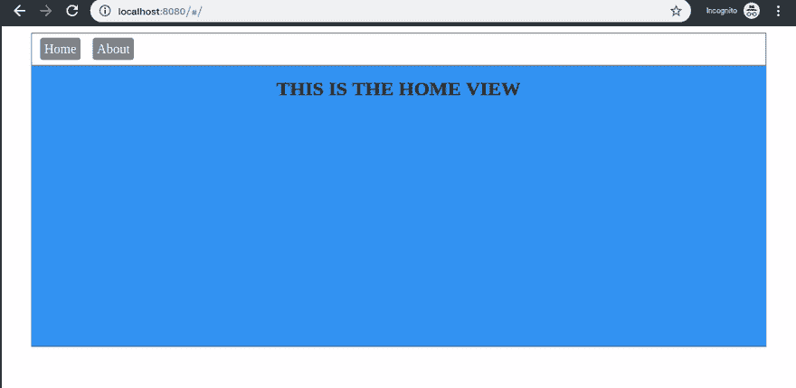
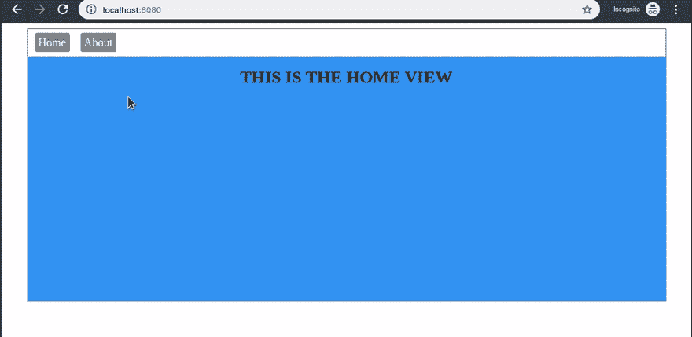

# 比较的路由器选项:Vue 路由器、Voie、Vue-routisan 和 Vue-route

> 原文：<https://dev.to/bnevilleoneill/router-options-compared-vue-router-voie-vue-routisan-and-vue-route-3m9j>

[](https://res.cloudinary.com/practicaldev/image/fetch/s--5QSsXU9A--/c_limit%2Cf_auto%2Cfl_progressive%2Cq_auto%2Cw_880/https://thepracticaldev.s3.amazonaws.com/i/la5r589v3ufb34pqvcec.png)

## 简介

现代 web 框架的出现改变了开发人员思考和构建软件的方式。我们现在可以使用灵活的框架(名字真的很酷)——比如 [Angular](https://angular.io/) 、 [React](https://reactjs.org/) 和[Vue](https://vuejs.org/)——轻松地创建吸引人的界面。

使用现代前端框架的一些好处包括:

*   [模板系统](https://www.freecodecamp.org/news/reacts-jsx-vs-vue-s-templates-a-showdown-on-the-front-end-b00a70470409/)
*   渐进式 web 应用程序(PWA)功能
*   反应性(数据绑定)
*   最佳化
*   按指定路线发送
*   单页应用程序(SPA)

[](https://logrocket.com/signup/)

每个框架都有解决问题的独特方式，但是框架的一般概念规定了它们之间的基本相似性。在本文中，我们将探讨客户端路由、其重要性以及 Vue 路由器——我们用于 Vue 应用的首选路由器。

SPA 是在整个交互过程中在单个页面的空间内显示动态内容的 web 应用程序。SPA 的工作是当用户从一个页面切换到另一个页面时，巧妙地替换应用程序的用户界面。

SPA 知道如何使用路由器进行页面转换。路由器负责 URL 地址栏和正在显示的界面之间的同步。在 web 开发中，有两种向 web 浏览器呈现内容的基本方法:

1.  客户端
2.  服务器端

使用服务器端方法，每当需要新内容时，客户端都会向服务器发出请求。这样做的明显缺点是，在与后端资源的交互中，它可能会重复浪费时间。好的一面是——这对 SEO 来说很好，因为爬虫机器人提供了索引内容。

使用客户端方法，web 应用程序最初将从后端服务器请求一个页面— `index.html` —然后在第一次请求之后，将动态获取额外的数据(使用一个`[XHR](https://www.w3schools.com/xml/xml_http.asp)`对象)。应用程序的进一步路由将由客户端 JavaScript 处理。

让我们定义一下我们的讨论主题——路由器:

> 路由器是一种将当前显示的视图与地址栏同步的工具。换句话说，它是一个现代 web 应用程序的组件，当 URL 地址发生变化时，它触发视图的更新。

我们将把 Vue 看作是令人感兴趣的渐进式 JavaScript 框架。它有一个名为 [Vue Router 的官方路由器模块。](https://router.vuejs.org/)该路由器一直由维护 Vue 框架的同一批人维护。

## 什么是 Vue 路由器？

Vue 路由器是 [Vue](http://vuejs.org/) 的官方路由器。它与 Vue core 深度融合，让用 Vue 建造 spa 变得轻而易举。Vue 路由器的一些功能包括:

*   [嵌套路线/视图映射](https://router.vuejs.org/guide/essentials/nested-routes.html)
*   [路线参数，查询，通配符](https://router.vuejs.org/api/#to)
*   [查看 Vue.js 过渡系统提供的过渡效果](https://router.vuejs.org/guide/advanced/transitions.html)
*   [与自动激活 CSS 类的链接](https://router.vuejs.org/api/#linkactiveclass)
*   [HTML5 历史模式或哈希模式，IE9 中带有自动回退功能](https://router.vuejs.org/guide/essentials/history-mode.html)
*   [可定制](https://router.vuejs.org/guide/advanced/scroll-behavior.html) [滚动](https://router.vuejs.org/guide/advanced/scroll-behavior.html) [行为](https://router.vuejs.org/guide/advanced/scroll-behavior.html)

让我们通过设置和使用 Vue 路由器来了解它的一些好处。

## 使用 Vue 路由器

虽然有很多方法可以建立一个 Vue 项目，但是对于本教程来说，我们首选的方法是使用 [vue-cli。](https://cli.vuejs.org/)vue-CLI 让我们能够快速搭建和服务 Vue 项目。在撰写本文时，我们将使用该工具的最新版本(版本 3)——如果您还没有安装它，您可以在这里安装[。](https://cli.vuejs.org/)

### **创建新项目**

我们可以用这个命令创建一个新的 Vue 项目:

```
vue create routerapp 
```

Enter fullscreen mode Exit fullscreen mode

系统会提示您选择一个预设，选择默认(babel，eslint)。

### **安装 Vue 路由器**

让我们将 Vue 路由器添加到我们的项目:

```
npm install vue-router 
```

Enter fullscreen mode Exit fullscreen mode

> 注意:如果你使用纱线，这将是`yarn add vue-router`。如果您喜欢通过脚本标签使用 Vue，您可以在这个脚本中包含 Vue 路由器:`<script src="https://unpkg.com/vue-router"></script>`

### **配置路由器**

我们已经成功安装了 Vue 路由器，但是 Vue 无法知道它的存在。我们将在`src/main.js`文件中明确告诉 Vue 使用 Vue 路由器:

```
import Vue from 'vue'
import App from './App.vue'
import VueRouter from 'vue-router'
import routes from './routes'

Vue.use(VueRouter)
const router = new VueRouter({
  routes
})

Vue.config.productionTip = false

new Vue({
  render: h => h(App),
  router
}).$mount('#app') 
```

Enter fullscreen mode Exit fullscreen mode

> 注意:如果您尝试保存，您的 IDE 可能会显示错误，但这只是因为我们尚未创建— routes —文件夹。我们接下来将创建它，所以现在忽略这个错误。

我们已经包含了对一个尚未创建的文件夹`./routes`的引用。该文件夹将包含一个文件，我们将在其中定义路线和它们映射到的视图。

我们调用了`Vue.use()`并传入了`VueRouter`对象，这样我们就可以访问任何组件中的路由器。让我们在`src`目录下创建`routes`文件夹。我们还将在`src/routes`文件夹中创建一个`index.js`文件，用于保存我们的路线定义。

打开`src/routes/index.js`文件并粘贴以下代码片段:

```
import Home from '../components/Home'
import About from '../components/About'

const routes = [
    {
        path: '/',
        name: 'home',
        component: Home
    },
    {
        path: '/about',
        name: 'about',
        component: About
    }
]
export default routes 
```

Enter fullscreen mode Exit fullscreen mode

> 注意:和以前一样，我们引用了一些尚未创建的文件。现在忽略任何 lint 错误。我们将很快创建这些视图文件。

在上面的代码片段中，我们定义了一些路线及其视图。我们导入了两个组件视图(我们将很快创建它们)并将它们作为组件添加到`routes`数组中。这就是我们使用 Vue 路由器定义新路由的方式。

### **建筑构件**

让我们创建`Home`和`About`组件:

1.  `Home`组件是我们希望用户在页面加载时看到的默认组件
2.  `About`组件显示应用程序的一些信息

在`components`目录下创建一个`home.vue`文件，并粘贴到下面的代码片段中:

```
<template>
 <div class="home">
   <h2>THIS IS THE HOME VIEW</h2>
 </div>
</template>
<script>

export default {
 name: "home"
};

</script>
<style scoped>
.home {
 width: 100%;
 height: 50vh;
 background: rgb(25, 169, 241);
}
h2 {
 padding: 15px 0px 0px 0px;
 margin: 0px;
 text-align: center;
 font-size: 24px;
}
</style> 
```

Enter fullscreen mode Exit fullscreen mode

很好，我们刚刚定义了主页的标记，现在让我们在`components`目录下创建一个— `about.vue` —文件，并粘贴以下内容:

```
<template>
  <div class="about">
    <h2>THIS IS THE ABOUT VIEW</h2>
  </div>
</template>
<script>

export default {
  name: "about"
};

</script>
<style scoped>
.about {
  width: 100%;
  height: 50vh;
  background: rgb(243, 245, 145);
}
h2 {
  padding: 15px 0px 0px 0px;
  margin: 0px;
  text-align: center;
  font-size: 24px;
}
</style> 
```

Enter fullscreen mode Exit fullscreen mode

我们已经构建了这两个组件，但是为了让我们看到 Vue 路由器的平滑过渡，我们必须使用`<router-view/>`标签。当这个标签被定义时，它根据 URL 地址栏自动控制显示哪个视图。我们把这个标签放在哪里？

让我们打开父组件— `src/App.vue` —并对其进行编辑，使其具有两个组件的链接，并使用`<router-view/>.`打开文件并粘贴到下面的代码片段中来显示正确的视图:

```
<template>
  <div id="app">
    <nav>
      <router-link to="/">Home</router-link>
      <router-link to="/about">About</router-link>
    </nav>
    <router-view/>
  </div>
</template>
<script>

export default {
  name: "app"
};

</script>
<style>

#app {
  max-width: 896px;
  margin: 0 auto;
}

nav {
  padding: 10px;
  border: 1px solid grey;
}

nav a {
  color: white;
  padding: 5px;
  background: grey;
  border-radius: 3.5px;
  text-decoration: none;
}

a:first-child {
  margin-right: 15px;
}

</style> 
```

Enter fullscreen mode Exit fullscreen mode

现在让我们测试应用程序。使用终端导航到`src`目录，并为应用服务:

```
$ cd src
$ vue serve 
```

Enter fullscreen mode Exit fullscreen mode

最后一个命令将启动开发服务器，并在本地地址上呈现应用程序—[http://localhost:8080/](http://localhost:8080/)—让我们在浏览器上访问它:

[](https://res.cloudinary.com/practicaldev/image/fetch/s--HFyHYUO7--/c_limit%2Cf_auto%2Cfl_progressive%2Cq_66%2Cw_880/https://paper-attachments.dropbox.com/s_55A7AFCA2D01F19D1DB2C5D7074A21DFD7AC4F153729C79E2C15A8BA81A1C30D_1557624053526_RouterRender.gif)

在上面的屏幕记录中，我们可以看到应用程序如何在主页和关于页面之间切换，而不会导致浏览器窗口的重新加载。这就是现代网络框架中路由器的力量。再来看看 Vue 路由器的其他一些功能和特点。

### **切换到历史模式**

您会注意到在应用程序的 URL 地址栏中有一个“#”。这是因为，默认情况下，Vue Router 使用 URL 哈希来模拟完整的 URL，这样当 URL 更改时，页面不会重新加载。我们可以切换模式，将其更改为历史模式，利用`history.pushState` API 来实现 URL 导航，而无需重新加载页面。

让我们通过更新`src/main.js`文件中的代码切换到历史模式:

```
import Vue from 'vue'
import App from './App.vue'
import VueRouter from 'vue-router'
import routes from './routes'

Vue.use(VueRouter)
const router = new VueRouter({
  mode: 'history', // add this
  routes
})

Vue.config.productionTip = false
new Vue({
  render: h => h(App),
  router
}).$mount('#app') 
```

Enter fullscreen mode Exit fullscreen mode

很好，现在让我们转到网络浏览器，我们可以看到“#”消失了，历史模式被激活:

[](https://res.cloudinary.com/practicaldev/image/fetch/s--0Pd2Kx-f--/c_limit%2Cf_auto%2Cfl_progressive%2Cq_66%2Cw_880/https://paper-attachments.dropbox.com/s_55A7AFCA2D01F19D1DB2C5D7074A21DFD7AC4F153729C79E2C15A8BA81A1C30D_1557628250951_Render2.gif)

我们几乎没有探索 Vue 路由器的功能和特性，但这里有一些其他的特性供好奇者参考:

1.  [动态](https://router.vuejs.org/guide/essentials/dynamic-matching.html) [r](https://router.vuejs.org/guide/essentials/dynamic-matching.html) [郊游](https://router.vuejs.org/guide/essentials/dynamic-matching.html)
2.  [嵌套](https://router.vuejs.org/guide/essentials/nested-routes.html) [r](https://router.vuejs.org/guide/essentials/nested-routes.html) [outes](https://router.vuejs.org/guide/essentials/nested-routes.html)
3.  [道具](https://router.vuejs.org/api/#router-view-props)
4.  [路线守卫](https://router.vuejs.org/guide/advanced/navigation-guards.html#global-before-guards)
5.  [保持组件存活](https://router.vuejs.org/api/#exact-active-class)等

在下一节中，我们来看看 Vue 路由器的一些替代方案。

## Vue 的替代路由器选项

有时，您可能想为您的 Vue 应用程序使用不同的路由器。在这种情况下，以下是一些值得考虑的替代方案:

## 车道

根据官方 npm [页面](https://www.npmjs.com/package/voie)的定义，Voie 是一个简单的路由器，用于在 [Vue](http://vuejs.org/) 建立强大的水疗中心。与围绕 URL 组织的 Vue 路由器不同，Voie 是围绕*州*组织的。基于 Voie 的应用程序基本上是[有限状态机](https://en.wikipedia.org/wiki/Finite-state_machine)——状态只是应用程序中一个名为的逻辑“位置”的*。*

每个状态可以*可选地*有一个:

*   URL 模式
*   Vue 组件
*   输入钩子以用数据填充状态
*   让胡克去收拾东西

状态被组织成层次结构:子状态将从父状态继承参数和数据。如果子状态有一个组件，它将被呈现在由`<v-view>`指令指示的父(或最近的祖先)状态指定的位置。

让我们来看看这个例子:

> 注意:Voie 仍在积极开发中，因此报告的问题将随着开发的进展而得到解决。

### **安装**

Voie 可以使用以下命令与 npm 一起安装:

```
 npm i --save voie 
```

Enter fullscreen mode Exit fullscreen mode

### **用法和语法**

我们来看看这个例子:

```
app.add('user', {
 path: '/user/:userId',
 redirect: 'user.dashboard',   // specify "default" sub-state
 enter: (ctx) => {             // can return a Promise
   return fetch('/user/' + ctx.params.userId)
     .then(res => res.json())
     .then(data = ctx.data.user = data);
 },
 component: {
   template: '<div class="user-layout"><v-view></v-view></div>'
 }
});

app.add('user.dashboard', {
 component: {
   template: '<h1>Hello, {{ user.name }}!</h1>'
 }
}); 
```

Enter fullscreen mode Exit fullscreen mode

在上面的代码片段中，访问`/user/123`将从服务器获取 id 为`123`的用户，然后呈现以下标记(假设用户的名字是“爱丽丝”):

```
<div class="user-layout">
  <h1>Hello, Alice!</h1>
</div> 
```

Enter fullscreen mode Exit fullscreen mode

> **注意:** [片段实例](http://vuejs.org/guide/components.html#Fragment_Instance)不支持作为组件。换句话说，确保所有组件都包含一个没有流控制指令(`v-if`、`v-for`等)的顶级元素。)

### **进一步学习**

访问官方 npm [页面](https://www.npmjs.com/package/voie)了解更多关于其他 Voie 的概念，包括:

*   州经理
*   状态定义
*   运行状态管理器
*   状态层级
*   导航状态
*   进入/离开
*   每次之前/之后
*   改变方向
*   状态转换
*   因素
*   历史设置

## vista-鲁西斯坦语

Vue 作为一个 web 框架的发展曲线中的一个重要时期是当 Laravel 开始提供包含 [Bootstrap](https://getbootstrap.com/) 和 [Vue 的前端样板文件时。](https://vuejs.org/)这导致 Vue 成为许多 Laravel 开发人员首选的前端框架。也就是说，Vue-routisan 是一个基于 Laravel 路由系统的 Vue 路由系统。

### **安装**

我们可以使用下面的命令在 npm 上安装 Vue-routisan:

```
npm install vue-routisan 
```

Enter fullscreen mode Exit fullscreen mode

### **用法和语法**

`view()`方法分别接收`path`和`component`路径选项。如果您定义了视图解析器，您可以直接指定组件的名称:

```
Route.view('/', 'Home'); 
```

Enter fullscreen mode Exit fullscreen mode

如果没有视图解析器，它将:

```
import Home from './views/Home';

Route.view('/', Home); 
```

Enter fullscreen mode Exit fullscreen mode

### **什么是视图解析器？**

视图解析器允许`view()`方法为您的路线自动要求组件。这可以让你在定义路线时避免重复的`import`和`require`。视图解析器是可选的。如果您选择不配置它，您可以`import`一个组件，并直接将其作为`view()`方法的第二个参数:

```
import Route from 'vue-routisan';

Route.setViewResolver((component) => {
    return require('./views/' + component).default;
}); 
```

Enter fullscreen mode Exit fullscreen mode

### **命名航线**

`name()`方法在*路由实例上设置`name`选项:*

```
Route.view('/user/profile', 'Profile').name('profile'); 
```

Enter fullscreen mode Exit fullscreen mode

### **嵌套航线**

`children()`方法在*路由实例上设置`children`选项:*

```
Route.view('/user', 'User').children(() => {
    Route.view('', 'UserList');
    Route.view(':id', 'UserDetails');
    Route.view(':id/edit', 'UserEdit');
}); 
```

Enter fullscreen mode Exit fullscreen mode

### **进一步学习**

访问官方 npm [页面](https://www.npmjs.com/package/vue-routisan)了解其他 Vue-routisan 概念，包括:

*   路由组
*   路线前缀
*   自动格式化的路径
*   检索所有路线
*   导航防护装置
*   重定向路由

## 视图路线

Vue-route 是 Vue.js 的路由指令，灵感来自于`ng-view.`，它允许你在`$root` Vue 对象:
上声明你的路线

```
var root = new Vue({
    el: 'body',

    routes: {
        '/home': {
            componentId: 'fg-home',
            isDefault: true
        },
        '/items/:item': {
            componentId: 'fg-item',
            afterUpdate: 'updateHeader',
            data: {
                defaultColor: '#3453DD'
            }
        },
        options: {
            hashbang: true
        }
    }
}); 
```

Enter fullscreen mode Exit fullscreen mode

然后可以用最少的标记引用:

```
<body>
    <div v-route></div>
</body> 
```

Enter fullscreen mode Exit fullscreen mode

### **安装和配置**

*   我们可以使用以下命令通过 npm 安装 Vue-route:

```
npm i vue-route --save 
```

Enter fullscreen mode Exit fullscreen mode

*   要求并安装插件:

```
var Vue = require('vue'),
    route = require('vue-route');

Vue.use(route); 
```

Enter fullscreen mode Exit fullscreen mode

*   把`<div v-route></div>`放到你的主模板中。
*   将您的路线传送到应用程序的`$root`虚拟机。

## 过渡、保活等指令

如果您想在页面之间添加自定义过渡，建议将它们放在每个页面的组件模板上。在`v-route`元素上放置任何东西只有在你改变这个元素时才会被激活(例如用一个`v-if`指令)。按照这个例子，这将是:

```
<div class="Home" v-transition="homeTransition">...</div> 
```

Enter fullscreen mode Exit fullscreen mode

### **进一步学习**

访问官方 npm [页面](https://www.npmjs.com/package/vue-route)了解其他 Vue 路线概念，包括:

*   位置概念
*   路线参数
*   子路由

## 结论

在本文中，我们了解了客户端和服务器端呈现的应用程序之间的一些差异。我们还看到了客户端路由的一些优势，以及它如何增强我们的 web 应用程序的性能。

除了 Vue 路由器的替代品之外，我们还进一步了解了 Vue 和 Vue 路由器(Vue 的官方路由器)。如果您一直在寻找 Vue 路由器的替代方案，您应该尝试熟悉上面列出的选项之一。

* * *

## Plug: [LogRocket](https://logrocket.com/signup/) ，一款适用于网络应用的 DVR

[](https://res.cloudinary.com/practicaldev/image/fetch/s--6FG5kvEL--/c_limit%2Cf_auto%2Cfl_progressive%2Cq_auto%2Cw_880/https://i2.wp.com/blog.logrocket.com/wp-content/uploads/2017/03/1d0cd-1s_rmyo6nbrasp-xtvbaxfg.png%3Fresize%3D1200%252C677%26ssl%3D1)

[log rocket](https://logrocket.com/signup/)是一个前端日志工具，让你重放问题，就像它们发生在你自己的浏览器中一样。LogRocket 不需要猜测错误发生的原因，也不需要向用户询问截图和日志转储，而是让您重放会话以快速了解哪里出错了。它可以与任何应用程序完美配合，不管是什么框架，并且有插件可以记录来自 Redux、Vuex 和@ngrx/store 的额外上下文。

除了记录 Redux 动作和状态，LogRocket 还记录控制台日志、JavaScript 错误、stacktraces、带有头+体的网络请求/响应、浏览器元数据、自定义日志。它还使用 DOM 来记录页面上的 HTML 和 CSS，甚至为最复杂的单页面应用程序重新创建像素级完美视频。

[免费试用](https://logrocket.com/signup/)。

* * *

帖子[路由器选项对比:Vue 路由器、Voie、Vue-routisan 和 Vue-route](https://blog.logrocket.com/router-options-compared/) 最先出现在 [LogRocket 博客](https://blog.logrocket.com)上。