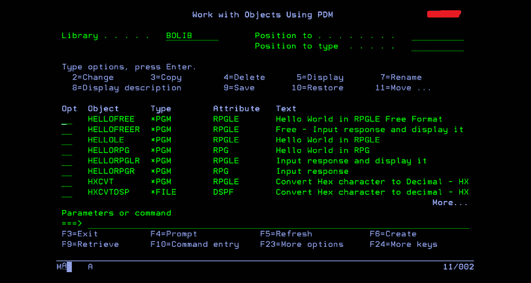
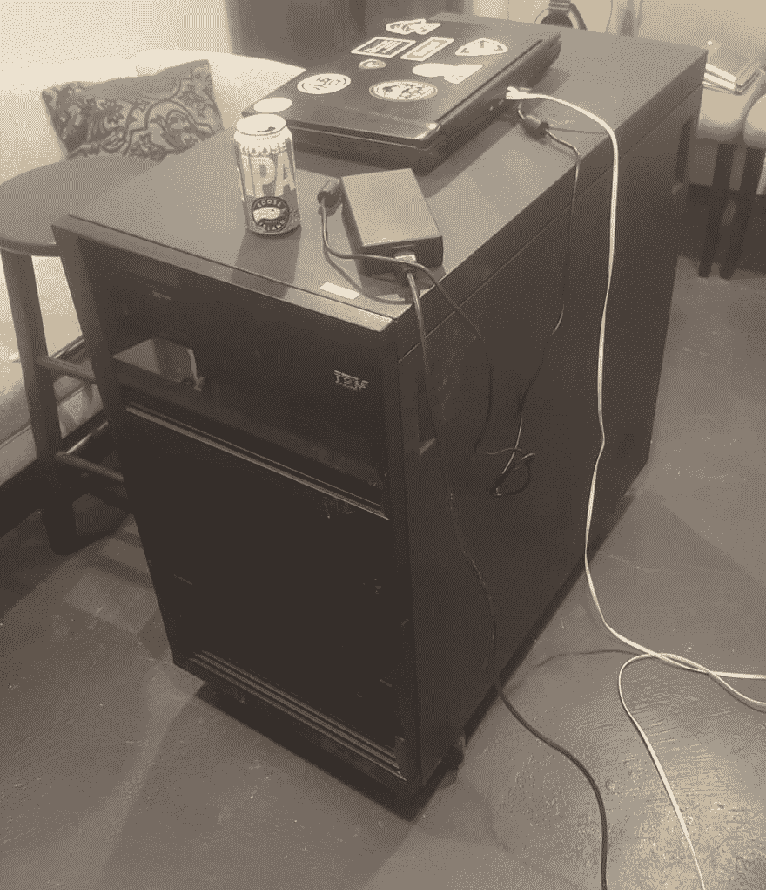
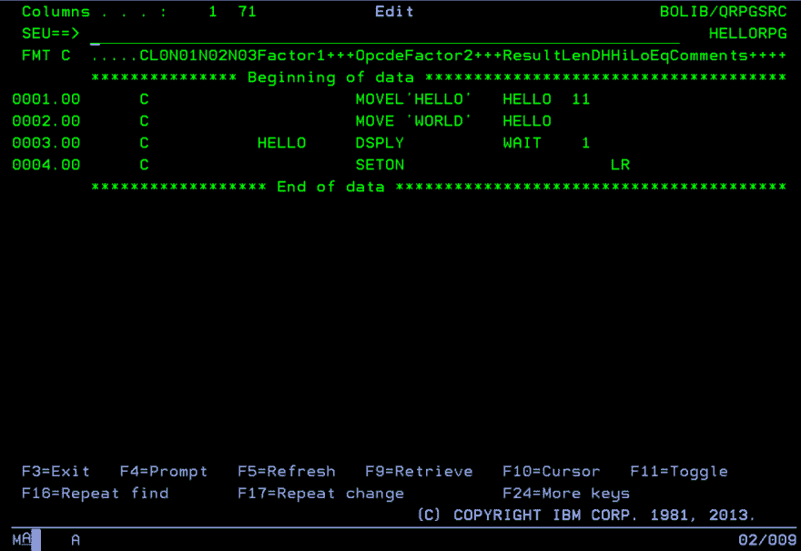

# RPG 和 IBM i

> 原文：<https://dev.to/barrettotte/rpg-and-the-ibmi-563>

[](https://res.cloudinary.com/practicaldev/image/fetch/s--1VTLYpXm--/c_limit%2Cf_auto%2Cfl_progressive%2Cq_auto%2Cw_880/https://thepracticaldev.s3.amazonaws.com/i/0kjxzu87dygrr1f338ji.PNG)

这是我写给 DEV 的第一篇文章，看看是否有开发人员以前用过 IBM i 或者有兴趣了解它是什么。首先，我将关注 IBM i 的历史以及随之发展的 RPG 编程语言。

在我目前的工作场所，我在许多老开发人员的显示器上注意到这种不祥的绿色和黑色屏幕。不久之后，我发现我的公司用 RPG(LE)代码库开发和维护一个 IBM i 系统。我立刻被激起了兴趣，并着手了解发生了什么。问题是学习一种新的思维模式是困难的。

由于我是一名 web 开发人员，并表示对学习 IBM i 有点兴趣，所以给了我一个用户帐户和库，我可以随意使用。我在各种网站和一些 IBM 文档中搜索“教程”。但是，我很快发现，与学习其他编程语言和/或操作系统相比，这并不是一个很好的起点。

## 重要的一课

[](https://res.cloudinary.com/practicaldev/image/fetch/s--lV-Avs0P--/c_limit%2Cf_auto%2Cfl_progressive%2Cq_auto%2Cw_880/https://thepracticaldev.s3.amazonaws.com/i/y55ie8f7ckyltkclbnot.jpg)

如果你发现自己想通过在易贝上购买二手 AS/400 来学习 RPG，不要这样做(除非你有额外的 20K 美元)。IBM 很酷，但是他们的软件很贵，而且是封闭源码的。所以，我现在在我的地下室里有一个相当可爱的 500 磅的吧台。

## 简介

IBM i 是一个非常适合业务应用程序、报告、数据仓库等的操作系统。它还带有一个名为 DB2 的内置数据库，该数据库使用自己的 SQL 风格。

IBM i 还能够使用许多语言，比如 RPG、CL、DDS、COBOL、BASIC、C/C++、Java、Python、DB2 SQL 和 REXX。这台机器有很多信息，但在高层次上，这些信息应该足够了。

IBM i 的一大卖点就是稳定性。据我工作场所的开发人员说，我们的 IBM i 系统在 30 多年的运行中只需要重启一次。

## 简史

随着时间的推移，IBM i 发生了很大的变化，在谷歌上搜索东西时经常会感到困惑。追踪其发展的最简单的方法是跟随 RPG 编程语言。

*   1959ish [IBM 1400 系列](https://en.wikipedia.org/wiki/IBM_1400_series) - **RPG I**
    *   **穿孔卡片和磁带**
    *   也支持 COBOL、FORTRAN 和一些古老的 ASM 语言。
*   1969-1977 年 [IBM 系统/3](https://en.wikipedia.org/wiki/IBM_System/3) - **RPG II**
    *   还支持 COBOL、FORTRAN、BASIC
*   1978 [IBM 系统/38](https://en.wikipedia.org/wiki/IBM_System/38) - **RPG III**
    *   磁盘存储器、软盘驱动器等。
    *   也支持 COBOL、BASIC、PL/I
*   1988 [**应用系统/400-AS/400**](https://en.wikipedia.org/wiki/IBM_System_i)-**RPG 400/IV**
    *   还支持 ASM、C/C++、COBOL、Python、REXX 等等。
*   2000 年-更名为 iSeries
*   2006 年-更名为系统 I

我忽略了很多信息，但请随意阅读更多信息。

## RPG

[](https://res.cloudinary.com/practicaldev/image/fetch/s--lYPELzb9--/c_limit%2Cf_auto%2Cfl_progressive%2Cq_auto%2Cw_880/https://thepracticaldev.s3.amazonaws.com/i/cjnjj8unl75jqs6n3v0s.PNG)

所以，等等...RPG 大概从 **1960** 左右就有了？

是啊。

RPG(报告程序生成器)始于穿孔卡片，是一种用于生成报告的编程语言。在其生命周期中，RPG 获得了新的特性/变化，目前可以像通用编程语言一样使用。

RPG 固定格式看起来这么丑是因为它的起源。因此，RPG 的语法依赖于需要特定数据的某些列。

渐渐地，RPG 从其固定格式的祖先进化出来，呈现出自由格式的外观。IBM 确保了 RPG 版本之间有足够的向后兼容性。例如，在 AS/400 上，您可以混合使用 RPG III 和 RPG IV 程序。随着 RPG 向自由格式的发展

RPG 有时被称为 RPGLE。不涉及太多细节:在 IBM i 上，有一个概念是**集成语言环境(ILE)** 语言。ILE 语言可以和其他 ILE 语言对话。这包括 CL、COBOL、C/C++、RPG 等等。现代 RPG 开发通常使用 RPGLE。

### 固定格式 RPG 中的 Hello World(RPG III)

```
 C                     MOVEL'HELLO'   HELLO  11
      C                     MOVE 'WORLD'   HELLO
      C           HELLO     DSPLY          WAIT    1
      C                     SETON                     LR 
```

Enter fullscreen mode Exit fullscreen mode

### 固定格式 RPGLE 中的 Hello World in)

```
 C     'Hello World' DSPLY
      C                   SETON                                        LR 
```

Enter fullscreen mode Exit fullscreen mode

### 自由格式 RPGLE 中的 Hello World in)

```
 /free
       dsply ('Hello World');
       *inlr = *on 
```

Enter fullscreen mode Exit fullscreen mode

使用**/自由**和**/自由端**可以混合搭配固定和自由旋转。

## 结论

这只是在 IBM i 的小小一瞥，关于这台机器还有堆积如山的信息要学，其中大部分我还没学会。我知道这可能会令人困惑，但我希望我的文字足够连贯，可以享受阅读。如果有人想阅读和学习更多关于 IBM 的知识，我会在评论中告诉我。我很想继续发这样的帖子。

未来可能的职位:

*   什么是控制语言(CL)？
*   什么是数据描述规范(DDS)？
*   IBM i 文件结构、物理文件和逻辑文件
*   从 Java、Python 等调用 IBM i
*   编写一个基本的 RPGLE 程序

## 我的 IBM 我的“项目”

为了开始学习，我做了一个小仓库来存放随机文件和笔记；位于[https://github.com/barrettotte/IBM-RPG](https://github.com/barrettotte/IBM-RPG)

我正在写一本名为“作为一个卑微的 Web 开发人员学习 IBM i”的小“书”(显然这个标题是在调侃)。这本书将是 IBM i 的临时指南，介绍各种晦涩难懂的语言(RPGLE、CL、DDS、REXX、COBOL 等)，以及总结概念的简短课程。

为了配合我的书，我随便开发了一个 IBM i VS 代码扩展和编辑器 API，以便能够从 VS 代码中查看、编辑和编译 IBM i 代码。

感谢您的阅读。