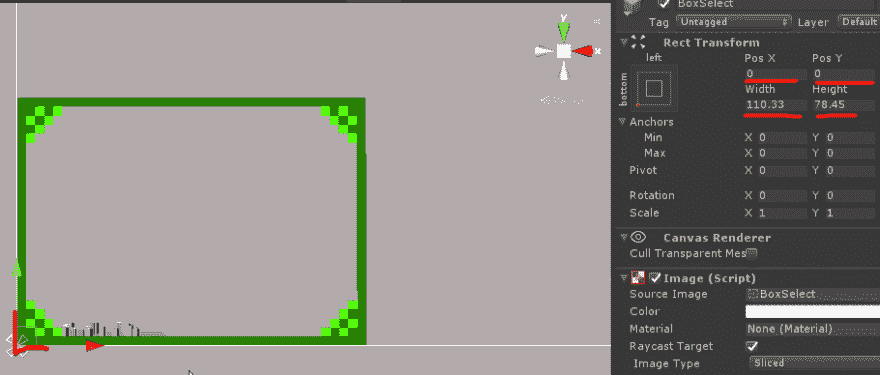
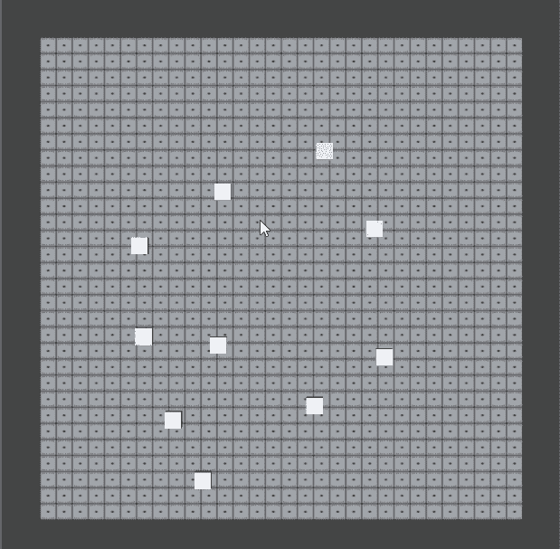
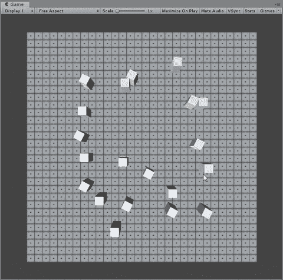
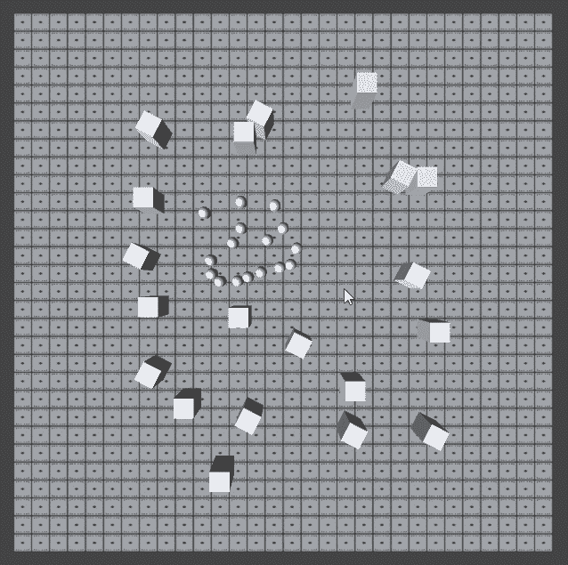
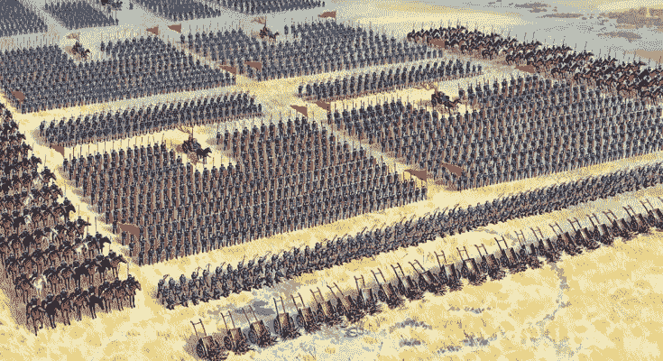

# RTS 游戏开发-第 1 周

> 原文：<https://dev.to/k1pash/rts-game-development-week-1-monday-5012>

我要做一个 Unity3D 的 RTS 游戏。我想在这里记录我的发展。希望你会觉得有趣。它在这个库中是开源的:[https://gitlab.com/Kipash/rts-concept](https://gitlab.com/Kipash/rts-concept)(是的，有兴趣的话联系我)

# 之前(提交 3f31d24)

首先，我做了网格，但后来我意识到我想使用基于网格的寻路，这已经内置到 Unity 中。

所以我用导航代理创建了一个简单的胶囊。和一个具有最少逻辑的定制单元脚本。只是基本的，像 GoTo 方法，它命令导航代理去一个世界位置。

```
public void GoTo(Vector3 worldPosition)
{
    print($"GoTo: {worldPosition}");
    agent.SetDestination(worldPosition);
    agent.isStopped = false;
} 
```

Enter fullscreen mode Exit fullscreen mode

然后我选择了盒子，我不知道如何做，也没有测试性能。

由于...

[](/brianpeek)

## [布莱恩偷看](/brianpeek) <button name="button" type="button" data-info="{&quot;id&quot;:139952,&quot;className&quot;:&quot;user&quot;,&quot;name&quot;:&quot;Brian Peek&quot;,&quot;style&quot;:&quot;full&quot;}" class="crayons-btn follow-action-button whitespace-nowrap  " aria-label="Follow user: Brian Peek" aria-pressed="false">跟着</button>

[I'm a Senior Software Engineer at Microsoft in the Xbox Advanced Technology Group. I also write games (new & retro), tinker with hardware, and speak at conferences.](/brianpeek)

...和他的 GameDev 新闻，我可以在这里读到一些关于 UI 优化的内容。我也推荐阅读它。这对于半初学者来说是很好的，我通常很喜欢它，并将使用一些在那里指出的东西。

回到 UI，我关注的是框选 UI，我从来没有这样做过，所以...我对如何在两点之间拉伸 UI 元素感到有点困惑，拖动开始和拖动结束。但后来它抓住了我。如果我们将轴心设置为(0，1)，那么我们就能够将高度和宽度设置为拖动开始和结束之间的差值。然后只需将 UI 元素的位置设置为拖动开始位置。得出那个结论后，那是小菜一碟。

[](https://res.cloudinary.com/practicaldev/image/fetch/s--J3RXUR4r--/c_limit%2Cf_auto%2Cfl_progressive%2Cq_auto%2Cw_880/https://thepracticaldev.s3.amazonaws.com/i/14mg6h36ihm2yvajltke.png)T3】

```
Tuple<Vector2, Vector2> NormalizeDrag(Vector2 start, Vector2 end)
{
    Vector2 a = new Vector2(
        start.x > end.x ? end.x : start.x,
        start.y > end.y ? end.y : start.y
    );
    Vector2 b = new Vector2(
        start.x > end.x ? start.x : end.x,
        start.y > end.y ? start.y : end.y
    );
    return new Tuple<Vector2, Vector2>(a, b);
} 
```

Enter fullscreen mode Exit fullscreen mode

对于不知道 Tuple 是什么的人来说(google it tho)，这是一种将更多的值/变量包装到一个类的实例中的好方法，这样你就可以一次返回多个类型。

我在这里做的是标准化拖动，因为你可以有 4 个不同的拖动方向(从右上到左下...从左下方到右上方...等等)。这样，检查单元是否在选择中的主实现，可以只针对一种类型的拖动方向来实现，因为我们确保它被归一化到这个方向。

注意:`unitManager.GetVisibleUnits()`过滤屏幕上的所有单位。但不在我们的定制选择中。

```
foreach (var unit in unitManager.GetVisibleUnits())
{
    Vector2 uPos = cam.WorldToScreenPoint(unit.transform.position);

    //Is in selection
    if (a.x - boxSelectBias < uPos.x && uPos.x < b.x + boxSelectBias &&
        a.y - boxSelectBias < uPos.y && uPos.y < b.y + boxSelectBias)
    {
        selectedUnits.Add(unit);
        print("yes");
    }
} 
```

Enter fullscreen mode Exit fullscreen mode

[](https://res.cloudinary.com/practicaldev/image/fetch/s--Ub_8sOAn--/c_limit%2Cf_auto%2Cfl_progressive%2Cq_66%2Cw_880/https://cdn.discordapp.com/attachments/549030720480477189/613374197833400350/XJR60MDgiP.gif)

# 第 1 周(提交 456a00c)

所以我接着做了一个标签池，放在选定的单元上。问题是用户界面元素重叠，这在视觉上令人不快。

[](https://i.giphy.com/media/PjrZ3qJd2SJvZnrPAd/giphy.gif)

增加队形，这起初是一个巨大的挑战，但最终愿景是明确的，要实现什么以及如何实现。我的意思是，它只是一个简单的沿 2 轴的偏移。

```
Vector3 destination = mouseclickPosition +
                      ( horizontalDir * colum * spacing) +
                      (-verticalDir   * row   * spacing); 
```

Enter fullscreen mode Exit fullscreen mode

对于哪个单元应该去哪个地点的排序有很大的问题。目前，它与所有单元的列表成线性关系...所以在某些情况下会产生长时间的过渡。

```
selectedUnits[i].GoTo(destination); 
```

Enter fullscreen mode Exit fullscreen mode

正如你所看到的，我总是告诉列表中的第一个单元，每次我点击的时候，都要移动到最左上角的位置。我宁愿根据某种距离来排序，但是还没有找到条件。

[](https://i.giphy.com/media/kG3gexa79B6gbjWtXI/giphy.gif)

我只玩过几次 RTS，但范围很广。所有的帝国时代，星际争霸 1，要塞十字军和命令与征服:将军。我喜欢据点里的单位分组和目的地可视化。你选择你的单位，无论你在哪里点击它，它都会试图形成一个正方形。每个单位都可以看到目的地。这意味着，你可以取消选择所有，只选择一个，你会看到它的目的地。

对我来说，我觉得球员应该有更多的权力来塑造团队...因为随着更大规模的战斗...真正的阵型更好。

[](https://res.cloudinary.com/practicaldev/image/fetch/s--X6sWmJJ0--/c_limit%2Cf_auto%2Cfl_progressive%2Cq_auto%2Cw_880/https://thepracticaldev.s3.amazonaws.com/i/f45nmac9tcie11fhze74.jpg)

就是这样，不确定我每周会发布多少次更新，但一般来说...我真的很享受这一点，我希望我可以说一些有价值的东西。