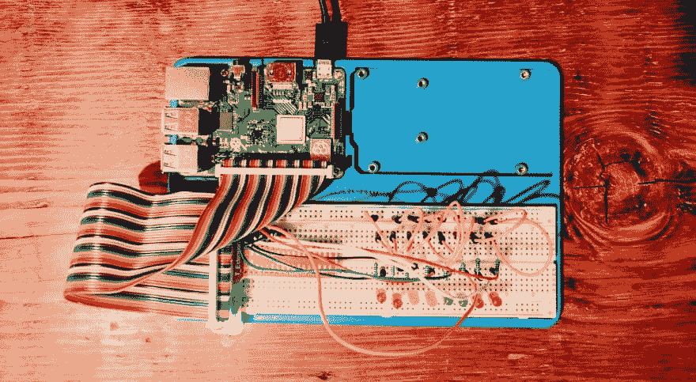

# Ruby 驱动的 LED 阵列

> 原文：<https://dev.to/codenamev/ruby-driven-led-arrays-343m>

> 这是我的 [Sunfounder Superkit 系列](https://blog.codenamev.com/tag/sunfounder-super-kit/)的第 3 部分。

我们眨了眨它，把它挂在一个按钮上，现在为了一些严肃的乐趣:*很多这样的按钮*！这个练习真正考验你对试验板的耐心。

(1 个 LED + 1 个电阻+ 2 根电线)* 8 = 24 个插头

一旦这一切都设置好了(大约 15 分钟)，它看起来棒极了！我真的很兴奋开始玩这么多闪烁的灯！

<figure> 

<figcaption>全连线 LED 阵列</figcaption>

</figure>

### 红宝石之旅开始

所以我打开 python 脚本，开始把它输入 ruby，因为 Ruby。我找到了用`rpi_gpio`设置 led 的那一行，我发现了什么？不支持多引脚设置。

我知道你在想什么，“继续前进，已经用 Python 或 C 测试过了”。你好不！我这样做并不是为了不得不拼凑一些半生不熟的蛇油代码(平心而论，C 代码很好使用，我在转换这个**腮红* *)之前也尝试过。

是时候鼓起勇气，乘着开源之风走向日落了。

幸运的是，关于创建扩展库的 [Ruby 文档非常精彩。稍微摆弄一下，我就能得到一个工作的多针`GPIO.setup`方法，](https://docs.ruby-lang.org/en/trunk/extension_rdoc.html) [PR 提交](https://github.com/ClockVapor/rpi_gpio/pull/18)。开源太棒了！

在 PR 合并之前，我必须在本地(`rake compile`)构建 gem，并在我的 gem 文件中使用`gem “rpi_gpio", path: /path/to/local/rpi_gpio`引用它。我将抛开我对开发 Ruby 扩展的所有不满，直接进入目标:一个现实生活中自制的宏伟的赛车字幕！