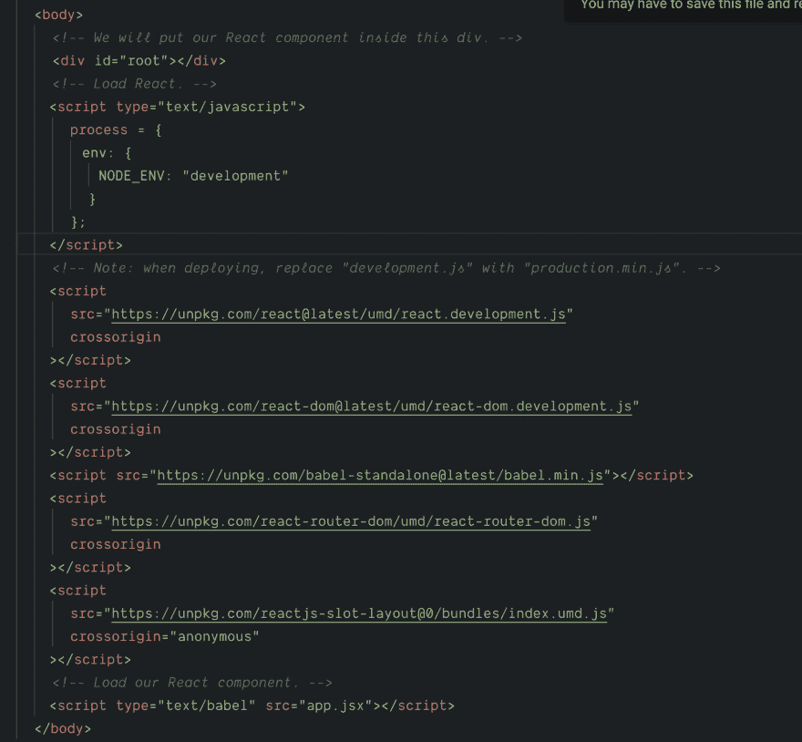
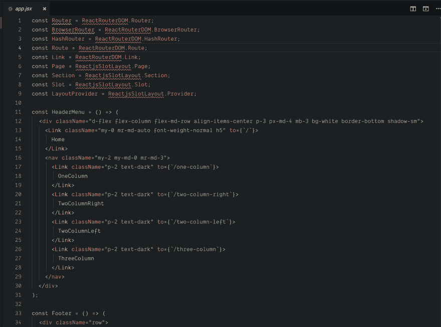

# 在浏览器中运行 JS ES6 & Reactjs。

> 原文：<https://dev.to/meabed/run-js-es6-reactjs-in-the-browser-3mjb>

当我正在构建一个 reactjs 包并且刚刚完成的时候。我想在浏览器中测试它——不仅仅是单元测试！我懒得安装 webpack dev server 或其他工具来编译我的代码，用热重装运行 dev server，所以我去尝试直接在浏览器中运行它！是的，它成功了！以下是我学到的一些东西:

*   UMD -通用模块定义
*   AMD -异步模块定义
*   CJS - CommonJS 模块
*   你可以在浏览器中运行脚本类型为 text/babel 的 es6 代码，并在浏览器中包含独立的 babel 来传输你的 es6 代码——太酷了！
*   你可以看到 babel 是如何在浏览器中传输你的代码的:[https://babeljs.io/en/repl](https://babeljs.io/en/repl)
*   使用 umd 包，您可以在浏览器中直接包含几乎所有的 JS 库。
*   Rollup 和 Typescript 构建就像 1-2-3 一样简单！有两个伟大的文学先驱
    *   [https://github.com/Hotell/typescript-lib-starter](https://github.com/Hotell/typescript-lib-starter)
    *   [https://github.com/alexjoverm/typescript-library-starter](https://github.com/alexjoverm/typescript-library-starter)
*   更倾向于偷懒是好事，只要你用这个去阅读，去重新发现另一种解决问题的方法。

*   跟上技术的发展是很难的，因为技术在超高速发展，每天都有新的东西出现！因此，尽可能多的尝试取消学习和重新学习你以前习惯做的事情，因为可能会有其他的解决方案。

截图和代码如下:

[T6】](https://res.cloudinary.com/practicaldev/image/fetch/s--2Ot9p1NK--/c_limit%2Cf_auto%2Cfl_progressive%2Cq_auto%2Cw_880/https://meabed.com/conteimg/2019/07/image-8.png)

HTML 预览:[https://codesandbox.io/s/currying-fire-rm55g](https://codesandbox.io/s/currying-fire-rm55g)

Github 回购链接:[https://github.com/meabed/reactjs-slot-layout](https://github.com/meabed/reactjs-slot-layout)

一些有用的链接:

*   [https://www . davidbcalhoun . com/2014/what-is-amd-commonjs-and-UMD/](https://www.davidbcalhoun.com/2014/what-is-amd-commonjs-and-umd/)
*   [https://www . freecodecamp . org/news/anatomy-of-js-module-systems-and-building-libraries-fadcd 8d 0e/](https://www.freecodecamp.org/news/anatomy-of-js-module-systems-and-building-libraries-fadcd8dbd0e/)
*   [http://unscriptable . com/2011/09/30/amd-vs-cjs-whats-the-best-format/](http://unscriptable.com/2011/09/30/amd-versus-cjs-whats-the-best-format/)

如果你有评论或想法，我很乐意听到，讨论和分享，请随时在评论中留下或联系 [@meabed](https://twitter.com/meabed)

快乐编码🤞