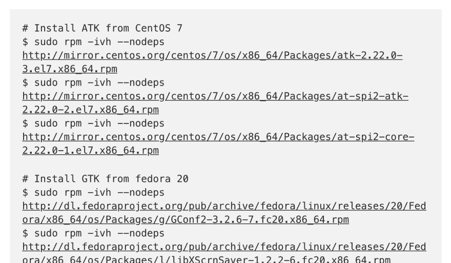
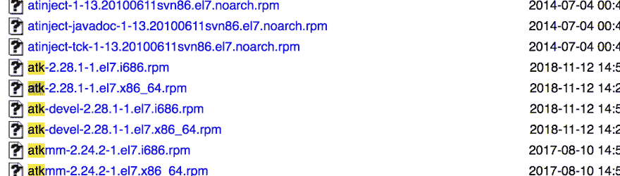
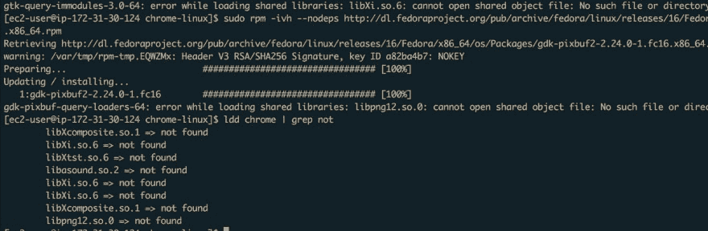
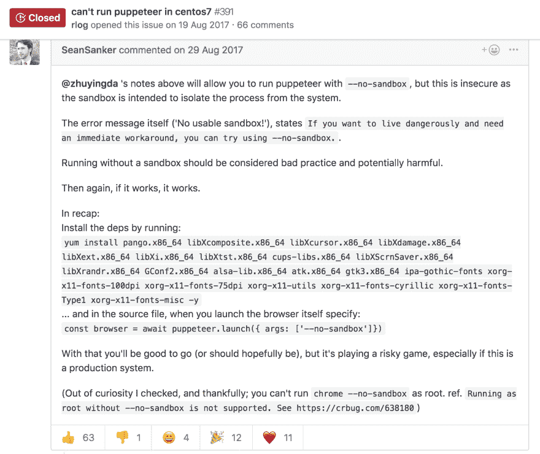
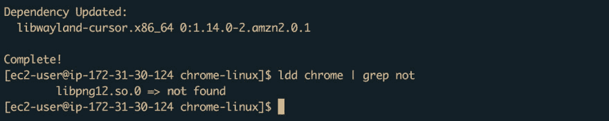
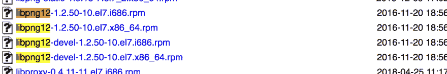

# 在 EC2 Amazon Linux AMI 上运行木偶师/Chrome Headless

> 原文：<https://dev.to/kerion7/run-puppeteer-chrome-headless-on-ec2-amazon-linux-ami-2ae8>

—2019 年 6 月增加

这篇文章紧密基于 MockingBot 的同名文章。最初的文章帮助很大，但是由于新的库和包的版本，有些部分已经过时了。因此，我在这里记下了需要从原始文章中扩充的内容，供我自己和其他遇到同样情况的人参考！

当你读到文章的这一部分时:

> 现在只剩下 6 个了，因为 Amazon Linux 没有内置 gtk，我们需要从其他发行版借用包:

请注意，有些包已经不存在了。

## 提示💡:转到 URL(直到最后一个结尾斜杠)

例如对于:
[http://mirror . centos . org/centos/7/OS/x86 _ 64/Packages/atk-2 . 22 . 0-3 . el7 . x86 _ 64 . rpm](http://mirror.centos.org/centos/7/os/x86_64/Packages/atk-2.22.0-3.el7.x86_64.rpm)

导航到:
[http://mirror.centos.org/centos/7/os/x86_64/Packages/](http://mirror.centos.org/centos/7/os/x86_64/Packages/)

并搜索 **atk-** :

因此，最接近的匹配应该是**atk-2 . 28 . 1–1 . el7 . x86 _ 64 . rpm**。

仔细阅读要用这种技术安装的项目列表，您应该就快完成了！

*差不多。*

唉，当您运行`ldd chrome | grep not`时，仍然会列出一些缺失的依赖项。在四处搜索之后，[这就敲定了交易](https://github.com/GoogleChrome/puppeteer/issues/391#issuecomment-325420271):

运行长的`yum install`命令后，您将剩下最后一个依赖项: **libpng12.so.0** 。同理，在 Centos 包列表页面中寻找 libpng12 包的 **x86_64** 版本并下载。

最后，所有的依赖项都已经组装好了。

## 结尾注

希望上面提到的提示会对你在 AMI 上安装木偶师有所帮助！如果这里有什么不清楚的地方，在原帖中也是不清楚的，一定要大声喊出来。同样，如果你已经尝试过，并注意到我的提示已经过时，也请让我知道。