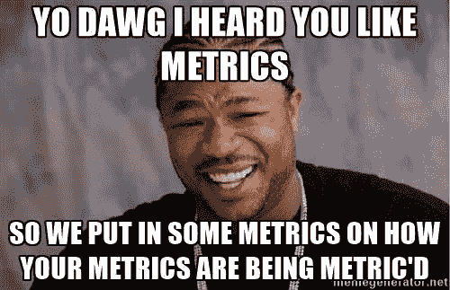
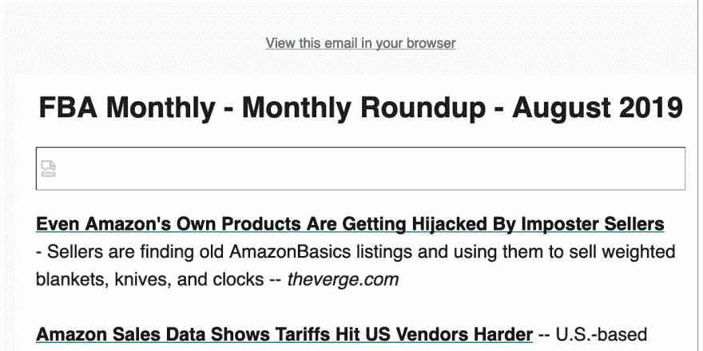

# 使用更好的指标经营新闻简报

> 原文：<https://dev.to/skatkov/running-a-newsletter-with-better-metrics-1d09>

# 多疑症

在 Gojko Adzic 的一本关于项目管理的书中，他讨论了度量的重要性。但是作为一名工程师，他保证使用正确的度量标准，而不是任何度量标准...

有一个想法深深地引起了我的共鸣——许多人陷入了跟踪错误指标的谬误，因为跟踪很简单。自从我读了这本书，太多尺度的偏执就一直跟着我。我主要将它应用于项目和团队管理。

举个例子，我完全放弃了用团队来度量个人的度量，只有团队范围的度量才有意义。即使你正在评估团队成员的表现，使用团队环境之外的个人指标也总是错误的。

举个例子:一个人可能比任何人都要解决更多的问题，但是这样做..为 QA 工程师和其他开发人员创建了大量的测试和修复工作。

# 经营简讯

我目前正在为亚马逊卖家管理一份新闻简报。该项目还不到一年。我们一直在寻找类似的服务-发现非。所以我们开始了。

最好的一个月我们赚了 250 美元。但是在 SaaS 项目中，我们为了得到同样多的资金，要付出更多的努力。谁能猜猜，我们是如何为这份时事通讯获得第一批付费客户的？没什么，他们只是写信给我们。

我从来没有认为简讯是一种可能的商业模式，但我已经被证明是错误的。我在这个领域确实是新手，第一年...我知道什么？

根据我短暂的经验，我经常听到这些问题:

*   你有多少**用户**？
*   你的邮箱**打开率**是多少？

这些问题非常普遍，感觉就像是行业标准。不过仔细考虑了一下，它们对我个人来说意义不大。

# 狗屁——谈行业标准

如果您只能选择一个指标，您真的会选择这两个中的一个吗？它能回答所有的问题吗？我个人的结论是，这两者似乎都不准确。

如果时事通讯将媒体平台扩展到普通电子邮件之外，那么**订户数量**就没什么意义了。如果我有一个包含我所有时事通讯的网站，把它和独立访客或回头客混在一起会让它更加混乱。

从本质上说，简讯是一个内容放大的问题，所以我们正是通过在社交网络上发布来做到这一点的。这些“视图”中的大多数从不计入**打开率**。我敢打赌，这些社会团体成员中的许多人确实会追随我们，但不希望订阅。

另一个问题是...

在我选择的电子邮件服务中，作为时事通讯的一部分发送的一个问题是:

有一个图像丢失了，只是因为它与跟踪脚本捆绑在一起——质子阻止了它。它也不会注册为“电子邮件打开”事件。

现在不仅仅是 ProtonMail 了——Firefox 默认情况下会屏蔽追踪器，Brave 也曾经这样做过。

因此...我向我的潜在客户提供的指标可能是扭曲的或者完全错误的。

# 理论

我分享的一个两难问题的答案，仍然未经检验。没有数据支持这一点。所以我称之为理论，请随意批评。

广告商试图评估我们读者群的参与度。所有这些估计大多基于隐藏在每个用户背后的眼球数量。

但是参与度指标真的很重要，这里的主要跟踪点是链接点击量。为了避免所有的阻塞-支持分析的基本网址缩写将完成交易。

这里有人经营时事通讯吗？如果不是为了打开率和用户数，你用了什么样的指标？希望得到一些反馈！