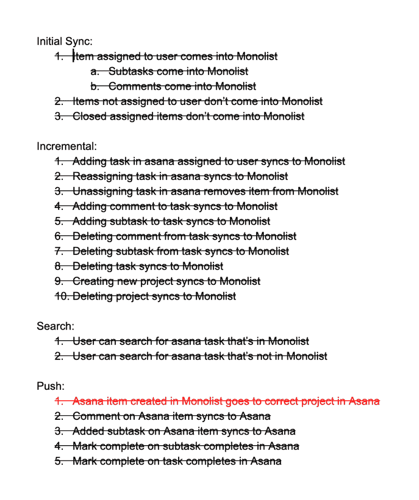

# 运行你的团队不会害怕的有效的 Bug Bashes

> 原文：<https://dev.to/jakemmarsh/running-effective-bug-bashes-that-your-team-won-t-dread-20bg>

“Bug bash”是软件工程和产品开发中经常使用的一个术语。一般来说，这意味着项目中的所有利益相关者将他们所有的注意力放在寻找(和解决)一个特性或产品中的任何未解决的 bug 上。

一些公司或团队以一种反动的方式进行 bug bashes，这意味着当他们在产品中积累了太多的 bug 时，他们会暂停一切。到那时，他们会告诉所有相关人员尽可能多地“打击”臭虫。在 Monolist，我们喜欢积极主动地引导他们:坐下来，以一种有组织的方式一起完成所有事情，就在我们向用户发布新东西之前。

#### 我们已经有了(QA |自动化测试)。我们真的也需要举办昆虫聚会吗？

如果你的公司有专门的 QA 工程师，他们的工作是从上到下手工测试每一个新功能，那么你就成功了(如果你是其中之一，我很抱歉)。这可能意味着我们在 Monolist 中定义的 bug bash 对你的团队来说是不必要的。但他们永远不会伤害！

另一方面，自动化测试覆盖是越来越多的软件公司努力的方向。这通常意味着单元测试和集成测试的结合(以及其他各种方法)。尽管我们坚信 Monolist 的一切都是自动化的，但我们仍然致力于对我们作为一个团队发布的每个新功能进行 bug bash，以实现以下目标:

**1。捕捉未知的边缘情况。**

不管你的测试套件有多全面，它仍然可能有一些缺口。使用单元测试，正如它的名字所暗示的，你测试的是单个的单元，而忽略了单元之间的任何逻辑。集成测试旨在解决这个问题，但仍然需要您定义并正确测试每一个可能的用户路径。尽管你应该一直为这个目标而努力，但它可能并不总是现实的。

**2。让所有利益相关者看到最终产品。**

我们都梦想有一个完美的产品过程，在这个过程中，特性从一开始就被很好地定义，没有需求变化，一切都按照预期交付。在一个理想的世界里，所有的产品问题都应该在你到达 bug bash 之前被提出和解决。不幸的是，这很少成为现实。

所有涉众(产品、设计、工程等)参与的最后一次 bug bash。)确保每个人都能看到产品的(接近)最终状态。这将有助于确保在公开发布前消除之前产品流程中出现的任何差异或沟通失误。

# 如何最大化压力，最小化功效

bug bash 的本质会导致压力和焦虑。毕竟，你和你的整个团队坐在一起，仔细研究产品，在一个匆忙的环境中发现并解决任何数量的新错误。我没有统计数据，但我认为对这一前景感到兴奋的工程师人数会相当低。

由于压力诱发的性质，在进行 bug bash 时，有许多事情是你应该避免的。

#### 来得毫无准备或没有测试计划。

把一群人扔进一个房间，只给出一个指令“打破它”，从一开始就是一个非常无效的策略。没有各方之间的协调，您很可能会以下列情况结束:

*   同一个 bug 的多次报告，浪费了报告者和被报告者双方的时间和精力。
*   遗漏的 bug，因为没有计划，你的团队就没有机会通过所有的测试用例。
*   一个紧张而困惑的团队试图用他们听到的 bug 玩打地鼠游戏。

缺乏对缺陷发现/报告过程的组织。当你确实有很多人都在寻找并报告某个产品的问题时，这可能会很快演变成任何数量的人争夺相关利益方的注意力，或者说出他们的问题，或者询问他们周围的人是否看到了同样的事情。这些都分散了实际 bug bash 的注意力，使得团队更有可能错过真正的问题。

#### 允许非利益相关者参与(甚至在房间里)。

没有参与构建和发布特性的其他人不应该出现在 bug bash 的房间里(抱歉)。没有与项目相关的上下文，他们很可能会插入在 bug bash 中没有位置的想法或意见，并且很可能在过程的后期导致压力、混乱或误导。

#### 试图讨论或解决与 bug 无关的反馈，比如关于设计或用户体验的反馈。

当 bug bash 中出现与实际 bug 无关的问题时，例如，设计调整或 UX 问题，很容易分心并投入到关于特定问题的对话中。尽管应该跟踪和解决这个问题，但是 bug bash 并不是最好的论坛。

# 怎么做才对

现在，我们已经讨论了在组织和运行 bug bash 时不应该做的各种事情，下面是我们在 Monolist 中整理的一些事情，以确保所有 bug bash 都能顺利运行，没有挫折，并尽可能多地解决未决问题。

#### 准备好需要测试的用户情景和/或具体路径的正式列表。

这些应该尽可能的细化，就像为测试人员提供一步一步的指导一样。如果你已经写了一份全面的产品规格说明书，概述了各种用户故事，这可能是你的测试计划的一部分。如果你还没有写产品说明书，写测试计划可能会有帮助。

下面是我们最近 Asana 整合改造的实际测试计划的截图。如你所见，这很简单。它所做的只是清楚地列出哪些特定场景需要测试，以及预期的结果是什么。你甚至可以从红色概述的故事中看出我们有一个 bug bash 后续。

#### 分配角色。

如前所述，把每个人都扔进一个房间并让他们开始抨击是不理想的。应该为利益相关者预先分配一套角色，划分职责以确保流程顺利进行。在 Monolist，我们使用以下角色:

**【演员】**——一个人负责在你的应用程序中表演所有概述的用户故事。
**【指挥】**——一个人负责按照必要的顺序带领演员(和更大的团队)通过测试计划。
**【记录者】**——一个人负责记录和分配任何和所有发生的 bug。

如果你有任何剩余的涉众参与到 bug bash 中，他们应该密切关注任何可能的产品问题、可视化 bug 或任何其他应该注意的东西。

#### 为你遇到的任何问题创建一个任务。立即分配。

当参与者继续执行测试计划时，记录者应该密切注意任何出现的错误或者提出的问题。无论你的团队使用什么样的任务管理系统，都应该立即跟踪和分配这些任务。这是为了确保以后不会忘记任何事情。

#### 如有必要，暂停并立即安排后续的 bug bash。

总有一些偶然的 bug bash，其中第一个 bug 出现在体验的早期，阻止了 bug bash 的继续。如果原因不是很明显，或者 bug 不能很快解决，那么 bug 大会应该暂停。你不想让所有人都等着或者把观众的压力压在负责的工程师身上。但是，在暂停之前，请确保将跟进安排在所有各方都将再次出席的时候。

#### 总是从最上面开始。

当您的团队准备好后续的 bug bash 时，一定要确保从测试计划的最开始开始，不管您上次做了多远。任何调整或错误修复都可能影响之前测试过的路径，因此应该涵盖所有内容。

# 总之...

当你的团队继续进行 bug bashes 时，要时刻注意它们的有效性以及团队对它们的感受。这一过程可以而且应该不断调整。

尽管 bug bashes 是一项人工工作，并且永远不会完全取代其他测试方法，但它是一种值得使用的方法，可以像用户一样对新功能进行端到端的测试。关键是要有一个系统，并坚持下去，确保你的 bug bashes 是有效的，对每个人都有价值。

Monolist 是工程师的全球收件箱。现在就尝试一下吧！