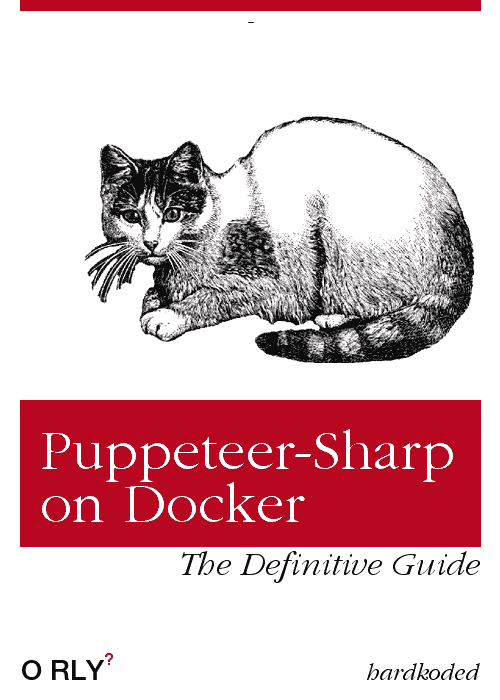
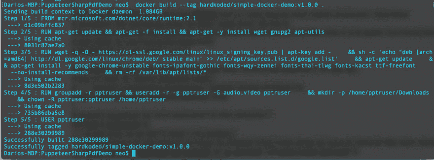

# 在码头上操纵木偶

> 原文：<https://dev.to/hardkoded/running-puppeteer-sharp-on-docker-54fb>

我收到了很多关于在 Docker 上运行 puppet er-Sharp 的问题。让我们看看我们是否能得到:

[](https://res.cloudinary.com/practicaldev/image/fetch/s--MqZzVakt--/c_limit%2Cf_auto%2Cfl_progressive%2Cq_auto%2Cw_880/https://raw.githubusercontent.com/kblok/kblok.github.io/master/img/puppeteer-sharp-docker/orly.png)

让我们看一下由木偶师提供的[例子，看看我们需要在那里做些什么来使它工作。](https://github.com/GoogleChrome/puppeteer/blob/master/docs/troubleshooting.md#running-puppeteer-in-docker) 

```
FROM node:10-slim

# Install latest chrome dev package and fonts to support major charsets (Chinese, Japanese, Arabic, Hebrew, Thai and a few others)
# Note: this installs the necessary libs to make the bundled version of Chromium that Puppeteer
# installs, work.
RUN wget -q -O - https://dl-ssl.google.com/linux/linux_signing_key.pub | apt-key add - \
    && sh -c 'echo "deb [arch=amd64] http://dl.google.com/linux/chrome/deb/ stable main" >> /etc/apt/sources.list.d/google.list' \
    && apt-get update \
    && apt-get install -y google-chrome-unstable fonts-ipafont-gothic fonts-wqy-zenhei fonts-thai-tlwg fonts-kacst ttf-freefont \
      --no-install-recommends \
    && rm -rf /var/lib/apt/lists/*

# If running Docker >= 1.13.0 use docker run's --init arg to reap zombie processes, otherwise
# uncomment the following lines to have `dumb-init` as PID 1
# ADD https://github.com/Yelp/dumb-init/releases/download/v1.2.0/dumb-init_1.2.0_amd64 /usr/local/bin/dumb-init
# RUN chmod +x /usr/local/bin/dumb-init
# ENTRYPOINT ["dumb-init", "--"]

# Uncomment to skip the chromium download when installing puppeteer. If you do,
# you'll need to launch puppeteer with:
#     browser.launch({executablePath: 'google-chrome-unstable'})
# ENV PUPPETEER_SKIP_CHROMIUM_DOWNLOAD true

# Install puppeteer so it's available in the container.
RUN npm i puppeteer \
    # Add user so we don't need --no-sandbox.
    # same layer as npm install to keep re-chowned files from using up several hundred MBs more space
    && groupadd -r pptruser && useradd -r -g pptruser -G audio,video pptruser \
    && mkdir -p /home/pptruser/Downloads \
    && chown -R pptruser:pptruser /home/pptruser \
    && chown -R pptruser:pptruser /node_modules

# Run everything after as non-privileged user.
USER pptruser

CMD ["google-chrome-unstable"] 
```

# 从

我们需要改变基本形象。而不是:

```
FROM node:10-slim 
```

我们将使用:

```
FROM mcr.microsoft.com/dotnet/core/runtime:2.1 
```

次要版本在这里不重要。我们可以使用 2.0、2.1 或 2.2 版本

# 木偶师菜谱

这是他们的设置方法:

```
# Install latest chrome dev package and fonts to support major charsets (Chinese, Japanese, Arabic, Hebrew, Thai, and a few others)
# Note: this installs the necessary libs to make the bundled version of Chromium that Puppeteer
# installs, work.
RUN wget -q -O - https://dl-ssl.google.com/linux/linux_signing_key.pub | apt-key add - \
    && sh -c 'echo "deb [arch=amd64] http://dl.google.com/linux/chrome/deb/ stable main" >> /etc/apt/sources.list.d/google.list' \
    && apt-get update \
    && apt-get install -y google-chrome-unstable fonts-ipafont-gothic fonts-wqy-zenhei fonts-thai-tlwg fonts-kacst ttf-freefont \
      --no-install-recommends \
    && rm -rf /var/lib/apt/lists/*

# If running Docker >= 1.13.0 use docker run's --init arg to reap zombie processes, otherwise
# uncomment the following lines to have `dumb-init` as PID 1
# ADD https://github.com/Yelp/dumb-init/releases/download/v1.2.0/dumb-init_1.2.0_amd64 /usr/local/bin/dumb-init
# RUN chmod +x /usr/local/bin/dumb-init
# ENTRYPOINT ["dumb-init", "--"]

# Uncomment to skip the chromium download when installing puppeteer. If you do,
# you'll need to launch puppeteer with:
#     browser.launch({executablePath: 'google-chrome-unstable'})
# ENV PUPPETEER_SKIP_CHROMIUM_DOWNLOAD true

# Install Puppeteer, so it's available in the container.
RUN npm i puppeteer \
    # Add user so we don't need --no-sandbox.
    # same layer as npm install to keep re-chowned files from using up several hundred MBs more space
    && groupadd -r pptruser && useradd -r -g pptruser -G audio,video pptruser \
    && mkdir -p /home/pptruser/Downloads \
    && chown -R pptruser:pptruser /home/pptruser \
    && chown -R pptruser:pptruser /node_modules

# Run everything after as non-privileged user.
USER pptruser 
```

这里是所有乐趣的开始。如果我们使用 Docker 映像运行该设置，我们将得到以下结果:

> /bin/sh:1:wget:not found
> E:GnuPG、gnupg2 和 gnupg1 似乎没有安装，但此操作需要其中一个

我发现在运行那个设置之前我们需要这个:

```
RUN apt-get update && apt-get -f install && apt-get -y install wget gnupg2 apt-utils 
```

我们还需要删除一些节点的东西。让我们去掉`npm i puppeteer`和`&& chown -R pptruser:pptruser /node_modules`。
这将使我们的用户设置如下:

```
RUN groupadd -r pptruser && useradd -r -g pptruser -G audio,video pptruser \
    && mkdir -p /home/pptruser/Downloads \
    && chown -R pptruser:pptruser /home/pptruser 
```

嗯，至少我们现在正在建立我们的形象。

[](https://res.cloudinary.com/practicaldev/image/fetch/s--VRf3Yp6H--/c_limit%2Cf_auto%2Cfl_progressive%2Cq_auto%2Cw_880/https://raw.githubusercontent.com/kblok/kblok.github.io/master/img/puppeteer-sharp-docker/first-build.png)

注意这个食谱上的两件重要的事情:

## 我们正在下载 Chrome 浏览器

如果我们仔细看看，我们可以看到我们已经在那里下载 Chrome:

> & & apt-get install-y Google-chrome-不稳定字体-ipafont-gothic 字体-wqy-zenhei 字体-thai-tlwg 字体-kacst ttf-freefont \

**我们不需要在我们的应用**中使用 BrowserFetcher。这很重要，因为`BrowserFetcher`不会下载一个有效的版本在 Docker 上使用。

那么，我们如何告诉木偶夏普使用铬合金？

简单来说，我们可以设置一个环境变量:

```
ENV PUPPETEER_EXECUTABLE_PATH "/usr/bin/google-chrome-unstable" 
```

## 我们正在创建一个新用户。

我们不会在这个帖子里谈论`--no-sandbox`。你会在网上找到很多关于这面旗帜的优缺点的帖子。你也可以看看[官方文档](https://chromium.googlesource.com/chromium/src/+/master/docs/design/sandbox.md)。

但是你需要知道的是，我们有两种方法来树立你的形象:

### 有-无-沙盒

如果你同意在你的应用程序上添加`--no-sandbox`标志，因为你将浏览你拥有或信任的网站，你可以删除所有的用户设置。

这一切都将会水落石出:

```
# Add user, so we don't need --no-sandbox.
# same layer as npm install to keep re-chowned files from using up several hundred MBs more space    
RUN groupadd -r pptruser && useradd -r -g pptruser -G audio,video pptruser \
    && mkdir -p /home/pptruser/Downloads \
    && chown -R pptruser:pptruser /home/pptruser

# Run everything after as non-privileged user.
USER pptruser 
```

我们需要在我们的应用程序上添加`--no-sandbox`标志。

```
var launchOptions = new LaunchOptions
{
    Headless = true,
    Args = new[]
    {
        "--no-sandbox"
    }
}; 
```

### 无沙盒

如果您不想使用`--no-sandbox`标志，您需要保留用户设置。但如果你尝试启动 Chrome，你可能会得到这个错误:

> 无法移动到新命名空间:支持 PID 命名空间，支持网络命名空间，但失败:错误号=不允许操作

你会发现[很多](https://github.com/jessfraz/dockerfiles/issues/65)、[很多](https://github.com/GoogleChrome/puppeteer/issues/2668)的帖子都在谈论这个。

我在[这个帖子](https://github.com/jlund/docker-chrome-pulseaudio/issues/8#issue-166464652)上找到了解决办法。
我们需要使用`--security-opt=seccomp:unconfined`运行 docker

# 还有什么？

在做了所有的设置之后，我们需要做一个普通的。NET 部署到 Docker。您可以复制源代码并在映像中发布，或者复制现有的发布，就像这样:

```
COPY bin/Release/netcoreapp2.1/publish/ /app/
ENTRYPOINT ["dotnet", "/app/PuppeteerSharpPdfDemo-Local.dll"] 
```

# 最终解决

这是我们的新 docker 文件的样子:

```
FROM mcr.microsoft.com/dotnet/core/runtime:2.1

#####################
#PUPPETEER RECIPE
#####################
# Install latest chrome dev package and fonts to support major charsets (Chinese, Japanese, Arabic, Hebrew, Thai and a few others)
# Note: this installs the necessary libs to make the bundled version of Chromium that Puppeteer
# installs, work.
RUN apt-get update && apt-get -f install && apt-get -y install wget gnupg2 apt-utils
RUN wget -q -O - https://dl-ssl.google.com/linux/linux_signing_key.pub | apt-key add - \
    && sh -c 'echo "deb [arch=amd64] http://dl.google.com/linux/chrome/deb/ stable main" >> /etc/apt/sources.list.d/google.list' \
    && apt-get update \
    && apt-get install -y google-chrome-unstable fonts-ipafont-gothic fonts-wqy-zenhei fonts-thai-tlwg fonts-kacst ttf-freefont \
      --no-install-recommends \
    && rm -rf /var/lib/apt/lists/*

# Add user, so we don't need --no-sandbox.
# same layer as npm install to keep re-chowned files from using up several hundred MBs more space    
RUN groupadd -r pptruser && useradd -r -g pptruser -G audio,video pptruser \
    && mkdir -p /home/pptruser/Downloads \
    && chown -R pptruser:pptruser /home/pptruser

# Run everything after as non-privileged user.
USER pptruser
#####################
#END PUPPETEER RECIPE
#####################

ENV PUPPETEER_EXECUTABLE_PATH "/usr/bin/google-chrome-unstable"
COPY bin/Release/netcoreapp2.1/publish/ /app/
ENTRYPOINT ["dotnet", "/app/PuppeteerSharpPdfDemo-Local.dll"] 
```

# 演示

有用吗？

让我们编码那个`PuppeteerSharpPdfDemo-Local`控制台 app:

```
class MainClass
{
    public static async Task Main(string[] args)
    {
        using (var browser = await Puppeteer.LaunchAsync(new LaunchOptions()
        {
            Headless = true
        }))
        using (var page = await browser.NewPageAsync())
        {
            await page.GoToAsync("https://www.hardkoded.com");
            Console.WriteLine(
                await page
                    .QuerySelectorAsync(".page-subheading")
                    .EvaluateFunctionAsync<string>("el => el.innerText"));
        }
    }
} 
```

公布吧:

```
dotnet publish PuppeteerSharpPdfDemo-Local.csproj -c Release 
```

构建 docker 映像:

```
docker build --tag hardkoded/simple-docker-demo:v1.0.0 . 
```

运行它！

```
docker run --security-opt=seccomp:unconfined -it hardkoded/simple-docker-demo:v1.0.0 
```

`
[T3](https://res.cloudinary.com/practicaldev/image/fetch/s--sRm-8Kpa--/c_limit%2Cf_auto%2Cfl_progressive%2Cq_auto%2Cw_880/https://raw.githubusercontent.com/kblok/kblok.github.io/master/img/puppeteer-sharp-docker/magic.png)T5[T7](https://res.cloudinary.com/practicaldev/image/fetch/s--isVTcRvD--/c_limit%2Cf_auto%2Cfl_progressive%2Cq_66%2Cw_880/https://media3.giphy.com/media/12NUbkX6p4xOO4/giphy.gif%3Fcid%3D790b76115d3af0964552327845de62c8%26rid%3Dgiphy.gif)

# 最后的话

我希望这篇文章能帮助社区开始在 Docker 上使用 puppeter-Sharp。我会看看是否能把这些图片发布到 Docker 资源库，敬请期待！:)

不要停止编码！

最初发布于[harkoded.com](https://www.hardkoded.com/blog/puppeteer-sharp-docker)