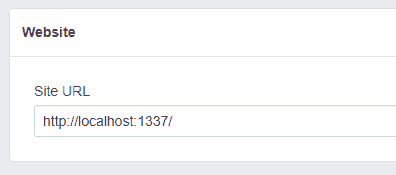

# SailsJS -使用 Passport 登录脸书

> 原文：<https://dev.to/christianstrang/sailsjs-use-passport-to-login-with-facebook-6nk>

对于本教程，我假设您使用步骤 1 (Web 应用程序)创建了 sails.js 应用程序。

### 1。安装 Passport 和 Passport 的脸书策略

```
$ npm install passport
$ npm install passport-facebook 
```

### 2。添加 Passport 中间件

我们需要在 **config/http.js**
中将 passport 添加到我们的中间件执行堆栈中

```
module.exports.http = {

  middleware: {

    passportInit: require('passport').initialize(),
    passportSession: require('passport').session(),

    order: [
      'cookieParser',
      'session',
      'passportInit',
      'passportSession',
      'bodyParser',
      'compress',
      'poweredBy',
      'router',
      'www',
      'favicon',
    ],
  },
}; 
```

### 3。添加 Passport-Facebook 策略

在文件夹 **config** 中创建一个新文件夹 **passport** ，并在里面创建一个名为 config/passport/**facebookstrategy . js**的文件。

```
'use strict';

var passport = require('passport'),
  FacebookStrategy = require('passport-facebook').Strategy,
  request = require('request');

var verifyHandler = function(req, token, tokenSecret, profile, done) {

  process.nextTick(function() {
    var url = 'https://graph.facebook.com/v2.10/me?access_token=%s&fields=id,email,first_name,last_name';
    url = url.replace('%s', token);

    var options = {method: 'GET', url: url, json: true};
    request(options, function (err, response) {
      if (err) {
        return done(null, null);
      }

      var data = {
        id: response.body.id,
        first_name: response.body.first_name,
        last_name: response.body.last_name,
        email: response.body.email
      };

      return done(null, data);
    });
  });
};

passport.use(new FacebookStrategy({
  clientID: FACEBOOK_CLIENT_ID,
  clientSecret: FACEBOOK_APP_SECRET,
  callbackURL: /api/v1/auth/facebook/callback,
  passReqToCallback: true
}, verifyHandler)); 
```

不要忘记在底部更改您的凭据(clientID、clientSecret、callbackURL)。您的脸书回调 URL 可以是 localhost，但只能用于测试/开发应用程序，因此除了您的实时/生产应用程序之外，您可能还需要创建一个。

### 4。创建一个 Passport 控制器来处理脸书验证

在您的控制台运行`sails generate controller passport`这将在您的 **api/controllers** 文件夹中创建一个文件 **PassportController.js** ，添加以下代码:

```
/**
 * PassportController
 *
 * @description :: Server-side actions for handling incoming requests.
 * @help        :: See https://sailsjs.com/docs/concepts/actions
 */

var passport = require('passport');

module.exports = {
  facebookAuth: function(req, res, next) {
    passport.authenticate('facebook', { scope: ['email']})(req, res, next);
  },

  facebookCallback: function(req, res, next) {
    passport.authenticate('facebook', function(err, user) {

      console.log('facebook credentials');
      console.log(user);
      res.json(user);
    })(req, res, next);
  },

}; 
```

### 5。将路由添加到 config/routes.js 文件中

```
'GET /api/v1/auth/facebook': {controller: 'PassportController', action: 'facebookAuth'},
'GET /api/v1/auth/facebook/callback': {controller: 'PassportController', action: 'facebookCallback'}, 
```

这两个路由将处理 facebook 的请求和回调。

### 6。将您的本地主机 URL 添加到您的脸书应用程序中

在你的 facebook 开发者后端，进入设置= >基本，在底部添加网站平台。作为站点 url 使用您的真实域，或者，如果您创建了一个测试应用程序，您可以添加一个本地主机 url，在我们的例子中应该是这样的:

[](https://res.cloudinary.com/practicaldev/image/fetch/s--rFN40KuJ--/c_limit%2Cf_auto%2Cfl_progressive%2Cq_auto%2Cw_880/https://thepracticaldev.s3.amazonaws.com/i/g7493yxkai0ltn9ou4wo.png)

### 7。通过脸书登录

如果您访问**[http://localhost:1337/API/v1/auth/facebook](http://localhost:1337/api/v1/auth/facebook)**，您现在应该会被重定向到 facebook，并得到提示，允许您的 Facebook 应用程序访问您的凭据。之后，您将被重定向到您的回调 url，并能够访问用户凭据。有了这些信息，您可以检查数据库中是否已经存在用户，或者创建一个新用户。

### 搞定

这是一个循序渐进的过程，而不是一个真正的教程，如果你对某个具体步骤有任何疑问，或者有任何错误/遗漏，请在评论中告诉我。

**更新:**更改了 GoogleStrategy 中的 callbackURL，使其对于具有不同域的试运行/生产环境更加灵活。