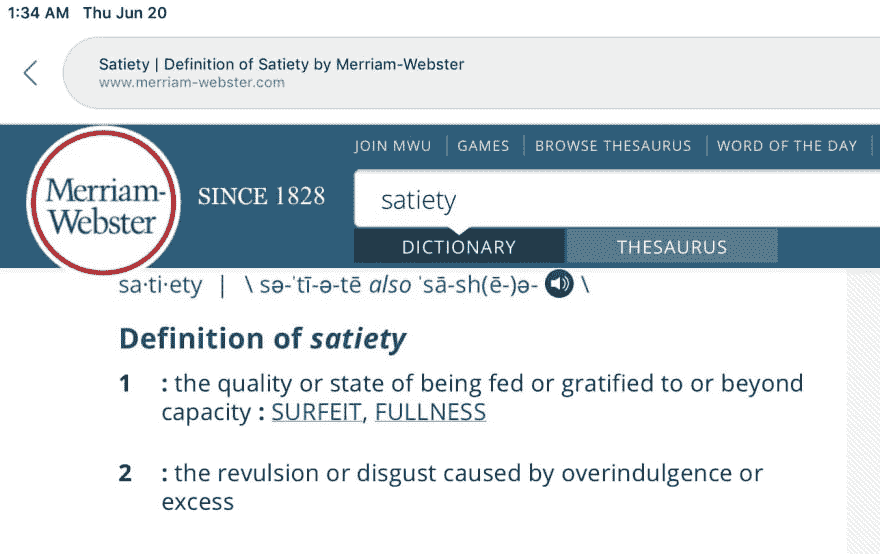
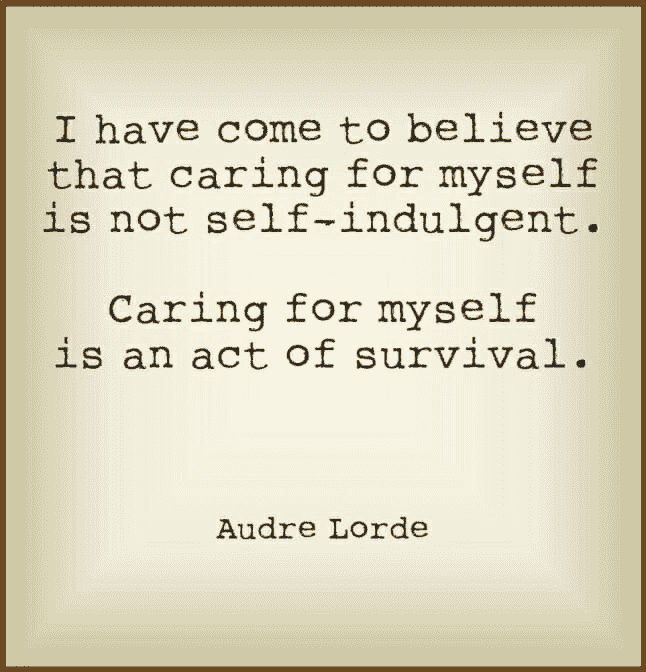
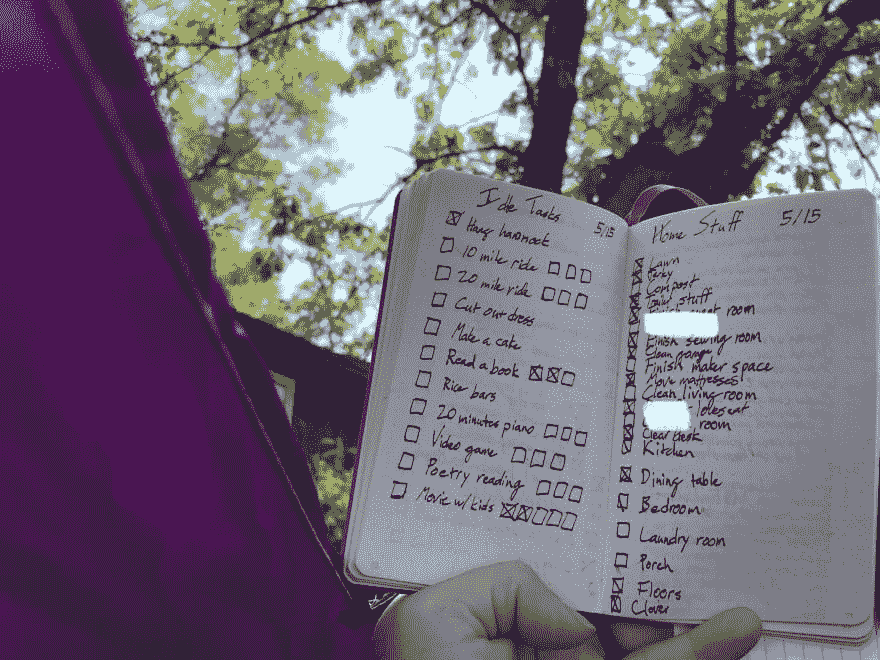
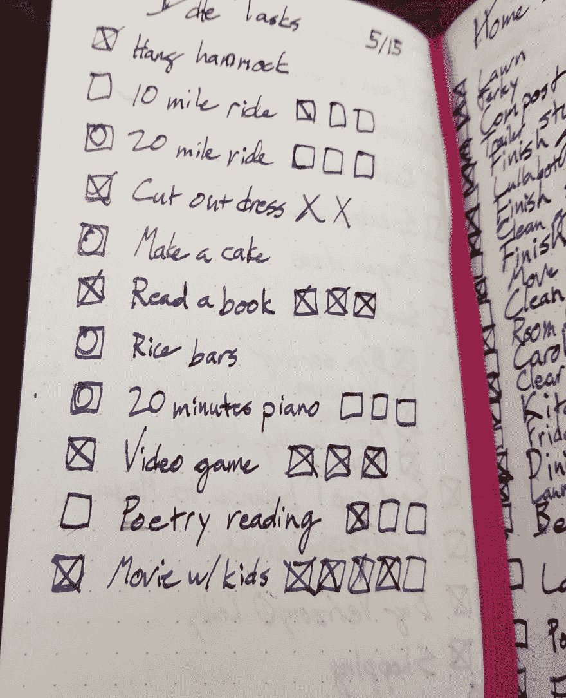

# 满足

> 原文：<https://dev.to/wiredferret/satiety-22a9>

在迪士尼的幻想曲中，魔法师的学徒米奇用魔法让扫帚完成他单调乏味的工作。

问题是，米奇只是一个学徒，虽然他可以让事情开始，但他没有足够的智慧给扫帚一个终点，一个“够了”。

我最近一直在思考这个概念，*饱腹感*。(和焦虑押韵。我是说，从字面上看，确实如此。)

这个定义是围绕着食物和满足感，以及*拥有你想要的一切，*但我也从充足、充裕和过剩的角度来考虑这个问题。

你看，我的生活很丰富。在这么多方向上，我都有丰富和满足。我有稳固、可靠、支持的人际关系。我的家庭安全完整。我的工作令人兴奋和满足。我的事业是…任何我想做的事情。

这也是问题所在。我的 ADD 症状之一是我很难不去理会或忽略杂乱的东西。你有没有玩过模拟人生或者其他类似的游戏，那里到处都有弹出窗口，你可以和它互动，消化它，然后采取行动？或者甚至是一个乐高电子游戏，在游戏中敲击灌木丛会让你得到一些耳钉？现在想象一下，每次你从电脑上抬起头，甚至换窗口的时候，都有这个覆盖图。

> 洗衣服！分类我，洗我，擦干我，折叠我，把我放好！
> 
> 应该用吸尘器打扫地板！
> 
> 别忘了检查账单自动支付是否正常！
> 
> 需要更多的信息来回复那封邮件，最好再次推迟！
> 
> 现在是下午 5 点，你知道你的晚餐从哪里来吗？！
> 
> 嘿！你答应过自己要读这本有趣的书！

问题是，当你的大脑本质上是三只穿着风衣的松鼠试图弄清楚一碗芝加哥混合餐时，你有确保账单得到支付的方法，这些方法包括永远不要首先做有趣的事情，因为如果你过度关注有趣的事情，比如，假设，熬夜到凌晨 3 点读完一本书，那么这可能会导致你的整个纸牌房子倒塌。我是一个长期不吃糖霜的人，尽管我喜欢糖霜。

从表面上看，这似乎不错。要有责任心，做好自己的家务，然后去玩。但是作为一个成年人，总是有更多的杂务。即使你完成了今天必须完成的所有事情，你也应该提前工作，因为就像上帝创造了小绿苹果一样，*一些该死的事情*将会发生，你将会失去你所指望的时间。所以你改做明天的必做之事。几周后开始为那件事做准备，然后…现在晚餐凉了，或者更糟的是，你的孩子来到你的办公室，给你吃他们做的晚餐，这很好，但除了这不是理想的沟通和家庭优先化。

那么这与饱腹感和足够感有什么关系呢？

我试图理解我的生活，不是从我害怕搞砸什么的角度，而是从我为完成什么而兴奋的角度。让我告诉你，这将是一个漫长的工作。但是它的第一部分是概述什么是足够。最起码可行的家务，或者邮件，或者准备。“足够”是什么样的？如果你的标准是优秀，这很好，但很少有人能在我们生活的所有领域做到这一点——我们有孩子，或残疾，或残疾的孩子，或在我们生活的其他领域的义务。而你又是如何平衡你需要做的事，你应该做的事，你想做的事，滋养你的事？

我是最容易被做空的选区，因为我抱怨最少，或者说抱怨最少。我认为我们中的许多人都是这样——不仅仅是女性社交，不仅仅是 GenX 的扭曲接受，而是对我们正在做的事情非常关心，这使得我们更容易忽视这样一个事实，即我们是人类，而不是自动机。

我已经回家 4 天了。我确实花了很多时间来补觉，因为如果我是无意识的，我就不会因为没做某事而感到内疚。但是每次我都想，“我应该把我的自行车带出去，天气真好！”，我跟进。"听起来很有趣，一旦我完成了我需要做的事情."

但是我需要它吗？有时候，是的。我确实需要及时预订机票。我确实需要付账。我需要确保我的孩子为去欧洲做好准备。！！)明天。但也许我不需要花一个小时来整理创客空间。也许我可以在黑暗中或者下雨的时候这样做，或者根本不做，因为我是唯一注意到的人。也许我应该花一个小时在我的自行车上，或者在我的吊床上。

在我五月份休假的两周里，我列了两份清单。一个是“闲置任务”，我喜欢做的事情，而不仅仅是“从我的清单上删除”。另一个是“家务事”，肯定是家务事。

你可以看到我已经把更多的注意力放在了家务上，而不是娱乐上。下面是假期结束时的清单。方框里的圆圈表示我没有做任何类似的事情。没有长途旅行，没有美味佳肴。我确实很擅长花时间和孩子们在一起，我也读了一些书，所以这很成功，但是家务方面显然是赢家。

我不确定我对此有一个令人震惊或满意的结论，但对我来说，把它写下来并思考数据向我展示了什么以及我当时的想法和感受是有用的。

*   当我们不做有用的事情时，我需要考虑休息、安息日、周末和人类模式中的时间，并把它们更多地添加到我的生活中。
*   我应该弄清楚我的厨房阻挡物是什么。很明显那里发生了一些事情。
*   我需要考虑饱腹感，不仅是在我的个人生活中，也是在职业上。即使我很享受，如果我不在每一次会议上实时发微博也没关系。很累。对我来说，*，什么才足以让我觉得一次会议是有价值的？*

 *让我们为自己清理出一些空间。

*