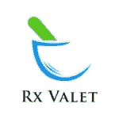
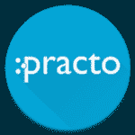
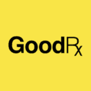
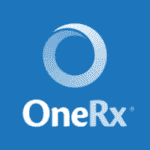
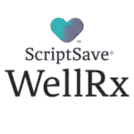

# 使用移动应用程序节省高达 80%的处方药费用

> 原文：<https://dev.to/appstoryorg/save-up-to-80-on-prescription-medications-with-mobile-app-56oo>

处方药折扣卡是可下载的折扣卡或优惠券，当激活时，用户有权在某些非专利和名牌处方药上享受折扣。各种服务的移动应用趋势现在甚至已经扩展到医疗保健等领域，包括预约医生和访问其他医疗和药房药品交付跟踪应用服务的应用。

可以通过网站和应用程序在线订购药品，无需在药店排长队。你可以用你的智能手机摄像头上传一张你的处方照片，然后所有的药品就会直接送到你家。

[自](https://www.cnbc.com/2018/02/23/the-american-greed-report-how-to-beat-the-pharma-bros-and-save-money-on-your-prescriptions.html) 2017 年以来，处方药价格上涨了近 6 倍，让一些人面临停止服药或在药物和其他必需品之间做出选择的艰难选择。

药物折扣卡可以给你一个巨大的缓解，现在有了处方折扣应用程序，找到你需要的任何药物的折扣交易比以往任何时候都更容易。处方药折扣真的可以累加，特别是如果你没有保险或保险不足。只要看看这五个找到正确的处方药折扣应用程序的提示。

你可以坐在沙发上取药，这些应用程序还提供很大的折扣和免费送货等其他激励措施。根据您的药物需求获取提醒，并可以访问大量关于处方药和药品的信息。

## **以下是一些最好的处方应用**

###  Rx 代客:网上药店&处方优惠卡

处方药折扣计划 Rx 代客提供非专利药和品牌药的折扣价格。它为消费者提供了两种储蓄选择。在第一种选择中，您可以通过 Rx Valet 网站或应用程序购买处方药，并在美国的任何零售药店购买。消费者在选择处方药物后通过授权卡购买药物。

支付完成后，消费者将获得一张数字 Rx 代客福利卡，该卡具有 Rx Bin 和会员 ID。所有交易都通过成员 ID 进行跟踪，并且特定计划的所有成员都由成员 ID 标识。98%的美国药店接受 Rx 代客卡。第二个储蓄选择是利用我们的送货上门计划。最初的购买就像零售选择，但是消费者选择送货上门。

此选项主要适用于 90 天供应量的慢性药物。购买将由会员的 ID 跟踪。高级药房是 Rx Vale 的药房合作伙伴。高级药房获得所有需要的处方，并免费将处方直接邮寄到消费者家中。

消费者将只支付购买的费用。Rx Valet 还提供药物提醒和大幅折扣的糖尿病检测用品等功能。Rx Valet 帮助消费者节省处方药费用，即使他们有处方药福利。

> **应用: [iOS App](https://itunes.apple.com/us/app/rx-valet/id1154454403?mt=8) 和[Android App](https://play.google.com/store/apps/details?id=com.rxvalet&hl=en)T5】**

### 医生和药品

Practo 是医生预约和审查的最佳和值得信赖的名字之一。该公司最近推出了其在线医药应用程序。使用该应用程序可以订购超过 40，000 种药物。Practo 还与当地药店和药房合作，帮助您按时将处方药送到您家门口。

您可以使用手机摄像头上传处方，然后它会方便地自动配药。这个应用程序还会记住您过去的订单，并在您需要时将其准备好。您可以使用手机摄像头上传您的处方，然后它会方便地自动重新配药。这个应用程序还会记住您过去的订单，并在您需要时将其准备好。

> **应用** : [iOS 应用](https://itunes.apple.com/in/app/practo-doctors-and-medicines/id953772015?mt=8)和 [Android 应用](https://play.google.com/store/apps/details?id=com.practo.fabric)

### GoodRx–节省处方费用

GoodRx 是另一个非常好的处方药应用程序，它有助于轻松比较各个药店的药品价格。该应用程序声称，通过现金和销售价格，以及优惠券和储蓄，可以为用户节省 80%的处方药费用。无需打印，因为节省的费用就在您的移动设备上。

该应用程序包含美国所有主要零售商的 6000 多种药物的 100 万种价格。它不仅适用于所有年龄段的药物，也适用于您的宠物。目前的客户报告节省了许多美元。

GoodRx Gold 是 GoodRx 服务的付费版本，每月收费 9.99 美元。它为多达六名家庭成员提供了独家获得更多处方和医疗保健服务折扣的机会。有 1000 多种价格低于 10 美元的处方，用户可以节省高达 90%的费用。

> **应用** : [iOS 应用](https://itunes.apple.com/us/app/goodrx-save-on-prescriptions/id485357017?mt=8)和 [Android 应用](https://play.google.com/store/apps/details?id=com.goodrx.gold&hl=en)

###  OneRx Rx 储蓄工具

OneRx 声称自己是唯一的处方储蓄应用程序，可以让您安全地输入您的保险信息，以查看所有 FDA 批准的药物的共付额以及折扣卡储蓄、患者援助计划(PAP)信息和制造商优惠券。

OneRx 是完全免费的，您可以为您的家人、朋友和宠物使用 OneRx。你不必创建一个帐户来使用这些服务。OneRx 让您轻松获得最佳价格，而无需一次又一次地为脚本付费。

您只需将您的保险信息添加到 OneRx 应用程序中，即可找到隐藏的优惠券，查看保险限制，并将您的自付额与折扣价进行比较，从而充分利用您的药房保险福利。

> **应用** : [iOS 应用](https://itunes.apple.com/us/app/onerx-rx-savings-tool/id969583916?mt=8)和 [Android 应用](https://play.google.com/store/apps/details?id=com.onerx.android&hl=en)

###  ScriptSave WellRx Rx 折扣

与您附近的药房相比，ScriptSave WellRx 可节省处方药费用，并提供更低的价格。

您可以通过下载免费的 ScriptSaveWellRx 应用程序来访问适用于您的 Android 设备的动态价格比较工具。只需输入药品名称和邮政编码来比较价格，就可以查看当地药店所有处方药的价格。你可以在你附近或任何地点附近的药店搜索最优惠的折扣。它是免费的，也没有使用限制。

ScriptSaveWellRx 为超过 65，000 家药店节省了处方药费用。它为每个家庭成员甚至宠物提供处方药储蓄。WellRx 提供免费的药剂师服务，解答与药物治疗相关的问题。

ScriptSaveWellRx 应用程序有一个药物价格检查器，可帮助找到您所在地区的最佳价格或您首选药房的价格。它还有一个虚拟药箱，可以储存、管理你的药物并即时定价。

它提供药物相互作用警告，提醒您与保存的药物的不良相互作用。它还会发送药丸和补充通知，提醒您及时服药和更新处方。

> **应用:** [iOS 应用](https://itunes.apple.com/in/app/scriptsave-wellrx-rx-discounts/id1016290130?mt=8)和 [Android 应用](https://play.google.com/store/apps/details?id=com.wellrx&hl=en_IN)

数字化赋予了商业运作的方式，医疗行业也不例外。处方应用程序让企业很容易满足顾客的需求。与此同时，客户可以享受使用任何应用程序带来的便利。

最初发布于移动应用程序的处方药

用手机应用程序节省高达 80%处方药的帖子[最先出现在](https://www.appstory.org/blog/save-up-to-80-on-prescription-medications-with-mobile-app/) [AppStory](https://www.appstory.org) 上。