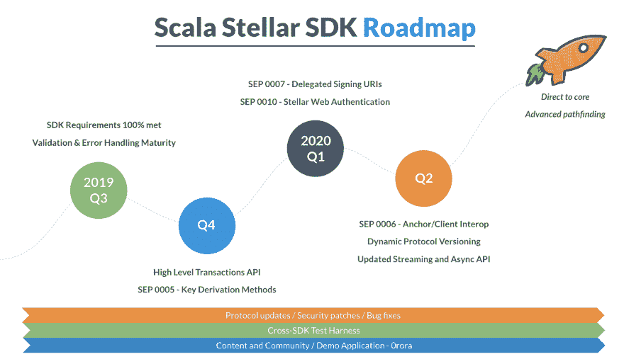

# Scala Stellar SDK 路线图

> 原文：<https://dev.to/jemmawson/scala-stellar-sdk-roadmap-2p5o>

一年半前，我启动了 [Scala Stellar SDK](https://github.com/synesso/scala-stellar-sdk#stellar-sdk-for-scala) ,为 Scala 开发人员提供一种以自然和习惯的方式构建 Stellar 网络的方式。目前，SDK 支持应用程序访问 Stellar 网络，以构建和提交事务、查询网络状态和流式更新。

SDK 的主要目标是继续构建以开发人员为中心的 API，同时保持 100%的测试覆盖率。该项目致力于继续改善开发人员的体验，以最大限度地发挥 Stellar 网络的效用。

那么，从这里去哪里呢？

**查询 API 端点的最后一公里。**
目前，SDK 提供了对*几乎*所有 API 端点的访问。首要任务是完成对未完成的接入点的覆盖- [交易聚合](https://www.stellar.org/developers/horizon/reference/endpoints/trade_aggregations.html)、[支付寻路](https://www.stellar.org/developers/horizon/reference/endpoints/path-finding.html)和完整的 [TOML 支持](https://github.com/stellar/stellar-protocol/blob/master/ecosystem/sep-0001.md#simple-summary)。

错误恢复的便利。
到第三季度末，该项目将围绕错误处理引入更多便利。开发人员应该能够指定通过 Horizon 进行交易的一些机制是自动化的，例如自动获取和刷新帐户序列号，以及自动重试失败的交易。

**高层交易 API。**
今年晚些时候，重点将转移到引入新的高级 API 上。现在，SDK 有一个全功能的 API，提供了构建和提交事务所需的所有抽象。但是需要在此基础上构建一个更简单的 API，开发人员可以使用它来快速执行常见操作(如创建帐户、支付和提供优惠)，而不必指定和调整更精细的细节。帕累托原则在这里绝对适用。

**重要的生态系统功能。**
为[密钥派生](https://github.com/stellar/stellar-protocol/blob/master/ecosystem/sep-0005.md#simple-summary)、[委托签名](https://github.com/stellar/stellar-protocol/blob/master/ecosystem/sep-0007.md#simple-summary)和 [Web 认证](https://github.com/stellar/stellar-protocol/blob/master/ecosystem/sep-0010.md#simple-summary)实现 SEPs (Stellar Ecosystem Proposal)的乐趣从此开始。

还有更多的计划正在进行中，我将在未来写下这些计划。

如果你是一个活跃的(或有抱负的)Scala 开发者，对构建一个坚如磐石、面向支付的分布式平台感兴趣，你一定要看看这个项目。如果你的目标是用 Scala 编写一流的应用程序，或者甚至是帮助构建 SDK 本身的未来，那么我很乐意听到你的意见。通过[按键](https://keybase.io/team/stellar.public)、 [GitHub](https://github.com/Synesso/scala-stellar-sdk) 或 [Gitter](https://gitter.im/scala-stellar-sdk/community) 取得联系。