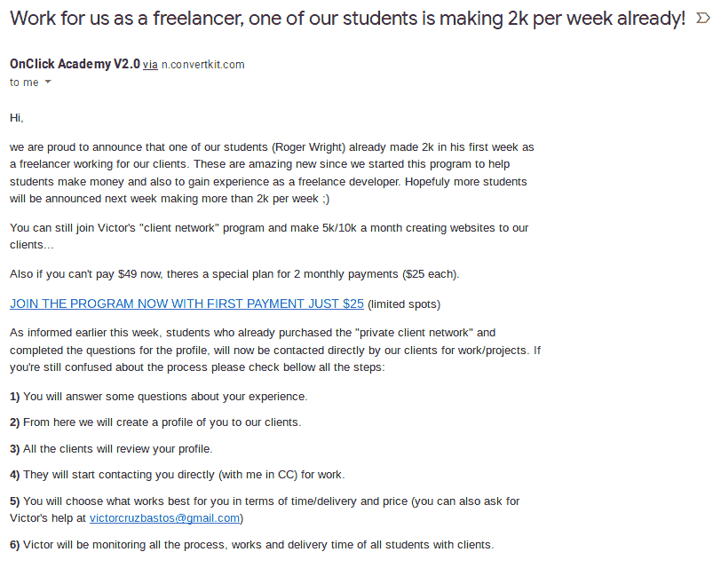
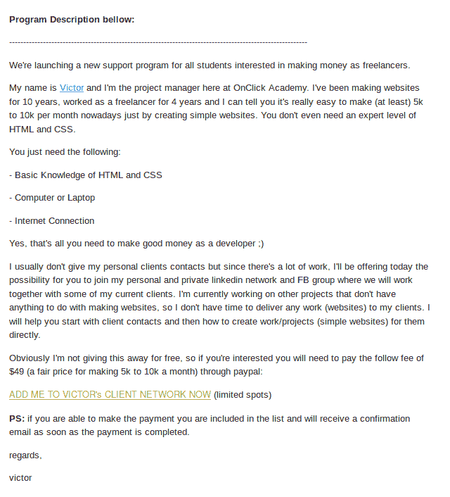
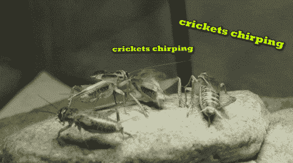

# 骗局警报:OnClick 学院

> 原文：<https://dev.to/p1xt/scam-alert-onclick-academy-2pop>

在过去的一周里，我决定报名参加 OnClick Academy 的活动，让该公司创始人的首席执行官分享他的一些客户群。

注意:我并不真的需要他的客户。我有自己的。但是，我有一点空闲时间，如果这份工作不完全是个骗局的话，我可以“安排”一些额外的工作。所以，这是提供给我一些工作，我是

*   有资格(实际上大材小用)
*   如果真的实现了，我愿意去做

于是，我报了五十块钱的低低价格。

注意:如果有的话，我会做这项工作(没有，这是一个彻底的骗局，不要注册它)，但我的主要目标是看看 Victor 的承诺是否属实(只需 HTML 和 CSS 知识，他就可以让初级开发人员每月获得价值 5000 到 10000 美元的工作)，因为如果是真的，我知道这对许多初级开发人员来说将是一笔非常好的交易。(不是真的，不要做。)

## 这是我报名参加的实际报价

## 这是我实际收到的 50 块钱

想象一整片蟋蟀在鸣叫

## 报名后

我收到一封电子邮件，要求我填写一份技能清单。我提供了所有要求的信息。(注意:对于‘你只需要知道基本的 HTML 和 CSS’这个提议，我是大材小用了。我知道 HTML 和 CSS，远远超过基本的，加上 JavaScript，TypeScript，PHP，Python，Angular，React 等，等等，并且已经是一个成功的自由职业者超过十年。)

几天后，在没有收到维克多的回复后，我发了一封跟进邮件，问他是否还需要我做些什么。

*蟋蟀*

周五，我要求退款。

周一，他发出了一封群发邮件，内容是关于他如何收到一堆投诉，因此他必须制定一个系统来确保工作被平均分配。他设法在一个关于“一个人”的插件中工作，这个人到目前为止已经赚了$4k。

我回答说，我真的很喜欢我的退款，一旦他解决了后勤问题，我会再注册。

他回答说，他很乐意退还我的钱，“直到星期五”。

我们花了几个小时来来回回地争论英语中“我将在星期五之前退还你的钱”和“我将在星期五退还你的钱”之间的区别。

最终，我结束了争论，并告诉他，我只是打开一个贝宝争议，然后他可以通过它退款。我真的开始觉得他上周拿走了我的钱，花掉了，没有做任何事情来提供他承诺的服务，并试图在一个永无止境的拒绝中把罐子踢到下周，旨在愚弄我，直到 PayPal 争议选项的最后期限过去。

他带着能想到的最荒谬的回答回来了。显然:

*   如果我提出争议，我将需要更长的时间来获得退款(我认为这是一种威胁，如果我提出争议，他将尽可能地拖延这一过程，以“让我回来”。他说，争议过程自然需要更长的时间。我回答说，他只需支付退款，一旦他这样做，争议就会消失。)
*   他在 PayPal 有一个联系人，他会打电话给他(大概是为了报复我，因为我对他已经同意退还的费用有争议。)

然后——我收到了他的另一封群发邮件(大概是发给他的整个邮件列表)，试图让更多的人注册(这次是三个月 19 美元的低费用。)

## 外卖

如果你是一名初级开发人员，收到 Victor Bastos 的电子邮件，承诺让你进入他的客户网络，你会想“这可能是我的机会”:

**不要这样做**

# 是骗局。

邮件说你会被列入他的私人 facebook 和 linkedin 网络。邮件上说你会得到客户的工作。邮件是骗人的。

可能会有一个注册了的家伙实际上赚了$ 4k——我不知道，我个人对此表示怀疑。我所知道的是，作为一名非常合格的高级工程师，我没有收到脸书或 Linkedin 网络的邀请，我赚了 0 美元，正在通过 PayPal 申请要回我(浪费的)钱。