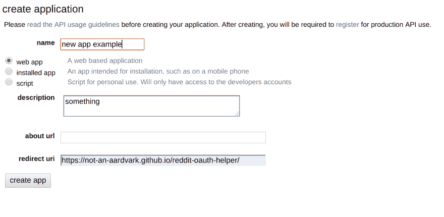

# 使用 snoowrap 抓取 node.js 中的 reddits api

> 原文：<https://dev.to/cpow/scraping-reddit-s-api-in-nodejs-with-snoowrap-2m9n>

我仍然在做我的兼职项目，在这个项目中，我在网上收集信息。我最终会把这些信息用在房地产投资和财产管理的每周综合时事通讯中。如果你很好奇，[时事通讯在这里](https://theweeklydigs.com)。对于这个项目的这一部分，我打算刮一些 Reddit 的 API 来寻找有趣的房地产和房东帖子。

### 明面上

成功抓取 NodeJS 中的 reddit API 只需要一个包:[snow wrap](https://github.com/not-an-aardvark/snoowrap)。

Snoowrap 是“Reddit API 的全功能 javascript 包装器”——引自 github repo 的索引页面。Snoowrap 真的很棒，它允许你查询帖子、评论、分数等...

所有的响应都被包装在它们自己的小对象中，并且都有很好的文档记录。此外，如果您正在使用像 Webstorm 这样的 IDE，您可以很容易地自动完成函数和类，因为项目中有非常好的类型定义。

### 安装 snoowrap

像在 NodeJS:
中安装任何其他 npm 包一样安装 Snoowrap

```
npm install snoowrap --save 
```

并要求其:

```
var snoowrap = require('snoowrap'); 
```

### 设置 Snoowrap

在调用 Reddit API 之前，您必须完成 oauth2 的初始设置，以生成应用程序和令牌。这相当简单，但是需要几个步骤。

*   去[https://not-an-aardvark.github.io/reddit-oauth-helper/](https://not-an-aardvark.github.io/reddit-oauth-helper/)，记下创建你的 reddit 应用时必须使用的重定向 URL(你用来调用 API 的东西)。在撰写本文时，网址是:`https://not-an-aardvark.github.io/reddit-oauth-helper/`
*   转到`https://www.reddit.com/prefs/apps/`并创建一个新应用。它通常应该是这样的:

* * *

[](https://res.cloudinary.com/practicaldev/image/fetch/s--EgP6-km_--/c_limit%2Cf_auto%2Cfl_progressive%2Cq_auto%2Cw_880/https://thepracticaldev.s3.amazonaws.com/i/dlev7p49d56thtltlmjj.png) 
<small></small>

<center><small>*注意重定向 URI*</small></center>

<small></small>

* * *

*   接下来，返回到[https://not-an-aardvark.github.io/reddit-oauth-helper/](https://not-an-aardvark.github.io/reddit-oauth-helper/)，选择您想要的权限，并生成您的令牌。

*   现在，您可以在脚本中配置 snoowrap 对象。

```
 const r = new snoowrap({
    userAgent: 'A random string.',
    clientId: 'Client ID from oauth setup',
    clientSecret: 'Client Secret from oauth setup',
    refreshToken: 'Token from the oauth setup'
  }); 
```

### 查询房地产子编辑的脚本

现在，您已经设置好了 snoowrap(做得好，聪明的开发人员)。可以用类似下面的脚本在 NodeJS 中查询 reddit 的 API:

```
import snoowrap from 'snoowrap';

export async function scrapeSubreddit() {
  const r = new snoowrap({
    userAgent: 'A random string.',
    clientId: 'Client ID from oauth setup',
    clientSecret: 'Client Secret from oauth setup',
    refreshToken: 'Token from the oauth setup'
  });

  const subreddit = await r.getSubreddit('realEstate');
  const topPosts = await subreddit.getTop({time: 'week', limit: 3});

  let data = [];

  topPosts.forEach((post) => {
    data.push({
      link: post.url,
      text: post.title,
      score: post.score
    })
  });

  console.log(data);
}; 
```

### 结论

上面的☝️脚本输出了 Reddit 的 RealEstate API 中排名前三的帖子。很漂亮吧？我认为这是一次有趣的经历，我真的很喜欢 Snoowrap 的工作方式。现在我可以用这些数据来充实我正在制作的时事通讯，同样，如果你好奇的话，[你可以在这里查看一下](https://theweeklydigs.com)。

谢谢，祝您愉快！