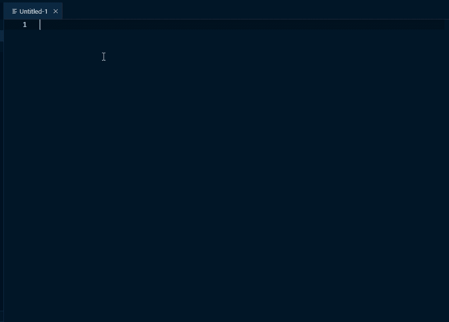

# VS 代码中的截屏模式

> 原文：<https://dev.to/dzhavat/screencast-mode-in-vs-code-11db>

这篇文章最初发表在我的博客上。

* * *

本周，我发布了 VS 代码扩展的更新，让你可以直接在编辑器中打开 flexbox 备忘单。这次更新包含了一些东西，但是我特别喜欢的是在`flex`值前面显示的一个小图标，使它易于识别。但正因为如此，我不得不制作新的演示 gif，因为旧的没有图标。

为了录制 Gif，我使用 [ScreenToGif](https://www.screentogif.com/) 。这是一个优秀的小程序，但我错过了它的一个选项，显示在录制过程中被按下的键。我需要这样做，因为打开备忘单的一种方法是在“命令栏”中搜索特定的命令，我希望组合键在 gif 中可见。

所以 VS 代码再一次帮助了我，因为它已经内置了这个确切的功能！叫做“投屏模式”。您可以通过在“命令面板”中搜索它来打开和关闭它。方法如下:

*   按`Ctrl+Shift+P` (Win，Linux)或`Cmd+Shift+P` (Mac)，搜索`Toggle Screencast Mode`。
*   按下`Enter`将其激活。
*   (显然，重复这些步骤来停用它)

现在每一次击键都会显示在一个覆盖图中。看看这个:

但是等等，还有呢！

默认情况下，激活此模式将显示覆盖中的所有按键。通常这可能不是你想要的。如果覆盖图只显示键盘快捷键(组合键)而不显示更多就好了。

那么，VS 代码已经覆盖了你！又来了！😎

如果你打开设置(`Ctrl+,` (Win，Linux)，`Cmd+,` (Mac))，搜索`Screencast Mode`，会发现两个设置。其中一个就是`Only show keyboard shortcuts in Screencast Mode`。它的作用很明显。

现在你知道如何在你的视频/gif 中显示所有这些漂亮的快捷键了。🚀