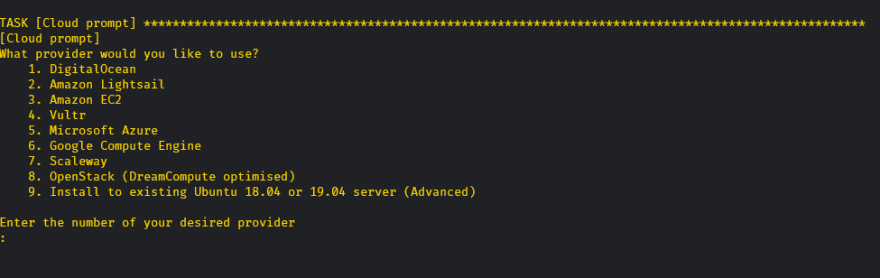
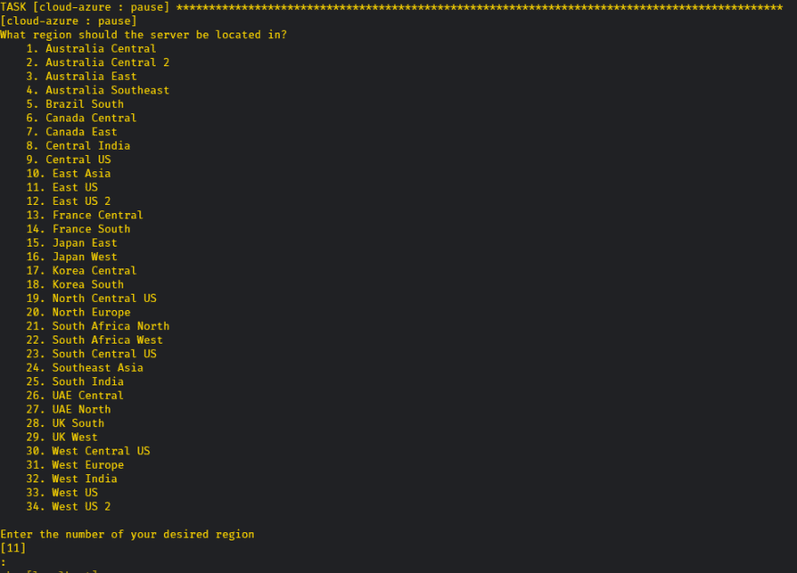
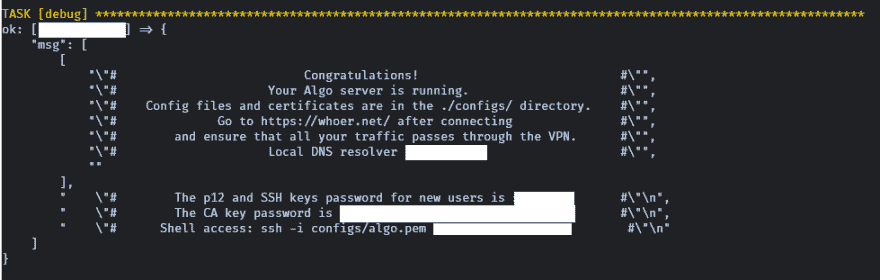

# 使用 Algo 和 Azure 的自托管 VPN

> 原文：<https://dev.to/colinrubbert/self-hosted-vpn-with-algo-and-azure-1kbn>

# 什么是 Algo？

[Algo VPN](https://blog.trailofbits.com/2016/12/12/meet-algo-the-vpn-that-works/) 是一种开源的自托管 VPN 服务。有大量的 VPN 服务可用，但如果你想控制收集、使用和/或出售的数据，那么推出自己的 VPN 服务再容易不过了。

Algo VPN 是云中(或对互联网开放的本地机器上)的按需 VPN 服务，使用现代协议和密码以及最少的软件。由于 VPN 是自托管的，拆除和重建的能力再简单不过了。

通过 Ansible packager，几乎不需要配置，非常接近“一键”安装。

# 你需要什么

下面列出了我们所需的安装和配置。

*   Azure*上的帐户
*   Ansible 的装置
*   访问基于 debian 的操作系统(WSL、Ubuntu、Debian、带有 Debian 的虚拟机等)
*   还提供对 macOS 的支持

**一些假设**

*   安装了用于 Linux 的 Windows 子系统——因为我将在 Windows 机器上做这件事，所以我将在这个演示中使用 WSL。
*   对 bash shell 的访问

*   *这是我们将在本次演示中使用的，但是这对于在所有其他主要云提供商上的安装来说是非常通用的*

# 入门

## 先决条件

### Azure-cli

我们需要安装 **Azure CLI** 以便让 shell 访问我们的 Azure 环境。这将有助于自动化很多过程，我们不必制作特殊的 API 密钥，因为我们已经通过了 Azure 环境的认证。

安装 Azure-cli 先决条件

```
 curl -sL https://aka.ms/InstallAzureCLIDeb | sudo bash 
```

### Ansible

添加可翻译的存储库

```
 sudo apt-add-repository -y ppa:ansible/ansible 
```

更新存储库

```
 sudo apt update -y
    sudo apt upgrade -y 
```

### Python 工具

安装 Python 工具

```
 sudo apt install -y build-essential libssl-dev libffi-dev python-dev python-pip python-setuptools python-virtualenv 
```

## Algo VPN 服务器安装

克隆存储库

```
 git clone https://github.com/trailsofbits/algo
    cd algo 
```

安装剩余的环境和要求

```
 python -m virtualenv env
    source env/bin/activate
    python -m pip install -U pip
    python -m pip install -r requirements.txt 
```

配置将使用 VPN 服务的用户。为此，你需要编辑位于*算法*目录下的`[config.cfg](http://config.cf)`文件。使用你最喜欢的编辑器来做这件事。*用我的用户替换你想要的任何用户。*

```
 Users:
      -  itsame
      -  bestfriend
      -  themisses 
```

**不需要:** *此时，如果您想更改 Algo 用来创建映像的默认虚拟机，您可以。您需要更改预定义的大小。*

```
 cloud_providers:
      azure:
        size: Standard_B1S # This can be changed to something else if need be but this is pretty cheap already and enough for 200+ simultaneous connections
        image: 19.04 
```

保存文件并退出编辑器

**仅适用于 Azure 环境:**

通过我们之前安装的 Azure-cli 登录到您的 Azure 环境。运行该命令，将弹出一个窗口，让您向您的环境进行身份验证。

```
 az login 
```

执行命令开始 Algo 安装。我在没有`sudo`的情况下运行它时遇到了一些问题，所以这就是我们在这里这么做的原因。

```
 sudo ./algo 
```

系统会提示您选择要安装 Algo 的云提供商。

[](https://res.cloudinary.com/practicaldev/image/fetch/s--lHM7NuH1--/c_limit%2Cf_auto%2Cfl_progressive%2Cq_auto%2Cw_880/https://fivethirtyfour.com/asseimg/post-images/algo-vpn-azure/cloud-provider.png)

由于我们正在安装 Azure，我们将选择`5`

大多数默认设置对你来说已经足够了，但是你只需要浏览它们，选择更适合你和你的情况的。

选择您想安装 VPN 服务器的地区。

[](https://res.cloudinary.com/practicaldev/image/fetch/s---teSWu92--/c_limit%2Cf_auto%2Cfl_progressive%2Cq_auto%2Cw_880/https://fivethirtyfour.com/asseimg/post-images/algo-vpn-azure/region.png)

从这里开始，安装程序将自动运行，不需要太多的交互。

虽然有一个警告，当它提示你接受指纹时，如果你不及时接受，它将超时，安装*将*失败。

[](https://res.cloudinary.com/practicaldev/image/fetch/s--25RfsWU5--/c_limit%2Cf_auto%2Cfl_progressive%2Cq_auto%2Cw_880/https://fivethirtyfour.com/asseimg/post-images/algo-vpn-azure/ssh.jpg)

此时，如果一切顺利，安装应该已经成功完成。

[](https://res.cloudinary.com/practicaldev/image/fetch/s--fW5ky4bc--/c_limit%2Cf_auto%2Cfl_progressive%2Cq_auto%2Cw_880/https://fivethirtyfour.com/asseimg/post-images/algo-vpn-azure/completed.png)

## 通过客户端连接

为了配置 VPN 客户端，Algo 为您在`config.cfg`文件中指定的所有用户生成 WireGuard 配置文件。这些文件将位于以下目录中:

*对于用于“从文件导入隧道”的 WireGuard 配置文件*

```
/algo/config/<ip of where the server was installed>/wireguard/<username>.conf 
```

*用于在移动设备上验证的 WireGuard 二维码*

```
/algo/config/<ip of where the server was installed>/wireguard/<username>.png 
```

要安装 WireGuard 软件，您需要为您的设备安装特定的软件。要找到你的设备的安装文件，你可以前往[https://www.wireguard.com/install/](https://www.wireguard.com/install/)。

在给定设备上安装软件后，导入隧道配置，并在 WireGuard 中`Activate`隧道。

## 大功告成！