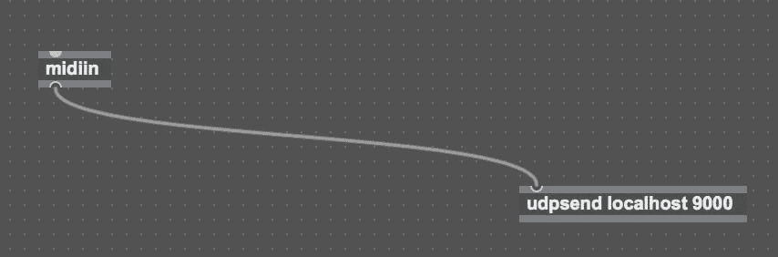

# 使用 OSC over UDP 从 Ableton 向浏览器发送详细的 MIDI 消息。

> 原文：<https://dev.to/fabiantjoeaon/sending-detailed-midi-messages-from-ableton-to-the-browser-using-osc-over-udp-4b9m>

## 最大/最大支持价格

上个月，我一直致力于基于我演奏的音乐在网络上生成实时视觉效果的概念，这样我就可以用实时生成的视觉效果进行现场表演。我在 Ableton 制作音乐，这在这种情况下对我来说是一个优势，因为 Ableton Live Suite 附带了 Max4Live，即 [Max/MSP](https://cycling74.com/) ，这是一种可视化编程语言，你可以(例如)创建自己的设备，如粒度合成器、vj 工具或任何其他你可以想象的可以在你的 DAW 中运行的设备。

通常我会使用[这个](https://github.com/alpacaaa/max4node)节点模块，它包括一个预制的 Max4Live 设备，您可以将它插入到您的 Live set 中。通过导入这个节点模块，您可以访问 LOM，这是一个活动对象模型，一个基于节点的活动接口表示。这可以让你以各种方式与实时界面进行交互，还可以让你读出很多值。不幸的是，它不能让你知道特定的音符在什么时候演奏，这对我是一个巨大的限制，因为这对我的项目来说是有价值的信息。

## 通过 UDP 发送消息

事实证明，将实时消息接收到您的 javascript 代码中实际上非常简单！您所需要的只是一个简单的 Max4Live 设备，它通过 UDP 将消息发送到某个端口，然后您将在 Node.js 中侦听这些消息。您确实希望使用 UDP over TCP(例如 HTTP)，因为这种通过互联网发送数据的方式更快，但是，它确实需要您使用缓冲区，因为 UDP 处理二进制数据。

这就是 Max4Live 设备的全部功能:

[](https://res.cloudinary.com/practicaldev/image/fetch/s--Mw0aqTvY--/c_limit%2Cf_auto%2Cfl_progressive%2Cq_auto%2Cw_880/https://thepracticaldev.s3.amazonaws.com/i/npewipt0rsjrqbaq3mgg.png)

`midiin`从安装了 Max4Live 设备的轨道接收所有音符数据，然后通过 UDP 将这些数据发送到端口 9000。然后在 NodeJs 中，您可以在端口 9000 上监听带有`dgram`包(它是 Nodejs 本身的一部分)的消息，就像这样:

```
const dgram = require('dgram');
const server = dgram.createSocket('udp4');

server.on('error', (err) => {
  console.log(`server error:\n${err.stack}`);
  server.close();
});

server.on('message', (msg, rinfo) => {
  console.log(`server got: ${msg} from ${rinfo.address}:${rinfo.port}`);
});

server.on('listening', () => {
  const address = server.address();
  console.log(`server listening ${address.address}:${address.port}`);
});

server.bind(9000); 
```

## 对 MIDI 消息使用基本 UDP 的缺点

现在，当播放一个音符时，我们会收到消息，但它给我们的信息并没有真正的帮助，因为它吐出的是随机数。MIDI 是一个非常描述性的标准，因为它可以接收多达 16 个通道的信息。事实证明，仅仅使用 UDP 并不能给我们很多关于**的信息，什么**没有被播放，它的速度是多少，等等。如果我们想要对抄送信息采取行动，这只会变得更加复杂，例如当你转动 MIDI 控制器上的旋钮时。

## 使用 OSC 获取更详细的 MIDI 信息

这就是 OSC 出手相救的地方。OSC 代表开放式声音控制，它是 UDP 上的一个协议，专门用于通过互联网发送音乐演奏数据。它对人类来说也很容易阅读，因为它使用了基于 URL 的消息。幸运的是，我们不必创建自己的 Max4Live 设备来利用 Ableton 轨道上的 OSC，已经有一个完美的实现可供我们使用，您可以在这里找到。

这个设备可以让您决定发送什么消息，以及您希望通过什么路径接收它们。

[](https://res.cloudinary.com/practicaldev/image/fetch/s--oMYIv9eY--/c_limit%2Cf_auto%2Cfl_progressive%2Cq_auto%2Cw_880/https://thepracticaldev.s3.amazonaws.com/i/vfr69e81qsgetlz8v8ij.png)

使用 [osc 节点模块](https://www.npmjs.com/package/osc)，接收这些消息易如反掌，参见下面的代码:

```
// // https://cycling74.com/forums/midi-over-udp
const app = require("express")();
const server = require("http").Server(app);
const io = require("socket.io")(server);
const osc = require("osc");

const UDP_PORT = 9000;
const SOCKET_PORT = 8000;

const udpPort = new osc.UDPPort({
  localAddress: "127.0.0.1",
  localPort: UDP_PORT
});
server.listen(SOCKET_PORT);

const requiredValuesForNote = 2;
let valueBuffer = {};

udpPort.on("ready", function() {
  console.log(`Listening for OSC over UDP on port ${UDP_PORT}.`);
  console.log(`Awaiting socket connection on port ${SOCKET_PORT}.`);

  io.on("connection", socket => {
    console.log("Socket connected!");

    udpPort.on("message", ({ address, args }) => {
      if (address === "/pitch") valueBuffer.pitch = args[0];
      if (address === "/velocity") valueBuffer.velocity = args[0];

      if (Object.keys(valueBuffer).length === requiredValuesForNote) {
        // Emit socket to (webGL) client
        io.emit("osc-message", valueBuffer);
        valueBuffer = {};
      }
    });
  });
});

udpPort.on("error", function(err) {
  console.log(err);
});

udpPort.open(); 
```

不幸的是，每一种不同类型的信息(音高、速度等)都是通过不同的事件接收的。我们只想向我们的客户端发送一次套接字(在这种情况下，它处理我们的视觉效果，如何实现完全取决于您)。使用一个缓冲区，我们一直等到所有的音符值都出现，然后我们用我们需要的数据触发我们的 websocket。

好了，我们现在可以实时接收详细的 MIDI 信息了！