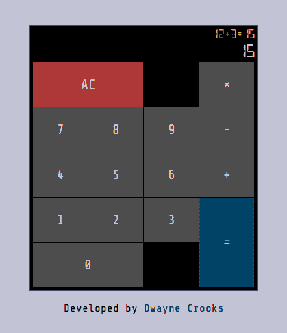

# 在 Elm 中将应用程序逻辑从 UI 中分离出来

> 原文：<https://dev.to/dwayne/separating-application-logic-from-the-ui-in-elm-8nj>

昨天，我开始实现我正在重新创建的一个简单计算器 web 应用程序的逻辑。

[](https://res.cloudinary.com/practicaldev/image/fetch/s--OP_YzmWD--/c_limit%2Cf_auto%2Cfl_progressive%2Cq_auto%2Cw_880/https://thepracticaldev.s3.amazonaws.com/i/4t9yzd24schmve9udmjg.png)

我构建它的目标之一是使用 Elm 的特性将应用程序逻辑从 UI 中清晰地分离出来。

我相信我已经达到了我的目标，这就是为什么我如此兴奋地与你们分享我的进步。

## 那么我做了什么？

我[用下面的公共 API 在`Calculator`模块中做了一个数据结构](https://www.youtube.com/watch?v=x1FU3e0sT1I):

```
module Calculator exposing
  ( Calculator, Key(..), Operator(..)
  , new, process

  , Display
  , toDisplay
  ) 
```

Enter fullscreen mode Exit fullscreen mode

**N.B.** *实现细节现在并不重要。*

`Calculator`是一种[不透明型](https://medium.com/@ckoster22/advanced-types-in-elm-opaque-types-ec5ec3b84ed2)。

`new`函数创建一个`Calculator`。`process`取一个`Key`和一个`Calculator`，返回更新后的`Calculator`。并且，`toDisplay`允许你观察由给定的`Calculator`产生的结果。

例如

```
Calculator.new
  |> Calculator.process (Digit 1)
  |> Calculator.process (Digit 2)
  |> Calculator.process (Operator Plus)
  |> Calculator.process (Digit 3)
  |> Calculator.toDisplay

{ expr = "12+3", output = "3" } 
```

Enter fullscreen mode Exit fullscreen mode

我经历了两大好处。首先，我能够对我的逻辑进行单元测试(是的，[测试是重要的](https://www.youtube.com/watch?v=51O63Sb-Ae0)，即使是在类型化的函数式语言中)，并在我的实现中获得信心。

以下是测试:

```
module Test.Calculator exposing (suite)

import Expect
import Test exposing (..)

import Calculator exposing (Key(..), Operator(..))

suite : Test
suite =
  describe "Calculator"
    [ processSuite ]

processSuite : Test
processSuite =
  describe "process"
    [ describe "when nothing has been entered" <|
        let
          calculator =
            Calculator.new
        in
          [ test "pressing AC" <|
              \_ ->
                calculator
                  |> Calculator.process AC
                  |> Calculator.toDisplay
                  |> Expect.equal { expr = "", output = "0" }
          , test "pressing a digit" <|
              \_ ->
                calculator
                  |> Calculator.process (Digit 1)
                  |> Calculator.toDisplay
                  |> Expect.equal { expr = "1", output = "1" }
          , test "pressing an operator" <|
              \_ ->
                calculator
                  |> Calculator.process (Operator Plus)
                  |> Calculator.toDisplay
                  |> Expect.equal { expr = "", output = "0" }
          , test "pressing =" <|
              \_ ->
                calculator
                  |> Calculator.process Equal
                  |> Calculator.toDisplay
                  |> Expect.equal { expr = "", output = "0" }
          ]
    , describe "when a number has been entered" <|
        let
          calculator =
            Calculator.new
              |> Calculator.process (Digit 1)
              |> Calculator.process (Digit 2)
        in
          [ test "pressing AC" <|
              \_ ->
                calculator
                  |> Calculator.process AC
                  |> Calculator.toDisplay
                  |> Expect.equal { expr = "", output = "0" }
          , test "pressing a digit" <|
              \_ ->
                calculator
                  |> Calculator.process (Digit 3)
                  |> Calculator.toDisplay
                  |> Expect.equal { expr = "123", output = "123" }
          , test "pressing an operator" <|
              \_ ->
                calculator
                  |> Calculator.process (Operator Plus)
                  |> Calculator.toDisplay
                  |> Expect.equal { expr = "12+", output = "+" }
          , test "pressing =" <|
              \_ ->
                calculator
                  |> Calculator.process Equal
                  |> Calculator.toDisplay
                  |> Expect.equal { expr = "12=12", output = "12" }
          ]
    , describe "when a number and operator has been entered" <|
        let
          calculator =
            Calculator.new
              |> Calculator.process (Digit 1)
              |> Calculator.process (Digit 2)
              |> Calculator.process (Operator Plus)
        in
          [ test "pressing AC" <|
              \_ ->
                calculator
                  |> Calculator.process AC
                  |> Calculator.toDisplay
                  |> Expect.equal { expr = "", output = "0" }
          , test "pressing a digit" <|
              \_ ->
                calculator
                  |> Calculator.process (Digit 3)
                  |> Calculator.toDisplay
                  |> Expect.equal { expr = "12+3", output = "3" }
          , test "pressing an operator" <|
              \_ ->
                calculator
                  |> Calculator.process (Operator Minus)
                  |> Calculator.toDisplay
                  |> Expect.equal { expr = "12-", output = "-" }
          , test "pressing =" <|
              \_ ->
                calculator
                  |> Calculator.process Equal
                  |> Calculator.toDisplay
                  |> Expect.equal { expr = "12=12", output = "12" }
          ]
    , describe "when a complete expression has been entered" <|
        let
          calculator =
            Calculator.new
              |> Calculator.process (Digit 1)
              |> Calculator.process (Digit 2)
              |> Calculator.process (Operator Plus)
              |> Calculator.process (Digit 3)
              |> Calculator.process (Operator Minus)
              |> Calculator.process (Digit 4)
        in
          [ test "pressing AC" <|
              \_ ->
                calculator
                  |> Calculator.process AC
                  |> Calculator.toDisplay
                  |> Expect.equal { expr = "", output = "0" }
          , test "pressing a digit" <|
              \_ ->
                calculator
                  |> Calculator.process (Digit 5)
                  |> Calculator.toDisplay
                  |> Expect.equal { expr = "12+3-45", output = "45" }
          , test "pressing an operator" <|
              \_ ->
                calculator
                  |> Calculator.process (Operator Plus)
                  |> Calculator.toDisplay
                  |> Expect.equal { expr = "12+3-4+", output = "+" }
          , test "pressing =" <|
              \_ ->
                calculator
                  |> Calculator.process Equal
                  |> Calculator.toDisplay
                  |> Expect.equal { expr = "12+3-4=11", output = "11" }
          ]
    , describe "when an answer is given" <|
        let
          calculator =
            Calculator.new
              |> Calculator.process (Digit 1)
              |> Calculator.process (Digit 2)
              |> Calculator.process (Operator Plus)
              |> Calculator.process (Digit 3)
              |> Calculator.process (Operator Minus)
              |> Calculator.process (Digit 4)
              |> Calculator.process Equal
        in
          [ test "pressing AC" <|
              \_ ->
                calculator
                  |> Calculator.process AC
                  |> Calculator.toDisplay
                  |> Expect.equal { expr = "", output = "0" }
          , test "pressing a digit" <|
              \_ ->
                calculator
                  |> Calculator.process (Digit 9)
                  |> Calculator.toDisplay
                  |> Expect.equal { expr = "9", output = "9" }
          , test "pressing an operator" <|
              \_ ->
                calculator
                  |> Calculator.process (Operator Plus)
                  |> Calculator.toDisplay
                  |> Expect.equal { expr = "11+", output = "+" }
          , test "pressing =" <|
              \_ ->
                calculator
                  |> Calculator.process Equal
                  |> Calculator.toDisplay
                  |> Expect.equal { expr = "12+3-4=11", output = "11" }
          ]
    ] 
```

Enter fullscreen mode Exit fullscreen mode

第二个好处是实现 UI 变得非常简单。我看到许多 web 应用程序为 UI 代码编写了大量的集成测试，但这是因为它们将 UI 与应用程序逻辑耦合在一起。有了适当的关注点分离，你会得到更多的单元测试和更少的集成测试(如果有的话)。

下面是使 UI 工作的代码:

```
-- MODEL

type alias Model =
  { calculator : Calculator
  }

init : Model
init =
  { calculator = Calculator.new
  }

-- UPDATE

type Msg
  = Clicked Key

update : Msg -> Model -> Model
update msg model =
  case msg of
    Clicked key ->
      { model | calculator = Calculator.process key model.calculator }

-- VIEW

viewCalculator : Calculator -> Html Msg
viewCalculator calculator =
  let
    display =
      Calculator.toDisplay calculator
  in
    div [ class "calculator" ]
      [ div [ class "calculator__expr" ]
          [ if String.isEmpty display.expr then
              text (String.fromChar nonBreakingSpace)
            else
              text display.expr
          ]
      , div [ class "calculator__output" ] [ text display.output ]
      , div [ class "calculator__buttons" ]
          [ button [ class "r0 c0 colspan2 bg-red", onClick (Clicked AC) ]
              [ text "AC" ]
          , button [ class "r0 c2", disabled True ]
              [ text "÷" ]
          , button [ class "r0 c3", onClick (Clicked (Operator Times)) ]
              [ text "×" ]
          , button [ class "r1 c0", onClick (Clicked (Digit 7)) ]
              [ text "7" ]
          , button [ class "r1 c1", onClick (Clicked (Digit 8)) ]
              [ text "8" ]
          , button [ class "r1 c2", onClick (Clicked (Digit 9)) ]
              [ text "9" ]
          , button [ class "r1 c3", onClick (Clicked (Operator Minus)) ]
              [ text "-" ]
          , button [ class "r2 c0", onClick (Clicked (Digit 4)) ]
              [ text "4" ]
          , button [ class "r2 c1", onClick (Clicked (Digit 5)) ]
              [ text "5" ]
          , button [ class "r2 c2", onClick (Clicked (Digit 6)) ]
              [ text "6" ]
          , button [ class "r2 c3", onClick (Clicked (Operator Plus)) ]
              [ text "+" ]
          , button [ class "r3 c0", onClick (Clicked (Digit 1)) ]
              [ text "1" ]
          , button [ class "r3 c1", onClick (Clicked (Digit 2)) ]
              [ text "2" ]
          , button [ class "r3 c2", onClick (Clicked (Digit 3)) ]
              [ text "3" ]
          , button [ class "r3 c3 rowspan2 bg-blue", onClick (Clicked Equal) ]
              [ text "=" ]
          , button [ class "r4 c0 colspan2", onClick (Clicked (Digit 0)) ]
              [ text "0" ]
          , button [ class "r4 c2", disabled True ]
              [ text "." ]
          ]
      ] 
```

Enter fullscreen mode Exit fullscreen mode

**关键要点:**让 UI 驱动一个数据结构，并对该数据结构进行单元测试。

你如何看待这种实现更复杂 ui 的方法？