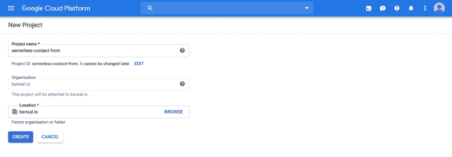
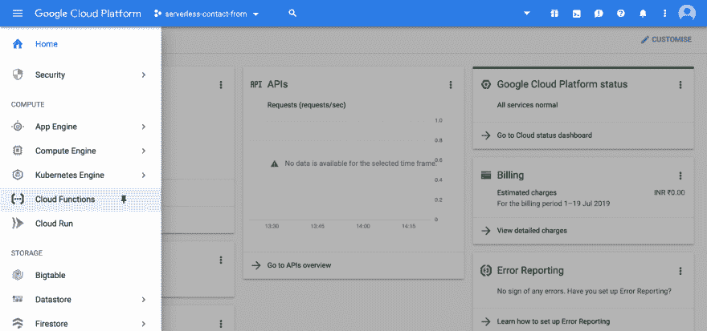
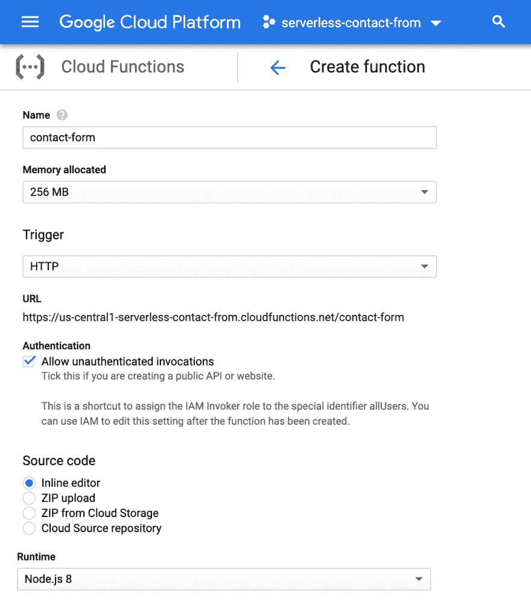
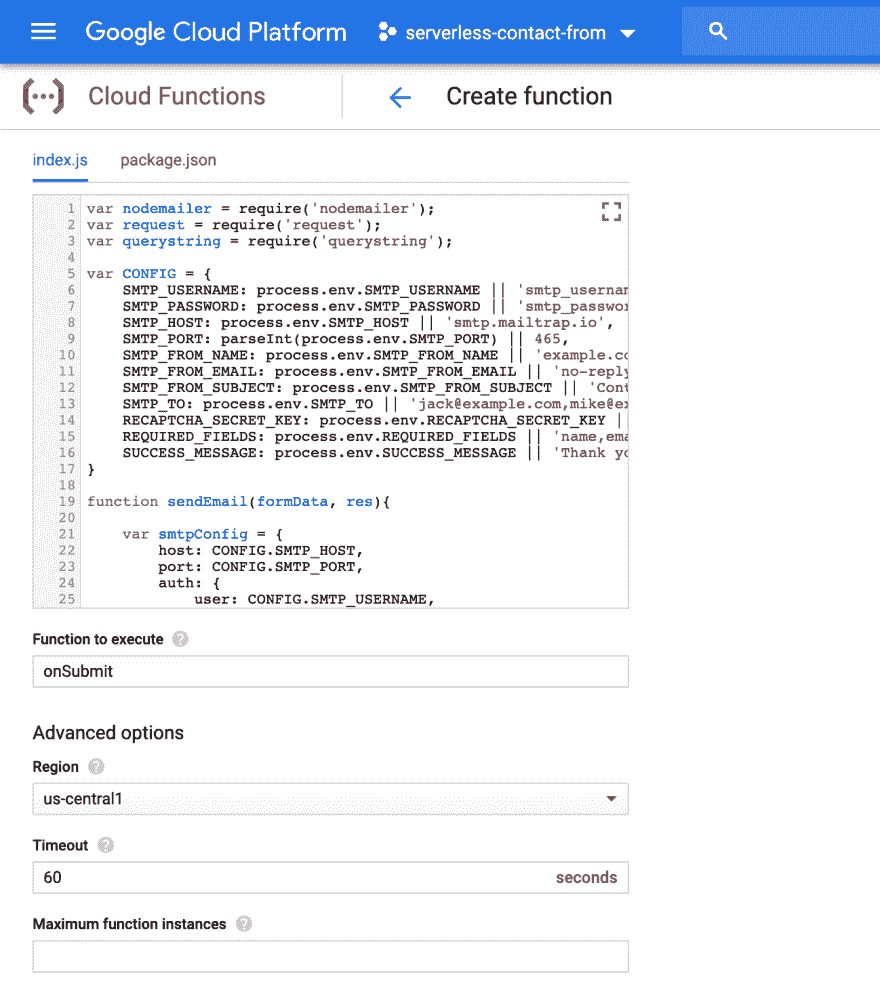
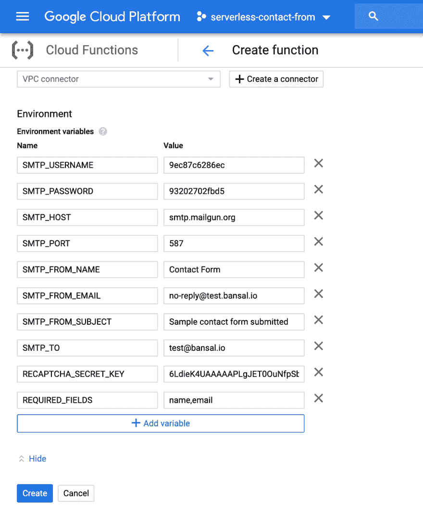

# 静态网站的无服务器联系人表单处理

> 原文：<https://dev.to/bansal/serverless-contact-form-handling-for-static-websites-12md>

当你在做一个静态网站时，这意味着你不想管理服务器或者想节省成本。然而，静态网站不能处理联系表单，这意味着您需要一个后端服务器来处理联系表单请求。但是如果需要服务器，那么做一个静态网站的逻辑是什么？因此，简单的解决方案是无服务器的联系形式。

## 为什么要去无服务器？

制作无服务器应用程序有很多好处，但简而言之，主要好处是易于设置、无需管理、成本更低(免费)。

## 平台选择

有很多方法可以运行像 aws lambda，Google cloud functions，cloudflare workers 这样的无服务器代码。但我选择了最简单的方式来运行无服务器代码，即谷歌云功能。

[谷歌云功能](https://cloud.google.com/functions/)允许你通过 HTTPS 请求触发功能。这也可以用 aws lambda 来完成，但是你需要额外设置 API Gateway 来触发这个函数。

## 成本

谷歌云提供免费的 200，000 GHz 秒的计算时间，5GB 的互联网出口流量，每月 200 万次调用。
[https://cloud.google.com/functions/pricing](https://cloud.google.com/functions/pricing)

我使用的是 256MB/0.4GHz 运行时，处理一个表单需要大约 800 毫秒。

这个免费配额太多，无法处理联系人表单提交。

0.4 x 0.8s =每次调用 0.32 GHz 秒
200，000 / 0.32 = 625，000

您每月可以免费处理 625，000 份成功提交的表格*。

> *这只是一个计算示例，不包括电子邮件成本。免费资源受制于谷歌云政策。

## 设置

### 第一步:创建项目

(如果您没有 Google 云帐户，请创建一个，然后创建项目)

### 第二步:创建函数

点击左上角的菜单图标。向下滚动并在计算部分找到云函数。

 
然后点击*创建功能*按钮。

### 第三步:配置云功能

设置功能名称(联系人表单)。

分配内存(256MB 足够了)

设置触发器‘HTTP’—它也适用于 https。

不需要身份验证，因此保持选中状态以接受未经身份验证的请求。

源代码可以添加内联或压缩文件可以上传。你可以在这里找到 zip 文件[https://github . com/bans al-io/server less-contact-form/tree/master/dist](https://github.com/bansal-io/serverless-contact-form/tree/master/dist)

我在这里选择了内联编辑器选项。

### 第四步:向编辑器添加代码

打开资源库
复制`index.js`和`package.json`文件的代码，粘贴到各自的代码编辑器页签中。

在字段函数中，执行 onSubmit 类型

### 第五步:设置环境变量

所有与 SMTP 相关的环境变量都是必需的。其余的变量是可选的。查看配置详情[https://github . com/ban sal-io/server less-contact-form/# configure](https://github.com/bansal-io/serverless-contact-form/#configure)
点击' *Create* 按钮，您的功能就准备好了。

> 注意:除了设置环境变量，您还可以更改`index.js`文件中的配置值。

## 获取 http 端点

一旦功能被部署，点击功能名称(联系表)，然后触发标签找到网址。

你的网址看起来会像这样。

[https://YOUR _ REGION-YOUR _ PROJECT _ id . cloud functions . net/FUNCTION _ NAME](https://YOUR_REGION-YOUR_PROJECT_ID.cloudfunctions.net/FUNCTION_NAME)

现在，您可以在 HTML 表单中设置这个 url in action 属性

这里有一个谷歌云功能[https://serverless-contact-form.netlify.com/](https://serverless-contact-form.netlify.com/)联系人表单的工作示例

> 注意:这段代码允许接受来自任何域的请求。要仅限制您的域，您还可以将“Access-Control-Allow-Origin”值从' * '更改为'[https://your-website . com '](https://your-website.com%E2%80%99)。