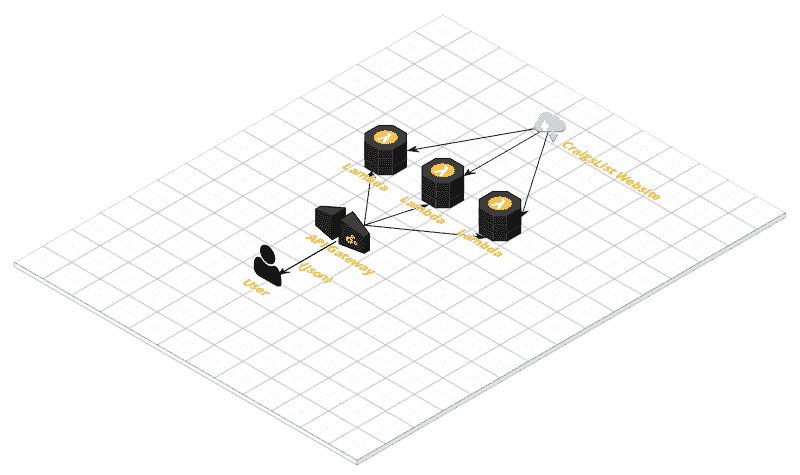

# 使用 Aws Lambda 和 Java 的无服务器 Web 抓取

> 原文：<https://dev.to/scrapingbee/serverless-web-scraping-with-aws-lambda-and-java-48lc>

无服务器是一个术语，指的是在短暂的容器内执行代码(功能即服务，或 FaaS)。它是 2019 年的热门话题，继“微服务”炒作之后，“纳米服务”又来了！

云功能可以由不同的因素触发，例如:

*   对 REST API 的 HTTP 调用
*   消息队列中的作业
*   一根木头
*   IOT 事件

云功能非常适合网络抓取任务，原因有很多。Web 抓取是 I/O 绑定的，大部分时间花在等待 HTTP 响应上，所以我们不需要高端 CPU 服务器。云功能很便宜(第一次 100 万次请求是免费的，之后每 100 万次请求 0.20 美元)，而且很容易设置。云函数非常适合并行抓取，我们可以同时创建数百或数千个函数来进行大规模抓取。

在这篇简介中，我们将看到如何使用无服务器框架在 AWS Lambda 上部署我们在之前的 [blogpost](https://dev.to/scrapingbee/introduction-to-web-scraping-with-java-5i8) 上制作的稍加修改的 Craigslist scraper 版本。

## 先决条件

我们将使用[无服务器](https://serverless.com/)框架来构建并部署我们的项目到 AWS lambda。无服务器 CLI 能够生成大量不同语言的样板代码，并将代码部署到不同的云提供商，如 AWS、Google Cloud 或 Azure。

*   AWS 帐户
*   节点和国家预防机制
*   [无服务器 CLI](https://serverless.com/framework/docs/providers/aws/guide/quick-start/) 并设置您的 [AWS 凭证](https://serverless.com/framework/docs/providers/aws/guide/credentials/)
*   Java 8
*   专家

## 建筑

我们将使用 API Gateway 构建一个 API，其中一个端点`/items/{query}`绑定在一个 lambda 函数上，该函数将使用一个 JSON 数组来响应我们，该数组包含该查询的所有条目(在第一个结果页面上)。

这是该架构的简单示意图:

[](https://res.cloudinary.com/practicaldev/image/fetch/s--7GKGCJBN--/c_limit%2Cf_auto%2Cfl_progressive%2Cq_auto%2Cw_880/https://www.scrapingbee.cimg/post/java-lambda/cloudcraft.png)

## 创建 Maven 项目

Serverless 能够用许多不同的语言生成项目:Java、Python、NodeJS、Scala...
我们将使用其中一个模板来生成一个 maven 项目:

```
serverless create --template aws-java-maven --name items-api -p aws-java-scraper 
```

现在，您可以在自己喜欢的 IDE 中打开这个 Maven 项目。

## 配置

首先要做的是修改 ***serverless.yml*** 配置实现一个 API 网关路由，并绑定到***Handler.java***类中的 **handleRequest** 方法。

```
service: craigslist-scraper-api 
provider:
  name: aws
  runtime: java8
  timeout: 30

package:
  artifact: target/hello-dev.jar

functions:
  getCraigsListItems:
    handler: com.serverless.Handler
    events:
    - http:
        path: /items/{searchQuery}
        method: get 
```

我还增加了 30 秒的暂停时间。无服务器框架的默认超时是 6 秒。由于我们正在运行 Java 代码， [Lambda 冷启动](https://serverless.com/blog/keep-your-lambdas-warm/)可能需要几秒钟。然后我们将向 Craigslist 网站发出 HTTP 请求，因此 30 秒似乎不错。

## 功能代码

现在我们可以修改*。函数逻辑很简单。首先，我们检索名为“searchQuery”的路径参数。然后我们创建一个 CraigsListScraper，并使用这个 searchQuery 调用 ***scrape()*** 方法。它将返回一个代表第一个 Craigslist 结果页面上所有项目的`List<Item>`。*

 *然后，我们使用由无服务器框架生成的`ApiGatewayResponse`类返回一个包含所有项目的 JSON 数组。

你可以在[这个库](https://github.com/ksahin/serverless-scraping)中找到剩余的代码，包括`CraigsListScraper`和`Item`类。

```
@Override
public ApiGatewayResponse handleRequest(Map<String, Object> input, Context context) {
    LOG.info("received: {}", input);
    try{
        Map<String,String> pathParameters = (Map<String,String>)input.get("pathParameters");
        String query = pathParameters.get("searchQuery");

        CraigsListScraper scraper = new CraigsListScraper();
        List<Item> items = scraper.scrape(query);
        return ApiGatewayResponse.builder()
            .setStatusCode(200)
            .setObjectBody(items)
            .setHeaders(Collections.singletonMap("X-Powered-By", "AWS Lambda & serverless"))
            .build();
    }catch(Exception e){
        LOG.error("Error : " + e);
        Response responseBody = new Response("Error while processing URL: ", input);
        return ApiGatewayResponse.builder()
            .setStatusCode(500)
            .setObjectBody(responseBody)
            .setHeaders(Collections.singletonMap("X-Powered-By", "AWS Lambda & Serverless"))
            .build();
    }
} 
```

我们现在可以构建项目:

```
mvn clean install 
```

并将其部署到 AWS:

```
serverless deploy
Serverless: Packaging service...
Serverless: Creating Stack...
Serverless: Checking Stack create progress...
.....
Serverless: Stack create finished...
Serverless: Uploading CloudFormation file to S3...
Serverless: Uploading artifacts...
Serverless: Uploading service .zip file to S3 (13.35 MB)...
Serverless: Validating template...
Serverless: Updating Stack...
Serverless: Checking Stack update progress...
.................................
Serverless: Stack update finished...
Service Information
service: items-api
stage: dev
region: us-east-1
stack: items-api-dev
api keys:
  None
endpoints:
  GET - https://tmulioizdf.execute-api.us-east-1.amazonaws.com/dev/items/{searchQuery}
functions:
  getCraigsListItems: items-api-dev-getCraigsListItems 
```

然后，您可以使用 curl 或您的 web 浏览器使用部署日志中给定的 url 来测试您的功能(

`serverless info`

)也会显示这些信息。)

以下是查找“macBook pro”的查询:

```
curl https://tmulioizdf.execute-api.us-east-1.amazonaws.com/dev/items/macBook%20pro | json_reformat                                                            1 ↵
  % Total    % Received % Xferd  Average Speed   Time    Time     Time  Current
                                 Dload  Upload   Total   Spent    Left  Speed
100 19834  100 19834    0     0   7623      0  0:00:02  0:00:02 --:--:--  7622
[
    {
        "title": "2010 15\" Macbook pro 3.06ghz 8gb 320gb osx maverick",
        "price": 325,
        "url": "https://sfbay.craigslist.org/eby/sys/d/macbook-pro-306ghz-8gb-320gb/6680853189.html"
    },
    {
        "title": "Apple MacBook Pro A1502 13.3\" Late 2013 2.6GHz i5 8 GB 500GB + Extras",
        "price": 875,
        "url": "https://sfbay.craigslist.org/pen/sys/d/apple-macbook-pro-alateghz-i5/6688755497.html"
    },
    {
        "title": "Apple MacBook Pro Charger USB-C (Latest Model) w/ Box - Like New!",
        "price": 50,
        "url": "https://sfbay.craigslist.org/pen/sys/d/apple-macbook-pro-charger-usb/6686902986.html"
    },
    {
        "title": "MacBook Pro 13\" C2D 4GB memory 500GB HDD",
        "price": 250,
        "url": "https://sfbay.craigslist.org/eby/sys/d/macbook-pro-13-c2d-4gb-memory/6688682499.html"
    },
    {
        "title": "Macbook Pro 2011 13\"",
        "price": 475,
        "url": "https://sfbay.craigslist.org/eby/sys/d/macbook-pro/6675556875.html"
    },
    {
        "title": "Trackpad Touchpad Mouse with Cable and Screws for Apple MacBook Pro",
        "price": 39,
        "url": "https://sfbay.craigslist.org/pen/sys/d/trackpad-touchpad-mouse-with/6682812027.html"
    },
    {
        "title": "Macbook Pro 13\" i5 very clean, excellent shape! 4GB RAM, 500GB HDD",
        "price": 359,
        "url": "https://sfbay.craigslist.org/sfc/sys/d/macbook-pro-13-i5-very-clean/6686879047.html"
    },
... 
```

注意第一次调用会很慢，对我来说花了 7 秒钟。下一次调用会快得多。

## 更进一步

这只是一个小例子，这里有一些改进的想法:

*   更好的错误处理
*   用 API 密匙保护 API(用 API Gateway 很容易实现)
*   将项目保存到 DynamoDB 数据库中
*   将搜索查询发送到 SQS 队列，并使用队列而不是 HTTP 请求来触发 lambda 执行
*   如果商品价格低于某个价位，请通过产品升级和技术支持服务发送通知。

如果你喜欢网络抓取并且厌倦了代理、JS 渲染和验证码，你可以检查我们新的[网络抓取 API](https://www.scrapingbee.com) ，第一批 1000 个 API 调用由我们负责。

本教程到此结束。我希望你喜欢这篇文章。不要犹豫尝试 Lambda 和其他云提供商，它真的很有趣，很容易，并且可以大大降低您的基础设施成本，特别是对于 web 抓取或异步相关任务。*