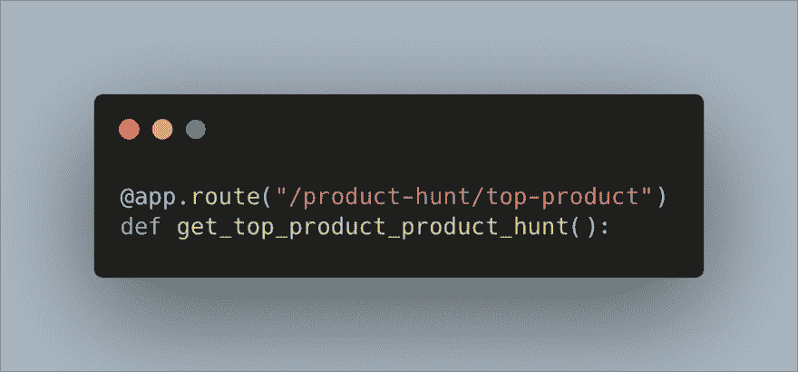
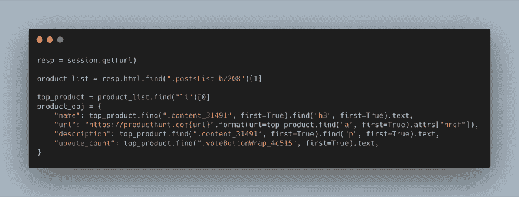
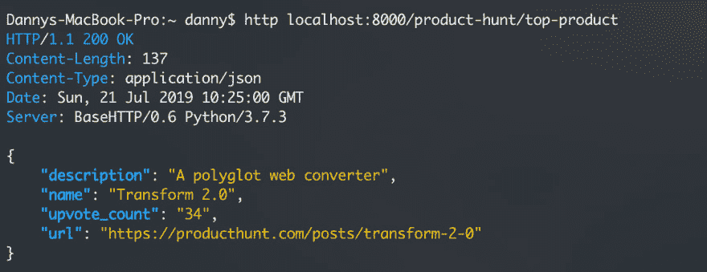

# 使用 Python、AWS Lambda 和 Chalice 进行无服务器网络抓取

> 原文：<https://dev.to/dannyaziz97/serverless-web-scraping-with-python-aws-lambda-and-chalice-42d4>

# [T1】简介](#intro)

程序化和可扩展的网络抓取很难做到。有许多构建和维护工作与实际的抓取任务无关。

无服务器计算让这变得简单多了。

你所需要担心的是以友好的方式抓取网站。让我们开始用 Python 创建一个无服务器的 web scraper，并通过使用 Chalice 为我们完成所有繁重的工作，将它托管在 AWS Lambda 上。

我们将创建一个小刮刀，返回 ProductHunt 上今天排名第一的产品。(顺便说一句:使用 ProductHunt API 这是完全可行的)

以下是该项目的回购:[https://github . com/DannyAziz/server less-product-hunt-scraper](https://github.com/DannyAziz/serverless-product-hunt-scraper)

# 1。设置🛠开发环境

设置您的 python 虚拟环境并安装 chalice

`mkivrtualenv serverless_scraping`

`pip install chalice`

请确保通过 pip 安装此依赖项，我们将使用它来简化我们的清理工作:

`pip install requests_html`

# 2。用 AWS 设置圣杯🔑

您需要使用您的 AWS 帐户验证您的机器。如果你以前做过，继续下一步。

首先，您需要访问密钥，要获得这些密钥，请从右上角的下拉菜单转到安全凭证页面

展开“访问密钥”下拉列表，然后单击“创建新的访问密钥”

一定要把这些记下来，因为你不会再看到这些了。

现在您需要将这些密钥保存到 AWS 配置文件中:

创建 AWS 配置文件夹

`mkdir ~/.aws`

创建并打开一个新文件

`nano ~/.aws/config`

粘贴这个，确保用你自己的键和区域替换键和区域

```
[default]
aws_access_key_id=YOUR_ACCESS_KEY_HERE
aws_secret_access_key=YOUR_SECRET_ACCESS_KEY
region=YOUR_REGION (such as us-west-2, us-west-1, etc) 
```

# 3。创建抓取脚本🕸

创建圣杯项目

`chalice new-project producthunt-scraper`

在您的 chalice 项目中会有一个 app.py 文件，用下面的代码替换这个文件:

```
from chalice import Chalice
from requests_html import HTMLSession

app = Chalice(app_name='producthunt-scraper')

@app.route("/product-hunt/top-product")
def get_top_product_product_hunt():
    session = HTMLSession()
    url = 'https://www.producthunt.com/'
    resp = session.get(url)

    product_list_containers = resp.html.find(".postsList_b2208")

    if len(product_list_containers) == 1:
        product_list = product_list_containers[0]
    else:
        product_list = product_list_containers[1]

    if product_list:
        top_product = product_list.find("li")[0]
        product_obj = {
            "name": top_product.find(".content_31491", first=True).find("h3", first=True).text,
            "url": "https://producthunt.com{url}".format(url=top_product.find("a", first=True).attrs["href"]),
            "description": top_product.find(".content_31491", first=True).find("p", first=True).text,
            "upvote_count": top_product.find(".voteButtonWrap_4c515", first=True).text,

        }
        return product_obj
    else:
        return {"error": "Product List Element Not Found"} 
```

让我们稍微分解一下代码。

[](https://res.cloudinary.com/practicaldev/image/fetch/s--_fEtdzKi--/c_limit%2Cf_auto%2Cfl_progressive%2Cq_auto%2Cw_880/https://thepracticaldev.s3.amazonaws.com/i/dqo9fdxf7iau54ql9t0v.png)

chalice 中的所有无服务器函数都是常规的 python 函数，它们需要应用一个@app 装饰器来调用函数。在这个例子中，我们使用@app.route，因为我们希望我们的函数在通过 HTTP 被请求时被调用，但是您也可以使用@app.schedule 来按计划运行该函数，或者使用您可以在这里找到的其他方法:[https://github.com/aws/chalice](https://github.com/aws/chalice)

[](https://res.cloudinary.com/practicaldev/image/fetch/s--kXmVk5Si--/c_limit%2Cf_auto%2Cfl_progressive%2Cq_auto%2Cw_880/https://thepracticaldev.s3.amazonaws.com/i/7gykua9oa3ko5kgbsvwu.png)

我们函数的主要部分使用 requests_html 包来完成解析 html 文档和提取基于类名和 HTML 标签的元素的所有繁重工作。最后，我们要么返回一个包含顶级产品的对象，要么返回一个错误。

# 4。部署🚀

您可以通过 chalice local 命令在本地测试这个 scraper，这将创建一个可以通过 [http://localhost:8000](http://localhost:8000) 到达的本地服务器，您可以用它来测试您的端点。

[](https://res.cloudinary.com/practicaldev/image/fetch/s--Ljk4p2cq--/c_limit%2Cf_auto%2Cfl_progressive%2Cq_auto%2Cw_880/https://thepracticaldev.s3.amazonaws.com/i/fqzemwn993s72cn1k8vp.png)

一旦你准备好了，使用这个命令:`chalice deploy`

Chalice 现在将负责一切，包括在控制台中创建 AWS lambda 函数，并将所有依赖项打包供 AWS lambda 使用。

# 5。完成的🎉

deploy 命令应该给出一个 URL，这是您的无服务器功能和我们的 ProductHunt scraper 的公共可达 URL。您刚刚创建了您的第一个无服务器刮刀！

# 更多阅读📖

点击这里查看圣杯文档-[https://github.com/aws/chalice](https://github.com/aws/chalice)
点击这里查看 AWS Lambda 文档-[https://docs.aws.amazon.com/lambda/latest/dg/welcome.html](https://docs.aws.amazon.com/lambda/latest/dg/welcome.html)

这个帖子最初是在[https://blog.dannyaziz.com](https://blog.dannyaziz.com)创建的