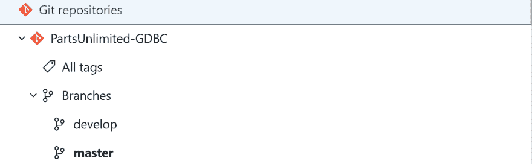
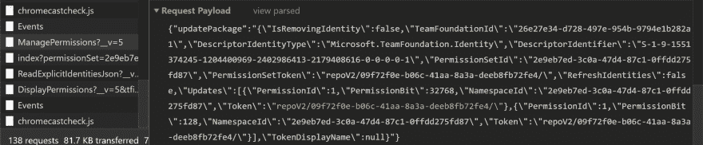
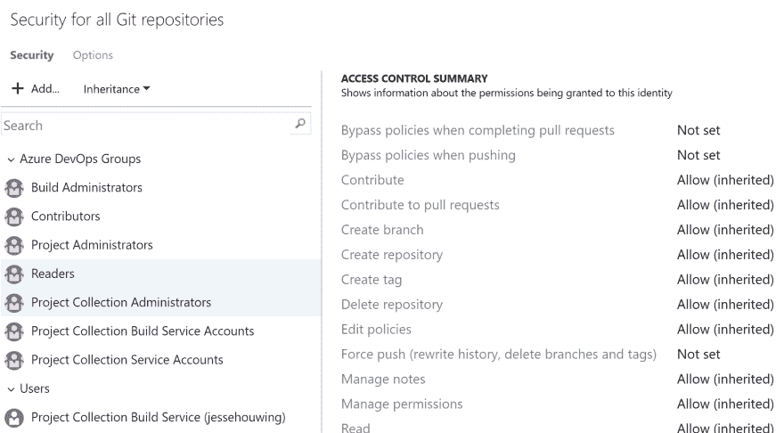
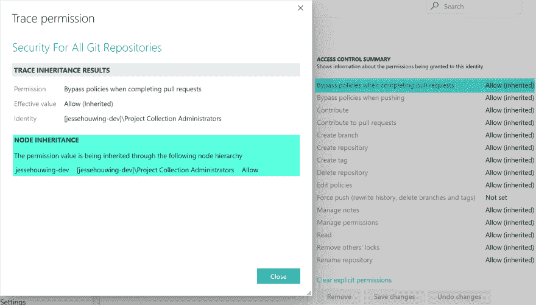

# 在您的 Azure DevOps 组织上设置默认存储库权限

> 原文：<https://dev.to/xpirit/setting-default-repository-permissions-on-your-azure-devops-organization-4lp8>

[](https://res.cloudinary.com/practicaldev/image/fetch/s--y7Whacfe--/c_limit%2Cf_auto%2Cfl_progressive%2Cq_auto%2Cw_880/https://jessehouwing.net/conteimg/2019/06/8580157564_114d84cc88_h.jpg)

在 Azure Repos 中，有很多地方可以设置安全性:

*   在分支级别(开发、主)
*   在分支级别(所有分支的默认值)
*   在标签级别
*   在标签级别(所有标签的默认设置)
*   在存储库级别(GDBC 部件有限公司)
*   在 Git 存储库级别(对于一个项目中的所有存储库)

[](https://res.cloudinary.com/practicaldev/image/fetch/s--G3PyfVP9--/c_limit%2Cf_auto%2Cfl_progressive%2Cq_auto%2Cw_880/https://jessehouwing.net/conteimg/2019/06/image-1.png) 

<figcaption>权限树中的每一级都可以管理。许多权限将逐级下降。</figcaption>

但是没有 UI 来设置组织级别的安全性。如果您对 Azure DevOps 中的默认安全设置感到满意，这是没问题的，但如果您希望某些设置应用于所有项目(也包括新创建的项目)，那么在组织级别设置权限有时会很有用。

> 对于全球 DevOps Bootcamp，我们面临一些挑战，需要通过自动化流程将更改提交给 Git，以便引起中断。
> 
> 为了确保更改能够绕过任何分支策略和受保护的分支，我们需要确保进行更改的服务帐户能够绕过策略。

如果你过去已经深入研究过 Azure DevOps 的安全内部，你会发现某些权限被授予个人或组，并且链接到一个*令牌。*这个令牌通常由一个根对象和一组 GUIDs 构建而成。例如，这是一个特定 Git 存储库的令牌:

```
repoV2/daec401a-49b6-4758-adb5-3f65fd3264e3/f59f38e0-e8c4-45d5-8dee-0d20e7ada1b7
^ ^ ^
| | |
| | -- The Git Repository
| -- The Team Project Guid
|
-- The root object (Repositories) 
```

<figcaption>Scope: specific repository.</figcaption>

据我所知，找到这些细节的最简单方法是捕获权限更改时发出的 web 请求:

[](https://res.cloudinary.com/practicaldev/image/fetch/s--ikQbFsMr--/c_limit%2Cf_auto%2Cfl_progressive%2Cq_auto%2Cw_880/https://jessehouwing.net/conteimg/2019/06/image-2.png) 

<figcaption>您可以在您喜欢的浏览器中使用 Web Developer 工具来查找您需要的令牌。</figcaption>

一旦理解了这一点，就很容易找到“一个团队项目中的所有存储库”的标记。只需去掉最后的 Git 存储库 GUID:

```
repoV2/daec401a-49b6-4758-adb5-3f65fd3264e3b7/
^ ^                                    
| |                                    
| -- The Team Project Guid
|
-- The root object (Repositories) 
```

<figcaption>Scope: all repositories in a project.</figcaption>

并且，使用相同的推理，得到“项目集合/组织中的所有存储库”的标记。最后去掉团队项目 GUID 就行:

```
repoV2/
^                                          
|
-- The root object (Repositories) 
```

<figcaption>Scope: all repositories in an azure DevOps Organization or Azure DevOps Server Project Collection</figcaption>

现在我们有了这个令牌，我们可以使用`tfssecurity`来设置组织级别的 git 权限:

```
tfssecurity /a+ "Git Repositories" repoV2/ "PullRequestBypassPolicy" adm: ALLOW /collection:https://dev.azure.com/org
            ^ ^ ^ ^ ^ ^
            | | | | | -- Allow or Deny the permission 
            | | | | -- The Group (in this case "Project Collection Administrators")
            | | | -- The Permission we want to set
            | | -- The Token we found above
            | -- The Secuity Namespace
            -- Add (a+) or Remove (a-) this permission 
```

而且，你可以在下面看到，这一招其实很管用:)。

[](https://res.cloudinary.com/practicaldev/image/fetch/s--L5siqbyH--/c_limit%2Cf_auto%2Cfl_progressive%2Cq_auto%2Cw_880/https://jessehouwing.net/conteimg/2019/06/image-3.png) 

<figcaption>以前:未在团队项目级别设置绕过策略。</figcaption>

[](https://res.cloudinary.com/practicaldev/image/fetch/s--Q2dmX-Sb--/c_limit%2Cf_auto%2Cfl_progressive%2Cq_auto%2Cw_880/https://jessehouwing.net/conteimg/2019/06/image.png) 

<figcaption>之后:绕过策略是从组织级别继承的。</figcaption>

您可以使用相同的技术来保护分支。分支的令牌使用存储库的令牌作为基础，并在其上添加分支。因为`/`是一个标记分隔符，所以通过用`^`替换`/`来转义分支引用。于是`refs/heads/master`变成了`refs^heads^master` :

```
repoV2/daec401a-49b6-4758-adb5-3f65fd3264e3/f59f38e0-e8c4-45d5-8dee-0d20e7ada1b7/refs^heads^master/
^ ^ ^ ^
| | | |
| | | -- The branch
| | -- The Git Repository
| -- The Team Project Guid
|
-- The root object (Repositories) 
```

> 这对全球 DevOps 训练营非常有用。我们不必为 3000 个团队项目定制权限，现在只需在为该事件设置的 7 个组织中设置该权限。

```
$orgs = @("gdbc2019-westeurope", "gdbc2019-westeurope2", "gdbc2019-india", "gdbc2019-centralus", "gdbc2019-australia", "gdbc2019-southamerica", "gdbc2019-canada")

$orgs | %{ 
    $org = $_
    & tfssecurity /a+ "Git Repositories" repoV2/ "PullRequestBypassPolicy" adm: ALLOW /collection:https://dev.azure.com/$org
    & tfssecurity /a+ "Git Repositories" repoV2/ "PolicyExempt" adm: ALLOW /collection:https://dev.azure.com/$org
} 
```

<figcaption>Set default org level permissions.</figcaption>

**注意:**您也可以使用 REST API 来管理安全性，但是需要做更多的工作来查找组或用户的正确标识符、名称空间标识符等等。虽然 REST API 通常更完整，但它更难理解。

代替`tfssecurity`，你现在也可以使用`az devops permissions`来设置权限。你仍然需要最复杂的代币知识:

```
# tfssecurity /a+ "Git Repositories" repoV2/ "PullRequestBypassPolicy" adm: ALLOW /collection:https://dev.azure.com/$org

az login
az extension add --name "azure-devops"

# Find the group identifier of the group you want to set permissions for

$org = "gdbc2019-westeurope"

# There is a weird edge case here when an Azure DevOps Organization has a Team Project with the same name as the org.
# In that case you must also add a quury to filter on the right domain property `?@.domain == '?'`  

$subject = az devops security group list `
    --org "https://dev.azure.com/$org/" `
    --scope organization `
    --subject-types vssgp `
    --query "graphGroups[?@.principalName == '[$org]\Project Collection Administrators'].descriptor | [0]"

$namespaceId = az devops security permission namespace list `
    --org "https://dev.azure.com/$org/" `
    --query "[?@.name == 'Git Repositories'].namespaceId | [0]"

$bit = az devops security permission namespace show `
    --namespace-id $namespaceId `
    --org "https://dev.azure.com/$org/" `
    --query "[0].actions[?@.name == 'PullRequestBypassPolicy'].bit | [0]"

az devops security permission update `
    --id $namespaceId `
    --subject $subject `
    --token "repoV2/" `
    --allow-bit $bit `
    --merge true `
    --org https://dev.azure.com/$org/ 
```

<figcaption>Use `az devops` as a modern alternative to `tfssecurity`</figcaption>

更多信息:

*   [使用 TFSSecurity 管理 Azure DevOps 的组和权限](https://docs.microsoft.com/en-us/azure/devops/server/command-line/tfssecurity-cmd?view=azure-devops)
*   [Azure devo PS REST API-Security](https://docs.microsoft.com/en-us/rest/api/azure/devops/security/?view=azure-devops-rest-5.1)
*   [Azure-CLI: `az devops security`](https://docs.microsoft.com/en-us/cli/azure/ext/azure-devops/devops/security?view=azure-cli-latest)

图片来源:[斯蒂芬埃德蒙兹](https://www.flickr.com/photos/popcorncx/8580157564/)。