# 在 Windows 上设置 Linux Javascript 开发环境

> 原文：<https://dev.to/vetswhocode/setting-up-a-linux-javascript-dev-environment-on-windows-2n74>

由于 WSL 和 Windows 的一些更新，这篇文章已经过时了。新版本在 https://dev.to/vetswhocode/windows-js-dev-in-wsl-redux-33d5

默认情况下，我通常是一个 Linux 用户。但是最近，我和编写代码的退伍军人们开始了一个团队，其中有一些 Windows 用户。Windows 把很多事情做得很好；设置开发环境并不总是其中之一。所以我想我会安装 Windows，看看我能多接近 Linuxy，让普通的 JavaScript 开发者更容易管理。这些是我采取的步骤；很多都来自这个[的帖子](https://www.smashingmagazine.com/2019/09/moving-javascript-development-bash-windows/)，来自[的伯克·霍兰德](https://twitter.com/burkeholland)。还有一些来自我。

## 让 Linux 在 Windows 上运行。

现在，你需要成为一个快环上的 Windows 内部人员来实现这一切。只是一个注意，内部渠道是测试软件，所以这样做的风险自担。您可以在此阅读更多关于[内幕计划的信息。](https://insider.windows.com/en-us/getting-started/)

当你完成了你的内部版本并全部更新后，我们必须得到用于 Windows (WSL) 的 [Linux 子系统。要打开子系统，按下`Win`键并开始输入“功能”。您应该会看到“打开或关闭 Windows 功能”的选项。选择该选项，并确保选择了“Windows Subsystem for Linux”和“Windows Virtual Machine Platform ”,如图所示。](https://docs.microsoft.com/en-us/windows/wsl/about)

[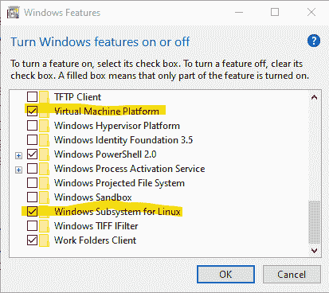](https://res.cloudinary.com/practicaldev/image/fetch/s--965T79w3--/c_limit%2Cf_auto%2Cfl_progressive%2Cq_auto%2Cw_880/https://thepracticaldev.s3.amazonaws.com/i/jzbww93o1waxqn5ad15l.png)

之后你必须重启电脑。

接下来你可以安装你的 Linux 发行版，如果你还没有的话。我推荐使用“Ubuntu-18.04”。

您可以通过输入以下命令来查看已经安装的发行版列表。

你应该会看到这样的东西..

```
PS C:\Users\timap> wsl -l
Windows Subsystem for Linux Distributions:
Ubuntu-18.04 (Default)
kali-linux
openSUSE-Leap-15-1 
```

Enter fullscreen mode Exit fullscreen mode

接下来，我们需要将现有安装转换为 WLS 2。在 1 和 2 之间有很大的性能差异，所以我们希望在 2 上，我们这样做如下。我将使用我的 Kali 安装作为例子。

`wsl --set-version kali-linux 2`

对每个安装的发行版都这样做。

为了避免每次都这样做，我们可以使用命令将 WSL 2 设置为默认值。这将确保以后安装的每个发行版都默认使用 WSL 2。

`wsl --set-default-version 2`

最后，如果您想验证您的所有设置，您可以运行以下。

`wsl -l -v`

这会让你看到一些类似于这个展示的发行版和 wsl 版本的东西。

```
PS C:\Users\timap> wsl -l -v
  NAME                  STATE           VERSION
* Ubuntu-18.04          Stopped         2
  kali-linux            Running         2
  openSUSE-Leap-15-1    Stopped         2 
```

Enter fullscreen mode Exit fullscreen mode

## 好了，让我们得到一个像样的终端！

这部分其实很简单。Windows 做了一个非常好的新终端，它还在测试阶段，但是作为内部人员，它已经在商店里了，你可以安装它。在商店里搜索“Windows 终端”即可。

[](https://res.cloudinary.com/practicaldev/image/fetch/s--hcsNtu5_--/c_limit%2Cf_auto%2Cfl_progressive%2Cq_auto%2Cw_880/https://thepracticaldev.s3.amazonaws.com/i/o2hpqojtpyyt7m1vstg6.png)

我们需要编辑一些东西来设置我们的环境。首先，我们希望打开终端时的默认配置文件是 Linux。通过按下向下箭头并选择设置来打开“终端”的设置。这将打开您的配置文件。

[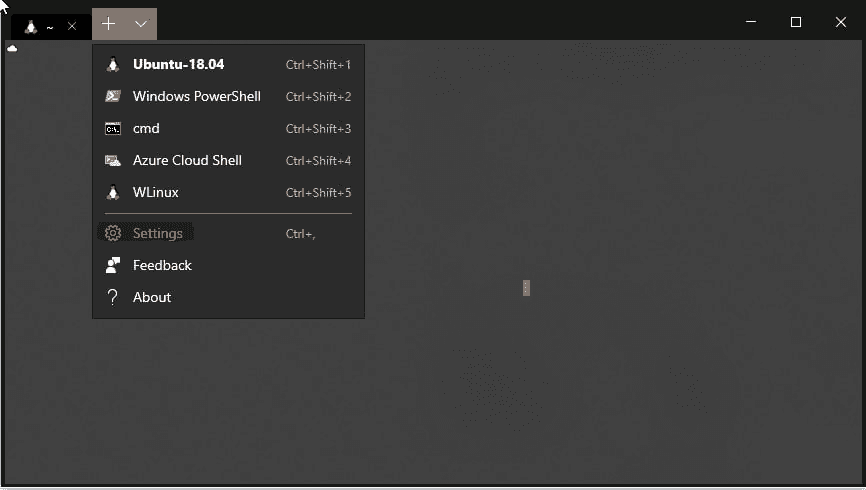](https://res.cloudinary.com/practicaldev/image/fetch/s--0QqritZF--/c_limit%2Cf_auto%2Cfl_progressive%2Cq_auto%2Cw_880/https://thepracticaldev.s3.amazonaws.com/i/a7gbe73686nzmbx9xewx.png)

要将主概要文件设置为 Linux，我们需要找到我们选择的概要文件 GUID，并将其复制到默认的概要文件条目中。配置文件可以在快捷键下面找到，默认是在顶部。

[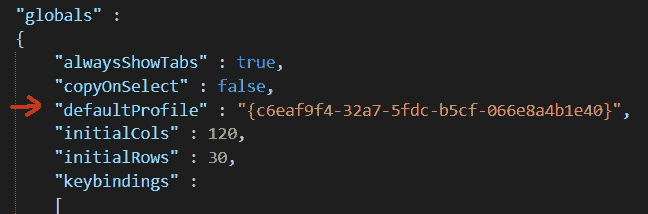](https://res.cloudinary.com/practicaldev/image/fetch/s--cxLJUDeq--/c_limit%2Cf_auto%2Cfl_progressive%2Cq_auto%2Cw_880/https://thepracticaldev.s3.amazonaws.com/i/srnei4pt1e0l4edznis6.png)
[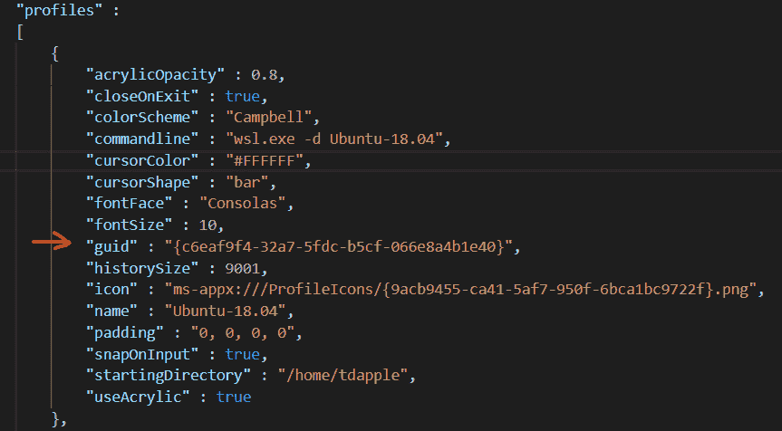T6】](https://res.cloudinary.com/practicaldev/image/fetch/s--d0fvNrN8--/c_limit%2Cf_auto%2Cfl_progressive%2Cq_auto%2Cw_880/https://thepracticaldev.s3.amazonaws.com/i/666xhcgvuarwniys3t7x.png)

(如果不是，请立即关闭终端，然后再次打开。确保 Linux 实例正在运行。)

现在我们要安装“Zsh”。如果你真的想的话，我们可以在 bash 中运行得很好，但是 zsh 有一个插件系统和主题化，我们在本教程的剩余部分中很好地利用了它。在 Linux 终端中使用下面的命令，我们将安装 zsh。

`sudo apt install zsh`

之后，我们添加了 [oh-my-zsh](https://ohmyz.sh) ，它允许对外壳进行一些很好的预置调整，并使一些配置更容易。用下面的命令安装 [oh-my-zsh](https://ohmyz.sh) 。

`sh -c "$(curl -fsSL https://raw.githubusercontent.com/robbyrussell/oh-my-zsh/master/tools/install.sh)"`

现在我们需要编辑我们的 zsh 配置。我将从命令行使用 [nano](https://www.nano-editor.org/) 来实现这一点。使用命令从终端打开配置...

`nano ~/.zshrc`

首先我把我的主题改为“云”。你可以在未来用 oh-my-zsh 探索更多的主题。

[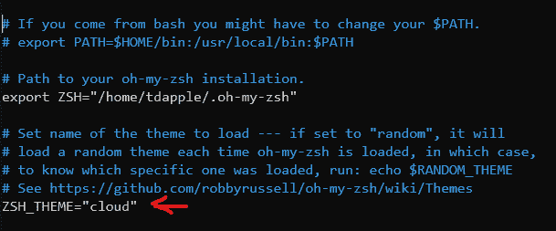](https://res.cloudinary.com/practicaldev/image/fetch/s--zfsQrWC---/c_limit%2Cf_auto%2Cfl_progressive%2Cq_auto%2Cw_880/https://thepracticaldev.s3.amazonaws.com/i/moevkrd5e8q6cv6dduio.png)

现在我们将下面两行添加到。zshrc

*   一个是别名，当我输入“whome”时，它会转到我的 Windows 主目录。你只需要把“timap”部分改成你的用户。
*   第二个是“cd ”,默认情况下，每次终端会话打开时，它都会打开我的 Linux 主目录。

[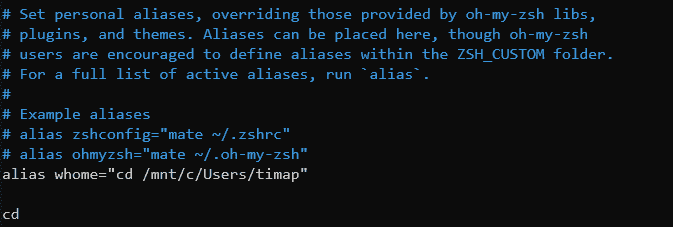](https://res.cloudinary.com/practicaldev/image/fetch/s--FsdMN9oD--/c_limit%2Cf_auto%2Cfl_progressive%2Cq_auto%2Cw_880/https://thepracticaldev.s3.amazonaws.com/i/61fxq04b4u2v6pl9va47.png)

按`ctrl-o`保存您在 nano 中的更改。
按`ctrl+x`退出 nano。

那么对于这一点以及你将来对。zshrc 您可以在终端中使用以下命令重新加载您的配置..
`source ~/.zshrc`

接下来，我们将设置自动建议。这允许 zsh 通过使用您过去的历史来推荐命令等。非常方便。只需在终端中键入以下命令。记住，每次我们打开终端时，它现在应该是默认的 Linux。

`git clone https://github.com/zsh-users/zsh-autosuggestions ~/.oh-my-zsh/custom/plugins/zsh-autosuggestions`

然后我们将插件添加到我们的 zshrc 文件中，`nano ~/.zshrc`,并将插件命名为 zsh-autosuggestions。

[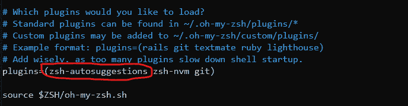](https://res.cloudinary.com/practicaldev/image/fetch/s--OFxR0oDI--/c_limit%2Cf_auto%2Cfl_progressive%2Cq_auto%2Cw_880/https://thepracticaldev.s3.amazonaws.com/i/y4zz49qakvljarim4yi2.png)

按`ctrl-o`保存您在 nano 中的更改。
按`ctrl+x`退出 nano。

这就是终端现在的情况，它现在非常高效，而且都是 Linuxy 的。

## 安装 Node.js

因此，如果你熟悉 Linux，传统上你会`sudo apt install node`获取 node。但这是 LTS 版的 Ubuntu，所以版本很可能有点落后。我们将使用 NVM 来保持现状。

首先，我们将 zsh-nvm 插件 repo 克隆到我们的 zsh 插件文件夹中。请记住，我们是在 Linux 端的终端上这样做的。

`git clone https://github.com/lukechilds/zsh-nvm ~/.oh-my-zsh/custom/plugins/zsh-nvm`

接下来，我们再次进入 zsh 配置来添加插件..
`nano ~/.zshrc`

[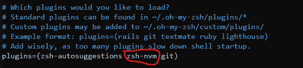](https://res.cloudinary.com/practicaldev/image/fetch/s--Z_viog1H--/c_limit%2Cf_auto%2Cfl_progressive%2Cq_auto%2Cw_880/https://thepracticaldev.s3.amazonaws.com/i/2gu2qwp0dzlivvay91h9.png)

现在记住..
`source ~/.zshrc`
重新加载你的 config。

我们可以在终端中用下面的命令安装 node。
`nvm install --lts`

将来我们可以升级它..
`nvm upgrade`

## 最后，VSCode

我假设您已经安装了 VSCode，并且使用过一点。首先让我们安装插件“远程 WSL”

[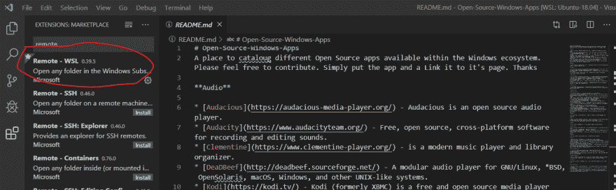](https://res.cloudinary.com/practicaldev/image/fetch/s--Ue2OxXn4--/c_limit%2Cf_auto%2Cfl_progressive%2Cq_auto%2Cw_880/https://thepracticaldev.s3.amazonaws.com/i/w7bs52fspa1frryo1qvc.png)

现在我们可以打开一个远程 WSL 会话。请注意，从网络的角度来看，这并不遥远。事实是，WSL 实际上是一个虚拟机，即使它在您的机器上，您也可以远程访问它。对于这篇文章来说，关于 WSL 本身还有很多东西需要学习。

接下来，我们可以在 VSCode 中按下`ctrl-shift-p`并选择“Remote-WSL: New Window ”,它将在子系统中打开 vscode。如果你在会话中打开终端，你会看到闪亮的新 zsh 提示符和它所有的优点。

[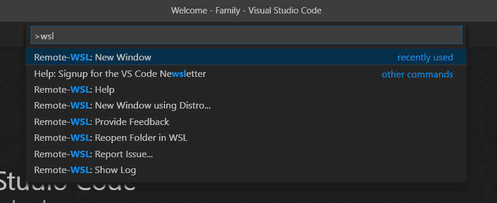](https://res.cloudinary.com/practicaldev/image/fetch/s--PXjlWmam--/c_limit%2Cf_auto%2Cfl_progressive%2Cq_auto%2Cw_880/https://thepracticaldev.s3.amazonaws.com/i/sebd2zhoyq9kllbku87e.png)

如果你在终端的一个项目的工作目录中，你可以输入`code .`，它将在那个位置打开 VScode。

这是我现在设置的图片...

[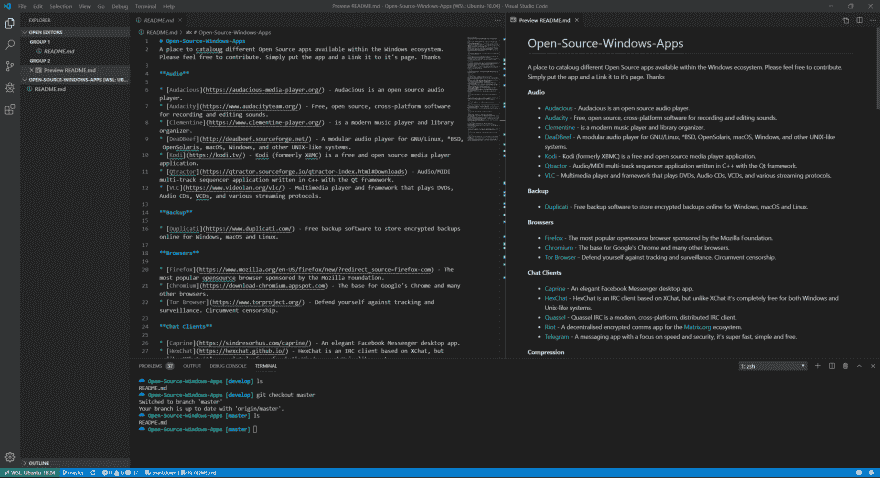](https://res.cloudinary.com/practicaldev/image/fetch/s--8CIM_yfs--/c_limit%2Cf_auto%2Cfl_progressive%2Cq_auto%2Cw_880/https://thepracticaldev.s3.amazonaws.com/i/v5wmpwb3igzpn610d7h2.png)

## 在此之后...

如果你想的话，在这一点上你可以做很多额外的调整，还有很多兔子洞要做。但是这些都是以后文章的主题。我希望这能有所帮助，如果有任何问题，请随时通过 [Twitter](https://twitter.com/OldVetCodes) 联系我。