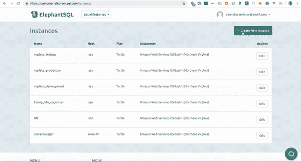

# 用 Postgres 和 Knex 设置节点 API

> 原文：<https://dev.to/easybuoy/setting-up-a-node-api-with-postgres-and-knex-588f>

在本文中，我将使用 Postgres 数据库和 Knex 查询构建器建立一个节点项目。

### **Knex 是什么**

Knex.js 是一个“包含电池”的 SQL 查询构建器，用于 Postgres、MSSQL、MySQL、MariaDB、SQLite3、Oracle 和 Amazon Redshift，设计灵活、可移植、使用有趣。

为了开始，我们必须初始化我们的项目来创建我们的`package.json`文件。

```
npm init -y 
```

Enter fullscreen mode Exit fullscreen mode

### **数据库设置**

我将使用一个名为 Elephantsql 的在线数据库来建立我的数据库。可以在这里注册[。](https://elephantsql.com)

注册后，创建一个数据库。下面是一个例子。

[](https://res.cloudinary.com/practicaldev/image/fetch/s--Rh1dx7fM--/c_limit%2Cf_auto%2Cfl_progressive%2Cq_66%2Cw_880/https://thepracticaldev.s3.amazonaws.com/i/5nula8dj0bpw1h3d7wsm.gif)

### **设置 Knex**

安装项目所需的依赖项

```
npm i knex -g
npm i pg express dotenv --save 
```

Enter fullscreen mode Exit fullscreen mode

在项目的根目录下创建一个`.env`文件，并添加数据库 URL。下面的例子。

```
DB_URL=URL (where URL is the database connection string) 
```

Enter fullscreen mode Exit fullscreen mode

在您的终端上，运行下面的命令来初始化 knex

```
knex init 
```

Enter fullscreen mode Exit fullscreen mode

上面的命令会在项目的根目录下生成一个`knexfile.js`,如下所示。

```
// Update with your config settings.

module.exports = {

  development: {
    client: 'sqlite3',
    connection: {
      filename: './dev.sqlite3'
    }
  },

  staging: {
    client: 'postgresql',
    connection: {
      database: 'my_db',
      user:     'username',
      password: 'password'
    },
    pool: {
      min: 2,
      max: 10
    },
    migrations: {
      tableName: 'knex_migrations'
    }
  },

  production: {
    client: 'postgresql',
    connection: {
      database: 'my_db',
      user:     'username',
      password: 'password'
    },
    pool: {
      min: 2,
      max: 10
    },
    migrations: {
      tableName: 'knex_migrations'
    }
  }

}; 
```

Enter fullscreen mode Exit fullscreen mode

我将把`knexfile.js`配置文件改为使用`Postgres`，并指定保存我的迁移和种子的目录。将`knexfile.js`文件编辑成下面的代码。

```
require('dotenv').config();

module.exports = {
  development: {
    client: 'pg',
    connection: process.env.DB_URL,
    migrations: {
      directory: './data/migrations',
    },
    seeds: { directory: './data/seeds' },
  },

  testing: {
    client: 'pg',
    connection: process.env.DB_URL,
    migrations: {
      directory: './data/migrations',
    },
    seeds: { directory: './data/seeds' },
  },

  production: {
    client: 'pg',
    connection: process.env.DB_URL,
    migrations: {
      directory: './data/migrations',
    },
    seeds: { directory: './data/seeds' },
  },
}; 
```

Enter fullscreen mode Exit fullscreen mode

### **数据库配置**

在`data`目录中创建一个`db.js`文件，它将在数据目录中保存我们的 knex 配置。这将保持我们环境的配置。

将以下代码添加到`db.js`文件中。

```
const knex = require('knex');

const knexfile = require('../knexfile');

const env = process.env.NODE_ENV || 'development';
const configOptions = knexfile[env];

module.exports = knex(configOptions); 
```

Enter fullscreen mode Exit fullscreen mode

### **迁徙**

迁移允许您定义模式更改集，因此升级数据库轻而易举。

要创建/生成迁移文件，请运行以下命令。

```
knex migrate:make todo 
```

Enter fullscreen mode Exit fullscreen mode

> 注意:上面命令中的`todo`是迁移名称。

上述命令将在为迁移指定的路径中创建一个迁移文件。在我们的情况下`/data/migrations`

然后，我们可以编辑迁移文件，将我们需要的列包含在 todo 表中。

```
exports.up = knex =>
  knex.schema.createTable("todo", tbl => {
    tbl.increments();
    tbl.text("task", 128).notNullable();
  });

exports.down = knex => knex.schema.dropTableIfExists("todo"); 
```

Enter fullscreen mode Exit fullscreen mode

要运行迁移，您可以运行下面的命令

```
knex migrate:latest 
```

Enter fullscreen mode Exit fullscreen mode

> `knex migrate:latest`将运行我们所有的迁移文件，并运行`up`函数，然后在我们的数据库中创建表。

要回滚迁移，您可以运行下面的命令

```
knex migrate:rollback 
```

Enter fullscreen mode Exit fullscreen mode

> `knex migrate:rollback`将运行我们所有的迁移文件，并运行`down`函数，然后这些函数将删除我们数据库中的表。

### **种子**

种子文件允许您用独立于迁移文件的测试或种子数据填充数据库。

要生成种子，请在您的终端上运行下面的命令

```
knex seed:make todo 
```

Enter fullscreen mode Exit fullscreen mode

这将在您的种子目录中创建一个`todo.js`文件。为我们的`knexfile.js`中的种子指定，然后可以编辑它以包含我们的测试数据。
下面是一个种子文件的例子。

```
 exports.seed = function(knex) {
  // Deletes ALL existing entries
  return knex('todo').del()
    .then(function () {
      // Inserts seed entries
      return knex('todo').insert([
        {id: 1, task: 'Create API'},
        {id: 2, task: 'Watch Money Heist'},
        {id: 3, task: 'Do Dishex'}
      ]);
    });
}; 
```

Enter fullscreen mode Exit fullscreen mode

要运行种子文件，我们可以在您的终端上运行下面的命令

```
knex seed:run 
```

Enter fullscreen mode Exit fullscreen mode

> run 命令然后获取所有种子文件，然后将它们播种到我们的数据库中。

### **剧本**

您可以将脚本添加到`package.json`文件中。

```
 "scripts":  {  "start":  "node index",  "migrate":  "knex migrate:latest",  "unmigrate":  "knex migrate:rollback",  "seed":  "knex seed:run "  } 
```

Enter fullscreen mode Exit fullscreen mode

> **`start`** :该命令用于启动我们的应用程序。
> **`migrate`** :这个命令将我们的迁移添加到我们的数据库中。
> **`unmigrate`** :该命令用于从数据库中回滚/删除所有现有的迁移。

为了查询数据库，您需要做的就是导入我们创建的`db.js`文件并进行查询。下面是一个例子。

```
const db = require("./data/db.js"); // importing the db config

app.get("/todo", async (req, res) => {
  const todos = await db("todo"); // making a query to get all todos
  res.json({ todos });
}); 
```

Enter fullscreen mode Exit fullscreen mode

# 结论

在本文中，我们已经了解了如何使用 Postgres 数据库和 Knex 查询构建器来设置节点 API。

本文演示中使用的源代码可以在[这里](https://github.com/Easybuoy/node-api-knex)找到。

点击这里了解 knex [的更多信息](http://knexjs.org)

如果您有任何问题或反馈，请留下评论。

感谢阅读。

这篇文章最初发布在我的[博客](https://www.blog.ezekielekunola.com)