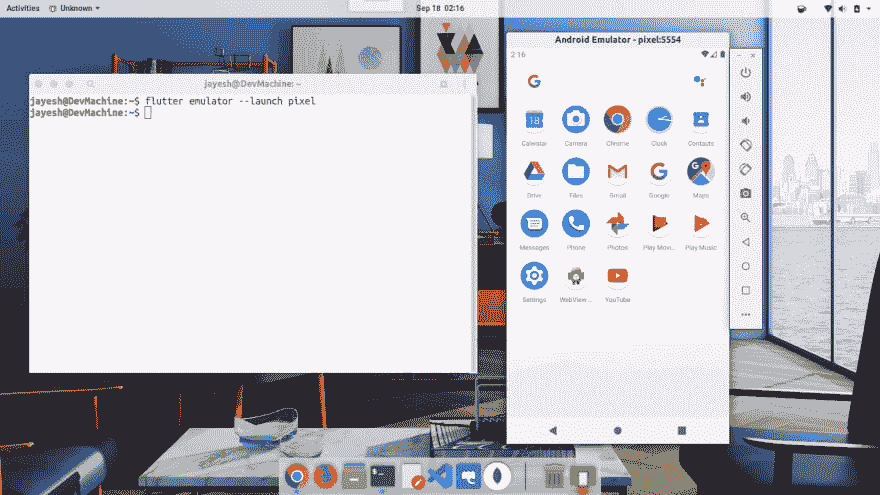

# 不使用 Android studio 设置 flutter

> 原文：<https://dev.to/jay_js/setting-up-flutter-without-android-studio-olo>

有时由于硬件限制或其他原因，开发人员会更喜欢轻量级的解决方案，而不是庞大笨重的 Android Studio。所以这里有一个好消息，在这篇文章中，我们将配置 visual studio 代码，以便在没有 android studio 的情况下使用 flutter。我们使用 ubuntu 19.04 作为操作系统，但是你可以选择你的 linux 发行版。所以让我们开始吧....

# 我们要求的套餐

1.  [安卓命令行工具](https://dl.google.com/android/repository/sdk-tools-linux-4333796.zip)
2.  [颤动双星](https://storage.googleapis.com/flutter_infra/releases/stable/linux/flutter_linux_v1.9.1+hotfix.2-stable.tar.xz)
3.  [Gradle build](https://downloads.gradle-dn.com/distributions/gradle-5.6.2-bin.zip)
4.  OpenJDK 8

# 安装软件包

我们分别按照以下步骤安装它:

1.  导航到下载二进制文件的文件夹。
2.  将其提取并移动到相关位置。
3.  设置路径并刷新。访问实用程序的配置文件。

# 安装软件包

> 在终端
> $ gedit ~/中设置路径打开配置文件类型。轮廓

### 安卓工具

```
$ unzip sdk-tools-linux-4333796.zip
$ mkdir Android
$ mv tools/ Android/
$ sudo mv Android/ /usr/lib 
```

Enter fullscreen mode Exit fullscreen mode

```
#android home
export ANDROID_HOME=/usr/lib/Android
export PATH=$ANDROID_HOME/tools:$PATH
export PATH=$ANDROID_HOME/tools/bin:$PATH
export PATH=$ANDROID_HOME/platform-tools:$PATH

#android sdk root
export ANDROID_SDK_ROOT=/usr/lib/Android
export PATH=$ANDROID_SDK_ROOT:$PATH 
```

Enter fullscreen mode Exit fullscreen mode

### 飘起

```
$ tar xvf flutter_linux_v1.9.1+hotfix.2-stable.tar.xz
$ sudo mv flutter/ /usr/lib 
```

Enter fullscreen mode Exit fullscreen mode

```
#flutter
export FLUTTER_HOME=/usr/lib/flutter
export PATH=$FLUTTER_HOME/bin:$PATH 
```

Enter fullscreen mode Exit fullscreen mode

### [度](#gradle)

```
$ unzip gradle-5.6.2-bin.zip
$ mkdir gradle
$ mv gradle-5.6.2/ gradle/
$ sudo mv gradle/ /opt 
```

Enter fullscreen mode Exit fullscreen mode

```
#gradle
export GRADLE_HOME=/opt/gradle/gradle-5.6.2
export PATH=$GRADLE_HOME/bin:$PATH 
```

Enter fullscreen mode Exit fullscreen mode

### OpenJDK 8

*   打开新立得软件包管理器，如果你没有通过

```
$ sudo apt install synaptic 
```

Enter fullscreen mode Exit fullscreen mode

*   键入 OpenJDK 8 搜索栏。
*   挑选
    1.  openjdk-8-jdk
    2.  openjdk-8-jdk-headless
    3.  openjdk-8-jre
    4.  openjdk-8-jre-headless
*   应用并等待安装。别担心，它会自动为你设置环境变量。

> 我们的软件包安装是使用后续命令刷新完成的。简介
> $。~/.轮廓

# 设置 Android 环境

为了设置 Android 环境，你必须下载以下软件包。我下载的是截至发布之日的最新版本，但是您可以下载许多系统映像来支持使用 sdkmanager 的各种设备。

> 注意:如果你正面临 sdkmanager 的警告:无法创建设置，然后打开终端并键入`$sdkmanager --sdk_root=${ANDROID_HOME} tools`这将升级二进制文件到最新的，一切将按预期工作。

```
$ sdkmanager "system-images;android-29;google_apis;x86_64"
$ sdkmanager "platforms;android-29"
$ sdkmanager "platform-tools"
$ sdkmanager "patcher;v4"
$ sdkmanager "emulator"
$ sdkmanager "build-tools;29.0.2" 
```

Enter fullscreen mode Exit fullscreen mode

接受所有许可证，使用

> sdkmanager -许可证

# 设置颤振配置

更新 flutter 配置并将路径设置为安装它的 android sdk 目录。

```
$ flutter config --android-sdk /usr/lib/Android 
```

Enter fullscreen mode Exit fullscreen mode

你必须在 visual studio 代码中安装 [flutter 扩展](https://marketplace.visualstudio.com/items?itemName=Dart-Code.flutter)才能使用 flutter。

# 创建仿真器

使用名称 pixel 创建仿真器或选择您想要的名称

```
$ avdmanager -s create avd -n pixel -k "system-images;android-29;google_apis;x86_64" 
```

Enter fullscreen mode Exit fullscreen mode

使用现有设备功能创建仿真器

```
$ avdmanager -s create avd -n pixel -k "system-images;android-29;google_apis;x86_64" -d 19 
```

Enter fullscreen mode Exit fullscreen mode

您可以使用
获得灭火装置列表

```
$ avdmanager list 
```

Enter fullscreen mode Exit fullscreen mode

# 关键时刻

```
$ flutter doctor -v 
```

Enter fullscreen mode Exit fullscreen mode

> 这个命令应该给出除 android studio 路径之外的所有绿色和 ok。

# 运行仿真器

```
$ flutter emulator --launch pixel 
```

Enter fullscreen mode Exit fullscreen mode

下面是一个正在运行的图像:
[](https://res.cloudinary.com/practicaldev/image/fetch/s--Yfg9vIg---/c_limit%2Cf_auto%2Cfl_progressive%2Cq_auto%2Cw_880/https://thepracticaldev.s3.amazonaws.com/i/nfjq2lqvu0kssevcqdg2.png)