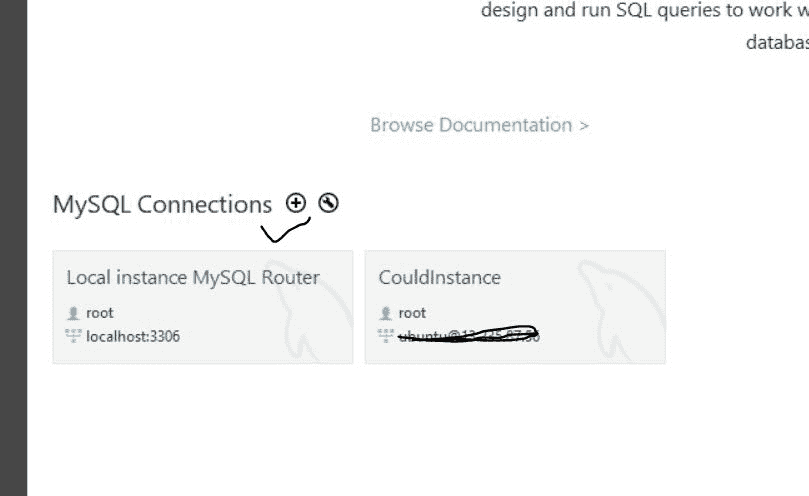
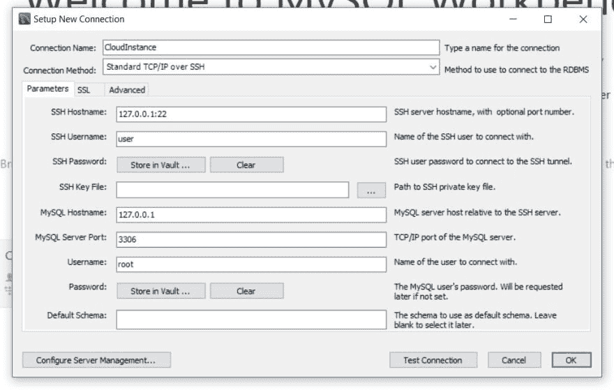
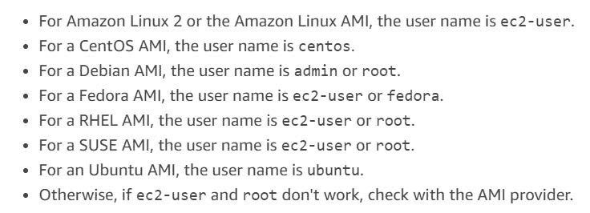
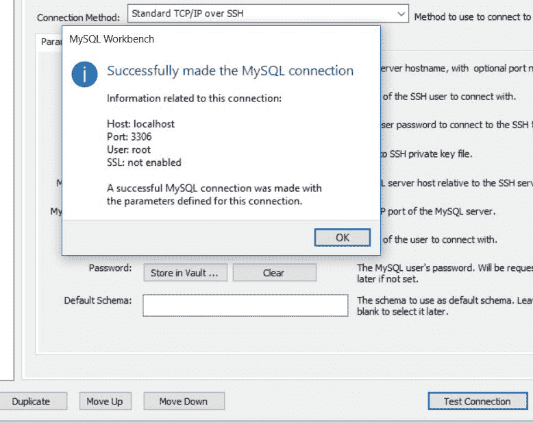

# 在 UBUNTU EC2 上设置 MYSQL，从 MYSQL Workbench 轻松连接

> 原文：<https://dev.to/jonesoncorners/setting-up-mysql-on-ubuntu-ec2-and-hassle-free-connectivity-from-mysql-workbench-15hj>

所以我以这篇文章开始了我的博客之旅，非常感谢对此的反馈。我最近已经从开发本地托管的遗留应用程序转向在基于云的环境中开发。到目前为止，我已经在 GCP 和亚马逊 AWS 上工作过，尽管对 GCP 的接触相当有限。我看到许多人都在努力解决的一个特殊问题是为 MYSQL 设置 EC2 实例，然后从 MYSQL Workbench 连接它们。所以这里有一个教程可以帮助你开始。

[一旦您的 EC2 实例启动并运行](https://docs.aws.amazon.com/lumberyard/latest/userguide/linux-set-up-ubuntu-amazon-ec2.html)，您需要做的第一件事就是升级您刚刚设法启动的实例上提供的默认软件包。首先使用命令切换到根目录

***须藤苏*T3】**

接下来，首先通过点火在实例上安装 MYSQL

***安装 mysql 服务器***

安装完成后，使用以下命令检查 mysql 服务是否正在运行

***systemctl status mysql***

下一部分是进行必要的配置，以允许外部连接到这个 EC2 数据库实例。这可以通过
1)将认证方法从*auth _ socket(默认)*更改为*mysql_native_password*
**设置 *root* 用户从 workbench 连接，将 MySQL _ native _ password 标识为‘very _ strong _ password’的用户‘root’@‘localhost’；**

或者

2)简单地为外部用户创建另一个用户，请注意这里的大小写很重要。

**创建由“newpwd”标识的用户“new USER”@“localhost”；**
**授予*上的所有权限。* TO ' newuser ' @ ' localhost**

现在 EC2 部分已经基本完成了。下载 MYSQL Workbench 并单击(+)添加一个新连接

出现的弹出屏幕如下所示

在屏幕中，您需要进行以下配置

连接方法:-标准 TCP/IP over SSH
SSH 名称:-您的 Amazon EC2 实例的公共 IP
SSH 用户名:-根据您的 EC2  
SSH 密码选择:-无需更改
SSH 密钥文件:- **这很重要，您需要使用。PEM 文件是在创建 EC2 实例时下载的，而不是。PPK 文件，因为当从 putty 连接时，我们使用。PPK，不要搞混了。**
MYSQL 主机名:- 127.0.0.1
MYSQL 用户名:-取决于您采用的方法，它可以是 *root* 或 *newuser* 您创建的
MYSQL 密码:-您创建的密码。希望这是一个强大的。
默认模式:-留空

点击测试连接，您应该已经设置好

在这一步中，如果你得到一个拒绝访问的错误，我很确定你做了以下 3 件事情中的一件，1)你的用户创建和授权没有正确完成。如果您使用 root 用户，您可以查询 mysql.user 表，检查 root 用户是否设置了 *mysql_native_password* 。
2)您没有使用。PEM 文件但是。你的密码不正确。

祝您开始 AWS 之旅愉快:)