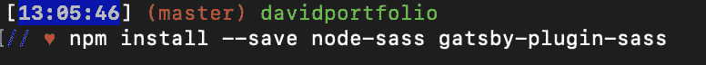
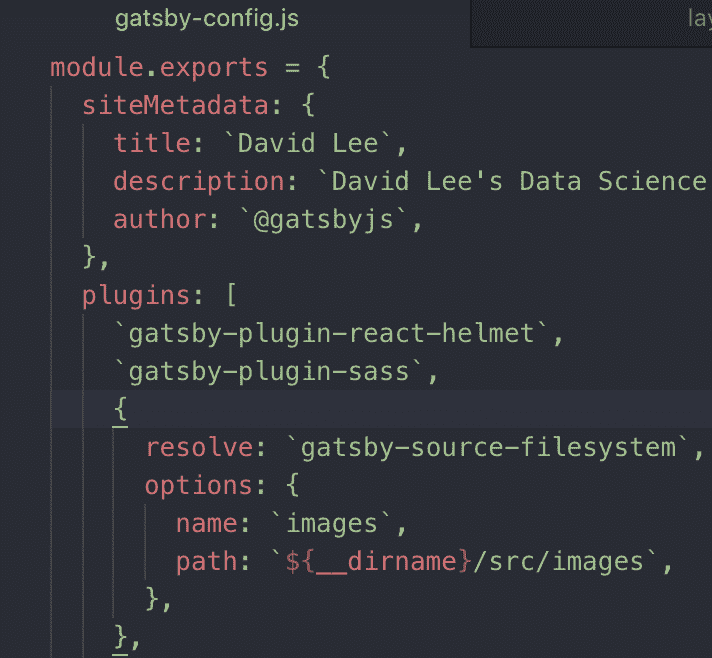
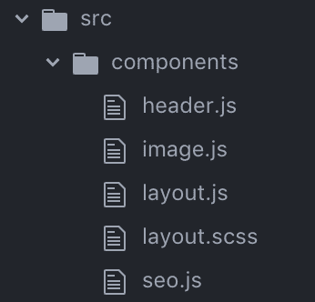
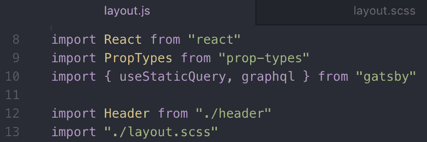

# 在 Gatsby 项目中设置 Sass 个简单步骤

> 原文：<https://dev.to/mollynem/setting-up-sass-in-gatsby-project-4-easy-steps-4p9b>

正在进行一个 Gatsby 项目，并且想通过使用 Sass 来提升您的游戏？你来对地方了，我的朋友。下面是让你马上开始使用 Sass 的指南！没有比现在更好的时机了，对吗？

### 1。安装插件&包

首先，通过您的终端安装 node-sass 包和用于 sass 的 Gatsby 插件。导航到您的 Gatsby 项目并运行以下命令:`npm install --save node-sass gatsby-plugin-sass`。

### 2。更新配置文件中的插件

现在您已经将 Sass 插件导入到您的项目中——确保将它添加到您的`gatsby-config.js`文件中。您将看到 react 包已经存在于插件数组中，只需将`gatsby-plugin-sass`添加到数组中并保存文件。

### 3。重命名`layout.css`

Gatsby 给了你一个名为`layout.css`的默认文件，但是现在我们正在利用`Sass`的优势，我们需要修改文件扩展名。只需重命名文件，在末尾加上`.scss`。

### 4。调整`layout.js`中的导入语句

这一步很简单——容易错过也容易完成！不要忘记在你的`layout.js`文件中调整`layout.scss`的文件名。无论您在第 4 步中决定了要给文件命名什么，都要确保它与`layout.js`中的名称相匹配。

剩下的就是历史了！您已经准备好在您的 Gatsby 项目中开始使用 Sass 了。运行`gatsby develop`,你可以在本地主机上立即看到你的改变。以下资源提供了更多见解:

[萨斯指南](https://sass-lang.com/guide)
[盖茨比外挂](https://www.gatsbyjs.org/plugins/)