# 设置 IDE(集成开发环境)

> 原文：<https://dev.to/th3n00bc0d3r/setting-up-the-ide-integrated-development-environment-3546>

棒极了，我们终于有了一个干净的自由窗口，让我们开始设置基本的开发环境，从而满足我们的需求。首先，我们想要的是 JAVA。现在从 Oracle.com，他们已经添加了一些注册，然后他们给链接。这只是伪造的，所以我找到了另一个地方，你可以直接下载它，虽然如果你想通过麻烦你可以去 oracle.com。我将坚持使用 JDK8，因为我发现它能更好地适应我们以后使用的大多数应用程序。

**Java 开发套件 64 位**8 更新 181 \
[https://file hippo . com/download _ Java _ Development _ Kit _ 64/86378/](https://filehippo.com/download_java_development_kit_64/86378/)

下载并安装它。

[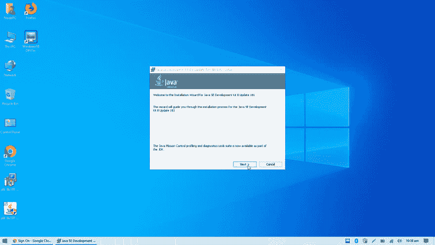](https://res.cloudinary.com/practicaldev/image/fetch/s--_-bUW537--/c_limit%2Cf_auto%2Cfl_progressive%2Cq_auto%2Cw_880/https://i.ibb.co/qMWm08t/Screenshot-71.png)

[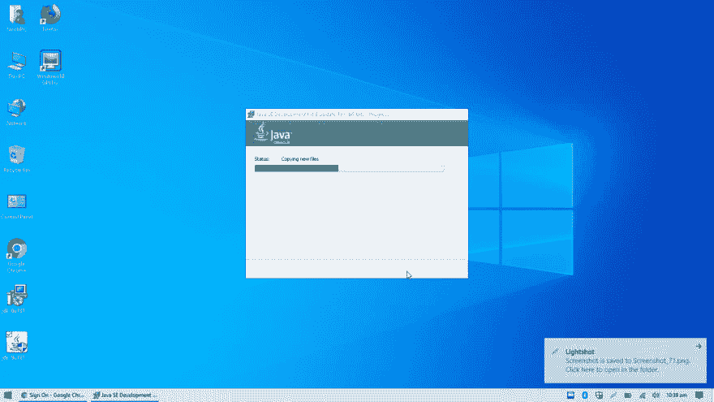](https://res.cloudinary.com/practicaldev/image/fetch/s--GWhkp9Zz--/c_limit%2Cf_auto%2Cfl_progressive%2Cq_auto%2Cw_880/https://i.ibb.co/fHKbkhG/Screenshot-72.png)

[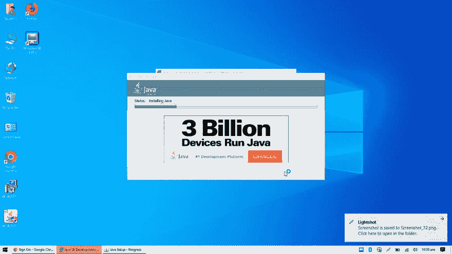](https://res.cloudinary.com/practicaldev/image/fetch/s--FUySwUmi--/c_limit%2Cf_auto%2Cfl_progressive%2Cq_auto%2Cw_880/https://i.ibb.co/CHWxcL0/Screenshot-73.png)

[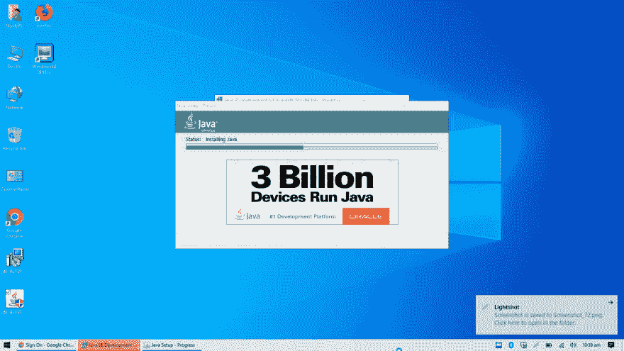](https://res.cloudinary.com/practicaldev/image/fetch/s--PTUUdLbo--/c_limit%2Cf_auto%2Cfl_progressive%2Cq_auto%2Cw_880/https://i.ibb.co/RjXq9yw/Screenshot-74.png)

现在我们要安装一个编辑器，我个人推荐 visual studio 代码。

[https://code.visualstudio.com/](https://code.visualstudio.com/)

下载并安装它。

[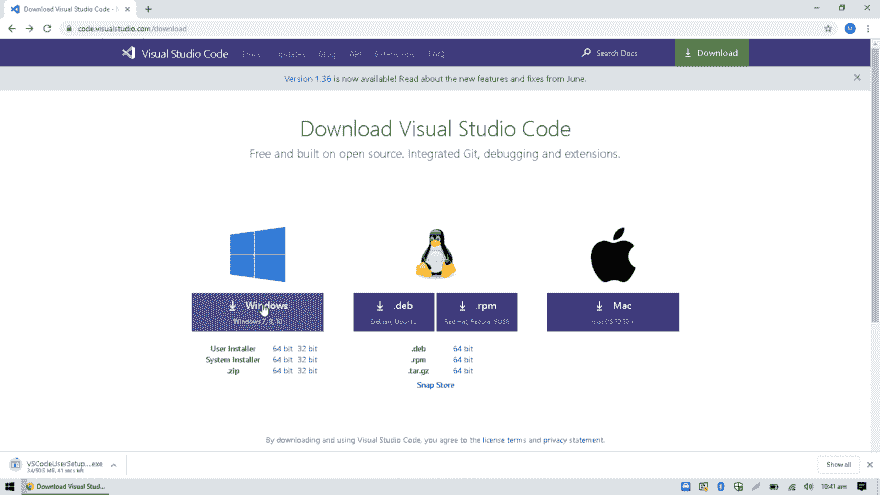](https://res.cloudinary.com/practicaldev/image/fetch/s--_wQAjH3l--/c_limit%2Cf_auto%2Cfl_progressive%2Cq_auto%2Cw_880/https://i.ibb.co/zZjnLRf/Screenshot-75.png)

[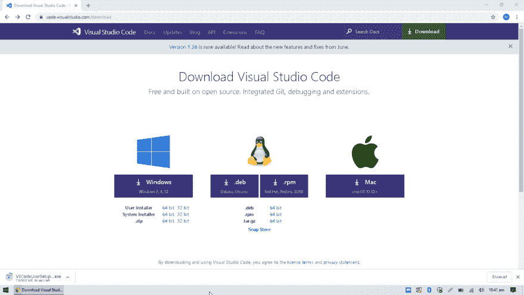](https://res.cloudinary.com/practicaldev/image/fetch/s--h74R_EG_--/c_limit%2Cf_auto%2Cfl_progressive%2Cq_auto%2Cw_880/https://i.ibb.co/cJstZzp/Screenshot-76.png)

[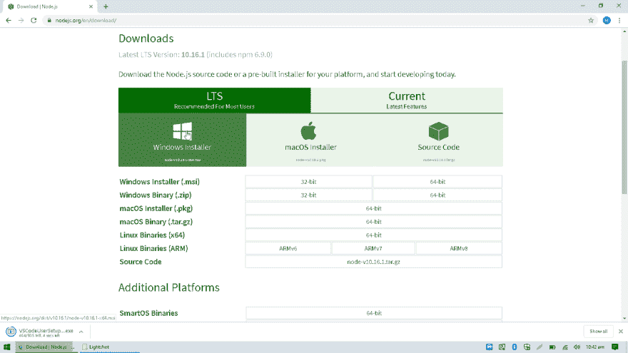](https://res.cloudinary.com/practicaldev/image/fetch/s--SqOG61dH--/c_limit%2Cf_auto%2Cfl_progressive%2Cq_auto%2Cw_880/https://i.ibb.co/y5FRXSH/Screenshot-77.png)

[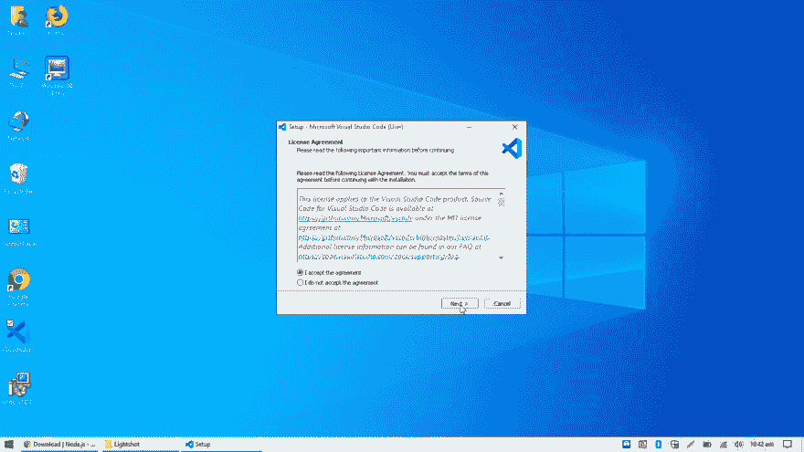](https://res.cloudinary.com/practicaldev/image/fetch/s--pEldFBGo--/c_limit%2Cf_auto%2Cfl_progressive%2Cq_auto%2Cw_880/https://i.ibb.co/n6RvL0T/Screenshot-78.png)

[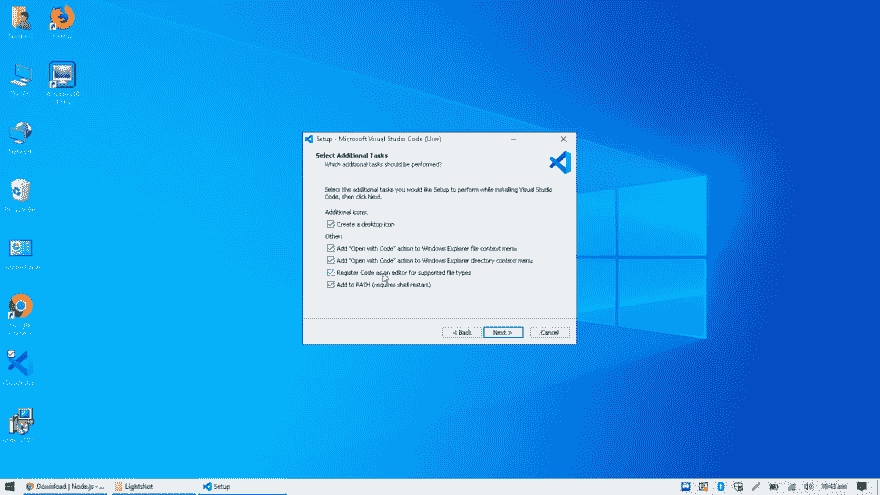](https://res.cloudinary.com/practicaldev/image/fetch/s--WLeTDNYK--/c_limit%2Cf_auto%2Cfl_progressive%2Cq_auto%2Cw_880/https://i.ibb.co/FsmHNt2/Screenshot-79.png)

[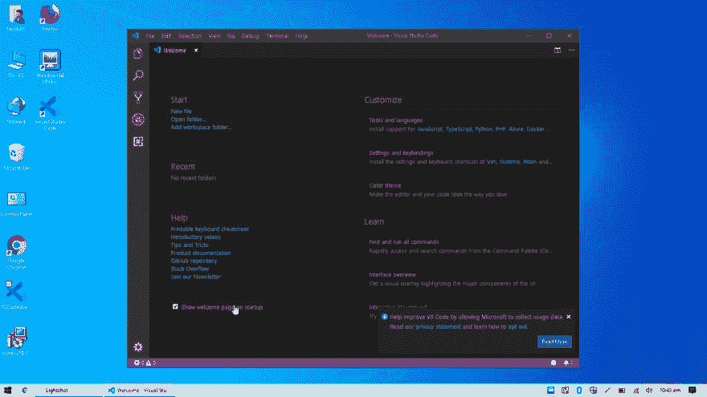](https://res.cloudinary.com/practicaldev/image/fetch/s--aT3qZG0F--/c_limit%2Cf_auto%2Cfl_progressive%2Cq_auto%2Cw_880/https://i.ibb.co/pwH8D5C/Screenshot-80.png)

一旦你安装了它，运行它，让我们定制一点。您看到的第一个屏幕是黑暗模式的欢迎屏幕。很多人都喜欢它，但我一直喜欢白色背景，所以我会改变主题。

点击文件→首选项→颜色主题

快捷键:Ctrl + K

[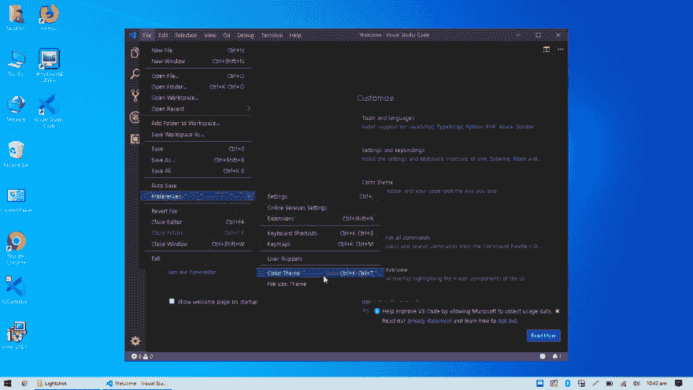](https://res.cloudinary.com/practicaldev/image/fetch/s--HY79EUsZ--/c_limit%2Cf_auto%2Cfl_progressive%2Cq_auto%2Cw_880/https://i.ibb.co/mbNGDzr/Screenshot-81.png)

[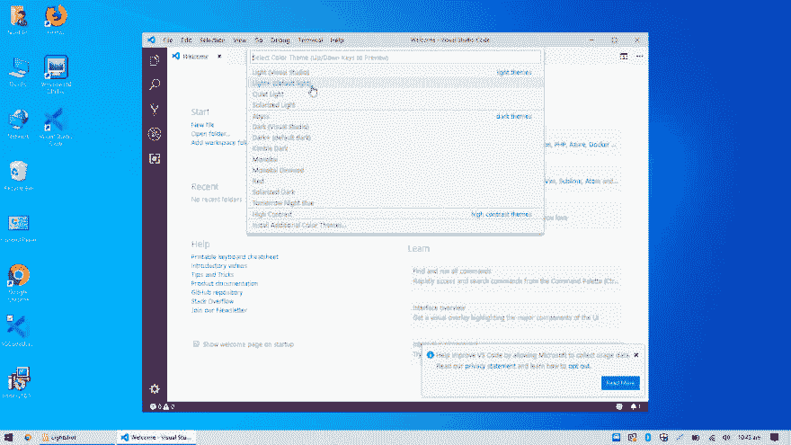](https://res.cloudinary.com/practicaldev/image/fetch/s--WlS8j4yX--/c_limit%2Cf_auto%2Cfl_progressive%2Cq_auto%2Cw_880/https://i.ibb.co/gm9Ct0x/Screenshot-82.png)

现在从下拉列表中，选择光+，记住加号，否则你不会得到花哨的突出。

接下来，我们将安装一些扩展，这是必须的。单击左侧带有方框图标的方框，这是为 vscode 安装所有扩展的地方。

[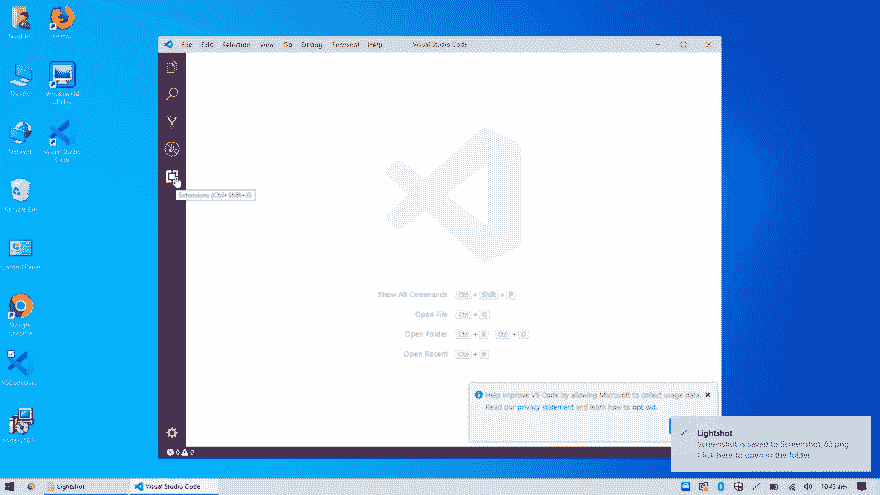](https://res.cloudinary.com/practicaldev/image/fetch/s--zKmOFvxW--/c_limit%2Cf_auto%2Cfl_progressive%2Cq_auto%2Cw_880/https://i.ibb.co/CVjGtYK/Screenshot-83.png)

现在搜索记事本，并点击记事本++按键映射和安装。现在我来自 Notepad++一个当时很棒的编辑器，我真的很习惯它的按键映射，它真的帮助我加快了工作。

《出埃及记》

重复行:Ctrl + D

多行选择模式:Alt + Shift +向下箭头

还有更多…

[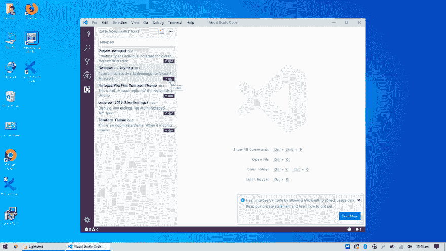](https://res.cloudinary.com/practicaldev/image/fetch/s--bWRoW7Ig--/c_limit%2Cf_auto%2Cfl_progressive%2Cq_auto%2Cw_880/https://i.ibb.co/3RHLcf2/Screenshot-84.png)

[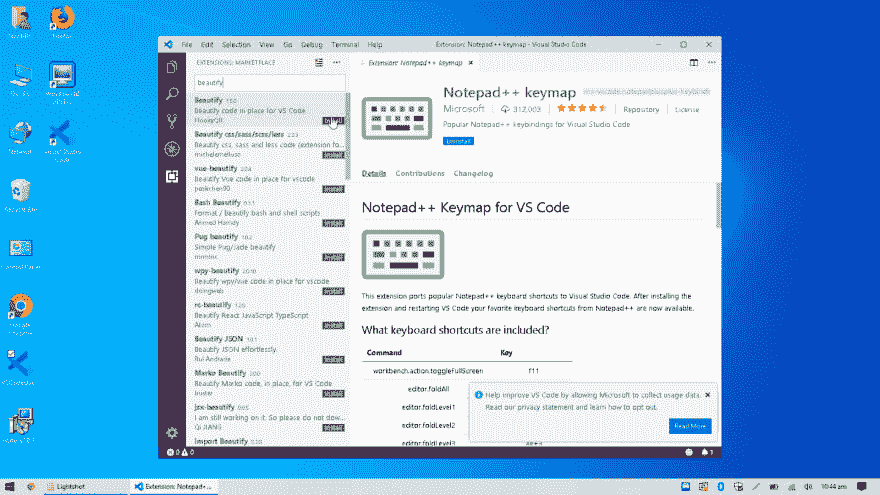](https://res.cloudinary.com/practicaldev/image/fetch/s--fssX4BnH--/c_limit%2Cf_auto%2Cfl_progressive%2Cq_auto%2Cw_880/https://i.ibb.co/p0wp8PB/Screenshot-85.png)

下一步搜索美化和安装它，另一个伟大的工具，使您的代码更干净的阅读和最终调试，如果发生错误。我发现对大多数人来说，如果你保持代码整洁，你可以很容易地找到并修复 bug，但是一个糟糕的图形版本的代码真的很难修复。

现在，我们将安装节点。是的节点。

直接链路

[https://nodejs . org/dist/v 10 . 16 . 1/node-v 10 . 16 . 1-x64 . MSI](https://nodejs.org/dist/v10.16.1/node-v10.16.1-x64.msi)

现在开始安装并检查所有的框，我们需要文档快捷方式和重要的添加到路径，否则它不会在全球可用。

[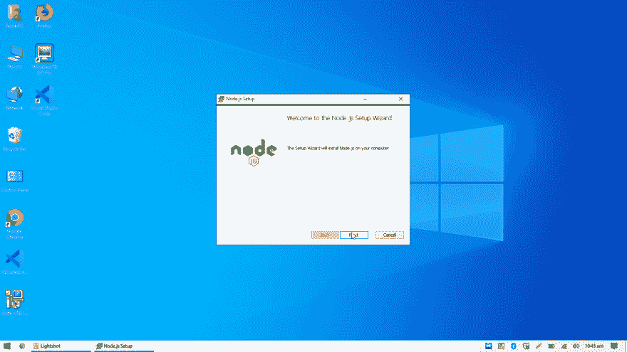](https://res.cloudinary.com/practicaldev/image/fetch/s--WP2g4zhR--/c_limit%2Cf_auto%2Cfl_progressive%2Cq_auto%2Cw_880/https://i.ibb.co/7ySTTMd/Screenshot-86.png)

[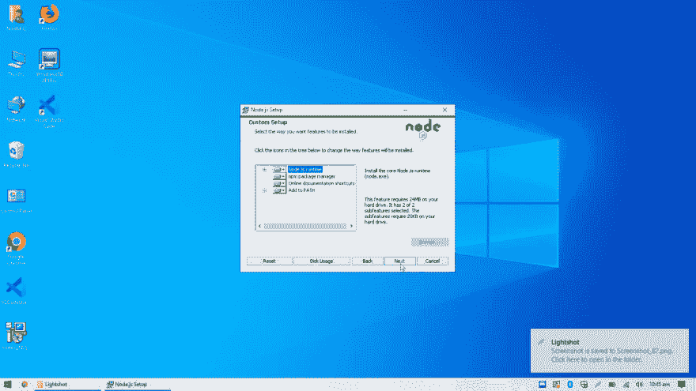](https://res.cloudinary.com/practicaldev/image/fetch/s--QiNk9wL5--/c_limit%2Cf_auto%2Cfl_progressive%2Cq_auto%2Cw_880/https://i.ibb.co/txy7p5G/Screenshot-88.png)

[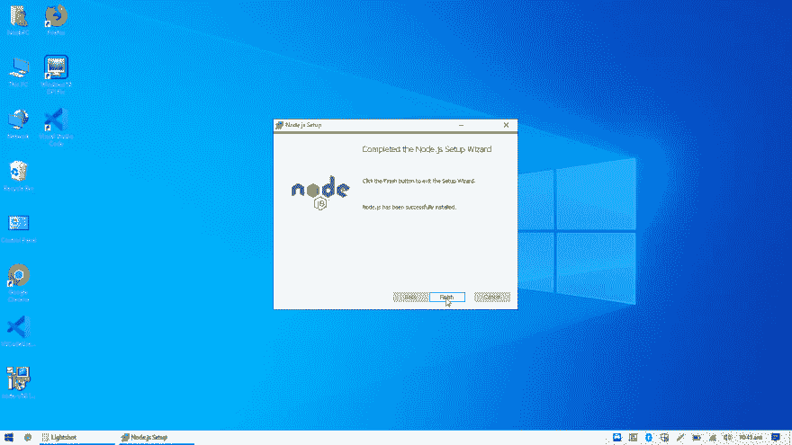](https://res.cloudinary.com/practicaldev/image/fetch/s--n1UWhHil--/c_limit%2Cf_auto%2Cfl_progressive%2Cq_auto%2Cw_880/https://i.ibb.co/Tt440VG/Screenshot-89.png)

接下来我们需要的是 Git for windows。

直接链路

[https://git-scm.com/download/win](https://git-scm.com/download/win)

按照您在屏幕上看到的安装程序和复选框进行操作。

[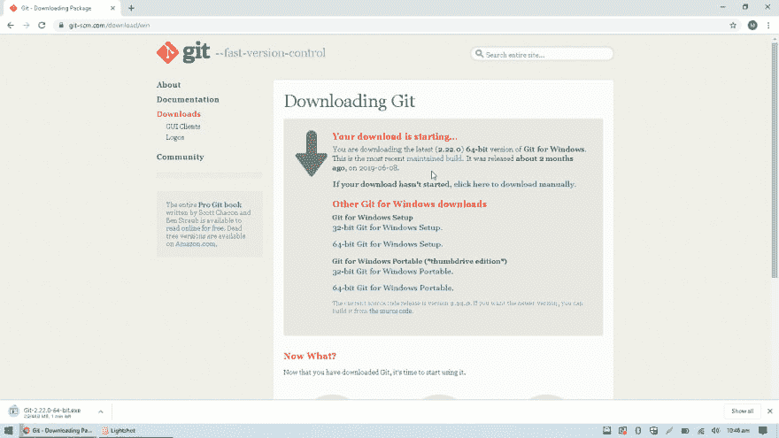](https://res.cloudinary.com/practicaldev/image/fetch/s--UjUmVaai--/c_limit%2Cf_auto%2Cfl_progressive%2Cq_auto%2Cw_880/https://i.ibb.co/7KyrTb8/Screenshot-90.png)

[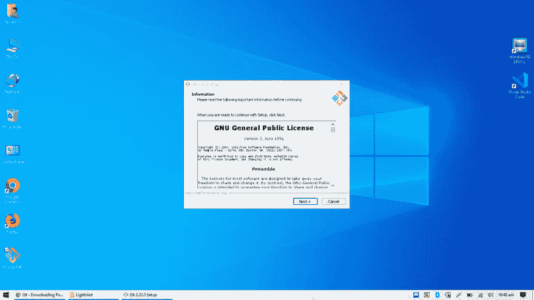](https://res.cloudinary.com/practicaldev/image/fetch/s--v8MYHMGp--/c_limit%2Cf_auto%2Cfl_progressive%2Cq_auto%2Cw_880/https://i.ibb.co/9ng71fF/Screenshot-91.png)

[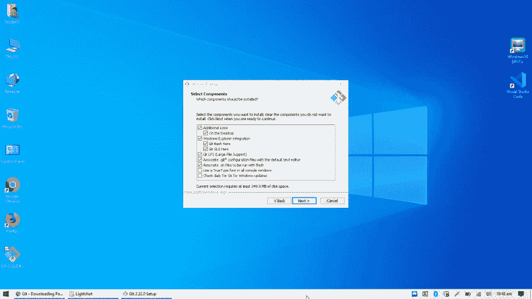](https://res.cloudinary.com/practicaldev/image/fetch/s--z8FnrclP--/c_limit%2Cf_auto%2Cfl_progressive%2Cq_auto%2Cw_880/https://i.ibb.co/XkZg1gV/Screenshot-92.png)

[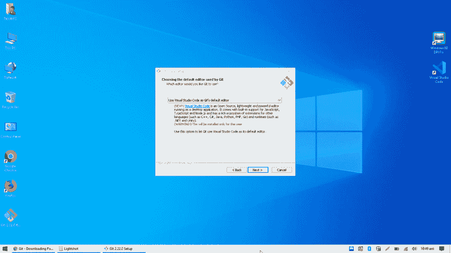](https://res.cloudinary.com/practicaldev/image/fetch/s--j5NKLxem--/c_limit%2Cf_auto%2Cfl_progressive%2Cq_auto%2Cw_880/https://i.ibb.co/SsBC03r/Screenshot-93.png)

接下来我们需要将 visual studio 代码设置为 GITs 默认编辑器，因此选择 drop 并选择 Use Visual Studio Code as GITs default editor。

[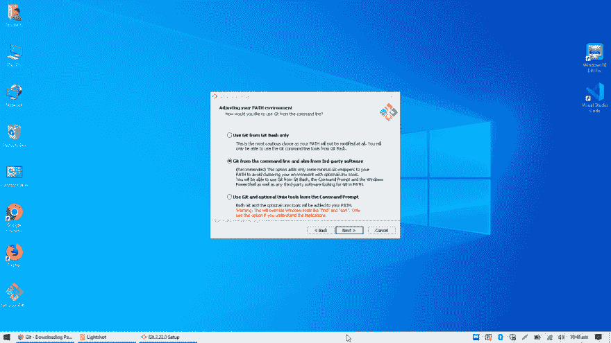](https://res.cloudinary.com/practicaldev/image/fetch/s--ZOwq2fpD--/c_limit%2Cf_auto%2Cfl_progressive%2Cq_auto%2Cw_880/https://i.ibb.co/MgNPTQ0/Screenshot-94.png)

[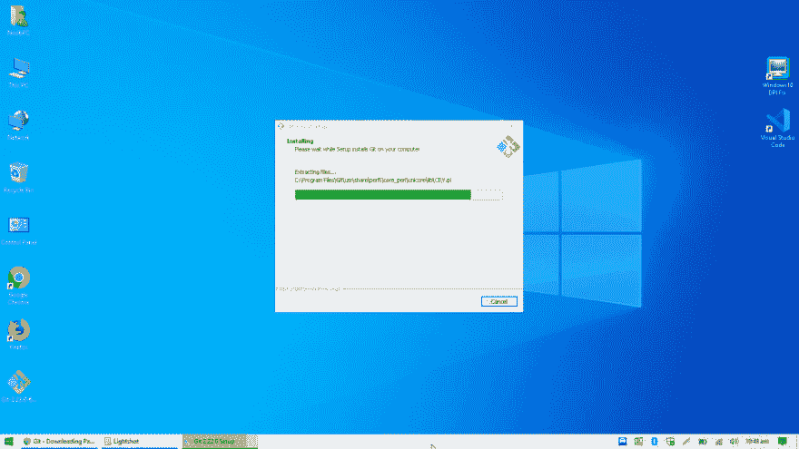](https://res.cloudinary.com/practicaldev/image/fetch/s--6cyLJt5P--/c_limit%2Cf_auto%2Cfl_progressive%2Cq_auto%2Cw_880/https://i.ibb.co/BsbC5qV/Screenshot-95.png)

其他一切都是安装者的经验法则，下一个，下一个，完成。

现在让我们测试是否一切正常。转到开始程序→ Windows 系统→命令提示符

[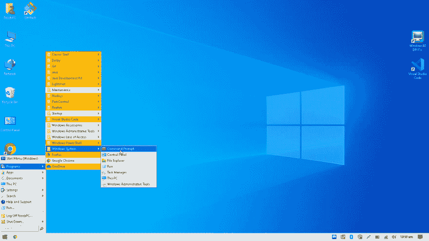](https://res.cloudinary.com/practicaldev/image/fetch/s--ijV6t5f7--/c_limit%2Cf_auto%2Cfl_progressive%2Cq_auto%2Cw_880/https://i.ibb.co/6gzZjy1/Screenshot-96.png)

c:去吧

[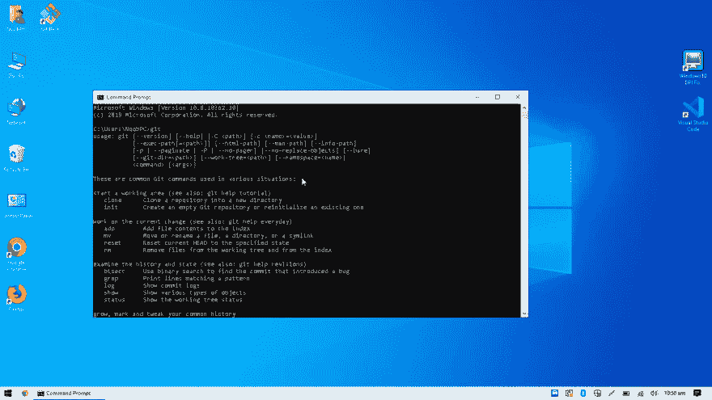](https://res.cloudinary.com/practicaldev/image/fetch/s--zFBrZjLV--/c_limit%2Cf_auto%2Cfl_progressive%2Cq_auto%2Cw_880/https://i.ibb.co/7zmk776/Screenshot-97.png)

它应该向您展示它的文档，您应该浏览一下。

在下面键入下一个；

c:>节点 v

显示节点版本

c:>npm -v

显示了 npm 版本

[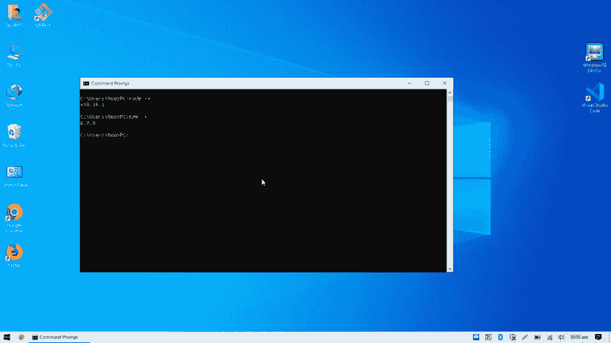](https://res.cloudinary.com/practicaldev/image/fetch/s--PwJcBVYj--/c_limit%2Cf_auto%2Cfl_progressive%2Cq_auto%2Cw_880/https://i.ibb.co/wNWM4VM/Screenshot-98.png)

接下来，我们需要使我们的计算机成为一个临时的 web 服务器，所以我们要安装著名的 Wamp 服务器。现在 wamps 服务器有时是个麻烦，所以为了解决这个问题，我们需要一些来自 windows 的运行时库来运行它。下载并安装以下软件。我在这个 git 链接中包含了所有的库。有些你会有一些只是安装，所以不要担心。

[https://github.com/th3n00bc0d3r/wamp-vcruntime-installers](https://github.com/th3n00bc0d3r/wamp-vcruntime-installers)

[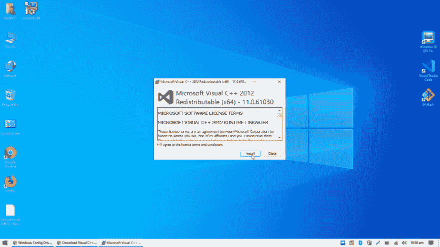](https://res.cloudinary.com/practicaldev/image/fetch/s--GNQM3yg4--/c_limit%2Cf_auto%2Cfl_progressive%2Cq_auto%2Cw_880/https://i.ibb.co/WfHq5QV/Screenshot-103.png)

[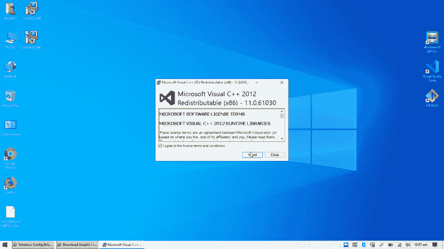](https://res.cloudinary.com/practicaldev/image/fetch/s--Hk7YG6Vv--/c_limit%2Cf_auto%2Cfl_progressive%2Cq_auto%2Cw_880/https://i.ibb.co/Nt8n1f4/Screenshot-104.png)

接下来我们下载 wamp 服务器

[https://SourceForge . net/projects/wamp server/files/wamp server % 203/wamp server % 203 . 0 . 0/wamp server 3 . 1 . 9 _ x64 . exe/download](https://sourceforge.net/projects/wampserver/files/WampServer%203/WampServer%203.0.0/wampserver3.1.9_x64.exe/download)

[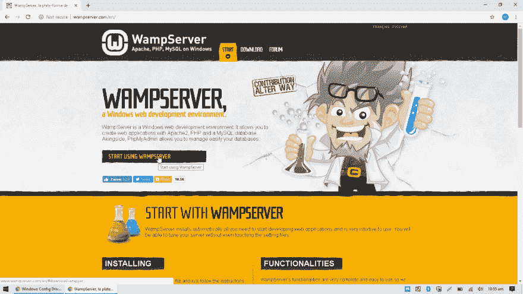](https://res.cloudinary.com/practicaldev/image/fetch/s--4QSqDXJ1--/c_limit%2Cf_auto%2Cfl_progressive%2Cq_auto%2Cw_880/https://i.ibb.co/Y2wz6gq/Screenshot-99.png)

[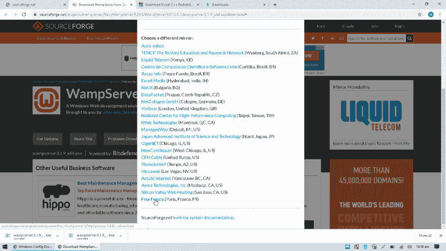](https://res.cloudinary.com/practicaldev/image/fetch/s--kdGpiNnG--/c_limit%2Cf_auto%2Cfl_progressive%2Cq_auto%2Cw_880/https://i.ibb.co/w0G2Jwb/Screenshot-105.png)

好了，现在让我们启动安装程序并继续。

[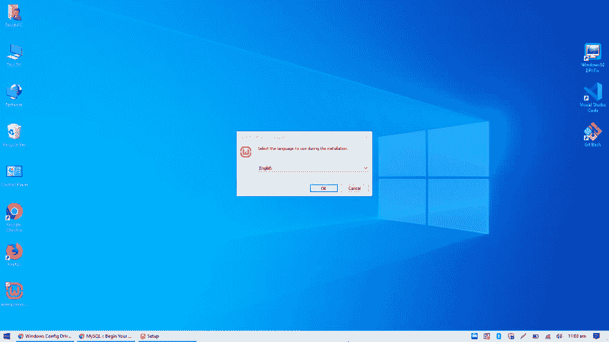](https://res.cloudinary.com/practicaldev/image/fetch/s--lpjz7mAw--/c_limit%2Cf_auto%2Cfl_progressive%2Cq_auto%2Cw_880/https://i.ibb.co/JjSXr3k/Screenshot-114.png)

是的，我们将把它保存在 c:\wamp64 中

[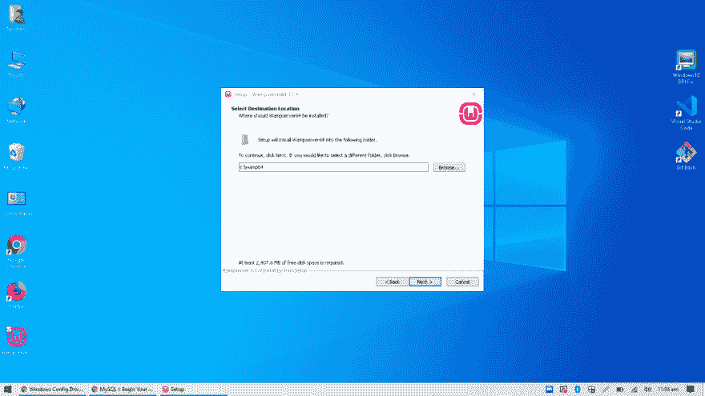](https://res.cloudinary.com/practicaldev/image/fetch/s---5wzPcOd--/c_limit%2Cf_auto%2Cfl_progressive%2Cq_auto%2Cw_880/https://i.ibb.co/wWbzZcS/Screenshot-115.png)

[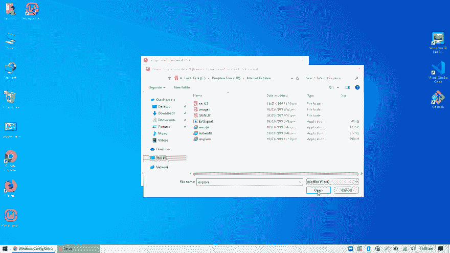](https://res.cloudinary.com/practicaldev/image/fetch/s--aKEOgzEh--/c_limit%2Cf_auto%2Cfl_progressive%2Cq_auto%2Cw_880/https://i.ibb.co/ZJhHwH9/Screenshot-116.png)

它会要求默认浏览器，你可以指定铬，我只是想快点，所以只需点击打开。

好了，现在双击并运行 WAMP 图标，让我们启动服务器。现在，一旦你启动它，你可能会看到一个橙色的图标，不要担心，让我们尝试修复它。左键单击图标，将出现一个菜单，使用该菜单进入 Apache →服务管理→并单击安装服务。如果它弹出一些问题，点击停止服务，然后安装服务，一个命令提示符会弹出，你只需按下回车键继续。

[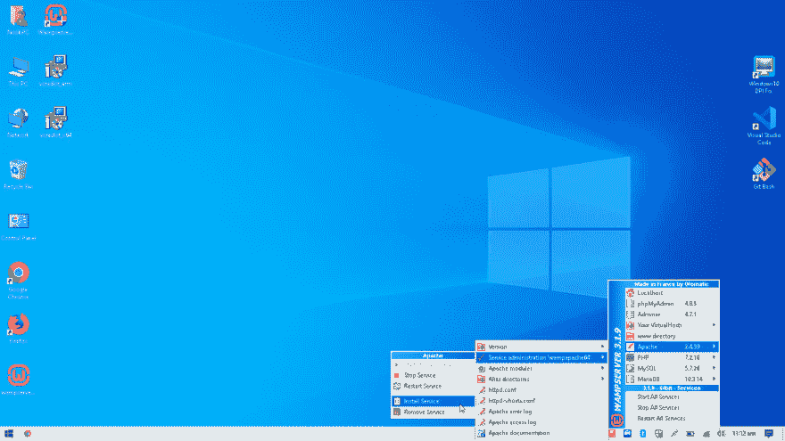](https://res.cloudinary.com/practicaldev/image/fetch/s--XTxr5YlS--/c_limit%2Cf_auto%2Cfl_progressive%2Cq_auto%2Cw_880/https://i.ibb.co/QX4PxGP/Screenshot-120.png)

[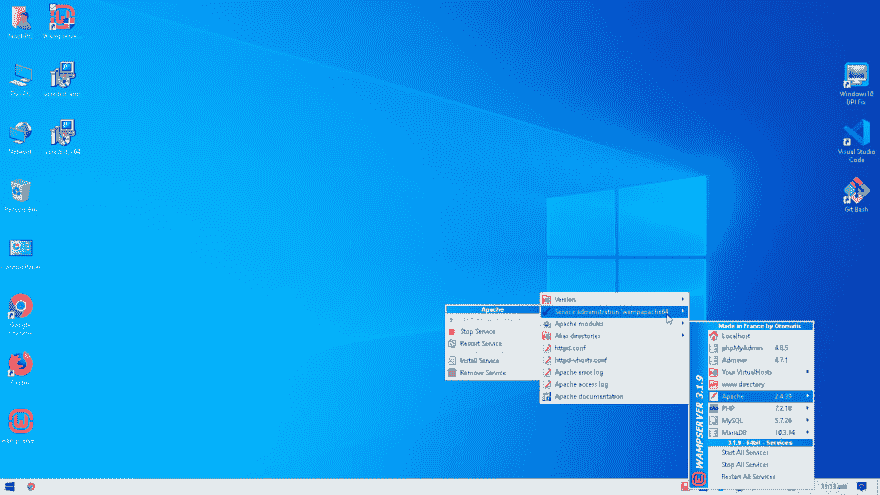](https://res.cloudinary.com/practicaldev/image/fetch/s--oYooEsO7--/c_limit%2Cf_auto%2Cfl_progressive%2Cq_auto%2Cw_880/https://i.ibb.co/s59N223/Screenshot-121.png)

[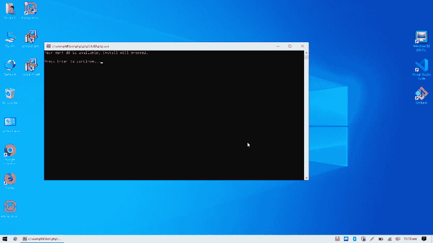](https://res.cloudinary.com/practicaldev/image/fetch/s--co7Ib2FH--/c_limit%2Cf_auto%2Cfl_progressive%2Cq_auto%2Cw_880/https://i.ibb.co/TBdrW4d/Screenshot-122.png)

接下来，我们将再次选择图标，但这一次，右键单击它，并在 wamp 设置中单击允许 MySQL。这将禁用 MySQL，因为我们将使用 MariaDB。

现在，单击并转到 MariaDB，然后单击测试端口 3306。它应该显示一个命令提示符，说明 3306 没有被使用。我们准备好了。

[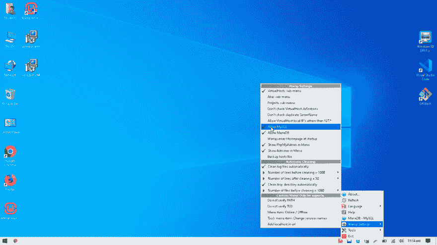](https://res.cloudinary.com/practicaldev/image/fetch/s--LeuZbh8k--/c_limit%2Cf_auto%2Cfl_progressive%2Cq_auto%2Cw_880/https://i.ibb.co/gRRg0m7/Screenshot-124.png)

[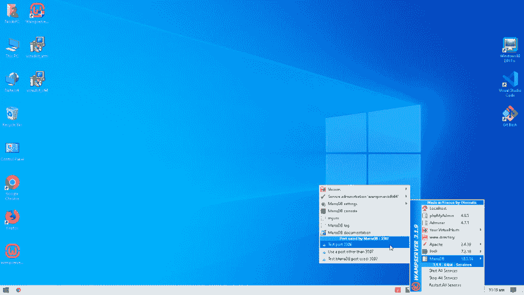](https://res.cloudinary.com/practicaldev/image/fetch/s--3yk6uuoN--/c_limit%2Cf_auto%2Cfl_progressive%2Cq_auto%2Cw_880/https://i.ibb.co/q7DMH30/Screenshot-125.png)

现在再次点击菜单，在 MariaDB 中点击使用 3307 以外的端口，并将其设置为 3306。这些基本上是默认值，所有其他事情都是基于这些值设置的，一旦设置为默认值，一切都像黄油一样工作。

[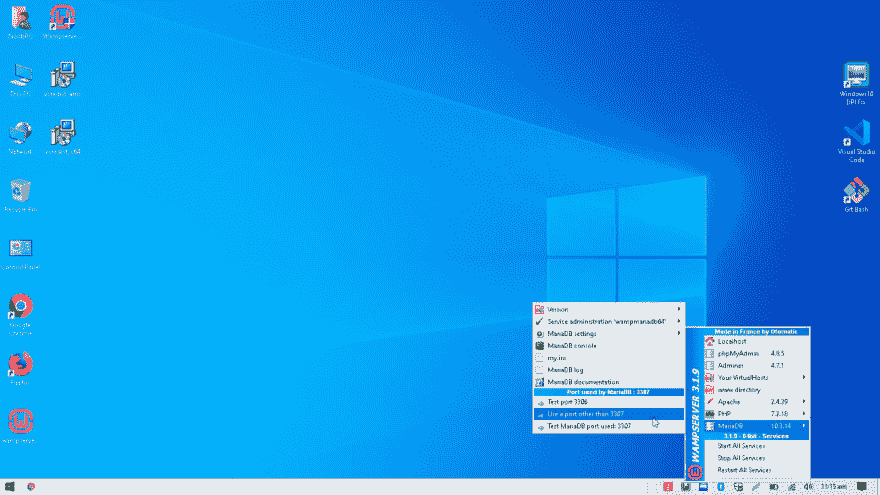](https://res.cloudinary.com/practicaldev/image/fetch/s--ZdU_ks11--/c_limit%2Cf_auto%2Cfl_progressive%2Cq_auto%2Cw_880/https://i.ibb.co/dWVfQCJ/Screenshot-126.png)

[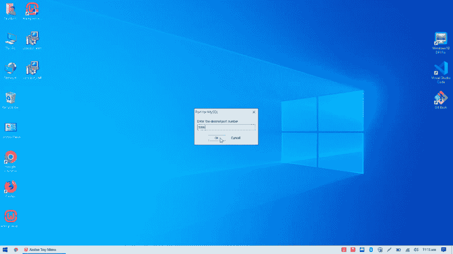](https://res.cloudinary.com/practicaldev/image/fetch/s--M2nQ-zJ8--/c_limit%2Cf_auto%2Cfl_progressive%2Cq_auto%2Cw_880/https://i.ibb.co/9sH1L0J/Screenshot-127.png)

现在，如果你打开浏览器 [http://localhost/](http://localhost/) 你会看到一个页面，服务器正在运行。

[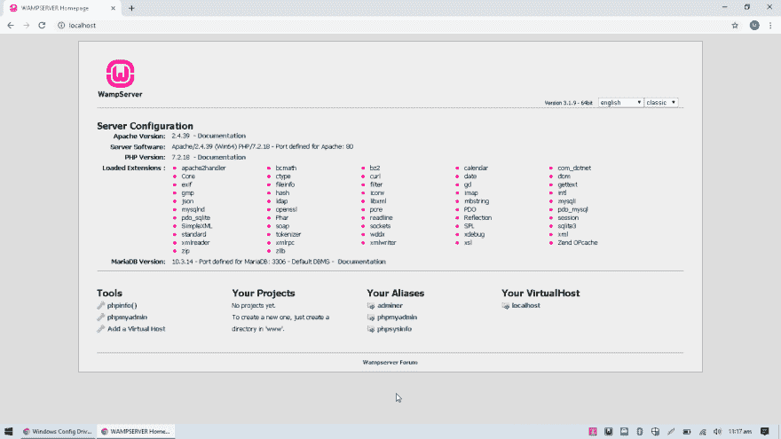](https://res.cloudinary.com/practicaldev/image/fetch/s--0Fmtdcej--/c_limit%2Cf_auto%2Cfl_progressive%2Cq_auto%2Cw_880/https://i.ibb.co/QMPHVDG/Screenshot-129.png)

我们将下载的另一个东西是 MySQL Workbench，

[https://dev.mysql.com/downloads/windows/installer/8.0.html](https://dev.mysql.com/downloads/windows/installer/8.0.html)

转到该链接，然后单击下载。使用安装程序运行并安装。

[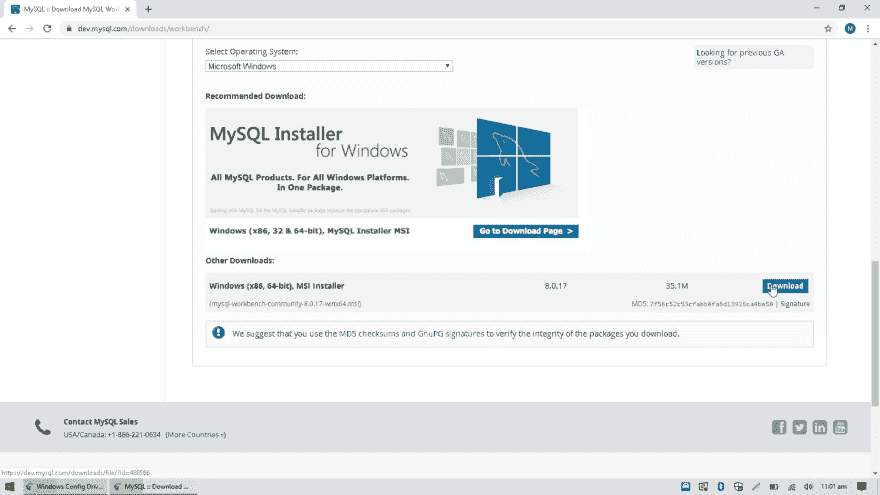](https://res.cloudinary.com/practicaldev/image/fetch/s--tDS99bxU--/c_limit%2Cf_auto%2Cfl_progressive%2Cq_auto%2Cw_880/https://i.ibb.co/5hGZ1J4/Screenshot-106.png)

[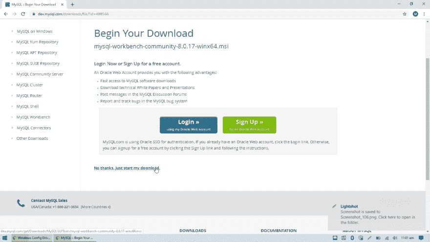](https://res.cloudinary.com/practicaldev/image/fetch/s--U-aOIESH--/c_limit%2Cf_auto%2Cfl_progressive%2Cq_auto%2Cw_880/https://i.ibb.co/RTdW7SR/Screenshot-107.png)

[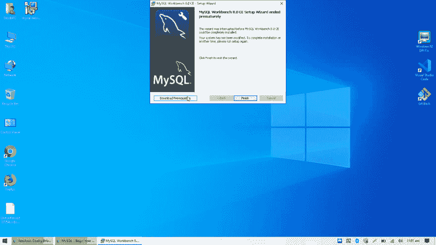](https://res.cloudinary.com/practicaldev/image/fetch/s--Aw6PZF3H--/c_limit%2Cf_auto%2Cfl_progressive%2Cq_auto%2Cw_880/https://i.ibb.co/rvX8vhx/Screenshot-108.png)

## 我们都不在这里。干得好，伙计们。

# Windows 准备编码了！

[Noob 指数](https://dev.to/th3n00bc0d3r/noob-guides-index-4mne)