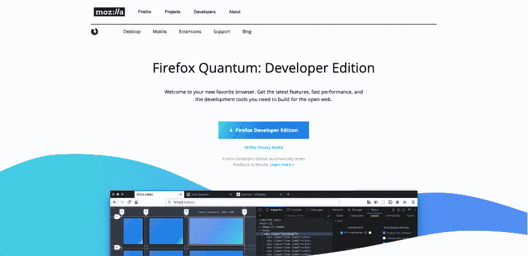
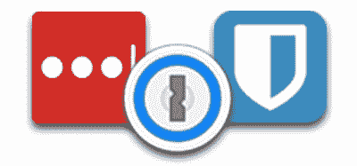

# 在 3 分钟内为 Web 开发设置 Firefox

> 原文：<https://dev.to/ryanmaynard/setup-firefox-for-web-development-in-3-minutes-2iag>

*这篇文章最初发表在我的[个人网站](https://ryanmaynard.co/firefox-setup-web-dev)上。*

### 步骤 1 -下载火狐开发者版

去下载 Mozilla Firefox 开发者版。

### 步骤 2 -添加广告拦截器

前往 Firefox 插件，安装某种广告拦截器。我目前用的是 [uBlock Origin](https://addons.mozilla.org/en-US/firefox/addon/ublock-origin/) ，但也有 [Adblock 加](https://addons.mozilla.org/en-US/firefox/addon/adblock-plus/)、火狐用 [Adblock，或者](https://addons.mozilla.org/en-US/firefox/addon/adblock-for-firefox/) [Ghostery](https://addons.mozilla.org/en-US/firefox/addon/ghostery/) 。

### 第三步-添加密码管理员

设置你的密码管理器插件。如果你没有使用密码管理器，你可能想检查一下 [Lastpass](https://addons.mozilla.org/en-US/firefox/addon/lastpass-password-manager/) 、 [BitWarden](https://addons.mozilla.org/en-US/firefox/addon/bitwarden-password-manager/) 、 [1Password](https://addons.mozilla.org/en-US/firefox/addon/1password-x-password-manager/) ，或者其中一个 [Keepass 插件](https://addons.mozilla.org/en-US/firefox/addon/keefox/)。

*注:使用[此链接](https://lastpass.com/f?6146526)可以免费获得一个月的 Lastpass Premium。*

### 完成了

多亏了 FireFox DevTools，以及这个版本对开发者友好的默认设置，你不需要做太多的事情就可以使用 FF Dev edition。你可能希望花一些时间来探索 DevTools 的[全部功能、`about:config`中的](https://developer.mozilla.org/en-US/docs/Tools)[高级设置](https://old.reddit.com/r/firefox/wiki/aboutconfig)，或者用 CSS 定制 [Firefox UI。](https://old.reddit.com/r/firefox/wiki/userchrome)

#### 优秀奖

其他一些值得一试的 Firefox 插件包括:

*   [分散](https://addons.mozilla.org/en-US/firefox/addon/decentraleyes/)
*   [历史清理器](https://addons.mozilla.org/en-US/firefox/addon/history-cleaner/)
*   [NoScript](https://addons.mozilla.org/en-US/firefox/addon/noscript/)
*   [脸书集装箱](https://addons.mozilla.org/en-US/firefox/addon/facebook-container/)
*   [用户代理切换器和管理器](https://addons.mozilla.org/en-US/firefox/addon/user-agent-string-switcher/)

如果你有任何额外的推荐插件或保护程序，请分享。