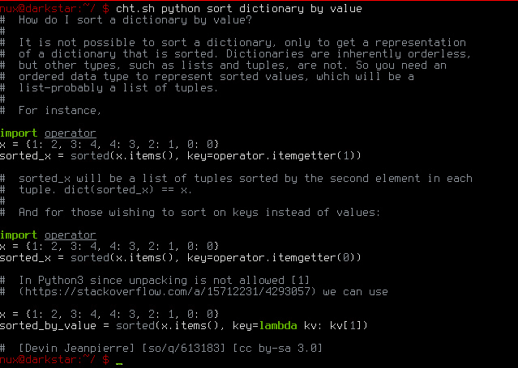
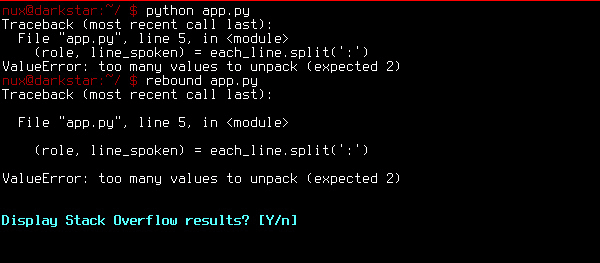
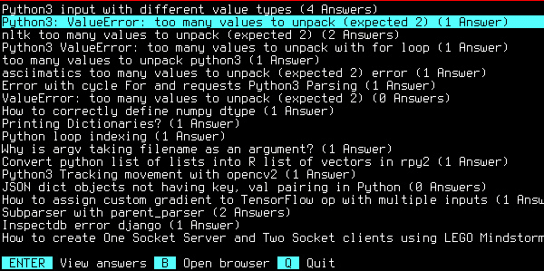
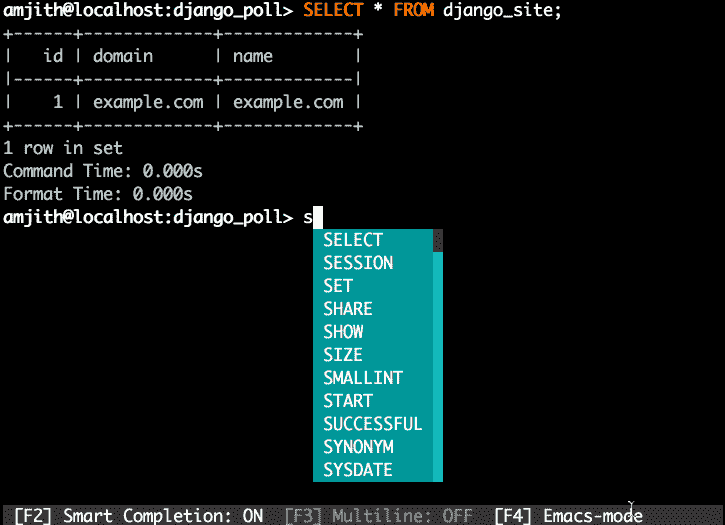
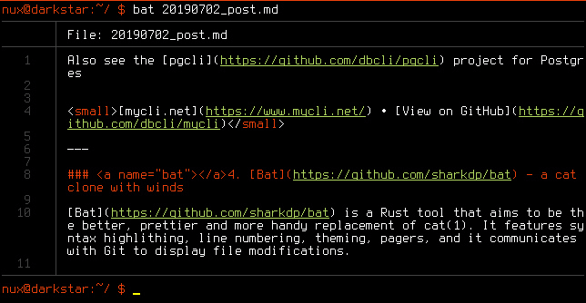
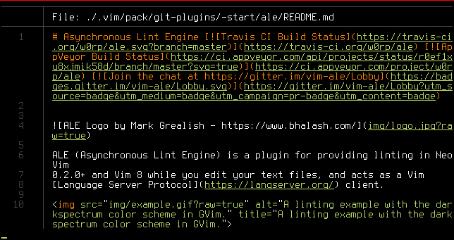
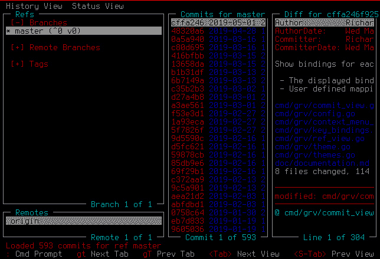
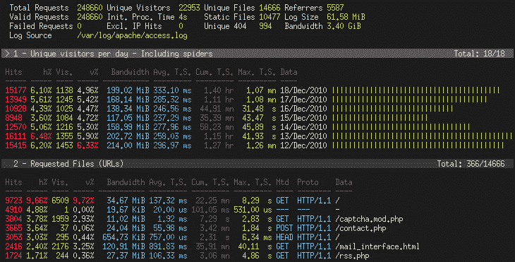
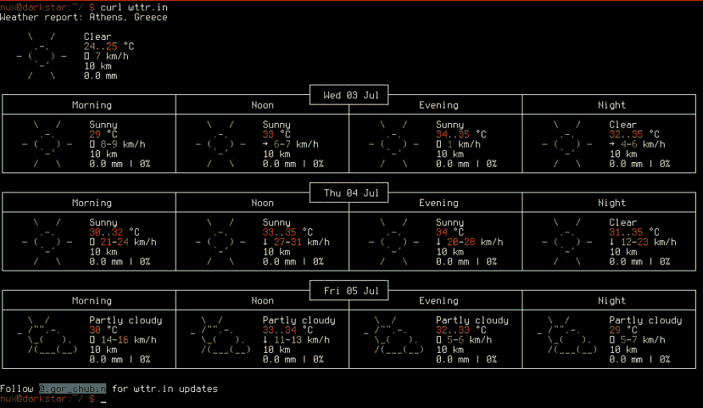

# 七个好得离谱的命令行工具

> 原文：<https://dev.to/listnux/seven-ridiculously-good-command-line-tools-1479>

<small>***原贴于[【listnux.com】](https://www.listnux.com/blog/seven-ridiculously-good-command-line-tools/)***</small>

你在用 Python 编码。你的屏幕上充满了各种尺寸和长度的终端，你有一个截止日期。现在是凌晨 2 点，冬天，房间里很冷，外面有暴风雨。

你有一个大字典，你想用一个数值对它进行排序。如何做到这一点？你把头转向屏幕，找到你最喜欢的浏览器，并询问你的朋友，谷歌或 StackOverflow。你知道浏览器就在那里，它一直在那里等着你。但是屏幕上所有的终端都完全覆盖了它。你诅咒自己使用没有任务栏的窗口管理器的决定，疯狂地开始移动和最小化终端。

嗯，你很幸运。你可能不需要。

## 好得离谱的命令行工具

| 内容 |
| --- |
| [cheat.sh](#cheatsh) |
| [反弹](#rebound) |
| [销售人员](#mycli) |
| [蝙蝠](#bat) |
| [档案- termbin.com](#fiche) |
| [GRV](#grv) |
| [GoAccess](#goaccess) |

### 1。你需要的唯一一张小抄

一个 cheatsheet，让你不仅可以访问实际的 cheat sheet 和各种命令和编程语言的简单概述，而且它甚至可以查询堆栈溢出来寻找答案？并自动选择与您的搜索词相匹配的投票最多的主题。对，就是 [cheat.sh](https://cheat.sh/) 。

要在不离开终端的情况下了解堆栈溢出对我们之前的问题有什么看法，很简单:

```
curl cheat.sh/python/sort+dictionary+by+value|more
# OR
curl cht.sh/python/sort+dictionary+by+value|more 
```

[](https://res.cloudinary.com/practicaldev/image/fetch/s--0SZFbtPf--/c_limit%2Cf_auto%2Cfl_progressive%2Cq_auto%2Cw_880/https://www.listnux.com/static/pictures/20190702-1.jpeg)

或者，您可以安装命令行客户端`cht.sh`，这样您甚至不必键入`curl`，或者在术语:
之间添加`+`

```
cht.sh python sort dictionary by value 
```

[](https://res.cloudinary.com/practicaldev/image/fetch/s--ohSjVvbQ--/c_limit%2Cf_auto%2Cfl_progressive%2Cq_auto%2Cw_880/https://www.listnux.com/static/pictures/20190702-2.jpeg)

注意结尾的链接(`so/q/613183`)？它代表[https://stackoverflow.com/q/613183](https://stackoverflow.com/q/613183)，并且是包含被查询术语的堆栈溢出中投票最多的问题。比方说，尽管投票最多的问题并没有回答你的具体问题(尽管这个特别的答案很好)？只需在查询末尾添加一个`/1`或`/2`或任何数字。例如:

```
curl cht.sh/python/sort+dictionary+by+value/1
#or
cht.sh python sort dictionary by value/1 
```

将返回这个堆栈溢出问题的顶部答案

<small>[cheat . sh](https://cheat.sh/)[查看 GitHub 上的](https://github.com/chubin/cheat.sh)</small>

* * *

### 2。[反弹](https://github.com/shobrook/rebound) -命令行工具，即时获取堆栈溢出结果

于是，在`cht.sh`的帮助下，你想出了你问题的答案，完成了你项目的一部分。所以你运行它，然后，哇...编译错误。您仍然可以为`cht.sh`键入错误，以从 StackOverflow 获取一个已回答的问题，但是，当您可以使用[反弹](https://github.com/shobrook/rebound)时，为什么要浪费时间键入一个长错误呢？

[Rebound](https://github.com/shobrook/rebound) 是一个神奇的 Python 工具，它允许你简单地执行文件，直接拉出错误信息，并找到相关的堆栈溢出问题。它可以与 Python，Ruby，Java，Goland 和 Node.js 一起工作，并且简单如:

```
# instead of typing:
python app.py
# you simply type:
rebound app.py 
```

事情是这样的:

[](https://res.cloudinary.com/practicaldev/image/fetch/s--BFsVbmrv--/c_limit%2Cf_auto%2Cfl_progressive%2Cq_auto%2Cw_880/https://www.listnux.com/static/pictures/20190702-3.jpeg)

一旦按下 enter 键，就会得到相关堆栈溢出线程的列表:

[](https://res.cloudinary.com/practicaldev/image/fetch/s--J4RXEuel--/c_limit%2Cf_auto%2Cfl_progressive%2Cq_auto%2Cw_880/https://www.listnux.com/static/pictures/20190702-4.jpeg)

太棒了。绝对的！

<small>[查看 GitHub 上的](https://github.com/shobrook/rebound)</small>

* * *

### 3。my CLI-MySQL 的终端客户端

乍看之下，mycli.net 可能没有以前的工具那么吸引人，但是当你使用 MySQL 数据库时，它非常方便。

[](https://res.cloudinary.com/practicaldev/image/fetch/s--bkQwcIrE--/c_limit%2Cf_auto%2Cfl_progressive%2Cq_66%2Cw_880/https://www.listnux.com/static/pictures/20190702-5.gif)

它为 SQL 关键字和表格、视图或列、日志、彩色表格数据、多行查询等提供自动完成功能。

但更重要的是，它允许您将复杂(或简单)的查询保存为别名以供将来使用。它允许对保存的查询进行参数替换，因此您可以在任何合适的时候重用它们。

例如，我保存了一个查询，它为以某个字符串开始的表生成一个`DROP`语句:

```
\fs cleardb SELECT CONCAT( 'DROP TABLE ', 
                            GROUP_CONCAT(table_name) , ';' ) AS statement FROM
                            information_schema.tables WHERE table_schema = '$1'
                            AND table_name LIKE '$2__%'; 
```

其中`$1`是我的数据库名，`$2`是我希望我的查询在表上匹配的字符串。简单地调用别名:

```
\f cleardb "my_database" "my_string_" 
```

将返回我需要的 drop 语句。在你真正尝试之前，你真的不会意识到你有多么想念这样一个工具。

另请参见 Postgres 的 [pgcli](https://github.com/dbcli/pgcli) 项目

<small>[mycli.net](https://www.mycli.net/)[在 GitHub 上查看](https://github.com/dbcli/mycli)T5】</small>

* * *

### 4。[蝙蝠](https://github.com/sharkdp/bat)——一只克隆的猫，带着风

Bat 是一款防锈工具，旨在更好、更漂亮、更方便地替代 cat(1)。它的特点是语法 highlithing，行号，主题，页面，它与 Git 通信显示文件修改。

[](https://res.cloudinary.com/practicaldev/image/fetch/s--uSpikdSw--/c_limit%2Cf_auto%2Cfl_progressive%2Cq_auto%2Cw_880/https://www.listnux.com/static/pictures/20190702-6.jpeg)

**球棒**可以完全替代`cat`，可以在管道中使用(`bat .bash_profile |grep PATH`)，也可以与`find` : `find -type f -name README.md -exec bat {} +`配合使用

[](https://res.cloudinary.com/practicaldev/image/fetch/s--FGBGYNYp--/c_limit%2Cf_auto%2Cfl_progressive%2Cq_auto%2Cw_880/https://www.listnux.com/static/pictures/20190702-7.jpeg)

<small>[查看 GitHub 上的](https://github.com/sharkdp/bat)</small>

* * *

### 5。[卡片](https://github.com/solusipse/fiche) - termbin.com

你还在编写 Python 脚本，记得吗？并决定与您的朋友共享一个文件。

现在，你可以登录 GitHub 发布一个要点，或者登录 GitLab 发布一个片段，或者登录 Pastebin。但是，是的，你的浏览器藏在几堆终端下面。那么，你能做什么？

这:

```
cat test_howdoi.py | nc termbin.com 9999 # or 'bat test_howdoi.py...' 
```

在上面的例子中，终端返回一个简单的 URL:[https://termbin.com/wf6u](https://termbin.com/wf6u)。你把这个网址发给你的朋友，看，你刚刚分享了你的文件，没有离开你的终端。(*如果你想知道，我分享了一个来自 [howdoi](https://github.com/gleitz/howdoi) 的文件，这是一个很棒的命令行工具，它不在当前的列表中，因为它与前面列出的两个工具*有一点相似的功能)。

Termbin.com 是一个公共的 pastebin 服务器，与命令行 pastebin 工具 [fiche](https://github.com/solusipse/fiche) 一起工作。它非常快，可以保存一个月，甚至有语法高亮显示(试试上面的链接，用`l.termbin`代替`termbin`:[l.termbin.com/wf6u](https://l.termbin.com/wf6u))。

更重要的是，你可以安装 **fiche** 并自托管你自己的 pastebin 服务器。

<small>[termbin.com](https://termbin.com/)[在 GitHub 上查看](https://github.com/solusipse/fiche)T5】</small>

* * *

### 6。[GRV](https://github.com/rgburke/grv)-git 的终端接口

有时你不知道你的本地 git 回购发生了什么。你记得你最后几次提交是" *Fix #1999* "，"*Prev Fix broken things，revert to #1998* "，" *Fix #2000* "，" *revert Fix #2000* "，" *final fix* "，"*% #&@ this I go sleep*"，但是你需要看到你每次提交时修改了什么文件，不同的是什么

当然 **git** 允许你做所有这些。当然，还有一种更简单的方法，在一个漂亮的、易于浏览的表格上查看您所有的提交、差异和引用。

“是的，**我知道** ”，你说，“它叫 **GitHub** 。我需要找出那个浏览器”。

或者你可以简单地使用 [GRV](https://github.com/rgburke/grv) 。它在你的终端上一个漂亮的桌子上呈现了所有上述信息。它有选项卡、分割、自定义视图、查询，并且每当文件系统发生变化时，您的终端会自动刷新。

[](https://res.cloudinary.com/practicaldev/image/fetch/s--VWK-QguM--/c_limit%2Cf_auto%2Cfl_progressive%2Cq_auto%2Cw_880/https://www.listnux.com/static/pictures/20190702-8.jpeg)

GRV 是一种工具，直到你真正使用它的时候，你才会意识到你有多需要它。它让你的 git repo 的展示变得如此容易掌握和浏览，以至于如果你经常使用 git，它是一个必备的工具(如果你在编码，你应该一直使用 Git *。*

<small>[查看 GitHub 上的](https://github.com/rgburke/grv)</small>

* * *

### 7。 [GoAccess](https://github.com/allinurl/goaccess/) -实时网络日志分析器

其中一件事与众不同。今天列表中的最后一个工具不会对你的编码冒险有所帮助。但是，如果你有一个网站，它会分析你的网络服务器的日志，并允许你直接在你的终端上查看。

[](https://res.cloudinary.com/practicaldev/image/fetch/s--RQRi2B69--/c_limit%2Cf_auto%2Cfl_progressive%2Cq_auto%2Cw_880/https://www.listnux.com/static/pictures/20190702-9.jpeg)

这太棒了，因为大多数服务器上的`access.log`日志很难阅读，更难快速分析。 [GoAccess](https://goaccess.io/) 将允许你在不跟踪访问者的情况下获得网站的访问者统计数据，[损害他们的隐私](https://www.listnux.com/blog/six-biggest-offenders-of-the-right-to-privacy/)并与大型互联网垄断企业分享他们的浏览器习惯。

这是为了满足一个简单的好奇心，即有多少人访问了你的网站，他们浏览了哪些页面。它不是取代谷歌分析、Piwiq/Matomo 或 Statcounter 的工具。它仅仅是为了很好地呈现您的 web 服务器已经保存的日志。

<small>[go access](https://goaccess.io/)[GitHub 上的视图](https://github.com/allinurl/goaccess/)</small>

### 【奖金】-查看天气的正确方法

那么，这场风暴还在外面吗？你听不到任何雨点落在你的窗户上，但不离开那个终端(或那把椅子)，你就无法确定。为什么不干脆叫`curl wttr.in`或者`curl wttr.in/YOUR-LOCATION`？

[](https://res.cloudinary.com/practicaldev/image/fetch/s--G72J-_nj--/c_limit%2Cf_auto%2Cfl_progressive%2Cq_auto%2Cw_880/https://www.listnux.com/static/pictures/20190702-10.jpeg)

没有，一片云彩也没有。不错！

<small>[查看 GitHub](https://github.com/chubin/wttr.in/) 上的</small>