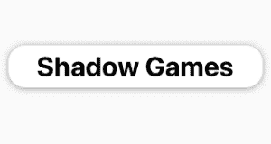
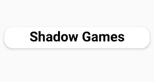
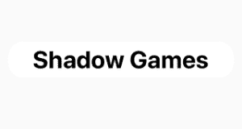

# 原生脚本中的阴影

> 原文：<https://dev.to/mudlabs/shadows-in-nativescript-2di9>

在我们开始之前，值得记住的是，*剥猫皮有很多种方法*。

## 😸（🔪∞∞，🐶）🙀

但是在这篇文章中，我们将着眼于使用单一视图在 NativeScript 中实现一个**阴影**;下图所示的`label`视图。

```
<!--
  main-page.xml

  This is the `xml` layout we'll be referring to throughout.
-->
<Page loaded="onLoaded" xmlns="http://schemas.nativescript.org/tns.xsd">
    <Label id="label" text="Shadow Games"/>
</Page> 
```

Enter fullscreen mode Exit fullscreen mode

* * *

# iOS 阴影

在上面的`xml`中，你会注意到没有设置`backgroundColor`或`borderRadius`。

这是因为在 iOS 上，实现阴影的相同视图不能同时实现`backgroundColor`或`borderRadius`T3(也称为 cornerRadius) 。嗯，可以，但它们需要设置阴影，在`CALayer`下面的视图上。

```
// main-page.js
function onLoaded(args) {
  const page = args.object;
  const label = page.getViewById("label");

  if(page.ios) {
    const layer = label.ios.layer;
    layer.backgroundColor = UIColor.whiteColor.CGColor;
    layer.shadowOffset = CGSizeMake(0, 1);
    layer.shadowOpacity = 1;
    layer.shadowRadius = 5;
    layer.cornerRadius = 20;
    /*
     You can also specify the shadow colour;
     (i.e. layer.shadowColor = UIColor.yellowColor.CGColor)

     But it will default to black if not set.
    */
  }
} 
```

Enter fullscreen mode Exit fullscreen mode

而现在我们在 iOS 中有了影子

|  |
| --- |

* * *

# 安卓阴影

从 NativeScript 5.4 开始，我们有了`androidElevation`。该功能目前仅在 Android 上可用，*因此得名*。

`androidElevation`是材料设计标高的实现。要使用它，你只需设置仰角，给你的视图一个`backgroundColor`和一个`margin`和一个*(如果你喜欢，还有一个`borderRadius`)*。

```
<Label 
  id="label" 
  text="Shadow Games"

  margin="10"
  borderRadius="20"
  androidElevation="12"
  backgroundColor="white"/> 
```

Enter fullscreen mode Exit fullscreen mode

|  |  |
| --- | --- |
| 使用仰角的 Android 阴影 | iOS 影子已经丢失 |

不幸的是，设置`backgroundColor`和`borderRadius`将意味着我们的 iOS 阴影将停止工作。为了解决这个问题，我们可以把有问题的属性扩展到 android。

```
<Label 
  id="label"
  text="Shadow Games"

  margin="10"
  android:borderRadius="20"
  androidElevation="12"
  android:backgroundColor="white"/> 
```

Enter fullscreen mode Exit fullscreen mode

瞧，我们有了跨平台阴影🤘。

|  |  |
| --- | --- |
| 安卓阴影 | iOS 阴影 |

* * *

# 在哪里分解？

总之， ***动画*** 。在 Android 上，你将不会有任何问题动画视图`backgroundColor`，但在 iOS 上，你会失去阴影。

这是因为 NativeScript 动画制作了*视图属性*，但是我们在`CALayer`的底层视图上实现了 iOS `backgroundColor` *(和`borderRadius` )* 。所以为了制作`backgroundColor`的动画，我们必须制作它在下面的动画。

```
// ...
const layer = label.ios.layer;
const newColor = UIColor.yellowColor.CGColor;
const bgAnimation = CABasicAnimation.animationWithKeyPath("background");

bgAnimation.fromValue = layer.backgroundColor;
bgAnimation.toValue = newColor;
bgAnimation.duration = 2 // seconds

// triggers the animation to run.
layer.addAnimationForKey(bgAnimation, "bgAnimation");

// update layer prop to new value after animation, else it pops back to the initial value.
layer.backgroundColor = newColor; 
```

Enter fullscreen mode Exit fullscreen mode

如果你做到了这一步，这里有一个动画效果完整的[游乐场](https://play.nativescript.org/?template=play-js&id=vc8Ahs)。