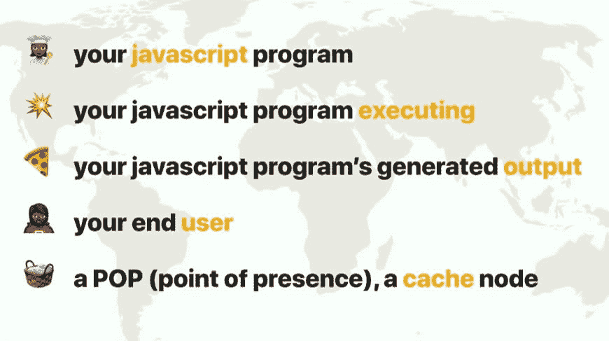
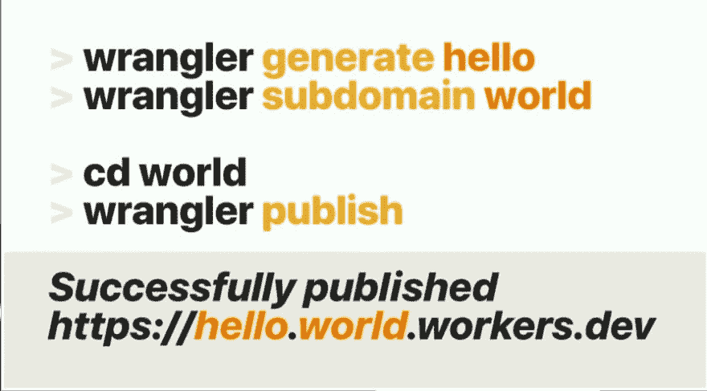

# 分享我在 2019 年 JS Conf EU Berlin 的经验

> 原文：<https://dev.to/angelakost/sharing-my-experience-from-js-conf-eu-berlin-2019-3d4j>

**简介**

上周，我参加了在德国柏林举行的 Js Conf Eu 2019。作为我职业生涯中的第一次会议，这对我来说是一次非同寻常的经历。除了获得新知识之外，这次会议还是交流使用 JavaScript 的实用和直观方法的绝佳场所。

我参加了哪些演示？

在丰富的活动日程和高提名的演讲者中，我参加了吸引我眼球的演讲，在某种程度上是有趣的，无论是以实践还是理论的方式。如今，在成为最强大的编程语言之一的道路上，有很多关于 JavaScript 的用法和威力的讨论。留在我记忆中的演讲有阿什莉·威廉姆斯的《JavaScript 的边缘之旅》和豪斯因·吉勒的《性能共鸣》,杰森·斯特劳汉的《教孩子编码》,亨利·Helvetica 的《网络的形状》,以及关于 Node.js 的用法和实现的演讲。

**我学到了什么？**

无服务器架构正在接管 IT 世界，它为构建更经济实惠、性能效率更高的应用提供了良好的基础。在我们深入编程的海洋之前，了解互联网是如何工作的是非常重要的，并且可能给出一些它在未来将如何工作的想法。移动或桌面设备上的数据可访问性需要以非常高的频率呈现。数据的加载时间不应该超过 3 秒，这就是为什么更深入地讨论和思考改进基本的客户机-服务器体系结构很重要。阿什莉·威廉姆斯在她的演讲中做了一个有趣的类比，将数据引用比作比萨饼，将数据传输比作比萨饼的可访问性。数据中心包含我们将在本帖中详细阐述的边缘架构。

在**客户端渲染**的过程中，实际做的是把厨师转移到客户端，在客户端所在的地方执行 java 脚本。**客户端渲染+缓存**是基本渲染的改进版本，在这种情况下，JS 程序被发送到存储的特定存在点，并从该点重新发送到其执行点。
**服务器端渲染**，提供 web 开发统一化的 Node.js 的出现，使得 js 开发者可以访问服务器。但是让我们回到服务器端渲染的比萨饼例子，所以厨师正在准备比萨饼。JS 代码在一个地方执行，输出立即发送给客户机。因此，正如我们在客户端看到的，我们发送了厨师，而在服务器端渲染中，我们发送了比萨饼，这是主要的区别。
**服务器端渲染+缓存**，在这种类型的渲染中，我们将披萨发送到我们的存在点或缓存站，然后将披萨重新发送到客户端，但这不是直观的方法。如果客户想要在比萨饼上添加一些配料，我们应该尽一切办法给客户想要的输出。让我们言归正传。实际上什么是**边缘侧渲染**？

从上图中我们可以看到，edge-side 架构让厨师有机会在篮子里做饭，或者在实际的数据中心或存在点执行 JS 代码，用缓存呈现。然后将代码的输出发送给最终用户。让我们来看看使用边缘渲染的好处。当我们谈论某个设备呈现的数据的加载时间时，我们的思维循环将随着我们的开始而结束，这种架构有多快，以及如何作为基准。边缘渲染为我们提供了更快的数据渲染速度，但是为了在我们的 IT 环境中实现这种架构，我们应该进行一些重要的更改。首先，客户端代码需要直接在服务器上执行，我们还需要将存储大数据的应用程序，网络浏览器应该运行网页上的所有代码。但是我们如何使用这种架构呢？是的，这里有 [Cloudflare Workers](https://workers.cloudflare.com/) ，他们可以将无服务器 JavaScript 部署到遍布 180 个城市的数据中心，从而为代码提供卓越的性能和可靠性。我还了解了这个新的 npm 模块，叫做[牧马人](https://github.com/cloudflare/wrangler)，它可以按照下面的照片所示进行安装，并可以为我们提供创建 DNS 的简单方法，以及在几秒钟内发布某些新创建的域名代码的便捷方法。

**会议中的文化和环境**

在 Treptow-Berlin 竞技场，旧与现代完美融合的基础设施正在举行。气氛非常友好，非常适合扩展 IT 同事的网络。此外，IT 世界的主要领先公司也参加了此次活动，展示了他们交流经验和分享职业道德的立场。

**结论**

我对参观会议的总体看法是非常有益的，因为你可以遇到来自世界各地的人，他们比你有更多的经验和知识，可以帮助你在你的职业领域中成长。此外，你还可以获得灵感，跳出框框，创造一些令人惊叹的东西，改变整个 IT 世界。