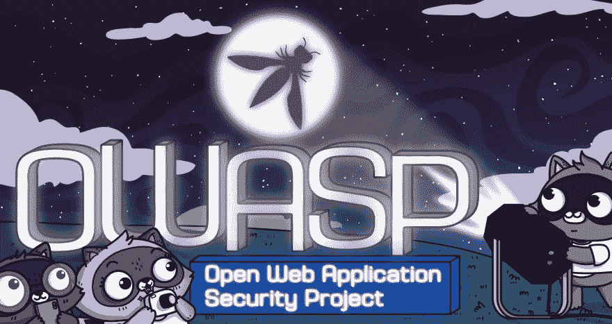

# 与信息安全和 IT 社区及行业分享演讲

> 原文：<https://dev.to/azure/sharing-talks-with-the-infosec-it-community-and-industry-4l66>

我最近决定与我的社区分享我的大部分演讲内容(所有我目前没有应用到会议中的内容)。我所说的“分享”是指**给予我的明确许可，任何人、任何地方都可以展示我写的内容，无需支付任何费用或征求我的同意**。你甚至可以为演讲收费，但如果你这样做了，我恳请你向 [OWASP 发展计划](https://www.paypal.com/donate/?token=js9Cr2GbMorxF0-RBVFUsLm1oYBCNs-sWCeaQfnD8zBHMrMDWbNcogOIMSAd2Hm5cJJllW&country.x=US&locale.x=)或 [WoSEC](https://twitter.com/WoSECtweets) 捐款。

有人问我为什么要这么做，有几个原因。

*   传播如何保护软件的信息；对我来说，让互联网和其他技术安全使用很重要。
*   帮助新发言人(尤其是来自未被充分代表的群体)。如果他们有可以展示的东西，有可以遵循的说明，希望这将有助于他们在展示时更加自信和熟练。
*   与我的社区分享知识:分享就是关怀。
*   越多的人展示我的演讲，就有越多的人决定跟随我。赢了这么多！

我决定发布的第一个演讲叫做《向左推，像个老板》。据我所知，这是一篇介绍应用程序安全性的文章，对于技术和非技术受众来说都非常容易理解。我妈妈看着我做这个演讲，说“我终于明白 IT 安全人员在工作中谈论什么，以及他们为什么打扰我！”你可以在任何 IT 聚会上做这个演讲，他们可能会发现它的价值；与软件开发人员或其他 it 人员共进午餐并在工作中学习也很棒。涵盖的主题包括:威胁建模、测试、代码审查、创建一个安全的系统开发生命周期，以及如何找出最安全的方法来做你想做的事情。通话难度等级:101/intro。还有，这个演讲是基于[向左推，像 Boss 博客系列](https://dev.to/azure/pushing-left-like-a-boss-part-1-4d9i)。

为了确保任何展示我的材料的人都有良好的体验[，我制作了一个 GitHub repo](https://github.com/shehackspurple/TTT-Pushing-Left) ，其中有一个关于说什么的[教学视频](https://www.youtube.com/watch?v=bWjPl-cKzFs)，一个带有书面说明和链接的[自述文件](https://github.com/shehackspurple/TTT-Pushing-Left/blob/master/README.md)，这样你就可以[观看我自己做的演讲](https://www.youtube.com/watch?v=kbTvhWfvp2o&t=1215s)。

请上前教导 AppSec！如果你有反馈，我想听听！更多的会谈正在进行中。

**关于这一点和更多，请查看我的书，[爱丽丝和鲍勃学习应用安全](https://aliceandboblearn.com/)和我的在线培训学院，[我们黑紫色](https://academy.wehackpurple.com)！**