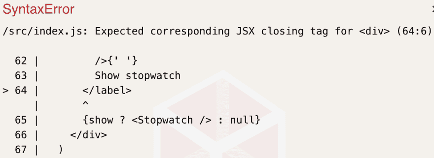

# 磨快你的斧子:寻找知识的工具

> 原文：<https://dev.to/jnielson94/sharpen-your-axe-tools-to-find-knowledge-4j3i>

“发现知识”是什么意思？

在最近的工作中，我一直在思考“学习时间”的概念，以及如何有效地利用这些时间作为一名开发人员取得进步，并能够更好地完成我的工作。在这些沉思中，我意识到很多目标是提高你的技能，这样你就可以处理新的和不同的问题。作为一名开发人员，我们有许多物理技能，比如打字、阅读、说话、分解东西等等。但是，事实上，我们每天做的很多事情都围绕着我们积累的知识，而不是我们在这段时间里获得的身体技能。这种认识帮助我细化了我的“学习时间”的重点，以更清楚地阐明我的目标是找到我可能甚至不知道存在的知识。

## 目无明

在大学里，在我最喜欢的计算机科学课上，我们被指定阅读 Phil Armour 写的东西，这是他的书“软件过程的法则”的附录，题为“无知的五个等级”。你可以在亚马逊上找到他的书[(也许)](https://www.amazon.com/Laws-Software-Process-Production-Management/dp/0849314895)你也可以阅读 [ACM 的文章《无知的五个等级](http://www.corvusintl.com/CACM002-5OI.htm)，我个人使用了我的电脑上仍然保存着的我的教授的 PDF 文件。在这个附录中，他描述了我们每天工作的软件是如何成为知识媒介而不是产品的。在描述这种心态的转变时，他将无知分为五个等级:

1.  零:缺乏无知——你知道这些事情
2.  第一:缺乏知识——你知道你不知道这些事情(你有的问题)
3.  第二:缺乏意识——你甚至不知道自己不知道这些
4.  第三:缺乏流程——我找不到我不知道的东西(我们这里重点讲)
5.  第四:元无知——我不知道这些类别，认为软件是生产出来的产品

## 应用无知的命令

在本帖中，我们将重点解决**三阶无知**。

这篇文章的格式可能会与未来的略有不同，因为下周我将在工作中就这个主题进行一次演讲，我将用它来收集并开始组织我的想法。

正如 Armour 所说，三阶无知是软件行业的一个大问题，因为如果你没有一个“适当有效”的过程来增加你的知识和意识，你将会继续运输软件，永远不会变得更好。为了解决这个问题，你可以采取一系列的方法:

*   注重提高认识
*   专注于增长知识
*   专注于提高速度
*   专注于加强沟通

可能还有其他方法可以加强你的学习过程，但是我选择了这些方法，因为它们在考虑无知的顺序和构建软件系统时是最容易看到的。虽然没有什么固有的东西禁止同时增加所有这些方面，但我发现根据我的经验，一般来说你可以一次解决一个。因为这篇文章的目的是帮助你有一个过程来减少你的一阶和二阶无知，所以认识到这可能不是对每个人都有效是很重要的。如果你有适合自己的不同方法，请发微博给我(jnielson01)告诉我！

## 着眼于提高认识

提高认识的工具:

1.  时事通讯
2.  社会化媒体
3.  RSS 源
4.  社区活动(聚会、用户组等)
5.  与同事交谈

为了提高知名度，大多数人转向社交媒体。在我看来，如果不仔细策划，这可能会耗费你大量的时间，但也可能是很好的信息来源。我个人发现了一个精心策划的 Twitter 列表，它给了我足够多的信息，满足了我去了解我没听说过的新事物和旧事物的愿望。我也听说过有人使用 rss 订阅源，我自己也开始使用了(顺便说一下，我确保我的博客有一个 RSS 订阅源)，还有一些人在黑客新闻和 reddit 上寻找热门的新事物或他们不知道的任何东西。人们使用的另一个途径是订阅策划简讯，这非常有用，策划简讯的人相对于他们有多棒而言经常被忽视！

在努力提高意识的同时，重要的是要意识到你不需要知道所有的事情，只要意识到一个话题，如果你找到了学习它的理由，你就更有能力在未来解决它。例如，在我的工作中，我并不经常使用 JavaScript 之外的语言，但我会努力“倾听”其他语言，如 Java，以便在需要使用该语言时有更好的准备。为了解决这个问题，我在我的 rss 提要中加入了一些通用技术时事通讯，以便了解其他领域即将到来的事情和趋势。

对于那些与足够多的开发人员互动的人来说，另一种提高意识的方法是简单地倾听。如果你听到了一些你以前从未听说过的事情，如果你当时不能询问，就把它写下来。一般来说，人们更愿意向他们周围的人解释事情——尤其是如果这是他们感兴趣的话题。但是，通过更多地专注于听你参与的或你周围的对话，它有助于扩大你知道你不知道的事情的圈子(通过增加一级无知来减少二级无知)。

提高认识的工具:

1.  时事通讯
2.  社会化媒体
3.  RSS 源
4.  社区活动(聚会、用户组等)
5.  与同事交谈

## 着眼于增加知识

增长知识的工具:

1.  有问题吗
2.  证明文件
3.  源代码
4.  社区资源，尤其是那些由维护者监控的资源(StackOverflow、Github 问题等)
5.  播客
6.  书
7.  视频/博客帖子教程/解释/等

好吧，你听说过一些你不太了解的事情。你是如何进一步了解它的？同样，你可以采取很多方法，但是要意识到真正重要的是你为什么要努力学习更多。如果你想更多地了解你每天工作的东西，你的方法应该不同于你正在研究的东西，以了解它所解决的问题，甚至不同于你正在遵循的教程，以更好地掌握它如何与你已经知道的东西相比较。以下是我发现的一些对增加知识最有用的策略，但你的收获可能会有所不同。对我有用的东西可能对你没用，但它们可能值得一试。

首先，让我们把这个联系到我们关注的三阶无知。如果你没有一个将你积累的一阶无知转化为零阶无知的过程，那么意识到这个话题或想法的意义何在？我经常发现，如果你增加了对更多你可以了解的话题和想法的意识，但从未真正学习过，并减少了你知道自己不知道的东西，这会导致一种我称之为“意识绝望”的状况。这是你意识到太多你不知道的事情的时候，你开始怀疑你是否真的知道任何事情，或者你是否在做正确的事情，或者你是否是一个“冒名顶替者”，越来越多的想法开始变得越来越消极。为了克服这一点，我发现写下你意识到的事情非常有用。当你把它们写下来的时候，把它们分成你现在不需要知道的和你需要知道的。我发现使用如下测试图很有帮助:

那么你现在需要知道什么呢？理想情况下，这是一个很短的列表，但是如果你开始一个新的角色或工作，它可能会比平时长。这个列表上的东西是应该学习的第一选择。但是你如何了解他们呢？

看情况。

### 攻坚库和语言功能

为了工作，我经常需要学习一种语言特性或库(一般来说也是由他人编写的代码)。一些对我有帮助的策略:

1.  看文件！
2.  阅读代码(或说明书)！
3.  深入社区。

一般来说，库变得流行起来，在某种程度上你可以在工作中使用它们，因为它们有很好的文档。如果你处在危险的边缘，你可能会发现缺少医生，但是如果你处在危险的边缘，你应该会感到一些痛苦。如果文档不是那么好，如果你能在你正在做的项目或他们的示例项目中找到一些，你可能会发现阅读利用库或特性的代码会有一些好处。

如果你正在学习一个库，深入研究他们的源代码(如果有的话)是一个很好的方法来学习更多关于这个库做什么，甚至可能帮助你意识到一些你不知道你不知道的事情。如果你正在学习一种新的语言特性，它的规范通常是非常详细的，只是有时完全令人困惑。对于 JavaScript，[EcmaScript 规范](https://www.ecma-international.org/ecma-262/10.0/index.html#Title)比我开始使用这种语言时预期的更容易理解。

一般来说，图书馆或语言会有一个社区，你可以通过他们的维基、博客文章、stackoverflow 问题(希望有答案)和教程来了解更多。从事库和语言工作的核心团队经常没有你日常工作所需的大量材料(尽管 reactjs 文档涵盖了我在工作中使用的很多内容)。在这种情况下，进入社区将是一个巨大的帮助，可以帮助您了解更多关于可用的不同库和工具的信息。请注意，有时社区资源(甚至官方资源)可能会过时，特别是在 stackOverflow 和 reddit 这样的论坛上，请注意潜在的过时信息。还要注意，有时候事情真的几年不变！仅仅因为一篇文章看起来过时了，并不意味着它不会像描述的那样工作。

我尝试过的一些方法效果不是很好:

1.  教程。
2.  只是建造它。
3.  请别人告诉我这件事。

对于我现在需要知道的或者日常工作中需要用到的东西，教程通常对于解释这个概念的“为什么这样做”部分来说太肤浅了。有一些很好的资源，如 [egghead.io](https://egghead.io) ，但即使这样，我通常也更多地将它们用于探索性学习(如后所述)。类似地，如果我试图跳过知识收集阶段来完成手头的任务(也就是我现在就需要知道)，如果我试图用我已经拥有的知识来构建它，结果会是一团糟。一般来说，花一些时间学习必要的概念，可以大大减少花在处理模糊错误或难以理解的错误上的时间。有时，请已经知道概念/代码/想法的人来解释它是可行的，但通常他们有其他事情要做，或者他们的知识有差距，迫使你无论如何都要求助于文档/代码/社区。

### 攻关其他类型的知识

在工作中，我偶尔会遇到我需要学习的其他类型的东西，比如组织流程或如何更好地与他人合作。对于这样的事情，交流通常是了解它们的第一(有时也是唯一)途径，因为它们通常不会被写在任何地方。对于提高软技能来说，[软技能工程播客](https://softskills.audio/)绝对棒极了。我已经听了好几年了，它们涵盖了你在官方文件中找不到的各种主题！

### 我现在不需要知道的事情

如果你的 T 形图中“现在就需要知道”的那一面没有任何内容(我希望你也是这种情况)，那该怎么办？好吧，那你就选一样吧！不断学习和提高是很重要的，否则你很可能会遇到你现在需要知道的事情太多而无法解决的情况(你可能需要用更具体的时间单位重做你的 T 图，比如“我这个小时需要知道的事情”之类的)。当学习我现在不需要知道的东西时，我倾向于采取与我现在需要知道的东西完全不同的方法。通常我会花更多的时间去理解主题/库/想法的概述，而花更少的时间在直接适用的东西上，比如文档/代码/规范。我发现这有助于我更好地了解文档/代码/规范在哪里可以用，当我现在确实需要知道这些东西时，但仍然增加了我交谈讨论这个话题的能力。当学习我现在不需要知道的东西时，我也更有可能找到并通过一两个教程(如果是与代码相关的东西)来构建一些基本的东西，并感受所提供的不同特性。

### 一般提示

所有知识收集的一个重要方面是问正确的问题。当你第一次意识到一些你不知道的事情时，你问的问题通常是非常宽泛和基本的。比如:

*   这有什么意义？
*   这是如何工作的？
*   谁在使用它？
*   这和 xyz 有什么区别？
*   有哪些弊端？

一旦你开始得到这些问题(以及其他问题)的答案，你将会想要了解更多关于特定方面的知识，并扩展你的知识面。有时候，评估一下你是否过于狭隘地专注于手头的主题，并通过意识到相关的事情来拓宽你的视野是很有用的。

另一方面，如果你在做某件事，你会偶尔碰到周围没人知道答案的墙。一个例子是，有一次我试图弄清楚为什么我们的内部组件库在 next.js 环境中使用时会导致类名不匹配错误，我问过的人都没有任何想法。当我在互联网上搜索时，所有关于它的问题都被关闭了，这表明它们已经通过 xyz 配置更改得到了修复。最终，我了解到我们的组件库需要利用样式化组件 babel-plugin，以便安全地在 next.js 环境中使用(这是我们的主要目标环境)。这种认识来自于阅读文档、阅读代码、仔细阅读 github 项目中公开和关闭的问题，以及对我所提问题的大量提炼。

我发现的另一个有用的通用提示是，当你不需要知道某些事情时，要意识到这一点。例如，在大学里，我们必须上一门计算机网络课，这门课概述了整个网络体系。它的好处是，他们以一种友好的方式提供了我们不需要知道的东西。这个课程并不关注 HTML/CSS/etc，所以他们向我们提供了这些，并帮助我们专注于我们当时需要了解的东西。有时，让抽象层成为抽象是有用的，只要你知道如何利用它提供的好处，就不用担心它如何工作或做什么。

增长知识的工具:

1.  有问题吗
2.  证明文件
3.  源代码
4.  社区资源，尤其是那些由维护者监控的资源(StackOverflow、Github 问题等)
5.  播客
6.  书
7.  视频/博客帖子教程/解释/等

一旦你已经很好地掌握了某样东西的基础知识，通常你会想继续学习更多。但是有时候退一步优化是有用的。

## 专注增加速度

提高速度的工具:

1.  重复/熟悉
2.  结对编程
3.  刻意练习
4.  集中注意力

我个人并不经常关注提高速度。一般来说，我在增加意识和知识之间来回摇摆，但是当我关注速度时，我关注它的几个方面:

*   完成任务的速度
*   速度来填补我知识上的空白
*   速度来确定错误的原因

随着时间的推移，提高我完成一项任务的速度，填补我知识上的空白，或者确定一个错误的原因都会产生巨大的收益，但一般来说，这并不是我完成工作所必需的。为了提高我的速度，很大一部分来自于熟悉。随着我对文档/代码/社区资源越来越熟悉，我能够找到信息来填补空白。为了提高完成任务的速度，我必须熟悉我正在使用的工具，否则它们会减慢我的速度，因为我不断有知识空白需要填补。

我不知道你们中有多少人以前见过 React 错误屏幕，但我现在对它非常熟悉:

我发现，提高我确定错误原因的速度取决于我对自己正在编写或使用的代码的熟悉程度。如果我对这个项目非常熟悉，我通常可以很快推断出发生了什么。例如，尽管这里的实际消息不是所缺少的(下面是结束的 div 标签),但由于我对这个错误很熟悉，所以我可以说我实际上缺少了一个开始的`<label>`标签。另一方面，在一个新项目中，我通常要花 5-10 倍的时间来确定错误的原因，因为有太多的事情我不知道。无论是哪种情况，许多项目中的错误都有很好的消息或有用的堆栈跟踪，我跳过它们，认为我知道问题的答案(这通常与事实相反)。如果我真的花时间去**阅读错误** 9/10 次，直接指向问题。如果我对这个项目不够熟悉，它可能会指引我到那里，但我仍然不知道如何修复它...在这种情况下，我可能需要回去，专注于增加知识，并从增加速度后退一步。

我发现的其他提高我整体速度的方法是和其他人一起结对编程。有很多关于结对编程的资源，但是我发现它最大的好处是能够看到其他人是如何工作的，并且学到更多我不知道的东西。例如，我最近和一个使用 vim 的人结对编程，并向我展示了如何使用 vim 宏。在看到他是如何做到的之后，我自己学习了一些基础知识，并使用了一些宏。后来，我再次和他结对编程，他向我展示了几个巧妙的技巧来提高速度！

我发现在提高速度时有帮助的另一件事是有意识地练习一些东西。当我学习打字的时候，我并没有那么快，但是一旦我决定我的职业是软件和计算机，我意识到我可能应该花一些时间来提高我打字的速度。我在网上找到了一个资源，并定期练习，看到了一些显著的速度提高(我最终改掉了这个习惯)。

我用来提高速度的另一个方法是集中注意力。我发现，如果我不专注于任务，我会走得更慢，还会犯更多的错误，总体表现更差。但是，集中注意力的最大好处是，我能够更清楚地注意到可以改进的地方。例如，上次我准备演讲时，我试着把注意力集中在演讲上，结果发现花时间写下更多我的想法有助于提高我的演讲的连贯性。

提高速度的工具:

1.  重复/熟悉
2.  结对编程
3.  刻意练习
4.  集中注意力

## 着眼于增加交流

增进沟通的工具:

1.  写博客
2.  改进文档
3.  回答 StackOverflow/Github 问题
4.  分享你学到的东西

当你学到一些东西时，你可以采取的另一种方法是增加你在这个话题上的交流。这实际上是我现在正在做的事情，我写这篇文章是为了分享，而不是仅仅为演示做一个大纲和内部幻灯片(这是我过去为工作演示所做的)。我写下这些的目的是为了让演讲更好，同时也提高我用其他方式交流这个话题的能力。我个人觉得学习这个话题很吸引人，希望有更多的资源从个人的角度来讨论这个话题——因为这是一件非常个人化的事情。

无论如何，这种方法的想法是分享你获得的知识(与他人交流)来帮助你坚持下去。肯特·多兹最近发表了一篇博文，谈到了教授和分享你所学知识的重要性。另一件常见的事情是[在公共场合](https://twitter.com/swyx/status/1009174159690264579)学习，这是我希望我能做得更多的事情，因为我已经看到我从那些学习的人那里受益匪浅。

我应该做得更多的事情是在我学到一些东西后改进文档。有时，我会仔细阅读文档，发现一个错误，找到导致错误的原因(通常是没有记录的最近的更改)，然后将该解决方案应用到我的任务中，但从不回头将该解决方案添加到文档中。这对其他人来说更容易，但对我来说也更容易在下一次遇到这个问题。

你可以做的另一件事就是去回答别人的问题，来交流你学到的东西。StackOverflow 和 Github Issues 都使这一点非常容易开始做，项目的维护者几乎总是感谢帮助他们解决他们看到的大量问题。这样做的另一个好处是，你会经常遇到你不知道自己不知道的事情(我肯定在其他地方也提到过)，所以你可以使用任何最适合你的方法找到知识并分享它。

这里的关键思想是，你如何交流想法并不重要，但是增加你交流的次数会帮助你更多地了解它们。当你谈论/写博客/分享时，你通常会遇到更多你不知道你不知道的事情，以及你知道你不知道的事情的答案。无论是哪种情况，都有大量的其他材料谈论交流你所学到的东西(我在上面链接了我最喜欢的两个)。

关于交流，一个重要的警告是让它可被搜索的重要性。虽然收集知识很酷，但我们的大脑只能容纳这么多，所以以后能够找到信息(通过搜索 Google/github/其他地方)的好处是巨大的！书面交流的最大好处之一是电脑让我们搜索起来非常容易。例如，如果你不记得我在整篇文章中提到的工具，你可以用浏览器搜索页面，你会得到很多结果(我在最后也把它编成了一个列表)。

增加沟通的工具

1.  写博客
2.  改进文档
3.  回答 StackOverflow/Github 问题
4.  分享你学到的东西

## 重述

在你的职业生涯中，你有希望学到很多你刚开始时不知道的东西。分享一下！使用它们！我希望我在这里描述的方法和过程可以帮助你创建你自己的过程来学习钓鱼和磨利你自己的斧头。

### 提高知名度的工具

1.  时事通讯
2.  社会化媒体
3.  RSS 源
4.  社区活动(聚会、用户组等)
5.  与同事交谈

### 增加知识的工具

1.  有问题吗
2.  证明文件
3.  源代码
4.  社区资源，尤其是那些由维护者监控的资源(StackOverflow、Github 问题等)
5.  播客
6.  书
7.  视频/博客帖子教程/解释/等

### 增加速度的工具

1.  重复/熟悉
2.  结对编程
3.  刻意练习
4.  集中注意力

### 增加沟通的工具

1.  写博客
2.  改进文档
3.  回答 StackOverflow/Github 问题
4.  分享你学到的东西

感谢阅读！如果你对我可以详细阐述的事情有意见或其他想法，请随时发微博给我(或者如果你觉得这样更舒服的话，发短信给我)。在我的演示中，我将从头到尾使用一些实时编码示例，并通过一些文档来获取示例。