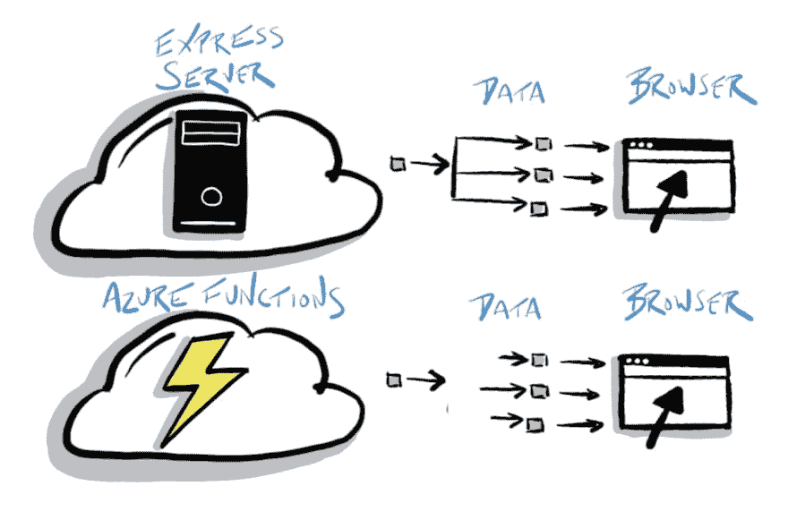
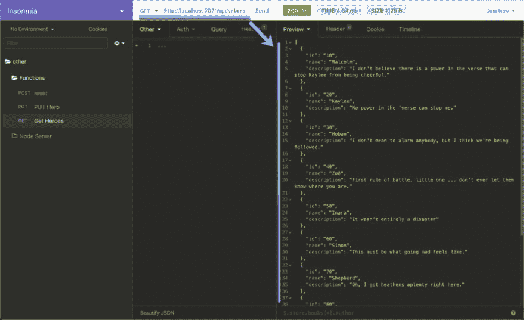
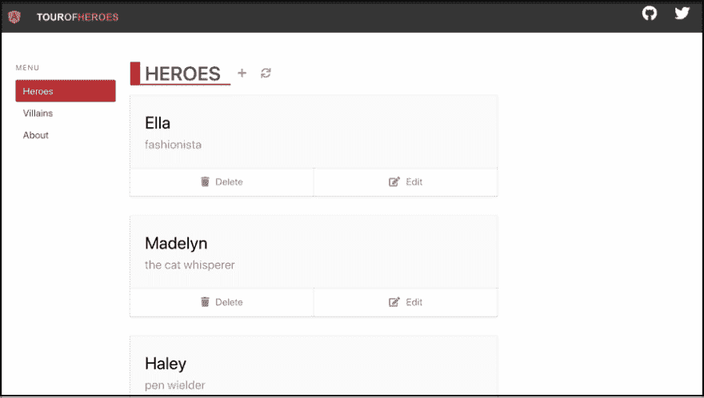
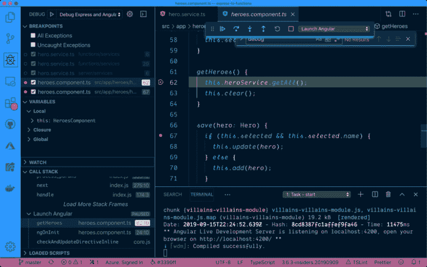
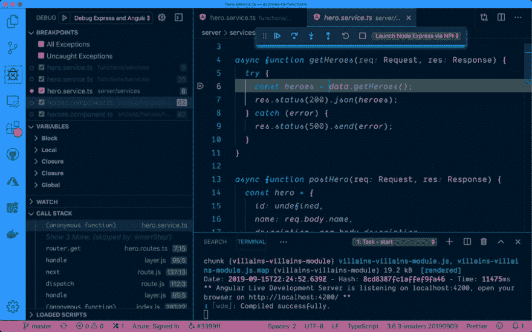
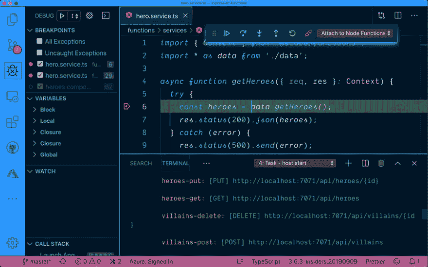

# 将您的 Node Express APIs 转移到无服务器

> 原文：<https://dev.to/azure/shifting-your-node-express-apis-to-serverless-b87>

如果你有 Express APIs，你并不孤单。但是你有没有考虑过将这种基于服务器的 API 模型转移到无服务器的模型？请继续关注我，在这篇文章的结尾，您将会看到如何去做，并且有一个工作示例供您自己尝试。

> 更新:[在这个实践教程中尝试你在这篇文章中看到的一切](https://docs.microsoft.com/en-us/learn/modules/shift-nodejs-express-apis-serverless/?wt.mc_id=devto-blog-jopapa)

我喜欢创建 API 的 Node 和 Express！然而，这些都需要一台服务器，并为云中的服务器付费。转移到无服务器减少了成本和服务器维护，有助于轻松扩展和缩小，并减少了健壮的 Express 应用程序所需的中间件的表面积。完美吗？不，当然不是！但是如果这些因素影响到你，这是一个可靠的选择。在本文中，您将了解如何将 Node Express APIs 转换为无服务器函数。

[](https://res.cloudinary.com/practicaldev/image/fetch/s--CJPRHQUM--/c_limit%2Cf_auto%2Cfl_progressive%2Cq_auto%2Cw_880/https://thepracticaldev.s3.amazonaws.com/i/1etett7tpuyeutfj00zr.jpg)

> 本文是 [#ServerlessSeptember](https://dev.to/azure/serverless-september-content-collection-2fhb) 的一部分。在这个无服务器的内容集合中，您可以找到其他有用的文章、详细的教程和视频。九月份每天都有新文章发表。
> 
> 在[https://docs.microsoft.com/azure/azure-functions](https://docs.microsoft.com/en-us/azure/azure-functions/?WT.mc_id=servsept_devto-blog-cxa)了解更多关于微软 Azure 如何实现你的无服务器功能。

## 你会学到什么

我们将从探索和运行示例项目中的节点和 Express APIs 开始。然后，我们将创建一个 Azure Functions 应用程序，然后重构到 Azure Functions 应用程序的快速路由和数据调用。最后，我们将一起探索结果。通过本课程，您将学会:

1.  创建一个 Azure 功能应用
2.  将现有的 Express APIs 重构为 Azure 函数
3.  理解两种方法之间的差异

> 虽然本文介绍了将 API 从 Express 转移到 Azure 函数的步骤，但是您也可以跟随 GitHub 上完整的示例项目。

我们将一起浏览代码和步骤，最后，我会分享一些链接，这些链接指向您开始学习和亲自尝试所需的一切。

## 计划向无服务器转变

在将应用程序转移到无服务器之前，让我们想想为什么我们可能要这样做，以及执行这种转移可能需要付出什么努力。

首先，快速应用程序需要一个服务器，您必须配置和维护它。如果能减轻一些这种努力和成本就好了。

Express 应用程序通常有一长串中间件和逻辑来启动服务器。这个示例项目有最少的中间件，但是您肯定希望在一个生产应用程序中有更多的关注点(例如:安全性)和特性(例如:日志)。虽然 Azure 功能不能完全消除这种情况，但启动 Azure 功能的逻辑和代码更少。通常只有很少的代码和一些配置。这在一个具体的例子中意味着什么？嗯，对于这个示例应用程序来说， *server.ts* 文件实际上已经消失了。

那么，为什么要进行这种转变呢？总的来说，使用无服务器服务器需要考虑的事情更少。

## 关于样本项目

您将在本文中了解到 GitHub 上的[示例项目中的哪些内容？很棒的问题！](https://github.com/johnpapa/express-to-functions)

该项目在 TypeScript 中表示一个简单的 Node Express APIs 应用程序，该应用程序被转移到 Azure 函数。

但是如果不使用 TypeScript 呢？那很好。如果你的 Express 应用使用的是 JavaScript，你可以随意使用 JavaScript 将其转换为 Azure 函数。

客户端应用程序是有棱角的，但它也可以很容易地被 Vue 或 React。英雄和反派主题贯穿整个应用程序。

虽然我们将使用 Angular 应用程序，但 Azure Functions 的一个伟大之处是，你可以在你的计算机上本地运行它，调试它，并使用浏览器、Postman、失眠症等工具调用 HTTP 函数(如下所示)。
[T3】](https://res.cloudinary.com/practicaldev/image/fetch/s--xkuniT2V--/c_limit%2Cf_auto%2Cfl_progressive%2Cq_auto%2Cw_880/https://thepracticaldev.s3.amazonaws.com/i/1hhzrhiktn18umnpy1k2.jpg)

## 入门

让我们从获取代码和设置开发环境开始。按照以下步骤准备代码。

1.  克隆此存储库
2.  安装 npm 软件包
3.  构建节点表达式和角度代码

```
 git clone https://github.com/johnpapa/express-to-functions.git
   cd express-to-functions
   npm install npm run node-ng:build 
```

1.  复制一个名为*的 *env.example* 文件。env* ，在项目的根中。它应该包含以下代码。

*。env*

```
NODE_ENV=development
PORT=7070
WWW=./ 
```

> 环境变量:应用程序可能有非常重要的环境变量位于*的根目录中。env* 文件。此文件未签入 GitHub，因为它可能包含敏感信息。

现在我们的代码已经可以使用了。但在此之前，让我们后退一步，看看我们有什么。

## 节点和 Express APIs

现在让我们探索一下 GitHub 上的[示例项目。](https://github.com/johnpapa/express-to-functions)

这是一个传统的节点和 Express 应用程序，服务于以下八个端点。

| 方法 | 路由端点 |
| --- | --- |
| 得到 | 英雄 |
| 邮政 | 英雄 |
| 放 | 英雄:id |
| 删除 | 英雄/:id |
| 得到 | 恶棍 |
| 邮政 | 恶棍 |
| 放 | 反派:id |
| 删除 | 恶棍/:id |

Node Express 应用程序的结构非常简单，包含在*服务器*文件夹中。

```
server
 | - routes
 | | - hero.routes.ts  👈 The hero routes
 | | - index.ts
 | | - villain.routes.ts
 | - services
 | | - data.ts         👈 The hero data (could be database API calls)
 | | - hero.service.ts 👈 The logic to get the hero data
 | | - index.ts
 | | - villain.service.ts
 | - index.ts
 | - server.ts         👈 The Express server
 | - tsconfig.json 
```

入口点是运行 *server.ts* 代码来启动 Express 服务器的 *server/index.ts* 文件。然后路线(如/英雄)从*/路线*文件夹中载入。这些路由执行 */services* 文件夹中的适当代码。 *data.ts* 文件是应用程序定义数据存储配置的地方。

例如，当客户端应用程序对 */heroes* 路由进行 HTTP GET 时，该路由执行*/services/hero . service . ts*文件中的逻辑来获取 heroes。

您可以自行探索*服务器*文件夹中的 Express 逻辑代码。

下面是正在运行的应用程序的屏幕截图。

[](https://res.cloudinary.com/practicaldev/image/fetch/s--eqwLZYky--/c_limit%2Cf_auto%2Cfl_progressive%2Cq_auto%2Cw_880/https://thepracticaldev.s3.amazonaws.com/i/bp83wqpwc4ne6lot6x8d.jpg)

### 运行并调试快递 App

当我想熟悉一个应用程序时，我发现用调试器运行和调试应用程序很有帮助。让我们一起努力。

让我们从用 Visual Studio 代码打开应用程序开始。

1.  打开 *proxy.conf.json* ，将端口改为 **7070** (我们的快递 app)
2.  打开 VS 代码命令面板 **F1**
3.  键入**视图:显示调试**并按**键进入**
4.  选择**调试快速和角度**
5.  按下 **F5**
6.  注意浏览器打开到 [http://localhost:7070](http://localhost:7070)

您现在可以在快速和角度代码中设置断点。

这里调试器在 Angular 应用程序中的一个断点处停止。

[](https://res.cloudinary.com/practicaldev/image/fetch/s--jFibXBvj--/c_limit%2Cf_auto%2Cfl_progressive%2Cq_auto%2Cw_880/https://thepracticaldev.s3.amazonaws.com/i/ak08usxnehfpgfj8vg9a.jpg)

这里，调试器在 Express 应用程序中的断点处停止。

[](https://res.cloudinary.com/practicaldev/image/fetch/s--mCcoxu61--/c_limit%2Cf_auto%2Cfl_progressive%2Cq_auto%2Cw_880/https://thepracticaldev.s3.amazonaws.com/i/z328yfch0tflkw46wk88.jpg)

> 文件*。vscode/launch.json* 和*。vscode/tasks.json* 是该项目的调试体验不可或缺的一部分。我鼓励您探索这些文件，并为自己的目的复制/重构它们的内容。

## 制造转移

现在，我们已经运行了应用程序，并探索了我们从 Express 开始的地方，让我们计划一下从 Express 到无服务器的转变。我喜欢把问题分解成小问题来解决。在这种情况下，et 从分解 Node Express 应用程序开始，可以分解为三个主要领域:

1.  快递服务器(主要在 *server.ts* 中)
2.  路线(*路线/* *)
3.  数据访问逻辑( *services/* .service.ts*)

我们将一次处理一个，因为我们要对所有这些进行转换。让我们从 Express 服务器转移到 Azure 功能开始。

### 快递👉Azure 函数

Express 服务器在服务器上运行 API。您可以创建一个 Azure Functions 项目来运行 API。我推荐使用 Azure 函数的 [VS 代码扩展。安装完成后，按照以下步骤在您的计算机上创建 Azure 函数。](https://marketplace.visualstudio.com/items?itemName=ms-azuretools.vscode-azurefunctions&WT.mc_id=devto-blog-jopapa)

1.  按下 **F1** 打开命令面板
2.  键入并选择 **Azure Functions:创建新项目**
3.  选择**浏览**找到创建功能的文件夹
4.  在项目中创建一个名为 *functions* 的新文件夹
5.  选择**打字稿**
6.  当提示创建功能时，选择**暂时跳过**

恭喜你，你刚刚创建了一个 Azure 功能 app！

> Azure Functions 应用程序为我们的路线提供服务。

在 *functions* 文件夹中创建 function 应用程序有助于将其与同一个项目中的 Angular 和 Express 应用程序分开。您当然不必将它们都放在同一个项目中，但是对于这个示例来说，将它们放在一个地方会有所帮助。

### 移动路线-创建您的第一个功能

您可能还记得，我们在 Express 应用程序中有八个端点。按照以下步骤为第一个端点创建一个函数。我们很快会回来创建其他七个端点。

1.  按下 **F1** 打开命令面板
2.  键入并选择 **Azure 函数:创建函数**
3.  为函数类型选择 **HTTP 触发器**
4.  输入 **heroes-get** 作为函数的名称
5.  选择**匿名**作为认证级别

注意，现在有一个文件夹 *functions/heroes-get* 包含一些文件。 *function.json* 包含了函数的配置。打开 *function.json* ，注意这些方法允许 GET 和 POST。将此更改为仅允许 GET。

默认情况下，执行该功能的路径将是**英雄-获得**。快递 app 里的路线简单来说就是**英雄**。我们希望它们是相同的，所以在 *function.json* 的**绑定**部分添加一个`route: "heroes"`条目。现在该函数将在调用 HTTP GET on **/heroes** 时执行。

您的 *function.json* 应该看起来像下面的代码。

```
{  "disabled":  false,  "bindings":  [  {  "authLevel":  "anonymous",  "type":  "httpTrigger",  "direction":  "in",  "name":  "req",  "methods":  ["get"],  "route":  "heroes"  },  {  "type":  "http",  "direction":  "out",  "name":  "res"  }  ],  "scriptFile":  "../dist/heroes-get/index.js"  } 
```

在*功能/英雄-获取*文件夹中的另一个重要文件是*索引. ts* 。该文件包含调用路由时运行的逻辑。我们已经从 Express 应用程序中获得了所有这些逻辑。我们下一步去拿。

### 将服务数据转移到无服务器

执行与数据存储交互的所有逻辑都包含在 Express 应用程序的*服务器/服务*文件夹中。我们可以将这些代码转移到 Azure Functions 应用中，并做一些小的调整。这看起来似乎行不通，但让我们考虑一下 Express 应用程序和 Azure Functions 应用程序的不同之处。以下是这些服务的一些主要区别。

1.  Express 应用使用 npm 包 **express** 而 Azure Functions 应用使用 npm 包 **@azure/functions**
2.  Express 有代表请求和响应的`req`和`res`参数。Azure Functions 将这些放在一个`context`对象变量中。

这就是我们要知道的全部。有了这些信息，我们就可以将 Express 应用程序中的服务代码复制到 Azure Functions 应用程序中，只需做最小的改动。我们现在就开始吧。

#### 将代码从 Express 转移到 Functions

如果没有必要，为什么要从头开始写所有的东西，扔掉你的辛苦工作，对吗？嗯，我们可以从 Express 应用程序中获取服务代码，并将其复制到 Azure Functions 应用程序中。

1.  复制**服务器/服务**文件夹
2.  粘贴到**功能**文件夹中

现在我们做了一些小的重构，让代码可以使用 Azure 函数而不是 Express。这里唯一改变的是路由 API 以及请求和响应的传递方式。让我们针对这个 API 差异进行重构。

1.  打开**功能/服务/hero.service.ts** 文件
2.  将`import { Request, Response } from 'express';`替换为`import { Context } from '@azure/functions';`
3.  用`({ req, res }: Context)`替换`(req: Request, res: Response)`的每个实例。

完成重构后，您的代码将如下所示。请注意，发生变化的地方会被添加注释。

```
// 👇 This was import { Request, Response } from 'express';
import { Context } from '@azure/functions';
import * as data from './data';

// 👇 This was async function getHeroes(req: Request, res: Response) {
async function getHeroes({ req, res }: Context) {
  try {
    const heroes = data.getHeroes();
    res.status(200).json(heroes);
  } catch (error) {
    res.status(500).send(error);
  }
}

// 👇 This was async function postHero(req: Request, res: Response) {
async function postHero({ req, res }: Context) {
  const hero = {
    id: undefined,
    name: req.body.name,
    description: req.body.description
  };

  try {
    const newHero = data.addHero(hero);
    res.status(201).json(newHero);
  } catch (error) {
    res.status(500).send(error);
  }
}

// 👇 This was async function putHero(req: Request, res: Response) {
async function putHero({ req, res }: Context) {
  const hero = {
    id: req.params.id,
    name: req.body.name,
    description: req.body.description
  };

  try {
    const updatedHero = data.updateHero(hero);
    res.status(200).json(updatedHero);
  } catch (error) {
    res.status(500).send(error);
  }
}

// 👇 This was async function deleteHero(req: Request, res: Response) {
async function deleteHero({ req, res }: Context) {
  const { id } = req.params;

  try {
    data.deleteHero(id);
    res.status(200).json({});
  } catch (error) {
    res.status(500).send(error);
  }
}

export default { getHeroes, postHero, putHero, deleteHero }; 
```

有四个函数，其中请求和响应是参数。`getHeroes`、`postHero`、`putHero`和`deleteHero`各一个。

Express app 中每个函数的参数都包含`req`和`res`。Azure Functions 应用程序仍然可以访问请求和响应对象，但是它们包含在一个`context`对象中。我们使用析构来访问它们。

> `Context`对象还包含其他 API，比如`log`(例如:`context.log('hello')`)。这可以用来代替你在节点应用中常用的`console.log`。

#### 重构路线

现在将您的路线指向您的**functions/heroes-get/index . ts**文件中的服务。打开该文件，并用以下代码替换它。

```
import { AzureFunction, Context, HttpRequest } from '@azure/functions';
import { heroService } from '../services';

const httpTrigger: AzureFunction = async function(context: Context, req: HttpRequest): Promise<void> {
  await heroService.getHeroes(context); // 👈 This calls the hero service
};

export default httpTrigger; 
```

您添加的代码调用异步函数`heroService.getHeroes`并传入包含请求和响应对象的`context`。

### 创建剩余功能

请记住，Express 应用程序中共有八个端点，我们刚刚创建了第一个。现在，按照这些步骤为其余的端点创建一个 Azure 函数。

1.  按下 **F1** 打开命令面板
2.  键入并选择 **Azure 函数:创建函数**
3.  为函数类型选择 **HTTP 触发器**
4.  输入英雄和反派的功能名称。我推荐**大侠——获得**、**大侠——发帖**、**大侠——放**、**大侠——删除**、**小人——获得**、**小人——发帖**、**小人——放**、**小人——删除**)
5.  选择**匿名**作为认证级别
6.  打开 *function.json* ，将方法设置为 get、post、put 或 delete 的适当值。
7.  在 bindings 部分，为 **get** 和 **post** ，添加一个`route: "heroes"`(或反派，视情况而定)条目。
8.  在 bindings 部分，对于**删除**和**放置**，添加一个`route: "heroes/{id}"`(或者视情况反派)条目。
9.  在每个函数的 *index.ts* 文件中添加代码，调用相应的英雄或反派服务函数。

### 查看功能 App

Azure Functions 应用程序现在有映射到相应端点的文件夹，如下所示。

| 方法 | 路由端点 | 文件夹 |
| --- | --- | --- |
| 得到 | 英雄 | 英雄-获得 |
| 邮政 | 英雄 | 英雄邮报 |
| 放 | 英雄:id | 英雄-放 |
| 删除 | 英雄/:id | 英雄-删除 |
| 得到 | 恶棍 | 恶棍-滚 |
| 邮政 | 恶棍 | 恶棍邮报 |
| 放 | 反派:id | 恶棍--放 |
| 删除 | 恶棍/:id | 恶棍-删除 |

*functions* 文件夹中包含的 Azure Function app 的结构应该是这样的。

```
functions
 | - heroes-delete
 | | - function.json
 | | - index.ts
 | - heroes-get
 | | - function.json  👈 The hero route's configuration
 | | - index.ts       👈 The hero routes
 | - heroes-post
 | | - function.json
 | | - index.ts
 | - heroes-put
 | | - function.json
 | | - index.ts
 | - services          👈 The same folder that the Express app has
 | | - data.ts         👈 The hero data (could be database API calls)
 | | - hero.service.ts 👈 The logic to get the hero data
 | | - index.ts
 | | - villain.service.ts
 | - villains-delete
 | | - function.json
 | | - index.ts
 | - villains-get
 | | - function.json
 | | - index.ts
 | - villains-post
 | | - function.json
 | | - index.ts
 | - villains-put
 | | - function.json
 | | - index.ts
 | - .funcignore
 | - .gitignore
 | - host.json
 | - local.settings.json
 | - package.json
 | - proxies.json
 | - tsconfig.json 
```

## 调试节点表达和角度

现在是运行应用程序的时候了，看看是否一切正常！我们将通过 VS 代码调试器来实现这一点。

> 为了保持事情的独立性，我们将确保 Express 应用程序使用端口 **7070** ，Azure Functions 应用程序使用端口 **7071** 。如果我们真的删除了 Express 应用程序(此时我们完全可以这样做)，我们可以保留相同的端口。但是为了教育的目的，让我们把他们都留在身边

1.  打开 *proxy.conf.json* ，将端口改为 **7071** (我们的函数 app)
2.  打开 VS 代码命令面板 **F1**
3.  键入**视图:显示调试**并按**键进入**
4.  选择**调试功能和角度**
5.  按下 **F5**
6.  打开浏览器到 [http://localhost:7071](http://localhost:7071)

您现在可以在函数和角度代码中设置断点。

[](https://res.cloudinary.com/practicaldev/image/fetch/s--lgMpQg0u--/c_limit%2Cf_auto%2Cfl_progressive%2Cq_auto%2Cw_880/https://thepracticaldev.s3.amazonaws.com/i/2l27psjcsqyh8f2u32ls.jpg)

> 以防你错过了这些文件*。vscode/launch.json* 和*。vscode/tasks.json* 是该项目的调试体验不可或缺的一部分。我鼓励您探索这些文件，并为自己的目的复制/重构它们的内容。

## 可选-删除快递 App

此时，不再使用 Express 应用程序。如果您想在 Express 和 Azure 函数之间来回切换，可以随意删除它(您总是可以重新克隆 GitHub 示例)或保留它。

## 总结

最终的结果是，我们有角函数和天蓝色函数。现在我们可以少考虑服务器了(懂吗，因为我们用的是无服务器？).

Node 和 Express 非常强大，经常被用于服务 API 端点。现在有了无服务器，你可以转移你的 API，不用担心服务器的设置或维护，可能会降低一个永远在线的服务器的成本，并用 Azure Functions 服务取代 Express server。通过您的努力，您将获得一个扩展性很好的 API，并让您专注于代码，而不是服务器。

> 如果你想把 Azure Functions 应用程序部署到云上，你可以按照这个教程来[部署它。你所需要的只是一个](https://marketplace.visualstudio.com/items?itemName=ms-azuretools.vscode-azurefunctions&WT.mc_id=devto-blog-jopapa) [Azure 账户](https://azure.microsoft.com/en-us/free/?wt.mc_id=devto-blog-jopapa)，然后使用 Visual Studio 代码的 Azure Functions 扩展来部署它。

[示例项目的完整解决方案在 GitHub 上的](https://github.com/johnpapa/express-to-functions)处。自述文件中也有关于如何开始的说明。您可以尝试运行 Express 应用程序或 Azure Functions 应用程序来了解其中的差异。然后尝试将这种转变应用到您的代码中。

## 资源

这里有一些关于本文所涉及主题的参考资料。

*   [Azure 免费试用](https://azure.microsoft.com/en-us/free/?wt.mc_id=devto-blog-jopapa)

### VS 代码

*   [VS 代码](https://code.visualstudio.com?wt.mc_id=devto-blog-jopapa)
*   [VS Azure 上节点的代码扩展](https://marketplace.visualstudio.com/items?itemName=ms-vscode.vscode-node-azure-pack&WT.mc_id=devto-blog-jopapa)
*   [VS Azure 函数的代码扩展](https://marketplace.visualstudio.com/items?itemName=ms-azuretools.vscode-azurefunctions&WT.mc_id=devto-blog-jopapa)

### Azure 函数

*   Azure 函数 [local.settings.json](https://docs.microsoft.com/en-us/azure/azure-functions/functions-run-local#local-settings-file?WT.mc_id=devto-blog-jopapa) 文件
*   教程[使用 Azure 函数部署到 Azure](https://code.visualstudio.com/tutorials/functions-extension/getting-started?WT.mc_id=devto-blog-jopapa)
*   关于 [Azure 函数类型脚本支持的文章](https://azure.microsoft.com/en-us/blog/improving-the-typescript-support-in-azure-functions/?WT.mc_id=devto-blog-jopapa)

### 调试资源

*   [调试 VS 代码中的角度](https://code.visualstudio.com/docs/nodejs/angular-tutorial?wt.mc_id=devto-blog-jopapa)
*   [在 VS 代码中调试反应](https://code.visualstudio.com/docs/nodejs/reactjs-tutorial?wt.mc_id=devto-blog-jopapa)
*   [调试 VS 代码中的 Vue](https://code.visualstudio.com/docs/nodejs/vuejs-tutorial?wt.mc_id=devto-blog-jopapa)
*   [VS 代码中的任务](https://code.visualstudio.com/Docs/editor/tasks?wt.mc_id=devto-blog-jopapa)