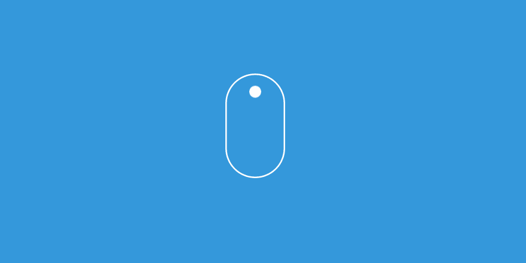

# 用 requestAnimationFrame 动画/填充网页滚动

> 原文：<https://dev.to/ampersanda/shimming-webpage-scroll-with-requestanimationframe-2la>

[](https://res.cloudinary.com/practicaldev/image/fetch/s--J0XOVjkb--/c_limit%2Cf_auto%2Cfl_progressive%2Cq_66%2Cw_880/https://thepracticaldev.s3.amazonaws.com/i/8n1euynk65hupaqtfkop.gif)

我在 [Awwwards](http://awwwards.com/) 里面发现了一些令人惊奇的网站，他们正在使用这种方法来填充他们网页的滚动。

是让你的动画工作的特殊函数，基本上你使用循环每隔几毫秒做一次改变。因此，它是用于动画的基本 API，无论是基于 DOM 的样式变化，canvas 还是 WebGL。

# 支持 requestAnimationFrame

我们知道，浏览器是不同的，所以我们必须为 requestAnimationFrame 设置一些回退。

```
 // http://paulirish.com/2011/requestanimationframe-for-smart-animating/
// http://my.opera.com/emoller/blog/2011/12/20/requestanimationframe-for-smart-er-animating

// requestAnimationFrame polyfill by Erik Möller
// fixes from Paul Irish and Tino Zijdel

(function() {
    var lastTime = 0;
    // checking website vendors that has their own requestAnimationFrame
    var vendors = ['ms', 'moz', 'webkit', 'o'];
    for(var x = 0; x < vendors.length && !window.requestAnimationFrame; ++x) {
        window.requestAnimationFrame = window[vendors[x]+'RequestAnimationFrame'];
        window.cancelAnimationFrame = window[vendors[x]+'CancelAnimationFrame']
                                   || window[vendors[x]+'CancelRequestAnimationFrame'];
    }

    if (!window.requestAnimationFrame)
        window.requestAnimationFrame = function(callback, element) {
            var currTime = new Date().getTime();
            var timeToCall = Math.max(0, 16 - (currTime - lastTime));
            var id = window.setTimeout(function() { callback(currTime + timeToCall); },
              timeToCall);
            lastTime = currTime + timeToCall;
            return id;
        };

    if (!window.cancelAnimationFrame)
        window.cancelAnimationFrame = function(id) {
            clearTimeout(id);
        };
}()); 
```

上面的代码更像是检查并给出了`requestAnimationFrame`和`cancelAnimationFrame`回退的健壮解决方案。

# HTML 的基本结构

```
<html>
  <!-- ...  -->
  <body>
    <!-- #app will be used for wrapper of your website content -->
    <div id="app">
      <!-- content will be here -->
    </div>
  </body>
  <!-- ...  -->
</html> 
```

还有 Javascript

```
document.addEventListener('DOMContentLoaded', function() {
    // get the #app
    let wrap = document.getElementById('app');

    // set the styles of #app
    wrap.style.position = 'fixed';
    wrap.style.width = '100%';
    wrap.style.top = '0';
    wrap.style.left = '0';

    // initialize #app position to the window
    // on top of page
    wrap.style.transform = 'translateY(0)'; // you can also use top
}); 
```

从上面的代码中，我们*固定了*div 的位置，这是因为实际上我们将使用 CSS `transform: translateY()`或`top`动画来模拟滚动动画；

# 获取滚动进度

> 我们的`#app`有固定的位置，这意味着身体不再关心它的高度，这将停用`scroll`事件并从浏览器中移除滚动条。

所以我们必须创建具有`#app`高度的`an empty div`。

```
let fakeDiv = document.createElement('div');
fakeDiv.style.height = wrap.clientHeight + 'px';
document.body.appendChild(fakeDiv); 
```

## 更新滚动进度

```
let update = function () {
  window.requestAnimationFrame(update);

  if (Math.abs(scrollTop - tweened) > 0) {
    // you can change `.072` for the acceleration of scroll
    let top = tweened += .072 * (scrollTop - tweened), // update value of Y translation 
        wt = wrap.style.transform = `translateY(${(top * -1)}px)`;
  }
};

// optional function for adding event
let listen = function (el, on, fn) {
    (el.addEventListener || (on = 'on' + on) && el.attachEvent)(on, fn, false);
};

let scroll = function () {
  scrollTop = Math.max(0, document.documentElement.scrollTop || window.pageYOffset || 0);
 };

listen(window, 'scroll', scroll);

// trigger the update function
update(); 
```

> 注意:调整页面大小时，需要更新`fake scroll div`的高度

就是这样。[演示可在此处访问](https://ampersanda-demo-rafscroll.netlify.com/)。

这里是[完整代码](https://github.com/ampersanda/shimming-page-example/blob/master/index.html)。

感谢您花时间阅读这篇文章。

快乐编码😊