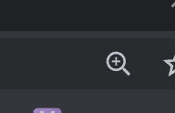
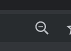
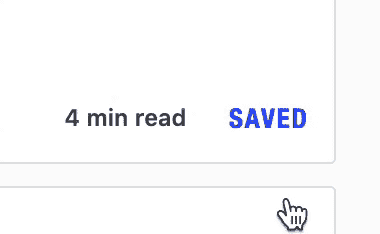

# 按钮应该传达当前状态、预期行为还是两者都传达？

> 原文：<https://dev.to/ben/should-a-button-communicate-the-current-state-the-intended-behavior-or-both-50na>

当我放大 Chrome 中的一个窗口时，我会看到这样一个图标:

当我把一个窗口的大小缩小到正常的 100%以下时，我得到了这个:

单击这些图标中的任何一个都会给我提供修改放大级别的选项。

在 DEV 上，当我跟踪某人时，我会看到这个按钮。点击它让我“不关注”他们。

我们的 UI 不一致，因为我们通过提供一个指示预期动作的悬停状态来区别对待主页的“保存”按钮。

当我们试图使这种行为一致时，我很好奇你认为什么是基本正确的行为。这种情况在网络上有不同的处理方式，但我很好奇是否有人觉得有真正的最佳实践。

所有关于该主题的评论都非常感谢！