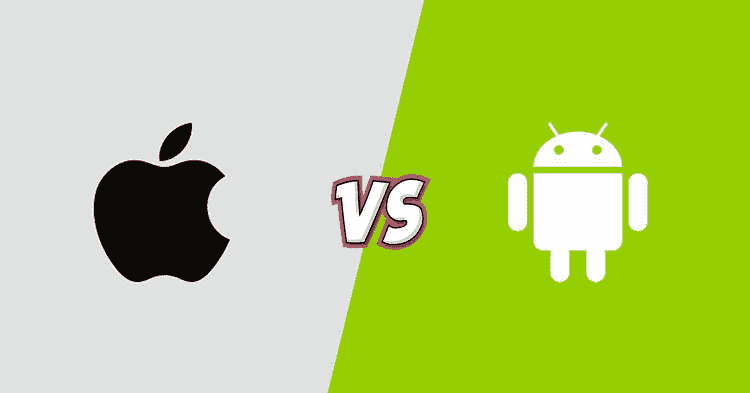

# 我应该做 Android 还是 iOS？

> 原文：<https://dev.to/vijaykhatri96/should-i-do-android-or-ios-80b>

 
所以你想[成为移动开发者](https://hackr.io/blog/how-to-become-a-mobile-app-developer)却无法决定选择 Android 还是 iOS？事实是你不是唯一一个有这种困境的人。许多有抱负的移动开发者都有这个问题。甚至一些有经验的开发者也不例外。一些知名的自由职业者也是如此。

需要注意的是，选择 Android 还是 iOS 取决于很多因素。首先，这主要取决于你为什么想成为一名移动开发者的目标。也要看你目前的职业水平。您需要考虑的主要因素有:您的编程经验、学习曲线的长度、学习成本、使用的工具、开发的容易程度、您当前使用的操作系统、您的目标地理位置以及文档或培训材料的可用性等。

本文试图为上述所有因素提供答案。您还将获得关于是否可以使用任何跨平台解决方案为 Android 和 iOS 开发应用程序的帮助。

你的编程经验

学习 Android 的主要先决条件是拥有 Java 编程经验。如果你没有 Java 编程的经验，有可能你会觉得学起来很难。另一方面，iOS 是用 Swift 写的，比较好学。即使你没有任何编程经验，你也能学会它。

**学习曲线**

下一个问题是，在尝试学习一项新技术或一门课程之前，任何人都想知道——需要多长时间完成？这个问题的答案取决于所选课程的难度以及你能花在学习上的时间。如前所述，与 Android 相比，学习 iOS 更容易一些。所以显然在 iOS 中学习曲线更少。

Android 的学习曲线更长的原因是——你需要更加重视兼容性和测试。原因是——Android 有多种操作系统版本、密度和屏幕尺寸。Android 非常庞大，有来自不同厂商的几款设备。这些都使得 Android 上的学习曲线更多。

**学习成本**

说到学习的成本，相对于 Android 来说，更多的是在 iOS 的情况下。原因是——你需要订阅苹果才能将你的应用发布到 App Store。iOS 中个人开发者程序的费用是 100 美元。但是，Google Play 商店要求您一次性支付 25 美元的注册费。一旦付费，你就可以发布任意多的应用。

**易于开发**

对于 iOS 开发，您可以使用 Xcode IDE，它非常容易使用。使用 Xcode，您可以为所有 Apple 产品开发应用程序，包括 iPhone、iPad、Mac OSX 和 iWatch。Xcode IDE 包含丰富的功能，如 UI 设计界面、代码完成、管理目录的层次结构、分析、调试、核心数据和资产管理等。

您可以使用 Android Studio 开发 Android 应用程序，它也具有丰富的功能。然而，在易用性方面，Android 的得分低于 Xcode IDE。

你需要知道的更重要的一点是——在开发基于 iOS 的应用程序时，你可以使用拖放界面来设计屏幕。您不需要为此编写任何代码。然而，Android 没有这种易用性，除非你在 XML 方面有优势，否则你无法开发出具有最佳设计的屏幕。

**您使用的设备**

决定学习哪门课程也取决于你拥有或使用的设备。如果你有一部 iOS 手机，学习 iOS 将对你有利，因为你可以使用自己的手机只是为了测试目的。假设，你有一部 Android 手机，但你想学习 iOS，那么这将是一件昂贵的事情。原因是你需要支付一大笔钱来买一部 iPhone 进行测试。另一方面，Android 手机比 iPhone 便宜得多。

**文件的可用性**

对于学习者来说，如果有足够的真实文档或培训材料，学习会变得更容易。Android 和 iOS 都为学习者提供了优秀的文档。

**您的目标地理位置**

另一个你需要考虑的重要因素是地理。如果你的目标是任何特定的国家，如美国、英国或任何其他发达国家的应用程序开发，那么最好学习 iOS。这是因为——在美国、英国、日本、中国、新西兰或任何其他发达国家，iOS 的使用率远远高于 Android。Android 在新兴国家有很大的市场。然而，总的来说，Android 在世界范围内的渗透率很高。

到目前为止，我们已经看到了 iOS 和 Android 的区别。假设，你不想同时学习 Android 和 iOS，但想知道是否有任何跨平台的解决方案，使用它可以为 iOS 和 Android 平台开发应用程序。是的。使用 React Native、Flutter 或 Xamarin 等工具是可能的。

以下是对这些的描述。

***反应过来的土著***

React Native 是一个来自脸书的框架，你可以用它来开发 iOS 和 Android 的应用程序。使用相同的代码，您可以开发适用于 iOS 和 Android 的原生应用。如果你懂 Javascript，那就更容易了，因为 Javascript 是用来开发 React 原生应用的。

***飘起***

Flutter 是跨平台开发的最佳框架之一。Flutter 的主要优势是——它是由 Google 开发的开源移动应用程序开发框架。

***Xamarin*T3】**

Xamarin 是另一个流行的工具，用作跨平台解决方案。使用 Xamarin，你不仅可以开发 Android 和 iOS 应用，还可以开发 UWP、WPF 和 macOS 应用。

**总结**

当谈到在 Android 和 iOS 之间选择学习目的时，立即做出决定并不容易，因为两者都是同样受欢迎的技术。明智的做法是——在做出决定之前，你需要仔细研究多种因素。对上述因素进行透彻的思考将会使你在以后的生活中不会后悔。你可以加入[最佳移动应用开发公司](https://squareboat.com/services/app-development)来了解更多关于它的知识，并可以与任何人分享你的知识。