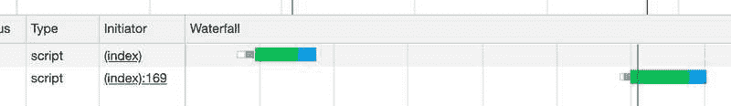

# 我们都应该开始实施差别服务吗？

> 原文：<https://dev.to/alexmacarthur/should-we-all-start-implementing-differential-serving-2cc6>

围绕为浏览器提供它们能够支持的 JavaScript 包的潜力，已经有了很多讨论。例如，如果用户在 Internet Explorer 上，则提供一个透明的、多填充的包。如果他们用的是现代版的 Chrome，那就用更简洁的非透明版本。

为了实现这一点，`module` / `nomodule`技巧已经被抛来抛去了不少。看起来是这样的:

```
<script type="module" src="scripts.modern.min.js"></script>
<script nomodule src="scripts.min.js"></script> 
```

老浏览器会跳过`type="module"`，下载`nomodule`版本。现代浏览器会忽略`nomodule`属性，下载`type="module"`版本。结果，浏览器得到了它们能够处理的代码。如今，他们中的大多数人无论如何都能理解现代 JavaScript，所以以这种方式提供捆绑包对大多数网站的访问者都有好处。

## 是啊，但是可靠吗？

从我的阅读和见证来看，不是很好。[约翰·斯图尔特](https://www.johnstewart.dev/)有一些[真正有趣的结果](https://github.com/johnstew/differential-serving#tests)他分享了他自己的研究，揭示了(并且被我自己的修补所证实)相当多的浏览器版本最终下载了他们不应该下载的捆绑包——有时甚至是多次。因此，举例来说，如果你的用户碰巧正在使用 MS Edge 18，你实际上是在*损害*性能——而不是帮助。

即使社区因为这些问题而逐渐远离浏览器，它们的使用仍然很广泛，足以阻止我在生产中使用`module` / `nomodule`技巧。至少现在是这样。

## 还有别的办法吗？

是的，有几个。

### 一个服务器端的替代品

一些人探索了[一种服务器端解决方案](https://www.johnstewart.dev/differential-serving#alternative-approach)，它在提供正确的资产之前检查浏览器的用户代理。它在外观上更可靠(尽管肯定不是防弹的)，但当缓存和其他因素加入进来时，它会变得非常复杂和不可预测。 [CloudFront，例如](https://docs.aws.amazon.com/AmazonCloudFront/latest/DeveloperGuide/RequestAndResponseBehaviorCustomOrigin.html#request-custom-user-agent-header)，完全覆盖了`User-Agent`头，建议你不要基于它的传入值缓存对象。Mozilla 对`User-Agent`嗅探采取了更加强硬的立场，直截了当地说[你应该**永远不要**去做](https://developer.mozilla.org/en-US/docs/Web/HTTP/Browser_detection_using_the_user_agent#Considerations_before_using_browser_detection)。大胆的话！字面上。他们的话在他们的网站上是粗体的。

### 客户端替代

我敢说，这里有*是*一个 JavaScript 方法来探索:

```
<script>
    var MODERN_BUNDLE = "assets/dist/js/scripts.modern.min.js";
    var LEGACY_BUNDLE = "assets/dist/js/scripts.min.js";

    function isModern() {
      try {
        new Function('import("")');
        return true;
      } catch (err) {
        return false;
      }
    }

    var scriptTag = document.createElement("script");
    scriptTag.setAttribute("src", isModern() ? MODERN_BUNDLE : LEGACY_BUNDLE);
    document.body.appendChild(scriptTag);
</script> 
```

通过在`try/catch`块中包装一些现代特性，我们可以返回一个`boolean`来检查浏览器是否能理解现代 JS。一旦我们知道了这一点，就可以在主体上附加一个`<script>`标签，告诉它到底要下载哪个文件。我在自己的沙箱中实现了这一点，即使使用上面提到的有问题的浏览器，它似乎也能工作。

可靠性加分，但感觉还是不对。在下载一大块 JS 之前，需要等待一小块 JS 被解析和执行，这是一种内在的性能折衷。深入研究之后，性能损失比我预期的要大得多。

#### 测试客户端方法

我运行了一些场景，用三种不同的方式加载一个 **~300kb 的传输文件**和一个 **~50kb 的“现代”文件**。在我自己的实验中，我通过不进行转译节省的代码量在 10% - 50%之间，所以我想我应该用一个更极端的例子来测试(> 80%的节省)，以确定通过 JS 加载的方法是否合理。所有这些例子都涉及到在主体末尾加载文件，结果是在我的本地机器上使用简单静态站点的每种方法的近似平均值。他们在这里:

**标准**:加载 300kb 文件的简单`<script>`标签。

**Modern via HTML:** 加载带有`module` / `nomodule`技巧的瘦版本。

**Modern via JS:** 用 JS 加载特征检测后的 slim 版本。

| 方法 | 排队时间 | 下载时间 | 随时可以使用 |
| --- | --- | --- | --- |
| 标准 | 20 毫秒 | 35 毫秒 | 55 毫秒 |
| 通过 HTML 实现现代化 | 20 毫秒 | 15 毫秒 | 35 毫秒 |
| 现代 via JS | 120 毫秒 | 15 毫秒 | 135 毫秒 |

毫不奇怪，更小的文件下载需要更少的时间，但是当它通过 JS 加载时，它会排队下载*远*。嵌入式和 JS 方法最终会进行如下比较:

[](https://res.cloudinary.com/practicaldev/image/fetch/s--BcEN3mXW--/c_limit%2Cf_auto%2Cfl_progressive%2Cq_auto%2Cw_880/https://macarthur.me/static/8b837186b0c9e6aa9efdf428de5dd8f2/a296c/waterfall.jpg)

这很重要。可能有几个原因:

**首先，解析和执行 JavaScript 需要时间。**有很多关于这方面的信息，其中最著名的声音之一是 Addy Osmani 和他的[JavaScript 演讲成本](https://v8.dev/blog/cost-of-javascript-2019)。

**其次(也是最主要的)，当你想下载的文件没有真正嵌入到文档中时，你不能利用浏览器的推测性解析**(也称为“预加载扫描”)。[米莉卡·米哈伊利亚有一篇关于这个](https://hacks.mozilla.org/2017/09/building-the-dom-faster-speculative-parsing-async-defer-and-preload/)的很棒的文章(发表在我生日那天——很大)。

她解释说，当加载页面时，非古代浏览器(指 2008 年以后的浏览器)不会严格按照脚本在文档中出现的顺序来获取脚本。相反，在页面生命周期的开始，他们“推测性地”发现最终需要的资产，并开始在后台加载它们。因此，与 JS 加载的脚本相比，嵌入式脚本有很大的优势，JS 加载的脚本首先必须等待 DOM 构建过程中的时机，然后才能开始下载。这就是为什么瀑布看起来是这样的。

#### 我们能让它更有性能吗？

我确实想到了几个选择:

首先，我尝试在文档的`<head>`而不是`<body>`中加载脚本。没多大帮助。由于文件排队更快，我节省了大约 10-15 毫秒，这并不能弥补将这些文件嵌入到文档中所损失的大约 100 毫秒。

第二，我尝试预加载 modern bundle，在页面生命周期中，排队时间大大缩短，因为可以利用推测性解析。旧的浏览器不会下载不必要的现代脚本，因为它们不理解提示。这听起来不错，但这也意味着任何不支持预加载资源提示的[浏览器都将受制于我们上面发现的总加载时间。根据你所在的行业，这通常仍然是一大群*用户。*](https://caniuse.com/#feat=link-rel-preload)

在所有这些之后，客户端方法并没有给人留下深刻的印象。

## 这一切是什么意思？

这种东西的重要含义应该是非常明显的:正如它所描述的那样，差别服务还没有准备好用于主流实现。就我所见，有太多的麻烦和不可预测性，却没有足够的收获。

即使是等待浏览器更加一致地处理`module` / `nomodule`技巧，到那时，创建两个不同的包可能根本不值得。[对 ES2015 的支持正在变得*真正*好](https://caniuse.com/#feat=es6)，有 **~91%** 的用户在完全支持的浏览器上， **~96%** 至少有部分支持。最重要的是，如今大多数浏览器的发布节奏都很快——根据 Chromium 的和 Firefox 的发布日历，大约每隔几个月左右发布一次。

关键是，可能用不了多久，“现代 JavaScript”就会被理解为“JavaScript”，担心降低差分服务可能会浪费很多精力。

## 抱歉！

如果你读到这篇文章时，预计到我会揭示一个令人惊讶的、可靠的区别服务的替代方法，我很抱歉。至少，我希望你已经获得了一些真知灼见！

```
 (This is an article published at macarthur.me. [Read it online here](https://macarthur.me/posts/should-we-implement-differential-serving).) 
```