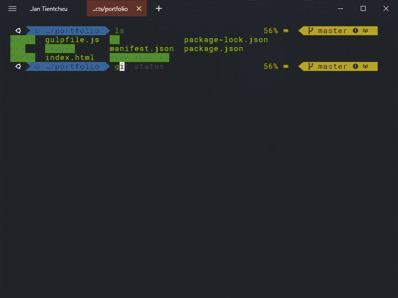

# 展示你的终端🐱‍💻✨

> 原文：<https://dev.to/dylantientcheu/show-off-your-terminal-1pe2>

最近，我在本地和远程终端上花费了大量的时间。

我知道开发人员喜欢调整他们的工具来适应他们自己。通过这篇文章，我的目的是提供一个分享空间。

# 我的 Windows 终端(Powershell)

*   超级终端
*   Powershell

> 这真的是 Powershell 吗？
> 
> 是的，我用 [Oh-my-Posh](https://github.com/JanDeDobbeleer/oh-my-posh) 实现了那个甜蜜的左提示

# 我的 WSL 终端(Ubuntu WSL)

*   流畅终端
*   Windows 子系统 Linux
*   哦，我的天，自动完成

给我们看看你的😍