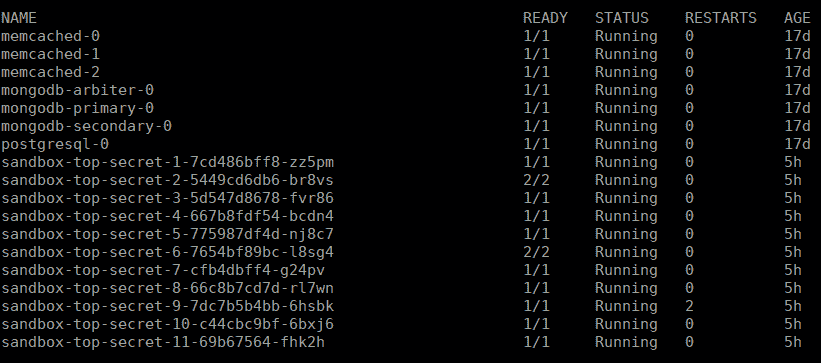
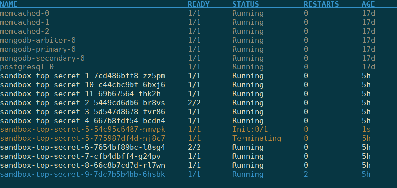
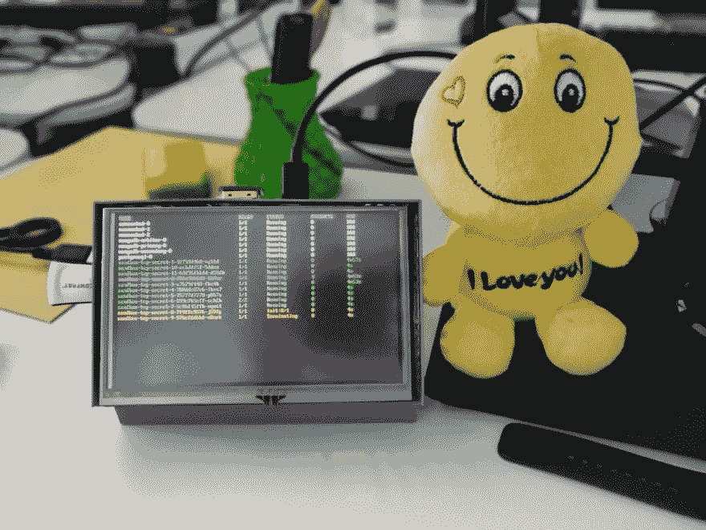

# 常见的编程错误:还有一件事...

> 原文：<https://dev.to/mjuraj/side-projects-just-one-more-thing-17c7>

这是一个关于一个简单的附带项目如何容易升级，如何做出不合理的决定，以及如何从中获得乐趣的故事！

### 想法

我有一个 5 英寸屏幕的树莓派已经很多年了，它一直在我的书架上积灰。但是上周末，我有了一个如何利用它的绝妙主意。假设是:

在我工作的公司，我们正在运行一个有十几个微服务的平台。那些程序负责处理一切。对我来说，总是看到每个程序的状态是很有用的，这样当一个程序崩溃时，我可以立即做出反应。

这应该不会太难吧？该平台使用 Kubernetes，因此访问数据非常容易(使用 [kubectl](https://kubernetes.io/docs/reference/kubectl/overview/) )，我会在屏幕上很好地显示出来。会很好的！

### 原型

我的任务很简单——让最重要的微服务的数据显示在屏幕上。这些数据包括:服务运行了多长时间，重启了多少次，以及当前是否正在运行。

设置过程很简单:

1.  下载 Raspbian OS(裸机版，因为谁需要台式机)
2.  将其安装在 MicroSD 卡上
3.  在树莓上设置一切(WiFi、ssh、屏幕驱动、kubectl)
4.  设置一个简单的单行 bash 命令，每秒刷新一次数据
5.  让它在启动时运行

基本上，kubectl 是一个命令，我可以用它来获取最新的数据，WiFi 让树莓与外界对话，ssh 让我与树莓对话，而屏幕驱动程序让我实际看到屏幕上的东西。

命令呢？其实很简单:

```
watch -n 1 kubectl get pods | grep "sandbox\|memcached\|mongo\|postgres" 
```

Enter fullscreen mode Exit fullscreen mode

这是我得到的结果:

[](https://res.cloudinary.com/practicaldev/image/fetch/s--s_rrO9df--/c_limit%2Cf_auto%2Cfl_progressive%2Cq_auto%2Cw_880/https://thepracticaldev.s3.amazonaws.com/i/zczx0tu0zgwiyrlvzjj4.png) 
*耗时:1.5 小时*

但是等等，有一个问题...我觉得这太容易了。我只是没有感受到辛苦工作一天的满足感。我知道，让我再补充一点！

### 下兔子洞

让我用一些颜色来编码。将来它对我来说意味着整个世界。此外，未来的 me 肯定希望着色逻辑易于编程，因此它可以支持所有它肯定需要的复杂逻辑。

为此，我决定从 Bash 转向 Python。这是我摇滚的地方，很快就会完成。我决定只做一个小小的限制——程序只能使用标准的 Python 库，否则事情会变得太简单，我想学习一些新的东西。

就这样。有了 2 个类、1 个递归函数和 5 个常规函数，总共 127 行代码，我就有了自己定制的彩色编码监控解决方案。当我在配有 i7 处理器、16GB 内存和 Nvidia 显卡的 15 英寸笔记本电脑上看着它时，我心想:*这是我可以引以为豪的事情。*

...直到我把它放到树莓上。在那里，我可以看到每次屏幕刷新时的小故障。它无法清理整个屏幕并足够快地重新打印所有内容。它太慢了，每 3 秒刷新一次，而不是我设定的 1 秒。此外，一些颜色使数据更难阅读。相当令人失望。

[](https://res.cloudinary.com/practicaldev/image/fetch/s--3EDMeX7g--/c_limit%2Cf_auto%2Cfl_progressive%2Cq_auto%2Cw_880/https://thepracticaldev.s3.amazonaws.com/i/efr6nk0qrxsz58h5y8iv.png) 
*耗时:3 小时*

好的，好的，没问题。我只需要稍微优化一下代码。它不需要每秒刷新一次，但我需要消除这个小故障。

我有一些优化的想法——每次我得到新数据时，我都会把它和旧数据进行比较。如果是一样的，我会忽略它，因为这意味着什么都没有改变。此外，我会存储所有需要打印出来的内容，这样当我打印时，我可以一次打印所有内容。

我把修改编码后，我很开心！我终于完成了让一切都如此令人满意的一天工作。可惜故障不会消失。

### 做或不做，没有尝试

这不会打败我。我知道解决办法是找到一种方法，只重新打印改变的数据。经过大量的(StackOverflow)研究，我发现我唯一的解决方案是这个 [curses 库](https://docs.python.org/3/library/curses.html)，它允许我编辑单独显示的每一行和每一列。

这意味着我不得不重写整个印刷过程。最后，我绘制了屏幕上每条信息的位置，寻找信息的变化，然后适当地替换它。

这带来了很多痛苦(还有快感？).如果我想在旧的信息上打印一条新的信息，我必须比较字符串，如果新的更短，我必须添加空格来覆盖差异。当服务终止时，它需要从屏幕上消失，这意味着我必须清除该行，然后将所有其他行上移以覆盖空白区域。我还必须注意某一行的颜色何时会根据数据变化而变化，因为整行都需要重新打印。

很多这样的小事加起来，最终会有 236 行代码，而我几乎花了一整天来编程。即使现在我还没有完成，由于小屏幕的尺寸，有一些修改，我将不得不做的一切，以正确渲染。

想想看，我用那一行 Bash 代码实现了几乎相同的功能。我疯了吗？

### 值得吗？

是的。没有。

我在编程和解决这些问题的过程中获得了很多乐趣，也遇到了一些通常伴随着这一行的挫折。当你开始以编程为生时，我认为这是经常丢失的东西，因为我们被规范和期限所困扰。我也学到了很多东西——如何在角色层面上操作屏幕，考虑硬件限制通常是有好处的，以及如何让覆盆子看起来很酷。

另一方面，最终结果并不比我在 Bash 中开始时好多少，甚至现在我仍然有一些修改要做。所以也许我可以利用这段时间做些别的事情，打破我的常规。

对我来说，有趣的是我在这个项目中做出的(不那么)微妙的非理性决定。所以借鉴我的经验。不一定是如何减少不理性，而是如何认识到这种行为，并在你的决策过程中考虑到这一点。此外，尝试和享受乐趣——这是至关重要的部分:)

[](https://res.cloudinary.com/practicaldev/image/fetch/s--Sgw5gcVe--/c_limit%2Cf_auto%2Cfl_progressive%2Cq_auto%2Cw_880/https://thepracticaldev.s3.amazonaws.com/i/hzein7rehph0ar0lqx1i.png) 
*耗时:8 小时*

### 你怎么看？

我真的很想知道你的想法。你知道解决我遇到的问题的更好的方法吗？你觉得这有用吗？你想让我在 GitHub 上发布代码吗？

[](https://res.cloudinary.com/practicaldev/image/fetch/s--3ybOnufT--/c_limit%2Cf_auto%2Cfl_progressive%2Cq_auto%2Cw_880/https://thepracticaldev.s3.amazonaws.com/i/gpmx1jyutc1icj9xtm66.jpg)