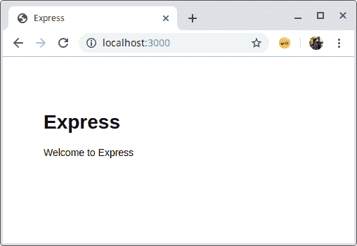
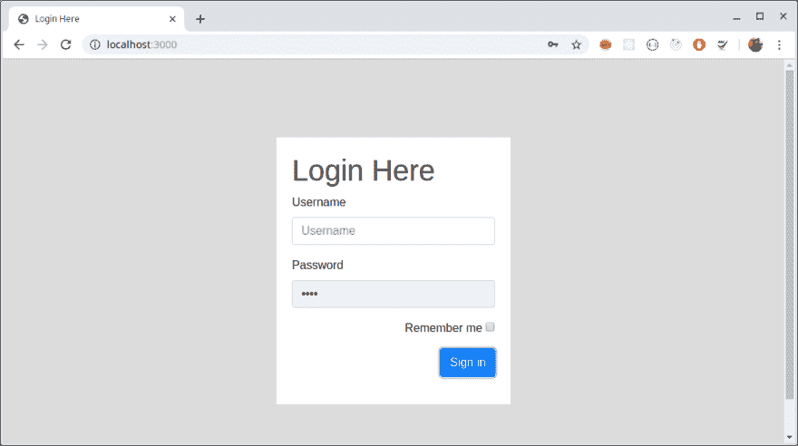
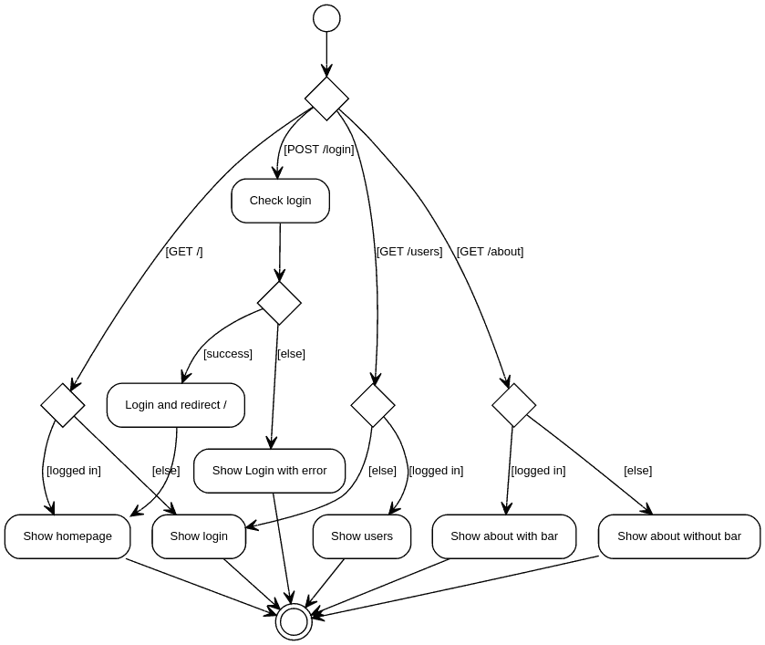
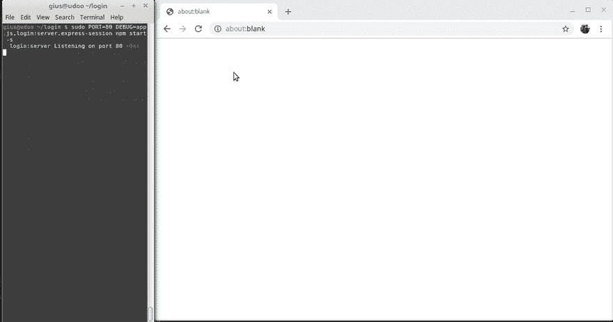

# 使用快速会话的最简单登录应用程序

> 原文：<https://dev.to/rkristelijn/simplest-login-app-using-express-session-gio>

# 快速登录与快速-会话

复制[此报告](https://github.com/rkristelijn/login/)或遵循以下步骤，了解如何设置 Node/express 应用程序，以实现登录、注销和安全路由。

| 步骤 | 指令 |
| --- | --- |
| 0。样板文件 | 这些步骤将建立一个初始项目。 |
| Zero point one | 全球安装[快速发电机](https://www.npmjs.com/package/express-generator)`npm install -g express-generator` |
| Zero point two | 在新文件夹中创建一个名为**登录**的新项目**登录**并添加 pug 支持(而不是 Jade)。`express -css=less --view=pug --git login` |
| Zero point three | 使用`cd login`进入目录后，通过执行`npm i`安装依赖项 |
| Zero point four | 根据发现的漏洞数量，您会看到警告。
`npm notice created a lockfile as package-lock.json. You should commit this file.`
`added 118 packages from 174 contributors and audited 247 packages in 10.793s`
`found 1 low severity vulnerability run npm audit fix to fix them, or npm audit for details`
运行`npm audit`后你会看到修复建议，你可能想运行`npm ls`来查看依赖树。
在这种情况下，您可以通过运行`npm i pug@latest`

来修复它。运行后，不会报告任何漏洞，我们可以继续运行并启动应用程序 |
| Zero point five | 通过以下命令之一启动应用:
1。`npm start` - *在默认端口 3000*-
上启动 app 2。`PORT=8080 npm start` - *启动端口 8080 上的*-
3。`DEBUG=login:* npm start` - *从调试信息开始* |
| Zero point six | 将您的浏览器指向`localhost:3000` 
在我们的控制台中我们看到:
`~/login$ DEBUG=login:* npm start`

`> login@0.0.0 start /home/gius/login`
`> node ./bin/www`

`login:server Listening on port 3000 +0ms`
`GET / 304 719.979 ms - -`
`GET /stylesheets/style.css 304 7.148 ms - -` |
| **1。创建登录表单** | 完成这些步骤后，我们有一个新的页面和路线。 |
| One point one | 运行`npm i --save express-session bootstrap`添加依赖项
注意 bootstrap 有两个对等依赖项:jquery 和 popper.js。我们不需要这些，因为我们只是要使用 css。这是处理`npm WARN` :
1 的方法列表。忽略警告；*不需要，因为团队会忽略所有 npm 输出*
2。安装对等 deps:`npm i --save jquery popper.js`；*不合意的；打包程序将包括 jquery 和 popper.js，并让代码库显著增长*
3。安装为开发部门:`npm i -D jquery popper.js`；*还不确定它是否解决了 2，但它关闭了警告*
4。使用[忽略警告](https://github.com/codejamninja/ignore-warnings) : *还不清楚[如何使用](https://github.com/codejamninja/ignore-warnings/issues/2)，但这似乎是一种合法的方式来避免 2 并且仍然保持 npm 输出干净*
5。使用 bootstrap cdn*首选本地安装，允许离线开发*
6。手动安装引导程序；*dep 应该在 package.json 中，以保持所有可更新和可见的 npm 审计* |
| One point two | 创建`/views/login.pug` [参见更改](https://github.com/rkristelijn/login/commit/e3c94bb22d43140f0a18054c793572fca60ce7ae#diff-6d5d452b8670045112ed889367008056) |
| One point three | 将路由添加到`app.js`以重新路由到登录、引导和包含会话[参见更改](https://github.com/rkristelijn/login/commit/e3c94bb22d43140f0a18054c793572fca60ce7ae#diff-0364f57fbff2fabbe941ed20c328ef1a)T3】 |
| One point four | 更新样式`public/style.css` [见改变](https://github.com/rkristelijn/login/commit/e3c94bb22d43140f0a18054c793572fca60ce7ae#diff-0aaa9d35a8082eda23139c53348d2e51) |
| One point five | 更新 layout.pug 以包含引导程序`views/layout.pug` [见更改](https://github.com/rkristelijn/login/commit/e3c94bb22d43140f0a18054c793572fca60ce7ae#diff-5c5792469bc79f8d2ab44b4192b02a20) |
| one point six | 当前结果路线默认路线为登录

`~/login $ DEBUG=login:* npm start -s`
`login:server Listening on port 3000 +0ms`
`GET / 304 737.652 ms - -`
`GET /css/bootstrap.min.css 304`
`.766 ms - -`
`GET /stylesheets/style.css 304 1.070 ms - -` |
| **2。添加关于页面和页眉** | 按照以下步骤添加关于页面和页眉 |
| Two point one | 在我们继续之前，我想清理一些日志。制造了太多噪音。从`app.js`中删除以下几行:
`var logger = require("morgan");`
`app.use(logger("dev"));`

你可以通过
`npm rm --save morgan`将摩根从`package.json`中删除。

趁我们还在；`debug`是`express`和`express-session`的直接依赖项，所以我们可以通过
`npm rm --save debug`将其从`package.json`中移除。

要看`debug`是否还能用，我们可以用:
`DEBUG=app.js,login:server,express-session npm start -s`。注意，我们可以对所有输出使用`DEBUG=*`。

现在我们可以这样添加调试信息(在 app.js 中):
`var debug = require('debug')('app.js');`
`debug('hello world');`

我们的输出:
`login:server Listening on port 3001 +0ms`
`express-session no SID sent, generating session +26s`
`app.js checkLoggedIn(), req.session.loggedIn: undefined rendering login +5ms`
`express-session saving PybLKV4TpsaSMx_PzZx_Mj5Is4X_0U9g +748ms`
`express-session set-cookie app=s%3APybLKV4TpsaSMx_PzZx_Mj5Is4X_0U9g.Bd1dSB8w4kfcL9DPonfLBXFRLtZBdqHThCNMTsv0Ixo; Path=/; HttpOnly +4ms`
`express-session fetching PybLKV4TpsaSMx_PzZx_Mj5Is4X_0U9g +736ms`
`express-session session found +1ms`
`app.js checkLoggedIn(), req.session.loggedIn: undefined rendering login +1ms`
`express-session saving PybLKV4TpsaSMx_PzZx_Mj5Is4X_0U9g +93ms`
`express-session split response +1ms` |
| Two point two | 将`routes/about.js`和`views/about.pug`加上[这个内容](https://github.com/rkristelijn/login/commit/e8c1317536cad9cde82169d40f05ffd68534e112#diff-8bd0aaff64e2da1404cfd91cce49a9f8)并更新`app.js`；添加:
`app.use("/about", aboutRouter);`
`var aboutRouter = require("./routes/about");` |
| Two point three | 将此内容添加到`views/header.pug`和`users.pug`中，并有条件地包含在`views/about.pug` :
`if loggedIn`
`include header`中 |
| Two point four | 然后在`views/login.pug` :
中还有一些零碎的东西需要修复——添加错误占位符
——添加关于页面的链接
——将按钮改为输入，这样回车键就可以工作了 |
| Two point five | 在这里用[的内容添加`views/users.pug`，然后像这样](https://github.com/rkristelijn/login/commit/e8c1317536cad9cde82169d40f05ffd68534e112#diff-e804aa6e48ffa93374f7428688bf657b)传递一个用户列表 |
| **3。完成登录** | 还有事情要做。[示例](#sources)仅支持登录和注销，会话在 6000 ms(6 秒)后终止 |
| Three point one | 我们可以删除线`cookie: {maxAge: 6000}`，这样会话就不仅仅是从`app.js`开始的 6 秒 |
| Three point two | 在`app.js`中，我们创建了一个`login()`和一个`logout()`函数，它们只关心登录和注销。

注销删除 session.loggedIn 标志，登录设置它并调用检查凭证。创建了一个名为`checkUser()`的独立函数来检查凭证 |

# 最终设计

# 最终演示

*   清洁开始`/`
*   获取`/about`
*   获取`/users`
*   注册
*   主页
*   获取`/users`
*   获取`/about`
*   注销
*   错误登录

# 提问/评价

这些是我在开始本文档之前寻求的答案，是在创建和审查代码期间提出的。

| 问题 | 回答 |
| --- | --- |
| 登录需要护照和护照本地吗？ | 没有。最小值是`express`、`express-session`和可能的`cookie-parse` |
| 创建登录/注销的最简单方式是什么？饼干？服务器端会话？ | 即使用户没有登录，这个解决方案也会创建一个 cookie。这是一个[会话 cookie](https://decodeproject.eu/cookies) 。

值为
`s%3Ayz92aWlUKzWDXhzlkqiz8wddo-SH2G0I.N6dzg2O0liagsejyMKLehW1aRGL6fEY1mkMrTFKOG1E`似乎与`DEBUG=express-session npm start -s`控制台中服务器上的会话值相同。
关于 [cookie 安全性的更多信息](https://flaviocopes.com/cookies/) |
| 我能否识别用户，以便创建访问组并允许每个用户使用不同的路由？ | 否。在这种情况下，只存储一个布尔:
`Session {`
`cookie: { path: '/', _expires: null, originalMaxAge: null, httpOnly: true },`
`loggedIn: true`
`}` |
| 这是最简单的例子吗？ | 为了测试会话，您至少需要 1 或 2 个“安全”路由、登录和注销路由以及某种视图。有了 SPA，后端可以更小。 |
| 创建`req.session.loggedIn`是管理会话的合法方式吗？ | 目前看来还可以。 |
| 什么是通用安全建议？ | 在 [express-session](https://github.com/expressjs/session#sessionoptions) 页面上写着:
**警告**默认的服务器端会话存储 MemoryStore 特意不是为生产环境设计的。在大多数情况下，它会泄漏内存，不会扩展到单个进程之外，并且用于调试和开发。似乎 [MongoDB 可以存储会话](https://www.npmjs.com/package/connect-mongodb-session)。 |

# 来源

1.  [原创教程](http://projectsplaza.com/login-logout-nodejs-express/)
2.  [尼玛 HKH 的另一位导师](https://medium.com/@nima.2004hkh/create-your-first-login-page-with-exprerssjs-pug-f42250229486)
3.  [节点登录完成正确](http://www.jyotman.xyz/post/logging-in-node.js-done-right)