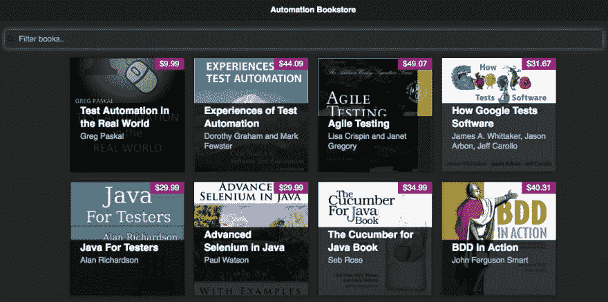
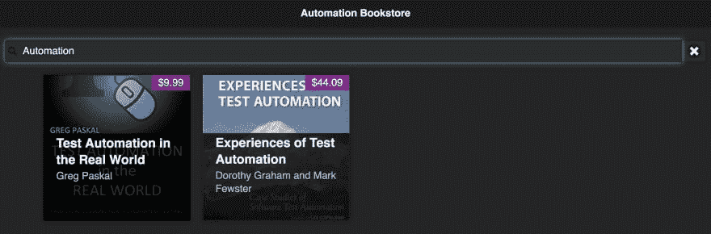

# 通过可视化验证简化自动化

> 原文：<https://dev.to/techgirl1908/simplifying-automation-with-visual-validation-4an6>

当自动化场景时，我们必须非常小心地捕获测试人员在执行测试时会处理的所有不同的验证点。我已经在[为测试自动化添加外围视图](http://angiejones.tech/adding-a-peripheral-view-to-test-automation/)中写过这个问题，并强调了确保我们将所有必要的断言编写到给定场景中是多么重要。但我找到了更好的方法。[视觉 UI 测试](https://applitools.com/)。

作为一名自动化工程师，我感到巨大的压力，要跳出框框思考，并确保没有遗漏任何断言。可视化验证减轻了这种压力，并使我的自动化脚本更快更简单。

让我告诉你我的意思。

这是我为自己的一些 UI 自动化研讨会构建的一个应用程序。这是一个显示测试自动化书籍的简单表格。通过在文本字段中搜索，用户可以过滤出符合查询条件的书籍。

[](https://res.cloudinary.com/practicaldev/image/fetch/s--yip_Jr8V--/c_limit%2Cf_auto%2Cfl_progressive%2Cq_auto%2Cw_880/https://i0.wp.com/angiejones.tech/wp-content/uploads/2016/10/application-for-automation.jpg)

### 无需目测验证

如果没有视觉验证，我会编写一个场景来确保我正在搜索的书是我搜索完成后唯一可见的书。在这个特定的场景中，我写了下面的内容，以确保当我搜索“自动化”时，我期望的两本书就是显示的那本。

[](https://res.cloudinary.com/practicaldev/image/fetch/s--wT_C2I1J--/c_limit%2Cf_auto%2Cfl_progressive%2Cq_auto%2Cw_880/https://i0.wp.com/angiejones.tech/wp-content/uploads/2018/08/filtered-bookstore.jpg)

```
 @Test
  public void testSearchByPartialTitle() {
    String title1 = "Test Automation in the Real World";
    String title2 = "Experiences of Test Automation";

    page.search("Automation");

    assertTrue("Book not found: " + title1, page.isBookVisible(title1));
    assertTrue("Book not found: " + title2, page.isBookVisible(title2));
    assertEquals("Number of visible books is incorrect", 2, page.getNumberOfVisibleBooks());
  } 
```

为了支持这个场景，我需要在我的框架中向 Page Object 类添加两个方法:`isBookVisible`和`getNumberOfBooks`(加上一个额外的支持方法以及元素定位器):

```
 public boolean isBookVisible(String title){
    List<WebElement> books = findVisibleBooks();

    for(WebElement book : books) {
      if(title.equalsIgnoreCase(book.findElement(titleAttribute).getText())){
        return true;
      }
    }

    return false;
  }

  public int getNumberOfVisibleBooks() {
    return findVisibleBooks().size();
  }

  private List<WebElement> findVisibleBooks() {
    return driver.findElements(visibleBooks);
  } 
```

即使有了所有这些代码，我也只是在验证书名是否正确。屏幕上还有那么多可能出错的地方，比如作者、价格、书籍封面……而这还没有涵盖整体的外观和感觉！

### 用目测验证

为了完全验证这本书的属性，我们的方法需要更加稳健。但是我实际上可以删除代码，并通过可视化验证获得更多的覆盖率，而不是添加更多的代码。

这是我修改后的测试方法。请注意，我已经用三行可视化验证替换了上面的三行断言，通过这种交换，我的测试覆盖了更多的内容。这种交换还消除了对上面显示的页面对象代码的需要，所以我不再需要维护它。这是 19 行代码加上我可以删除的 2 行元素定位符。现在，这个场景验证整个页面，不仅确保我的书(及其所有属性)在搜索后出现，而且外观和感觉也很完美。

```
 @Test
  public void testSearchByPartialTitle() {
    page.search("Automation");

    eyes.open(driver, "Automation Bookstore",  "testSearchByPartialTitle");
    eyes.checkWindow();
    eyes.close();
  } 
```

我甚至可以通过提取可视验证代码来使这个测试方法变得更小，特别是因为这将在我的一系列测试中重用。在一个基本测试类中，我可以将三行可视化验证代码移到一个实用方法中。这样，从这个类继承的任何测试类都可以访问这个:

```
 protected void validateWindow() {
        eyes.open(driver, "Automation Bookstore",  Thread.currentThread().getStackTrace()[2].getMethodName());
        eyes.checkWindow();
        eyes.close();
    } 
```

然后在测试本身中，我们减少到 5 行代码，实际的主体只有 2 行！

```
 @Test
  public void testSearchByPartialTitle(){
    page.search("Automation");
    validateWindow();
  } 
```

通过覆盖更多的验证，这种方法非常有效——确保我们想要的所有内容都在那里，确保我们不想要的所有内容都在那里，并确保页面的整体外观和感觉是我们所期望的。代码更少，压力更小！还有一点很棒的是，它没有*和*来完全替代功能验证。我可以很容易地保留我需要的任何断言(例如后端验证),并且仍然使用可视化验证来完成其余的工作。我基本上可以拥有一切！

<sub>*原帖[angiejones . tech](http://angiejones.tech/simplifying-test-automation-with-visual-validation/)*T5】</sub>