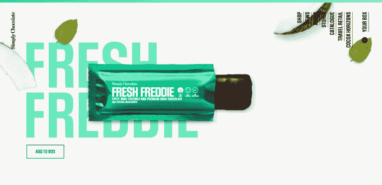
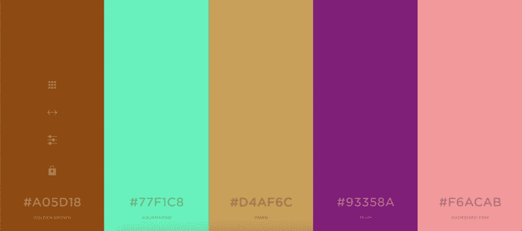
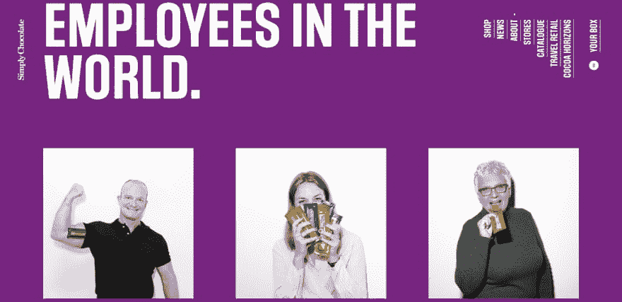
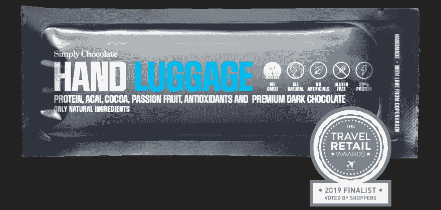

# 简单的巧克力

> 原文：<https://dev.to/mikeamiro/simply-chocolatey-2931>

想象一个装满巧克力的工厂，准确地说是瑞士巧克力。温度是 26 摄氏度，巨大的鼓装满融化的巧克力，巨大的冷却器制作巧克力棒，然后包装。不管你是不是巧克力爱好者，这肯定是一个令人难忘的地方。双关语。

我跑题了。我们正在谈论的不是瑞士巧克力，事实上，这个月的网站来自丹麦(足够接近)，仅仅是哥本哈根的巧克力，他们使用饼干。双关语。

一个干净和精简的网站，拼写优雅。这个网站让人觉得它是一个顶级巧克力品牌。有粉丝团，可能参加过巧克力大奖并获奖的那种巧克力。登录页面紧跟斐波那契数列。基于重要性，曲线的关键点引导眼睛看网站的重要方面。

在互动上，网站揭示的不仅仅是最初的。当你向下滚动页面时，微妙的动画和运动是令人愉快的，这是他们的产品列表，你可以直接与之互动。你必须亲身经历才能明白我的意思。

每个产品部分都包括一个行动号召按钮，提示用户将展示的产品添加到“盒子”中。这最大化了用户转化率——我最后在盒子里放了一些，当然是抱着购买的希望。

## 颜色

 
现场选用的调色板与生产和销售的产品直接相关。

## 语言

语言实际上是设计的一部分，因为它有助于与用户进行可理解的交流；根据 Adobe 的[思维设计](https://medium.com/thinking-design/what-is-a-design-language-really-cd1ef87be793)

单词有意义，句子也有意义，因此给出了意义和方向。采取的方向决定了转换，有多少用户将购买产品或服务。

> 是的，你可以买到爱情！

每个人都说你买不到爱情，但是他们告诉你一些别的东西。你真的可以。但是什么是爱呢？在他们看来，他们的巧克力就是爱。

## 人性方面

 
在“关于我们”页面上，巧克力简单地向用户介绍了“人”的方面。他们介绍了被称为**的整个团队，我们知道世卫组织是世界上最快乐的员工**。他们可能不是世界上最幸福的人，但就目前而言，他们是最幸福的，这才是最重要的。对于人类来说，在“数字产品”上看到其他人会让他们产生更多的联系，并消除网络的铁幕。用户不再觉得他们在与机器人和人工生命打交道，而是与展示的人类直接相关。

你对简单的巧克力有什么想法？让我们开始吧…

[数字军团](http://digitallegion.co.ke)