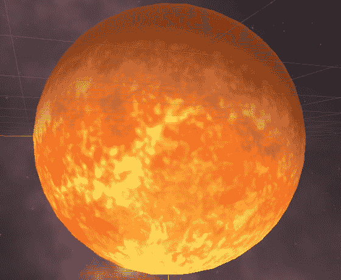
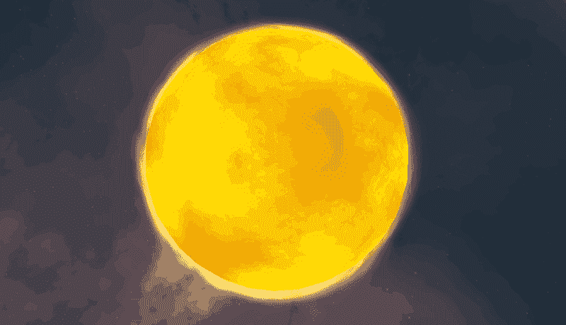
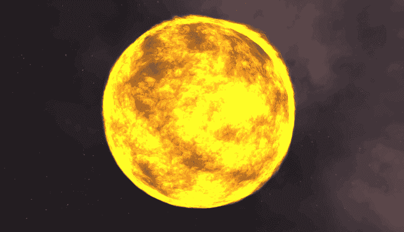
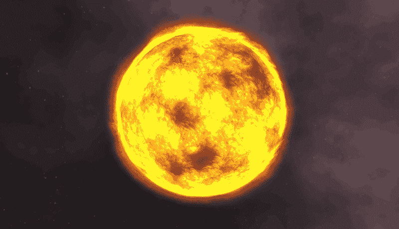
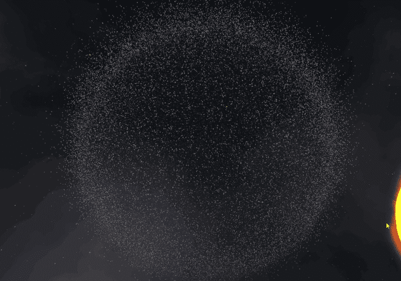
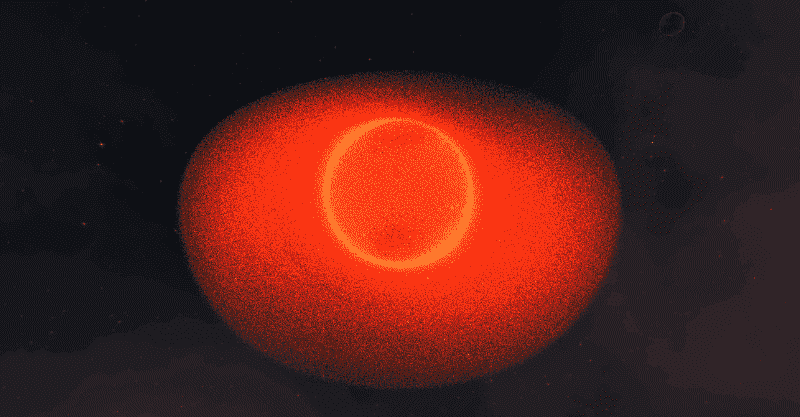
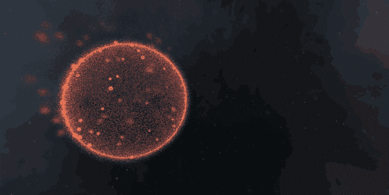
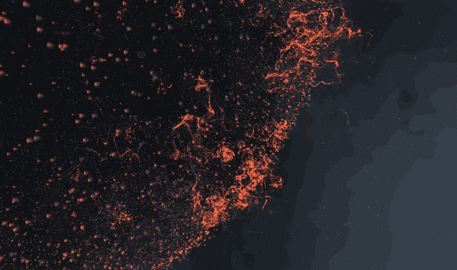
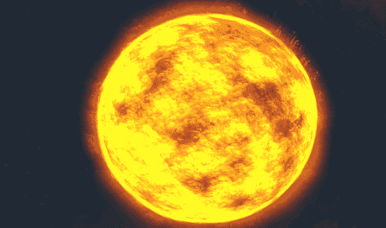
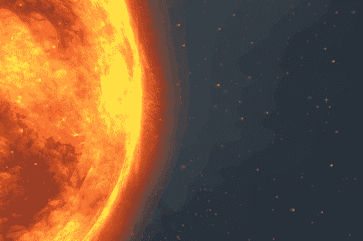

# 模拟数百万个粒子来创造太阳

> 原文：<https://dev.to/_darrenburns/simulating-millions-of-particles-to-create-the-sun-2ppo>

我最近写了一篇博文，讲述了我是如何在 Unity 游戏引擎中学习制作视频游戏的。在那篇文章中，我构建了一个简单的空间场景，并添加了一些基本的游戏机制。写完那篇文章后，我想尝试一些更闪亮的东西，在场景的中心建立一个戏剧性的太阳。这个项目让我在 Unity 中深入研究粒子模拟。起初，模拟完全是在 CPU 上完成的。后来，我发现了 Unity 视觉效果图和 GPU 能够实现的令人难以置信的性能。

我的第一次尝试是在我的场景中添加一个球体，并用太阳表面的等矩形投影包裹它，就像我在上一篇文章中对火星所做的那样。结果令人失望。太阳表面是活跃的，并辐射能量，但我的球体看起来像一个巨大的橘子漂浮在太空中。

为了让事情看起来更生动，我在 Unity 中创建了一个密集的粒子系统，然后用 Photoshop 创建了一个自定义纹理，使用了一张烟的图像。我创建了这个纹理，通过找到一个着火的船的图像，裁剪出一部分烟雾，并根据它的黑暗程度给每个像素添加 alpha 值，本质上是将黑暗转化为透明。这是大约 1000 个粒子在球体表面淡入淡出时的样子。

太阳表面现在有了运动，这无疑使事情比以前更有趣了。不幸的是，这仍然不是很有趣，事情看起来有点*偏离*。我很快意识到我创建的纹理实际上不是透明的。薄烟区域没有透明渲染，而是完全不透明渲染！

修复花了*个小时*才找到，大部分时间都在试图找出如何将我图像中较暗的像素转换成透明的。对于初学者来说，在 Photoshop 中使用 alpha 通道是*而不是*直观的！在修复了我的图像中的 alpha 通道，并弄清楚如何将透明纹理导入 Unity 后，事情看起来是这样的:

好多了！我尝试的下一件事是添加日冕。日冕是太阳大气层的外层，它比太阳表面暗得多。因此，我添加了另一层粒子，但使它们更暗，颜色更橙色。

对此我真的很高兴，但我想更进一步。上图中的太阳包含大约 1200 个粒子，所有这些都是在 CPU 上模拟的。最近，我一直在阅读视觉效果图，这是 Unity 即将推出的一个功能，它允许你完全在 GPU 上模拟粒子。事实证明，GPU 非常擅长这项任务。这个项目是一个很好的借口，可以深入 VFX 图表，看看它有什么能力。

首先，我创建了一个包含成千上万个粒子的球体。然后我开始增加数字，最终一次模拟 200 万个粒子:

尽管在我的屏幕上有大量的粒子渲染，我还是能够绕着场景飞行并保持恒定的 200 FPS。为了让我的 FPS 稳定地降到 60，下面是我所做的(注意，FPS 看起来更低，因为我的 GIF 记录软件的上限是 15 FPS):

这是实时模拟的 1400 万个粒子的爆炸。

我想利用 VFX 图的力量来赋予我的太阳生命。

我创建了一个球形体积的粒子，并配置了图形，以便在球体表面产生新的粒子实例。为此，我创建了一个随机数向量，然后将其归一化，使其长度为 1。这个向量代表单位球面上的一个随机点。在我的场景中，代表太阳的球体半径为 42。为了得到这个曲面上的随机点，我将代表单位球面上随机点的向量乘以 42。最终结果是太阳表面的一个随机点。

有了在我的球体表面产生微型粒子系统的能力，我的下一个任务是引入一些混乱。我想让它们看起来像是属于星球表面的。

统一 VFX 图上的“湍流”节点给了我一个我很满意的效果，而且我认为它在孤立时是美丽的。

在这一点上，我已经构建了一个巨大的粒子空心球，我希望当我将它们包裹在我之前制作的太阳周围时，它们不会看起来不合适。我把太阳放在这个粒子球里面，然后添加了一个脚本让整个物体旋转。

在这一点上，我对自己所处的位置很满意，但我意识到太阳上和周围的粒子运动确实有效地吸引了焦点。为了进一步吸引人们对太阳的注意，并使事情更具戏剧性，我添加了一股粒子流，它们在太阳表面繁殖，并在消失前向外传播。

最后，我想添加一些日珥，所以我启动 Photoshop，画了另一个纹理。这一次我只是手动绘制，而不是基于真实的图像。我产生了 50 个这样的例子，它包裹着太阳，并在它们产生的时候给粒子的比例增加了微小的变化。粒子随机旋转产生，绕着太阳慢慢旋转。

最后的结果并不是最真实的，但它确实很有戏剧性，我对它总体上很满意。

如果我继续工作，我可能会用着色器替换太阳的表面，而不是重复产生烟雾粒子，并尝试使它看起来比目前使用照明而不是粒子更“发光”。

感谢阅读！