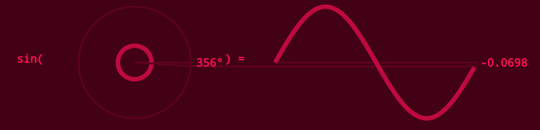
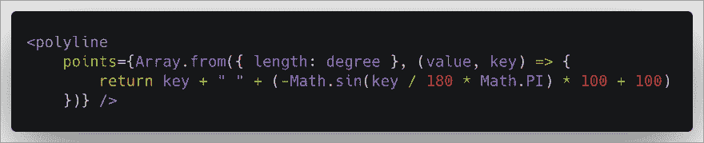
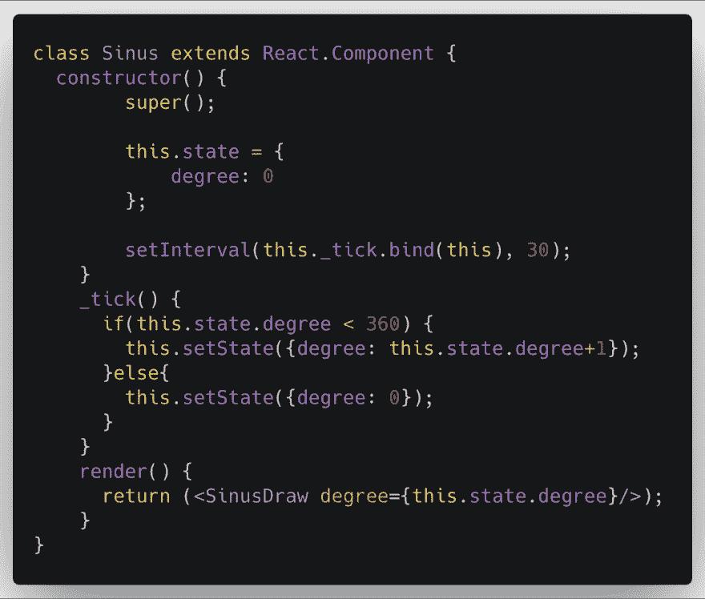
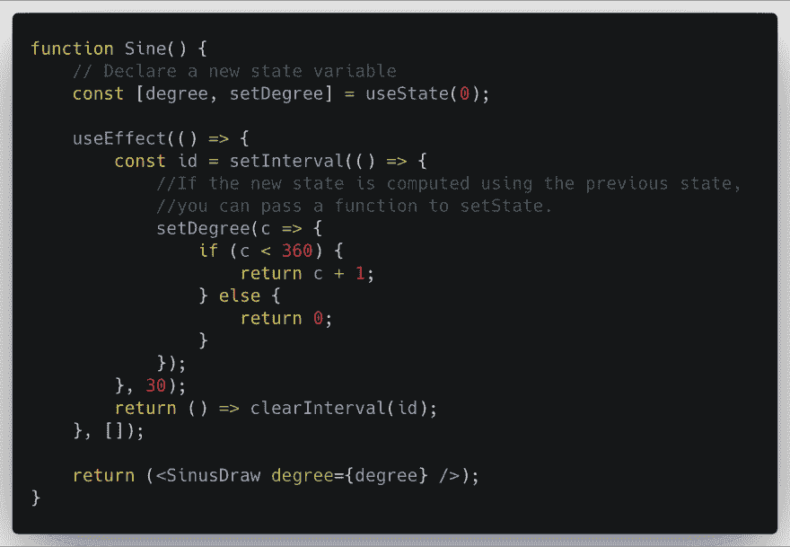
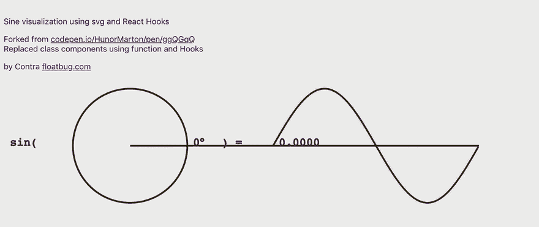

# 使用 JavaScript (React)实现正弦函数可视化

> 原文：<https://dev.to/avantcontra/sine-function-visualization-using-javascript-react-3b85>

**【编码德鲁伊】**系列是我的**横向编程**练习笔记，每一部分都围绕一个主题像数学、物理、电子、图形、声音等。，用几种编程语言实现。

* * *

**编码德鲁伊**
部分:数学
章节:三角函数
部分:Javascript (React)

*在其他部分，我用 [MaxMSP](https://www.patreon.com/posts/sine-function-28131990/) 、 [Python](https://www.patreon.com/posts/sine-function-28238879) 、 [Unity3D](https://www.patreon.com/posts/sine-function-28291611) :* 可视化了三角函数(正弦和单位圆)

这次我用 javascript 来实现。

在浏览器中用 javascript 绘制图形有多种方法:

*   直接在画布或 WebGL 中
*   d3js
*   p5js
*   小鬼
*   SVG + CSS
*   越来越

偶然发现了一个 [React + SVG 的例子](https://codepen.io/HunorMarton/pen/ggQGqQ)，非常喜欢。

SVG 以一种有标记的方式描述正弦函数:

利用 React 状态的更新机制，沿 x 轴绑定并更新 param `degree`的值。

我认为这是一种美丽而迷人的方式。

我在过去的项目中很少使用 SVG。那我就从这个例子里学起，爽！感谢它的[作者](https://codepen.io/HunorMarton/pen/ggQGqQ)。

而 React 是我多年来前端项目中最常用的库。但我对它的最新功能很陌生，比如说**反应钩**。所以我使用 React 钩子研究并重构了这个例子的 React 状态部分。

[挂钩公文](https://reactjs.org/docs/hooks-intro.html)很棒。我只是遵循它的规则，实现了这样的功能:

钩子简单而强大，但是你应该注意性能问题。因为`useEffect()`将在第一次渲染之后和每次更新**之后运行。[官方提示在此](https://reactjs.org/docs/hooks-effect.html#tip-optimizing-performance-by-skipping-effects)。**

**最终效果**:

 
我改变了颜色样式，以与原始示例进行区分。

空谈是廉价的。给我看看代码！

“编码德鲁伊”系列的这个演示是在这里开源的:
[https://github.com/avantcontra/coding-druid](https://github.com/avantcontra/coding-druid)

你可以在我的网站[floatbug.com](https://www.floatbug.com)找到更多资源。
或者你可以**在我的[店里给我买杯咖啡](https://www.patreon.com/avantcontra)**。你的鼓励是我前进的动力！

干杯~

反政府人员

*   网址:[floatbug.com](https://www.floatbug.com)
*   Github: [avantcontra](https://github.com/avantcontra)
*   Facebook:[avantt entra](https://facebook.com/avantcontra)
*   推特: [avantcontra](https://twitter.com/avantcontra)
*   Instagram: [avantcontra](https://www.instagram.com/avantcontra)
*   patreon _ **给我买个提议** xd): [avantcontra](https://www.patreon.com/avantcontra)